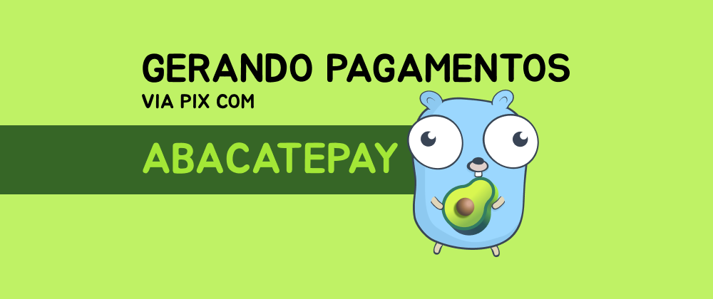
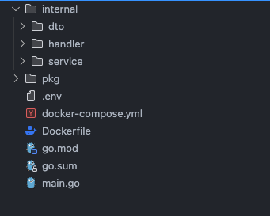

Recentemente precisei integrar com gateways de pagamento via Pix, para um sistema que estou desenvolvendo, durante esse processo passei por alguns serviços como MercadoPago, Stripe, Pagar.me, entre outros, todos eles com uma burocracia e complexidade que não estava disposto a ter nesse momento, gostaria apenas de gerar um código pix de forma simples.

Fazendo algumas pesquisas acabei conhecendo a [AbacatePay](https://www.abacatepay.com/) uma solução recém criada, mas com a proposta de ser simples, dando uma olhada na sua documentação é realmente simples sua integração, e suas taxas são bem atrativas, com isso resolvi dar uma chance e testar, nesse novo post vou mostrar como fiz essa integração.

### Estruturando o projeto

Primeiramente, vamos usar Golang, é claro :)!

Para exemplificar, vou deixar um print da estrutura do nosso projeto:



Já abortei em outros posts sobre essa estrutura, você pode ver [aqui](/posts/api-golang-parte-1/)

## Criando o handler

O handler será responsável por receber as requisições validar os dados de entrada através de um dto e repassar para o service.

`handler.go`: Será responsável por iniciar uma instância do handler e definir os metódos que precisamos implementar, vamos ter apenas dois métodos, uma para gerar o pix e outro para receber um webhook (vamos abordar sobre o webhhok).

```go
func NewHandler(service service.PaymentService) Handler {
	return &handler{
		service,
	}
}

type handler struct {
	service service.PaymentService
}

type Handler interface {
	CreatePix(w http.ResponseWriter, r *http.Request)

	Webhook(w http.ResponseWriter, r *http.Request)
}
```

Com isso, precisamos implementar, mas antes vamos criar um validador para os dados de entrada da nossa aplicação, vamos criar dentro da pasta **dto**

Vamos validar os dados de entrada manualmente, mas você pode usar algum pacote como o [go-plaayground validator](https://github.com/go-playground/validator):

```go
type CreatePixRequest struct {
	Name  string `json:"name"`
	Email string `json:"email"`
	Phone string `json:"phone"`
	CPF   string `json:"cpf"`
}

func (d *CreatePixRequest) Validate() error {
	if d.Name == "" {
		return errors.New("name is required")
	}
	if d.Email == "" {
		return errors.New("email is required")
	}
	if d.Phone == "" {
		return errors.New("phone is required")
	}
	if d.CPF == "" {
		return errors.New("cpf is required")
	}

	return nil
}

type WebhookRequest struct {
	Event string `json:"event"`
}
```

Validamos de forma bem simples a request, você pode aprimorar essa validação, como validar se é um email válido ou telefone.

Com o `validation` pronto, vamos implementar o handler!

`create_pix.go`: 

```go
type CreatePixResponse struct {
	Name  string `json:"name"`
	Email string `json:"email"`
	Phone string `json:"phone"`
	CPF   string `json:"cpf"`
}

func (h *handler) CreatePix(w http.ResponseWriter, r *http.Request) {
	defer r.Body.Close()

	var data dto.CreatePixRequest

	err := json.NewDecoder(r.Body).Decode(&data)
	if err != nil {
		w.WriteHeader(http.StatusBadRequest)
		json.NewEncoder(w).Encode(map[string]string{
			"error": "invalid json",
		})
		return
	}

	if err := data.Validate(); err != nil {
		w.WriteHeader(http.StatusBadRequest)
		json.NewEncoder(w).Encode(map[string]string{
			"error": err.Error(),
		})
		return
	}

	rs, err := h.service.CreatePix(r.Context(), &data)
	if err != nil {
		w.WriteHeader(http.StatusBadRequest)
		json.NewEncoder(w).Encode(map[string]string{
			"error": "error to create pix",
		})
		return
	}

	w.Header().Set("Content-Type", "application/json")
	w.WriteHeader(http.StatusCreated)
	json.NewEncoder(w).Encode(rs)
}
```

Não irei me aprofundar muito em Go, mas de forma simples, tranformamos o `body` na struct `CreatePixRequest`, depois chamamos o `Validate` que criamos, por fim repassamos para o service que é onde vai conter nossa regra de negócio, o service terminando o processamento, repassamos a reposta ao usuário.

## Registrando as rotas

Com o handler pronto, precisamos registrar as nossas rotas e para isso vamos criar dentro da pasta **handler** uma pasta **routes** e um arquivo `routes.go`

`routes.go`: 
```go	
func InitRoutes(router chi.Router, h handler.Handler) {
	router.Route("/payment", func(r chi.Router) {
		r.Post("/pix", h.CreatePix)
	})

	// rota para receber os eventos via webhook
	router.Post("/webhook", h.Webhook)
}
```

Registramos duas rotas, uma para gerar o pix e outra para receber o webhook.

## Criando o service

O service vai ser responsável pela regra de negócio, será no service que vamos chamar a api da [AbacatePay](https://www.abacatepay.com/).

`service.go`: 

```go
func NewService(abacatepayclient abacatepay.Client) PaymentService {
	return &service{abacatepayclient}
}

type service struct {
	abacatepayclient abacatepay.Client
}

type PaymentService interface {
	CreatePix(ctx context.Context, d *dto.CreatePixRequest) (*CreatePixRequest, error)
	ProcessWebhook(ctx context.Context, d *dto.WebhookRequest) error
}
```

Fica semelhante ao handler, mas agora o `NewService` recebe um parâmetro que vai ser o client que vamos criar para chamar a api da AbacatePay.

Antes de implementar os metódos do service, precisamos criar o `httpClient` chamando a api.

## Criando o http Client

Dentro da pasta **pkg** vamos criar outra pasta chamada **abacatepay** e um arquivo chamado `client.go`:

```go
var (
	baseURL = "https://api.abacatepay.com/v1"

	accessToken = os.Getenv("ABACATEPAY_KEY")
)

func NewAbacatePayClient() Client {
	return &httpClient{
		client: &http.Client{
			Timeout: 15 * time.Second,
		},
	}
}

type httpClient struct {
	client *http.Client
}

type Client interface {
	abacateLogger(body io.ReadCloser, statusCode int, url string) error

	RegisterUser(ctx context.Context, d *dto.CreatePixRequest) (*RegisterUserResponse, error)
	GerarPix(ctx context.Context, d *GerarPixRequest) (*GerarPixResponse, error)
}
```

Nesse arquivo vamos ter o "contrutor" `NewAbacatePayClient` e os metódos que vamos precisar, vamos criar mais um para fins de exemplo que será o `RegisterUser` mas vamos usar apenas o `GerarPix`.

Repare que usamos o `accessToken` buscando de uma variável de ambiente, esse token deve ser adquirido na plataforma da abacatepay e adicionado no `.env`, vou deixar tudo isso no repositório do projeto.

Também criei um  `abacateLogger` apenas para melhorar os logs usando o [logrus](https://github.com/sirupsen/logrus).

`gerar_pix.go`:
```go
type GerarPixResponse struct {
	Error any `json:"error"`
	Data  struct {
		ID       string `json:"id"`
		Status   string `json:"status"`
		BRCode   string `json:"brCode"`
		BRCode64 string `json:"brCodeBase64"`
		// add more fields here
	} `json:"data"`
}

type GerarPixRequest struct {
	Name        string
	Email       string
	Phone       string
	CPF         string
	Amount      int64
	ExpiresIn   int64
	Description string
}

func (h *httpClient) GerarPix(ctx context.Context, d *GerarPixRequest) (*GerarPixResponse, error) {
	requestURL := fmt.Sprintf("%v/pixQrCode/create", baseURL)

	body := map[string]interface{}{
		"amount":      d.Amount,
		"description": d.Description,
		"expiresIn":   d.ExpiresIn,
		"customer": map[string]interface{}{
			"name":      d.Name,
			"cellphone": d.Phone,
			"email":     d.Email,
			"taxId":     d.CPF,
		},
	}
	bodyBytes, err := json.Marshal(body)
	if err != nil {
		return nil, err
	}

	req, err := http.NewRequestWithContext(ctx, http.MethodPost, requestURL, bytes.NewBuffer(bodyBytes))
	if err != nil {
		return nil, err
	}

	req.Header.Set("Content-Type", "application/json")
	req.Header.Set("Authorization", fmt.Sprintf("Bearer %s", accessToken))

	rs, err := h.client.Do(req)
	if err != nil {
		return nil, err
	}
	defer rs.Body.Close()

	if rs.StatusCode != http.StatusOK && rs.StatusCode != http.StatusCreated {
		return nil, h.abacateLogger(rs.Body, rs.StatusCode, requestURL)
	}

	var pix *GerarPixResponse
	if err := json.NewDecoder(rs.Body).Decode(&pix); err != nil {
		return nil, err
	}

	if pix.Error != nil {
		return nil, h.abacateLogger(rs.Body, rs.StatusCode, requestURL)
	}

	return pix, nil
}
```

Esse método é bem simples, apenas pegamos os dados que vamos receber, chamamos a api da AbacatePay e retornamos o que recebermos da api, isso já é suficiente para ter um pix pronto para o cliente efetuar o pagamento, simples não é?

O `GerarPixResponse` não tem todos os dados que a api retorna, você pode conferir nas [docs](https://docs.abacatepay.com/pages/pix-qrcode/create) e adicionar.

O método `RegisterUser` segue a mesma lógica, você pode ver no repositório.

Com o http client criado, vamos implementar o service:

`create_pix.go`: 
```go
func (s *service) CreatePix(ctx context.Context, d *dto.CreatePixRequest) (*CreatePixRequest, error) {
	pix, err := s.abacatepayclient.GerarPix(ctx, &abacatepay.GerarPixRequest{
		Name:        d.Name,
		Email:       d.Email,
		Phone:       d.Phone,
		CPF:         d.CPF,
		Amount:      9900,
		ExpiresIn:   2000,
		Description: "AbacatePay Pix",
	})
	if err != nil {
		return nil, err
	}

	rs := &CreatePixRequest{
		ID:     pix.Data.ID,
		Status: pix.Data.Status,
		QRCode: pix.Data.BRCode,
	}

	return rs, nil
}
```

Como nossa é regra é simples, o service ficou simples, fazemos apenas a chamada do `abacatepayclient.GerarPix` passando o que recebemos no dto, pegamos a resposta e repassamos ao usuários, retornamos apenas o `id`, `status` e `qrcode`, mas você pode retornar mais dados.

Isso já nos retorna um id, esse id pode ser usado para consultar o status do pagamento, usando esse [endpoint](https://docs.abacatepay.com/pages/pix-qrcode/check), e a abacate ainda fornece outro endpoint que você pode confirmar esse pagamento, veja [aqui](https://docs.abacatepay.com/pages/pix-qrcode/simulate-payment) que bacana, basta informar o id que foi retornado e esse pagamento será confirmado e será enviado um webhook.

## Configurando o Webhook

Um webhook é uma forma de um sistema avisar outro automaticamente quando algo acontece. No nosso caso uma forma da AbacatePay nos informar que algo mudou, para isso precisamos registrar um endpoint do tipo `Post` que receba essa informação. 

Agora vamos implementear o `ProcessWebhook` do handler.

`webhook.go`: 

```go
func (h *handler) Webhook(w http.ResponseWriter, r *http.Request) {
	defer r.Body.Close()

	secret := r.URL.Query().Get("webhookSecret")
	expectedSecret := os.Getenv("ABACATEPAY_WEBHOOK_SECRET")

	if secret == "" || secret != expectedSecret {
		w.WriteHeader(http.StatusUnauthorized)
		json.NewEncoder(w).Encode(map[string]string{
			"error": "unauthorized webhook",
		})
		return
	}

	var data dto.WebhookRequest

	err := json.NewDecoder(r.Body).Decode(&data)
	if err != nil {
		w.WriteHeader(http.StatusBadRequest)
		json.NewEncoder(w).Encode(map[string]string{
			"error": "invalid json",
		})
		return
	}

	if err := h.service.ProcessWebhook(r.Context(), &data); err != nil {
		w.WriteHeader(http.StatusBadRequest)
		json.NewEncoder(w).Encode(map[string]string{
			"error": "erro to process notification",
		})
		return
	}

	w.WriteHeader(http.StatusOK)
}
```

Segue o mesmo padrão do `CreatePix` validamos os dados e repassamos para o service, mas nesse caso temos que validar o `webhookSecret` esse secret é informado lá na AbacatePay ao criar um webhook, e será sempre enviado no query params, basta extrair e validar, por isso salvamos esse secrete em uma variável de ambiente `ABACATEPAY_WEBHOOK_SECRET`.


Nosso service fica assim:
`process_webhook.go`:

```go
func (s *service) ProcessWebhook(ctx context.Context, d *dto.WebhookRequest) error {
	fmt.Println("event", d.Event)

	// aqui você pode enviar para uma fila e processar posteriormente

	return nil
}
```

Não vamos implementar aqui, pois isso varia conforme a regra de negócio, você pode enviar um e-mail para o usuário, atualizar algo no banco de dados. 

No exemplo recebemos o evento `billing.paid`, poderiamos disparar um e-mail, liberar um acesso ao produto.

Mas tudo isso leva um certo tempo, e nao podemos deixar a AbacatePay esperando esse processamento, alguns serviços exigem que o nosso endpoint que recebe o webhook responda em um tempo determinado, como 500 milisegundos por exemplo, disparar um e-mail, atualizar registro no banco, tudo isso faria que o tempo fosse atingido e o webhook seria marcado como não entregue, causando retentativas e possivelmente problemas (caso o sistema não esteja preparado para lidar com idempotência).

Por isso é uma boa prática responder o mais rápido possível, você pode jogar isso para uma fila, com RabbitMQ, SQS, Kafka, e processar essa informação do webhook posteriormente.

Mas, como estamos em desenvolvimento, não vamos receber esse webhook, pois ele precisa ser enviado para um endereço que esteja na web, nosso querido localhost não vale :)

Pra resolver isso, podemos usar um túnel, que vai disponibilizar um endereço para nós e redirecionar o tráfego para nosso localhost por exemplo.

Você pode usar o [ngrok](https://ngrok.com/) (é pago, mas é possível brincar com a versão free), [aqui](https://github.com/anderspitman/awesome-tunneling) tem uma lista de várias soluções para tunelamento.

No meu exemplo eu usei o [zero trust](https://www.cloudflare.com/pt-br/lp/dg/product/zero-trust-security/) da cloudflare, tem um limite free muito bom, a única desvantagem é que precisa adicionar um domínio a cloudflare.

Caso use o ngrok, eles fornecerão um dominio aleatório, como `https://399a-185-153-176-85.ngrok-free.app`, portanto lá no painel da AbacatePay informe o webhook como `https://399a-185-153-176-85.ngrok-free.app/webhook`.

## Rodando o projeto

Agora basta iniciar tudo no `main.go`

```go
func main() {
	slog.Info("starting server...")

	router := chi.NewRouter()

	// setup your cors here
	router.Use(cors.Handler(cors.Options{
		AllowedOrigins:   []string{"https://*", "http://*"},
		AllowedMethods:   []string{"GET", "POST", "PUT", "DELETE", "OPTIONS"},
		AllowedHeaders:   []string{"Accept", "Authorization", "Content-Type"},
		ExposedHeaders:   []string{"Link"},
		AllowCredentials: false,
		MaxAge:           300,
	}))

	service := service.NewService(abacatepay.NewAbacatePayClient())
	handler := handler.NewHandler(service)
	routes.InitRoutes(router, handler)

	port := fmt.Sprintf(":%s", "8080")
	slog.Info(fmt.Sprintf("Server running on port %s", port))

	err := http.ListenAndServe(port, router)
	if err != nil {
		slog.Error("error to start server", "err", err, slog.String("package", "main webserver"))
	}
}
```

Iniciamos as rotas usando o [go-chi](https://github.com/go-chi/chi) para roteamento, depois criamos as instâncias do `service`, `handler` e `abacatePayService`.

Agora basta rodar:

```bash
go run main.go
```

ou se preferir com docker

```bash
docker compose up -d
```

Com isso nossa integração com a AbacatePay está rodando 🎉

### Conclusão

Embora a [AbacatePay](https://www.abacatepay.com/) seja uma solução recente sua ,a sua a simplicidade me chamou a atenção, para quem busca uma integração ssem complicações com pix, pode ser uma ótima escolha, principalmente por sua taxa ser bem atrativa.

Sempre olhe a [documentação](https://docs.abacatepay.com/pages/introduction), a da AbacatePay é bem simples de entender.

## Links úteis

[repositório](https://github.com/wiliamvj/rate-limiter) do exemplo.