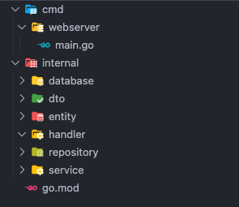

## Apresentação

Estou iniciando uma série de posts onde vamos criar uma API em Go de forma completa. A ideia é criar um projeto bem próximo do uso real, fugindo um pouco do "CRUD básico".

Vamos criar um cadastro completo de usuário, com autenticação JWT, redefinição de senha, cadastro de endereço (consumindo uma API), vamos criar também um cadastro de produtos, trabalhando um pouco com relacionamentos com banco de dados relacional, transactions.

Será um projeto simples, mas que vamos utilizar boa parte do ferramental utilizado no dia a dia no mercado Go.

Nesse post vou mostrar os pacotes que vamos usar, a estrutura inicial e vamos criar o projeto inicial e vamos configurar nossos logs.

## O que vamos usar?

Para o nosso projeto, vamos usar o seguinte:

- [PostgreSQL](https://www.postgresql.org/) como banco de dados
- [SQCL](https://sqlc.dev/) para lidar com nossas consultas ao banco de dados
- [Golang Migrate](https://github.com/golang-migrate/migrate) para lidar com nossas migrations
- [Go Chi](https://github.com/go-chi/chi) para criar nossas rotas
- [Go playground validator](https://github.com/go-playground/validator) será responsável por validar nossos dados de entrada
- [Swaggo](https://github.com/swaggo/http-swagger) para criar nossa documentação no padrão OpenAPI
- [Viper](https://github.com/spf13/viper) para gerenciar nossa variáveis de ambiente
- [Docker](https://www.docker.com/get-started/) para rodar nosso banco de dados

## Estrutura do projeto

Nesse post já vamos deixar nossa estrutura inicial pronta, vamos separa da seguinte maneira:

- **cmd**: Aqui vamos deixar nossos arquivos `main.go`, responsáveis por iniciar nossa aplicação.
- **config**: Vamos salvar algumas configs aqui, como envs, logs.
- **internal**: Aqui é onde vai ficar nossa regra de negócio
  - **internal/dto**: Onde vamos determinar os tipos de dados que vamos permitir entrar na aplicação
  - **internal/entity**: Aqui vamos salvar as entidades da nossa aplicação
  - **internal/handler**: Essa pasta vai ficar nossos arquivos de roteamento (pode chamar de controller se preferir)
  - **internal/database**: Essa pasta é onde vamos salvar tudo que for relacionado ao banco de dados
    - **internal/database/migrations**: Vamos salvar nossas migrations aqui
    - **internal/database/queries**: Onde vai ficar nossas queries sql de consulta ao banco
    - **internal/database/sqlc**: Aqui vai ficar os arquivos gerados automaticamente pelo sqlc
  - **internal/repository**: Aqui onde vai ficar nossa camada de repositórios, não seria preciso colocar essa camada, poderíamos usar diretamente as estruturas do sqlc, mas vamos adicionar mais essa camada, para deixar um pouco mais desacoplado do sqlc.
  - **internal/service**: Por último, nossa camada de service, onde a regra de negócio vai ficar (pode chamar de usecase se preferir).

Ao longo do projeto vamos melhorando nossa estrutura.

## Criando o projeto

Vamos criar o projeto com o comando

```bash
  go mod init github.com/wiliamvj/api-users-golang
```

Em Go é comum criar o nome do projeto com o caminho para o repositório, criando a estrutura mencionada acima, vamos ter esses diretórios:



A primeira coisa que vamos deixar pronto será nossos logs, os logs são de extrema importância para uma aplicação, é extremamente recomendado já iniciar adicionando logs desde o início, não vamos utilizar o famoso pacote zap log para nossos logs, vamos utilizar o que o Go já fornece, o [slog](https://pkg.go.dev/golang.org/x/exp/slog).

O que vamos fazer é criar uma função que inicializa nosso slog, mas setando como default usando `NewJSONHandler`, que faz nosso slog devolver os logs no formato de json, o que é indicado, para padronizar os logs e indexar, caso queira usar o [elastic stack](https://www.elastic.co/pt/elastic-stack), vamos criar dentro da pasta **config** uma pasta chamada **logger** e um arquivo `logger.go`.

```go
  package logger

  import (
    "log/slog"
    "os"
  )

  func InitLogger() {
    logger := slog.New(slog.NewJSONHandler(os.Stdout, nil))
    slog.SetDefault(logger)
  }
```

Agora podemos usar algo como `slog.Info("Starting api")` e teremos o log em json:

```json
{
  "time": "2023-12-01T18:58:22.270976-03:00",
  "level": "INFO",
  "msg": "starting api"
}
```

Iniciando o `main.go`, vamos iniciar nosso entrypoint e carregar o logger:

```go
  package main

  import (
    "log/slog"

    "github.com/wiliamvj/api-users-golang/config/logger"
  )

  func main() {
    logger.InitLogger()

    slog.Info("starting api")
  }
```

Temos algumas opções de levels do slog, como:

- `Info`
- `Error`
- `Debug`
- `Warn`

entre outros, conseguimos personalizar bastante o slog, com determinar quais campos serão ocultados do loga, como senhas, dados de cartão de crédito entre outros, vamos colocar no logs apenas textos, não vamos colocar dados do usuário, mas vamos ver um exemplo de como ocultar um campo do tipo password:

```go
  package main

  import (
    "log/slog"

    "github.com/wiliamvj/api-users-golang/config/logger"
  )

  type user struct {
    Name     string `json:"name"`
    Age      int    `json:"age"`
    Password string `json:"password"`
  }

  func (u user) LogUser() slog.Value {
    return slog.GroupValue(
      slog.String("name", u.Name),
      slog.Int("age", u.Age),
      slog.String("password", "HIDDEN"),
    )
  }

  func main() {
    logger.InitLogger()

    user := user{
      Name:     "John Doe",
      Age:      30,
      Password: "123456",
    }

    slog.Info("starting api")
    slog.Info("creating user", "user", user.LogUser())
  }
```

Basicamente criamos uma função para log do usuário, que recebe nossa struct, essa função chamada `LogUser()` return um `slog.Value` onde podemos ocultar campos sensíveis, veja o retorno:

```json
{
  "time": "2023-12-01T19:18:29.379521-03:00",
  "level": "INFO",
  "msg": "creating user",
  "user": { "name": "John Doe", "age": 30, "password": "HIDDEN" }
}
```

Este é apenas um exemplo, com o slog podemos customizar bastante nossos logs.

## Próximos passos

Bom, essa foi a parte 1, apenas uma introdução sobre o que vamos fazer e o que vamos utilizar, a parte mais mão na massa começa na parte 2.

Na parte 2 vamos configurar o banco de dados, sqlc, configurar nossas migrations e deixar nossas interfaces e constructors pré configurados, como assim contructors? Go não é orientado a objetos, mas vamos usar algo semelhante a OOP.

Já criei posts sobre algumas das ferramentas que vamos utilizar, você pode ficar pode dentro até sair a parte 2.

[Tenha controle sobre seu SQL com Golang e SQLC](https://wiliamvj.com/posts/golang-sqlc/)

[Usando migrations com Golang](https://wiliamvj.com/posts/migrations-golang/)

[Como deixar o Swagger com tema dark mode usando Swaggo e Golang](https://wiliamvj.com/posts/dark-mode-swaggo/)

## Link do repositório

[repositório](https://github.com/wiliamvj/api-users-golang) do projeto

[Gopher credits](https://github.com/egonelbre/gophers)
