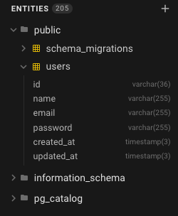
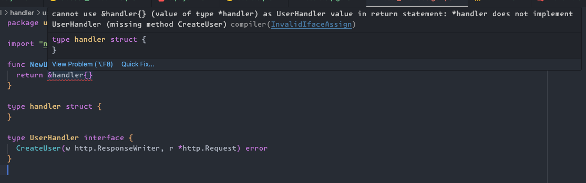

## O que vamos fazer?

Na parte 2 do nosso crud, vamos configurar nosso banco de dados com docker, sqlc, migrations, go chi, vamos criar nossas primeiras tabelas no banco e também vamos configurar as assinaturas das nossas interfaces.

Se ainda não viu a [parte 1](/posts/api-golang-parte-1/), leia esse post primeiro.

## Configurando o banco de dados

Vamos criar na raiz do projeto um arquivo `docker-compose.yml` para criar uma imagem do postgreSQL:

```yml
version: "3.9"

services:
    postgres:
        container_name: postgres_apigo
        image: postgres:14.5
        environment:
            POSTGRES_HOST: ${POSTGRES_HOST}
            POSTGRES_PASSWORD: ${POSTGRES_PASSWORD}
            POSTGRES_USER: ${POSTGRES_USER}
            POSTGRES_DB: ${POSTGRES_DB}
            PG_DATA: /var/lib/postgresql/data
        ports:
            - 5432:5432
        volumes:
            - apigo:/var/lib/postgresql/data
volumes:
    apigo:
```

O código acima vai criar uma imagem do postgreSQL e um volume, para garantir que nossos dados não sejam perdidos sempre que o docker parar. Vamos precisar também de um arquivo `.env` para guardadas as credenciais de acesso ao banco de dados, também na raiz do projeto:

```go
  POSTGRES_DB="golang_api_users"
  POSTGRES_USER="golang_api_users"
  POSTGRES_PASSWORD="golang_api_users"
  POSTGRES_HOST="localhost"
  POSTGRES_PORT="5432"
  DATABASE_URL="postgresql://${POSTGRES_USER}:${POSTGRES_PASSWORD}@${POSTGRES_HOST}:${POSTGRES_PORT}/${POSTGRES_DB}?sslmode=disable"
```

Agora ao rodar o comando `docker compose up -d` nosso banco vai ser criado e estará pronto para uso.

## Configurando o Golang Migrate

Agora vamos configurar o golang migrate para lidar com nossas migrations, já fiz um [post](https://wiliamvj.com/posts/migrations-golang/) sobre o assunto, recomendo ler antes.

Os comandos do golang migrate são um pouco extenso e cansativo de digitar, por isso vamos criar o arquivo `makefile` para facilitar o uso dos comandos:

Crie um arquivo `makefile` na raiz do projeto:

```makefile
  include .env

  create_migration:
    migrate create -ext=sql -dir=internal/database/migrations -seq init

  migrate_up:
    migrate -path=internal/database/migrations -database "postgresql://${POSTGRES_USER}:${POSTGRES_PASSWORD}@${POSTGRES_HOST}:${POSTGRES_PORT}/${POSTGRES_DB}?sslmode=disable" -verbose up

  migrate_down:
    migrate -path=internal/database/migrations -database "postgresql://${POSTGRES_USER}:${POSTGRES_PASSWORD}@${POSTGRES_HOST}:${POSTGRES_PORT}/${POSTGRES_DB}?sslmode=disable" -verbose down

  .PHONY: create_migration migrate_up migrate_down
```

No arquivo incluímos o nosso `.env` para o makefile poder ter acesso as credenciais do banco de dados, depois criamos 3 comandos, para gerar novas migrations sequenciais, uma para aplicar as migrations e outra para reverter.

Vamos rodar o comando para criar as migrations:

```bash
  make create_migration
```

Você vai perceber que foi gerado uma pasta chamada migrations dentro de **internal/migrations\*** e dois arquivos `.sql`, vai ser nesses arquivos que vamos escrever nosso sql para manipular nosso banco de dados. Você pode alterar o caminho em que as migrations foram geradas, basta alterar no arquivo `makefile`.

## Criando nossa primeira tabela

Com nossa migrations pronta, podemos criar nossa primeira tabela, vamos criar a tabela user com os primeiros campos que vamos precisar, vamos criar no arquivo `up` gerado pelo golang-migrate, no meu caso chamado `000001_init.up.sql`:

```sql
  CREATE TABLE users (
    id CHAR(36) NOT NULL PRIMARY KEY,
    name VARCHAR(255) NOT NULL,
    email VARCHAR(255) NOT NULL UNIQUE,
    password VARCHAR(255) NOT NULL,
    created_at TIMESTAMP(3) NOT NULL DEFAULT CURRENT_TIMESTAMP,
    updated_at TIMESTAMP(3) NOT NULL
  );
```

Repare que o `id` da nossa tabela `users` é um `CHAR(36)`, vamos usar o [uuid](https://bit.ly/414qfto), poderíamos usar uma extensão do postgreSQL como o [uuid-ossp](https://www.postgresql.org/docs/current/uuid-ossp.html) para gerar nossos ids, porém se nossa aplicação ficar responsável por gerar seu próprios ids, teremos a possibilidade de saber o `id` do nosso usuário antes mesmo de salvar no banco de dados, mas se preferir você pode instalar essa extensão e deixar o banco de dados responsável por gerar o `id` do usuário.

Nossa migration que desfaz isso, chamamos de down `000001_init.down.sql` ficaria assim:

```sql
  DROP TABLE IF EXISTS users;
```

Isso remove a tabela que criamos. Agora vamos rodar as migrations com nosso `make`:

```sql
  make migrate_up
```

Se tudo rodar sem erro, isso vai aparecer no seu terminal:

```bash
  2023/12/05 09:13:51 Start buffering 1/u init
  2023/12/05 09:13:51 Read and execute 1/u init
  2023/12/05 09:13:51 Finished 1/u init (read 4.167125ms, ran 6.650125ms)
  2023/12/05 09:13:51 Finished after 13.853791ms
  2023/12/05 09:13:51 Closing source and database
```

Agora se acessar a tabela, usando o [pgAdmin](https://www.pgadmin.org/) ou [DBeaver](https://dbeaver.io/download/) ou [BeeKeeper](https://www.beekeeperstudio.io/), vai ver ver que a tabela users foi gerada com sucesso.



Rodando o comando abaixo, nossa tabela é deletada, mas cuidado! Esse comando apaga todos os dados!

```sql
  make migrate_down
```

## Configurando o SQLC

Vamos iniciar a configuração do sqlc, também já fiz post sobre [como utilizar o go com sqlc](https://wiliamvj.com/posts/golang-sqlc/).

Primeiro precisamos criar um arquivo de configuração do sqlc na raiz do projeto, chamado `sqlc.yaml`:

```yaml
version: "2"
sql:
    - schema: "internal/database/migrations"
      queries: "internal/database/queries"
      engine: "postgresql"
      gen:
          go:
              package: "sqlc"
              out: "internal/database/sqlc"
```

Nesse arquivo determinamos o banco de dados que vamos usar, o caminho onde vai estão nossas migrations, queries e o caminho onde o sqlc vai salvar os arquivos gerados, você pode optar por outro caminho para salvar os arquivos do sqlc, assim como o nome do package.

Vamos criar nossa primeira query, apenas para buscar um usuário pelo id, dentro da pasta queries crie um arquivo chamado `user.sql`:

```sql
  -- name: GetUserByID :one
  SELECT * from users u where u.id = $1;
```

Pegamos todos os dados da tabela `users`, não é uma boa prática, o correto é pegar somente os campos que vamos utilizar, mas vamos alterar isso futuramente. Usamos query annotations para guiar o sqlc na geração `GetUserByID` é o nome da nossa função, `:one` informa ao sqlc que queremos retornar apenas 1 registro.

Rodando o comando:

```bash
  sqlc generate
```

Vamos gerar nossa pasta chamada **sqlc** dentro de **internal/database**, nessa pasta é onde vai ter todo o código gerado pelo sqlc, essa pasta não vamos alterar nada, para o sqlc é apenas isso, durante o projeto vamos criando novas queries.

## Criando nossas interfaces

Vamos usar uma estratégia parecida com OOP, onde vamos criar contratos, e cada função que utilizar esse contrato, precisa implementar conforme determinamos.

Nosso `handler`, `service` e `repository` terão seus próprios contratos, os contratos facilitam inclusive nos testes unitários.

### handler interface

Vamos criar do handler, dentro da pasta **handler**, vamos criar outra pasta para os handlers do usuário, chamada **userhandler**. dentro da pasta vamos criar um arquivo chamada `user_interface_handler.go`, você pode chamar como desejar.

```go
  package userhandler

  import "net/http"

  func NewUserHandler() UserHandler {
    return &handler{}
  }

  type handler struct {
  }

  type UserHandler interface {
    CreateUser(w http.ResponseWriter, r *http.Request)
  }
```

Veja que temos o `NewUserHandler` ele vai service como nosso constructor, onde ele vai criar uma instância do `handler` que é privado somente ao package `userhandler` e vai retornar nossa interface `UserHandler`, nessa interface vai ficar nossos método, por enquanto temos apenas o `CreateUser`.

Utilizando dessa forma, vai nos ajudar muito, perceba que o editor já deve estar acusando erro:



Isso acontece por que ninguém implementa nossa interface, quando utilizarmos o `CreateUser` com a exata assinatura que determinamos, o erro vai desaparecer.

Mas, para nosso `handler` funcionar ele precisa de um service, pois após receber a requisição precisamos chamar o service, então o `NewUserHandler` precisa obrigatoriamente da instância do `service` para funcionar, vamos criar a interface do service.

### service interface

Vai ser muito parecido com a interface do handler, crie uma pasta **userservice** dentro da pasta **service** e um arquivo chamado `user_interface_service.go`:

```go
  package userservice

  func NewUserService() UserService {
    return &service{}
  }

  type service struct {
  }

  type UserService interface {
    CreateUser() error
  }
```

Mesmo conceito, nosso `CreateUser` vai receber um `dto`, mas por enquanto não vamos passar parâmetros.

Porém nosso service, depende de um repository, para poder funcionar, nosso `NewUserService` vai receber uma instância do repository, vamos criar a interface também.

### repository interface

Crie uma pasta chamada **userepository** dentro de **repository** e um arquivo chamado `user_interface_repository.go`:

```go
  package userrepository

  func NewUserRepository() UserRepository {
    return &repository{}
  }

  type repository struct {
  }

  type UserRepository interface {
    CreateUser() error
  }
```

Mesma estrutura do service e handler, mas nosso repository agora precisa receber uma conexão com o banco de dados e nossas queries geradas pelo sqlc, ficando assim:

```go
  func NewUserRepository(db *sql.DB, q *sqlc.Queries) UserRepository {
    return &repository{
      db,
      q,
    }
  }

  type repository struct {
    db      *sql.DB
    queries *sqlc.Queries
  }

  type UserRepository interface {
    CreateUser() error
  }
```

Ainda vamos receber o erro, pois não implementam a interface.

_Não seria necessário criar um módulo de repository, você poderia pegar direto dentro do código gerado pelo sqlc, porém é uma boa prática desacoplar, caso futuramente não seja mais utilizado o sqlc, alteramos apenas nosso repository, sem alterar a camada anterior._

### finalizando as interfaces

Com nossas interfaces definidas, vamos ajustar nosso handler e service:

Nosso `user_interface_service.go` agora recebe uma instância do repository:

```go
  func NewUserService(repo userrepository.UserRepository) UserService {
    return &service{
      repo,
    }
  }

  type service struct {
    repo userrepository.UserRepository
  }

  type UserService interface {
    CreateUser() error
  }
```

Nosso `user_interface_handler.go` agora recebe uma instância do service:

```go
  func NewUserHandler(service userservice.UserService) UserHandler {
    return &handler{
      service,
    }
  }

  type handler struct {
    service userservice.UserService
  }

  type UserHandler interface {
    CreateUser(w http.ResponseWriter, r *http.Request) error
  }
```

### implementando

Precisamos implementar nossas interfaces, para o Go parar de acusar erro, vamos implementar o handler, dentro da pasta **userhandler** crie um arquivo chamado `user_interface_handler.go`:

```go
  func (h *handler) CreateUser(w http.ResponseWriter, r *http.Request) {}
```

Essa função recebe um ponteiro do handler, que implementa nossa interface, o erro já parou, pois implementamos nossa interface conforme esperado, por enquanto vamos retornar apenas um `nil`, vamos fazer o mesmo para o service e repository:

`user_service.go`:

```go
  func (s *service) CreateUser() error {
    return nil
  }
```

`user_repository.go`:

```go
  func (r *repository) CreateUser() error {
    return nil
  }
```

Com isso os erros de interface não implementada são resolvidos.

## Configurando o Viper

Para finalizar a parte 2, precisamos criar uma função que criar nossa conexão com o banco de dados, mas o banco de dados precisa consumir as credenciais salva no nosso `.env` para isso vamos utilizar o [viper](https://github.com/spf13/viper), não vou me aprofundar no viper, mas você pode entender melhor nesse [post](https://aprendagolang.com.br/2021/11/04/carregando-configuracoes-com-viper/).

Dentro da pasta **config** vamos criar outra pasta chamada **env** e um arquivo chamado `env.go`, esses nomes você pode renomear como achar melhor.

```go
  package env

  import (
    "github.com/spf13/viper"
  )

  var Env *config

  type config struct {
    GoEnv       string `mapstructure:"GO_ENV"`
    GoPort      string `mapstructure:"GO_PORT"`
    DatabaseURL string `mapstructure:"DATABASE_URL"`
  }

  func LoadingConfig(path string) (*config, error) {
    viper.SetConfigFile("app_config")
    viper.SetConfigType("env")
    viper.AddConfigPath(path)
    viper.SetConfigFile(".env")
    viper.AutomaticEnv()

    err := viper.ReadInConfig()
    if err != nil {
      return nil, err
    }
    err = viper.Unmarshal(&Env)
    if err != nil {
      return nil, err
    }
    return Env, nil
  }
```

Vamos usar no momento apenas 3 variáveis:

- `GO_ENV`: Determina o ambiente, pode ser `production`, `development`, `stage`.
- `GO_PORT`: Determina a porta que vamos usar para receber requisições, vamos usar a porta `:8080`,
- `DATABASE_URL`: Aqui fica a url de conexão com o banco de dados.

Criamos uma função `LoadingConfig` para carregar os arquivos com o viper, por fim disponibilizamos de forma global na nossa aplicação o `var Env *config`, para ser usado e acessar os valores dos nossos environments.

Não se esqueça de rodar o `go mod tidy`, para instalar o viper.

## Criando a conexão com o PostgreSQL

Vamos iniciar uma única conexão com o banco de dados, e compartilhar essa conexão com toda a nossa aplicação, para isso vamos criar um arquivo chamado `connection.go` dentro da pasta **database**:

```go
  package database

  import (
    "database/sql"
    "log/slog"

    _ "github.com/lib/pq"
    "github.com/wiliamvj/api-users-golang/config/env"
  )

  func NewDBConnection() (*sql.DB, error) {
    postgresURI := env.Env.DatabaseURL
    db, err := sql.Open("postgres", postgresURI)
    if err != nil {
      return nil, err
    }
    err = db.Ping()
    if err != nil {
      db.Close()
      return nil, err
    }
    slog.Info("database connected", slog.String("package", "database"))

    return db, nil
  }
```

Criamos uma função `NewDBConnection`, que vai ser responsável por iniciar uma conexão com o postgreSQL e retornar um ponteiro dessa conexão.

Talvez você precisa importar o driver do postgreSQL manualmente, o auto import as vezes não importa corretamente `_ "github.com/lib/pq"`.

## Criando nossas rotas

Precisamos criar nossas rotas, vamos usar o [Go Chi](https://github.com/go-chi/chi) para isso,
dentro da pasta **handler**, vamos criar uma pasta chamada **routes** e um arquivo chamado `user_routes.go`:

```go
  func InitUserRoutes(router chi.Router, h userhandler.UserHandler) {
    router.Route("/user", func(r chi.Router) {
      r.Post("/", h.CreateUser)
    })
  }
```

Criamos uma função `InitUserRoutes`, que será responsável por criar uma estância das rotas para os usuários, a função vai receber um `chi.Router` e a instância da nossa interface `UserHandler`, vai criar um grupo de rotas chamado `user`, e teremos um método `post` que vai chamar o handler `CreateUser` da nossa interface, apenas isso é o suficiente, para iniciar, vamos alterar depois nossas routes, adicionado middlewares, autenticação jwt.

Não se esqueça de rodar o `go mod tidy` para instalar o go chi.

## Criando as instâncias e rodando o projeto

Criamos bastante coisa no projeto, praticamente toda a estrutura está pronta, agora precisamos apenas inserir a regra de negócio, mas antes vamos iniciar nosso projeto, para isso vamos gerar as instâncias necessárias no arquivo `main.go` na pasta **cmd/webserver**, nosso `main.go` ficou assim:

```go
  func main() {
    logger.InitLogger()
    slog.Info("starting api")

    _, err := env.LoadingConfig(".")
    if err != nil {
      slog.Error("failed to load environment variables", err, slog.String("package", "main"))
      return
    }
    dbConnection, err := database.NewDBConnection()
    if err != nil {
      slog.Error("error to connect to database", "err", err, slog.String("package", "main"))
      return
    }

    router := chi.NewRouter()
    queries := sqlc.New(dbConnection)

    // user
    userRepo := userrepository.NewUserRepository(dbConnection, queries)
    newUserService := userservice.NewUserService(userRepo)
    newUserHandler := userhandler.NewUserHandler(newUserService)

    // init routes
    routes.InitUserRoutes(router, newUserHandler)

    port := fmt.Sprintf(":%s", env.Env.GoPort)
    slog.Info(fmt.Sprintf("server running on port %s", port))
    err = http.ListenAndServe(port, router)
    if err != nil {
      slog.Error("error to start server", err, slog.String("package", "main"))
    }
  }
```

Primeiro, iniciamos nosso logs, depois carregamos nossas envs, caso retorne erro, paramos por aqui, sem os dados da `env`, não podemos prosseguir, depois iniciamos a conexão com o banco de dados, também paramos caso retorne erro.

Depois iniciamos as queries do sqlc, passando a conexão com o banco, por fim iniciamos o encadeamento das nossas interfaces, onde o repository precisa do `dbConnection` e `queries` e o service precisa do `userRepo` e nosso handler precisa do `newUserService`.

Depois iniciamos nossas rotas com o go chi `chi.NewRouter()`, iniciamos o `InitUserRoutes` passando o `router` criando acima, por fim iniciamos o server com o `http.ListenAndServe(port, router)`.

Finalmente podemos rodar nossa aplicação com:

```bash
  go run cmd/webserver/main.go
```

output:

```bash
{"time":"2023-12-05T09:16:11.42702-03:00","level":"INFO","msg":"starting api"}
{"time":"2023-12-05T09:16:11.456843-03:00","level":"INFO","msg":"database connected","package":"database"}
{"time":"2023-12-05T09:16:11.456901-03:00","level":"INFO","msg":"Server running on port :8080"}
```

## Considerações finais

Fizemos muita coisa na parte 2, deixamos todo o projeto configurado e pronto para receber a lógica da aplicação.

## Próximos passos

Bom, essa foi a parte 2, na parte 3 vamos começar o crud do nosso usuário e validações usando nosso dto.

## Link do repositório

[repositório](https://github.com/wiliamvj/api-users-golang) do projeto

[Gopher credits](https://github.com/egonelbre/gophers)
