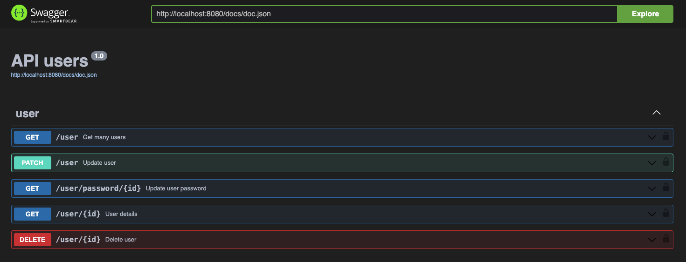

## O que vamos fazer?

Na parte 3 do nosso crud, vamos configurar nosso dto para realizar as validações dos dados de entrada da nossa api e vamos criar o handler do usuário.

Se ainda não viu a [parte 1](/posts/api-golang-parte-1/) e a [parte 2](/posts/api-golang-parte-2/) leia esse post primeiro.

## Padronizando erros http

Antes de iniciar com o dto, precisamos padronizar nossos erros http, é uma boa prática criar uma padronização dos nossos erros http que retornamos para nosso cliente, por isso vamos retornar sempre nesse padrão:

```json
{
  "message": "message error",
  "error": "bad_request",
  "code": 400,
  "fields": []
}
```

Vamos retornar sempre nesse formato, o campo `fields` vai ser preenchido pelo go playground com os dados dos campos que estão errados, ficando nesse formato:

```json
{
  "message": "message error",
  "error": "bad_request",
  "code": 400,
  "fields": [
    {
      "field": "email",
      "value": "email.com",
      "message": "invalid email"
    }
  ]
}
```

Dessa forma ajuda o consumidor da nossa api a identificar os campos errados.

Vamos criar dentro da pasta **handler** uma pasta chamada **httperr** e um arquivo dentro chamado `httperr`, ficando assim:

```go
  package httperr

  import "net/http"

  type RestErr struct {
    Message string   `json:"message"`
    Err     string   `json:"error,omitempty"`
    Code    int      `json:"code"`
    Fields  []Fields `json:"fields,omitempty"`
  }

  type Fields struct {
    Field   string      `json:"field"`
    Value   interface{} `json:"value,omitempty"`
    Message string      `json:"message"`
  }

  func (r *RestErr) Error() string {
    return r.Message
  }

  func NewRestErr(m, e string, c int, f []Fields) *RestErr {
    return &RestErr{
      Message: m,
      Err:     e,
      Code:    c,
      Fields:  f,
    }
  }

  func NewBadRequestError(message string) *RestErr {
    return &RestErr{
      Message: message,
      Err:     "bad_request",
      Code:    http.StatusBadRequest,
    }
  }

  func NewUnauthorizedRequestError(message string) *RestErr {
    return &RestErr{
      Message: message,
      Err:     "unauthorized",
      Code:    http.StatusUnauthorized,
    }
  }

  func NewBadRequestValidationError(m string, c []Fields) *RestErr {
    return &RestErr{
      Message: m,
      Err:     "bad_request",
      Code:    http.StatusBadRequest,
      Fields:  c,
    }
  }

  func NewInternalServerError(message string) *RestErr {
    return &RestErr{
      Message: message,
      Err:     "internal_server_error",
      Code:    http.StatusInternalServerError,
    }
  }

  func NewNotFoundError(message string) *RestErr {
    return &RestErr{
      Message: message,
      Err:     "not_found",
      Code:    http.StatusNotFound,
    }
  }

  func NewForbiddenError(message string) *RestErr {
    return &RestErr{
      Message: message,
      Err:     "forbidden",
      Code:    http.StatusForbidden,
    }
  }
```

Uma função simples, que vai apenas formatar e retornar uma mensagem padrão, para cada tipo de erro http, não criei todos os erros, apenas os mais comuns, você pode ver todos os erros http [aqui](https://developer.mozilla.org/pt-BR/docs/Web/HTTP/Status) e implementar.

## Configurando o Go Playground Validator

Vamos utilizar o [Go playground validator](https://github.com/go-playground/validator) para nos ajudar a realizar as validações, para isso vamos separar em uma pasta dentro da nossa pasta **handler** chamada **validation** o arquivo vai se chamar `http_validation.go`.

Nossa função vai receber uma interface vazia e vai retornar um ponteiro do nosso `http_err`, veja como vai ficar nossa função:

```go
  func ValidateHttpData(d interface{}) *httperr.RestErr {
    val := validator.New(validator.WithRequiredStructEnabled())

    // extract json tag name
    val.RegisterTagNameFunc(func(fld reflect.StructField) string {
      name := strings.SplitN(fld.Tag.Get("json"), ",", 2)[0]
      if name == "-" {
        return ""
      }
      return name
    })

    if err := val.Struct(d); err != nil {
      var errorsCauses []httperr.Fields

      for _, e := range err.(validator.ValidationErrors) {
        cause := httperr.Fields{}
        fieldName := e.Field()

        switch e.Tag() {
        case "required":
          cause.Message = fmt.Sprintf("%s is required", fieldName)
          cause.Field = fieldName
          cause.Value = e.Value()
        case "uuid4":
          cause.Message = fmt.Sprintf("%s is not a valid uuid", fieldName)
          cause.Field = fieldName
          cause.Value = e.Value()
        case "boolean":
          cause.Message = fmt.Sprintf("%s is not a valid boolean", fieldName)
          cause.Field = fieldName
          cause.Value = e.Value()
        case "min":
          cause.Message = fmt.Sprintf("%s must be greater than %s", fieldName, e.Param())
          cause.Field = fieldName
          cause.Value = e.Value()
        case "max":
          cause.Message = fmt.Sprintf("%s must be less than %s", fieldName, e.Param())
          cause.Field = fieldName
          cause.Value = e.Value()
        case "email":
          cause.Message = fmt.Sprintf("%s is not a valid email", fieldName)
          cause.Field = fieldName
          cause.Value = e.Value()
        default:
          cause.Message = "invalid field"
          cause.Field = fieldName
          cause.Value = e.Value()
        }

        errorsCauses = append(errorsCauses, cause)
      }
      return httperr.NewBadRequestValidationError("some fields are invalid", errorsCauses)
    }
    return nil
  }
```

Primeiro iniciamos o validador com `validator.New()`, depois extraímos o nome da tag do json, isso vai servir para informar o campo que ocasionou o erro, depois nosso `val.Struct(d)` realiza a validação e se houver um erro cai no if, onde verificamos cada tipo de erro, como por exemplo se for `required`, adicionamos esse erro no `errorsCauses` e assim por diante. Por fim retornamos o `http_err.NewBadRequestValidationError` com nosso erro personalizado.

Note que é um pouco manual para configurar, mas não precisa colocar todos os `case` com todas as opções, conforme for utilizando você vai incrementando essas validações. Perceba que com isso você pode colocar a mensagem de erro que desejar no `cause.Message`, logo você vai entender onde vamos determinar as regras dos nossos campos como `max`, `min`, `required`, `uuidv4`. Você pode ver como configurar com mais detalhes o [Go playground validator](https://pkg.go.dev/github.com/go-playground/validator/v10) na documentação oficial, essa foi a melhor forma que encontrei para utilizar em meus projetos, você pode encontrar outras implementações ou criar a sua.

## Iniciando os dtos

Calma, estamos quase chegando no nosso handler, mas antes precisamos criar nossos dtos (Data Transfer Object) que tem como responsabilidade validar os dados que transitam entre as camadas da nossa aplicação, no nosso caso vamos usar para trafegar entre handler e service.

Vamos criar na pasta **dto** um arquivo chamado `user_dto.go` responsável por salvar nossas structs e será nesse arquivo onde vamos definir as regras de validações, aquelas regras que definimos no go playground na função `ValidateHttpData`.

```go
  type CreateUserDto struct {
    Name     string `json:"name" validate:"required,min=3,max=30"`
    Email    string `json:"email" validate:"required,email"`
    Password string `json:"password" validate:"required,min=8,max=30,containsany=!@#$%*"`
  }
```

Usamos as tags do Go para informar ao go playground as validações que desejamos para este campo, não vamos criar muitos campos para ser mais rápido, apenas isso já será suficiente para criar um usuário.

Como validamos o `containsany`, forçando o usuário a informar uma senha que tenha qualquer desses caracteres, precisamos atualizar nosso `RegisterTagNameFunc`, vamos adicionar:

```go
  case "containsany":
    cause.Message = fmt.Sprintf("%s must contain at least one of the following characters: !@#$%%*", fieldName)
    cause.Field = fieldName
    cause.Value = e.Value()
```

## Finalizando o handler

Finalmente vamos partir para o nosso handler, vamos criar os seguintes endpoints:

- Criação de usuário
- Atualização de usuário
- Listar usuário pelo id
- Listar todos os usuários
- Deletar usuário
- Atualizar a senha do usuário

### Criando o usuário

Agora dentro do nosso `user_handler.go` vamos iniciar a validação da request recebida:

```go
  var req dto.CreateUserDto

  if r.Body == http.NoBody {
    slog.Error("body is empty", slog.String("package", "userhandler"))
    w.WriteHeader(http.StatusBadRequest)
    msg := httperr.NewBadRequestError("body is required")
    json.NewEncoder(w).Encode(msg)
    return
  }
```

Primeiro criamos uma var do nosso dto `CreateUserDto`, depois verificamos se o body da requisição não é vazio, se for já retornamos um erro, perceba que já estamos usando nossos logs.

```go
  err := json.NewDecoder(r.Body).Decode(&req)
  if err != nil {
    slog.Error("error to decode body", "err", err, slog.String("package", "handler_user"))
    w.WriteHeader(http.StatusBadRequest)
    msg := httperr.NewBadRequestError("error to decode body")
    json.NewEncoder(w).Encode(msg)
    return
  }
```

Agora estamos transformando o body que é um `io` em uma struct Go, especificamente na struct `CreateUserDto` e se der um erro também retornamos retornamos o erro e finalizamos a requisição.

```go
  httpErr := validation.ValidateHttpData(req)
  if httpErr != nil {
    slog.Error(fmt.Sprintf("error to validate data: %v", httpErr), slog.String("package", "handler_user"))
    w.WriteHeader(httpErr.Code)
    json.NewEncoder(w).Encode(httpErr)
    return
  }
```

Acima chamamos o `ValidateHttpData` que vai colocar o go playground em ação e validar se os dados do nosso `CreateUserDto` estão de acordo com o que determinamos, caso não esteja retorna um erro.

Já podemos ver isso na prática, se estiver acompanhando seu projeto deve rodar sem problemas, rode com o comando `go run cmd/webserver/main.go`, vamos fazer uma chamada POST para `http://localhost:8080/user`, vou deixar no projeto o arquivo da extensão para vscode do [rest client](https://marketplace.visualstudio.com/items?itemName=humao.rest-client)

```http
POST http://localhost:8080/user HTTP/1.1
content-type: application/json

{
  "name": "John Doe",
  "email": "john.doe@email.com",
  "password": "12345678"
}
```

Vamos ter o retorno:

```http
HTTP/1.1 400 Bad Request
Date: Thu, 14 Dec 2023 23:33:21 GMT
Content-Length: 205
Content-Type: text/plain; charset=utf-8
Connection: close

{
  "message": "some fields are invalid",
  "error": "bad_request",
  "code": 400,
  "fields": [
    {
      "field": "password",
      "value": "12345678",
      "message": "password must contain at least one of the following characters: !@#$%*"
    }
  ]
}
```

Perceba que nossas validações funcionaram, e fomos informados que nosso password está inválido, precisamos colocar qualquer caracter que solicitamos como obrigatório

```http
POST http://localhost:8080/user HTTP/1.1
content-type: application/json

{
  "name": "John Doe",
  "email": "john.doe@email.com",
  "password": "12345678@"
}
```

Resposta:

```http
HTTP/1.1 200 OK
Date: Thu, 14 Dec 2023 23:35:52 GMT
Content-Length: 0
Connection: close
```

Agora sim, tudo funcionando com validações e padronização, basta chamar o service, mas precisamos ajustar nosso service do usuário, para receber os parâmetros necessários.

`user_interface_service.go`:

```go
  type UserService interface {
    CreateUser(ctx context.Context, u dto.CreateUserDto) error
  }
```

Agora nossa interface receber um [context](https://aprendagolang.com.br/2022/11/02/onde-e-qual-context-utilizar/) e o nosso dto, precisamos ajustar a implementação também:

`user_service.go`:

```go
  func (s *service) CreateUser(ctx context.Context, u dto.CreateUserDto) error {
    return nil
  }
```

Voltando ao nosso handler, vamos chamar nosso service:

```go
  err = h.service.CreateUser(r.Context(), req)
  if err != nil {
    slog.Error(fmt.Sprintf("error to create user: %v", err), slog.String("package", "handler_user"))
    w.WriteHeader(http.StatusInternalServerError)
    msg := httperr.NewBadRequestError("error to create user")
    json.NewEncoder(w).Encode(msg)
    return
  }
```

Pegamos o context da requisição e nosso req que é um `CreateUserDto` e passamos para o nosso `UserService`. E essa é toda a responsabilidade que nosso handler vai ter, apenas validar os dados antes de passar para o service, nosso service que vai conter a regra de negócio.

### Atualizando o usuário

Para o nosso handler de atualização do usuário vamos precisar criar um novo dto:

```go
  type UpdateUserDto struct {
    Name  string `json:"name" validate:"omitempty,min=3,max=30"`
    Email string `json:"email" validate:"omitempty,email"`
  }
```

Mas desta vez não vamos usar `required` e vamos usar o `omitempty` com isso o campo se torna opcional, repare que não permitimos atualizar o password, vamos criar um endpoint separado apenas para atualizar a senha do usuário.

Vamos adicionar a nova rota, primeiro vamos criar na interface `UserHandler` o método `UpdateUser`:

```go
  type UserHandler interface {
    CreateUser(w http.ResponseWriter, r *http.Request)
    UpdateUser(w http.ResponseWriter, r *http.Request)
  }
```

Vamos adicionar a rota em `user_route.go`:

```go
 router.Route("/user", func(r chi.Router) {
    r.Post("/", h.CreateUser)
    r.Patch("/{id}", h.UpdateUser)
  })
```

vamos passar o `{id}` no param, e pegar na requisição, usaremos o patch pois nosso usuário pode ser alterado parcialmente.

Agora vamos implementar nosso `UpdateUser` e fazer as validações:

```go
  var req dto.UpdateUserDto

  id := chi.URLParam(r, "id")
  if id == "" {
    slog.Error("id is empty", slog.String("package", "userhandler"))
    w.WriteHeader(http.StatusBadRequest)
    msg := httperr.NewBadRequestError("id is required")
    json.NewEncoder(w).Encode(msg)
    return
  }
```

Primeiro criamos uma variável para o nosso `UpdateUserDto`, depois pegamos o id do usuário no param usando o `URLParam` do go chi, se estiver vazio retornamos um erro.

```go
  _, err := uuid.Parse(id)
  if err != nil {
    slog.Error(fmt.Sprintf("error to parse id: %v", err), slog.String("package", "handler_user"))
    w.WriteHeader(http.StatusBadRequest)
    msg := httperr.NewBadRequestError("error to parse id")
    json.NewEncoder(w).Encode(msg)
    return
  }
```

Depois validamos se o id que extraímos do param é um uuid válido, para isso usamos o `uuid.Parse(id)` do pacote do [google uuid](https://pkg.go.dev/github.com/google/uuid@v1.1.2).

```go
  if r.Body == http.NoBody {
    slog.Error("body is empty", slog.String("package", "userhandler"))
    w.WriteHeader(http.StatusBadRequest)
    msg := httperr.NewBadRequestError("body is required")
    json.NewEncoder(w).Encode(msg)
    return
  }
  err = json.NewDecoder(r.Body).Decode(&req)
  if err != nil {
    slog.Error("error to decode body", "err", err, slog.String("package", "handler_user"))
    w.WriteHeader(http.StatusBadRequest)
    msg := httperr.NewBadRequestError("error to decode body")
    json.NewEncoder(w).Encode(msg)
    return
  }
  httpErr := validation.ValidateHttpData(req)
  if httpErr != nil {
    slog.Error(fmt.Sprintf("error to validate data: %v", httpErr), slog.String("package", "handler_user"))
    w.WriteHeader(httpErr.Code)
    json.NewEncoder(w).Encode(httpErr)
    return
  }
```

Agora fazemos o mesmo que na criação de usuário, validamos se o body não está vazio, transformamos o body na struct `UpdateUserDto`, e validamos o `UpdateUserDto` usando nosso validator `ValidateHttpData`.

Por fim, vamos adicionar o método de `UpdateUser` no nosso service que vai receber um context, `UpdateUserDto` e o id do usuário para finalizar o handler de atualizar usuário:

`user_interface_service.go`:

```go
  type UserService interface {
    CreateUser(ctx context.Context, u dto.CreateUserDto) error
    UpdateUser(ctx context.Context, u dto.UpdateUserDto, id string) error
  }
```

Implementando o `UpdateUser` service:

```go
  func (s *service) UpdateUser(ctx context.Context, u dto.UpdateUserDto, id string) error {
    return nil
  }
```

Agora vamos finalizar o handler de `UpdateUser`:

```go
  err = h.service.UpdateUser(r.Context(), req, id)
  if err != nil {
    slog.Error(fmt.Sprintf("error to update user: %v", err), slog.String("package", "handler_user"))
    w.WriteHeader(http.StatusInternalServerError)
    msg := httperr.NewBadRequestError("error to update user")
    json.NewEncoder(w).Encode(msg)
    return
  }
```

Vamos testar:

```http
PATCH http://localhost:8080/user/9d47a06e-9677-460c-84e3-1bb7ac20b931 HTTP/1.1
content-type: application/json

{
  "name": "John Doe",
  "email": "john.doe@email.com"
}
```

Retorno:

```http
HTTP/1.1 200 OK
Date: Sat, 16 Dec 2023 19:06:12 GMT
Content-Length: 0
Connection: close
```

### Detalhes do usuário

Vamos buscar um usuário pelo id, para isso não vamos precisar de um dto, vamos apenas buscar pelo id que vamos pegar no param, já vamos criar as rotas e o método na interface do nosso service e handler. Mas antes vamos criar uma pasta chamada **response** e um arquivo chamado `user_response.go`, vamos armazenar nesse arquivo as structs do retorno para o nosso cliente.

```go
  type UserResponse struct {
    ID        string    `json:"id"`
    Name      string    `json:"name"`
    Email     string    `json:"email"`
    CreatedAt time.Time `json:"created_at"`
    UpdatedAt time.Time `json:"updated_at"`
  }
```

Dessa forma mapeamos os dados a serem retornados, em nosso service ficaria assim:

```go
  type UserService interface {
    CreateUser(ctx context.Context, u dto.CreateUserDto) error
    UpdateUser(ctx context.Context, u dto.UpdateUserDto, id string) error
    GetUserByID(ctx context.Context, id string) (*response.UserResponse, error)
  }
```

Retornando um ponteiro do `*response.UserResponse`, o handler `GetUserByID` vai ficar assim:

```go
  func (h *handler) GetUserByID(w http.ResponseWriter, r *http.Request) {
    id := chi.URLParam(r, "id")
    if id == "" {
      slog.Error("id is empty", slog.String("package", "userhandler"))
      w.WriteHeader(http.StatusBadRequest)
      msg := httperr.NewBadRequestError("id is required")
      json.NewEncoder(w).Encode(msg)
      return
    }
    _, err := uuid.Parse(id)
    if err != nil {
      slog.Error(fmt.Sprintf("error to parse id: %v", err), slog.String("package", "handler_user"))
      w.WriteHeader(http.StatusBadRequest)
      msg := httperr.NewBadRequestError("error to parse id")
      json.NewEncoder(w).Encode(msg)
      return
    }
    res, err := h.service.GetUserByID(r.Context(), id)
    if err != nil {
      slog.Error(fmt.Sprintf("error to get user: %v", err), slog.String("package", "handler_user"))
      w.WriteHeader(http.StatusInternalServerError)
      msg := httperr.NewBadRequestError("error to get user")
      json.NewEncoder(w).Encode(msg)
      return
    }
    w.Header().Set("Content-Type", "application/json")
    w.WriteHeader(http.StatusOK)
    json.NewEncoder(w).Encode(res)
  }
```

Mesma lógica dos demais, mas agora nosso `h.service.GetUserByID` retorna o `response.UserResponse` retornamos o dado em json para o client, usando o `json.NewEncoder(w).Encode(res)`.

Vamos testar, mas como nosso service não está finalizado, vamos retornar dados fakes:

`user_service.go`

```go
  func (s *service) GetUserByID(ctx context.Context, id string) (*response.UserResponse, error) {
    userFake := response.UserResponse{
      ID:        "123",
      Name:      "John Doe",
      Email:     "jonh.doe@email.com",
      CreatedAt: time.Now(),
      UpdatedAt: time.Now(),
    }
    return &userFake, nil
  }
```

Fazendo uma chamada:

```http
GET http://localhost:8080/user/9d47a06e-9677-460c-84e3-1bb7ac20b931 HTTP/1.1
content-type: application/json
```

Retorno:

```http
HTTP/1.1 200 OK
Content-Type: application/json
Date: Sat, 16 Dec 2023 19:42:11 GMT
Content-Length: 156
Connection: close

{
  "id": "123",
  "name": "John Doe",
  "email": "jonh.doe@email.com",
  "created_at": "2023-12-16T16:42:11.816803-03:00",
  "updated_at": "2023-12-16T16:42:11.816803-03:00"
}
```

### Deletando o usuário

O endpoint de deletar vai ser muito semelhante ao endpoint de listar usuário, a diferença vai ser apenas o método do service a ser chamado e não vai ter retorno:

`user_interface_handler.go`:

```go
  type UserHandler interface {
    CreateUser(w http.ResponseWriter, r *http.Request)
    UpdateUser(w http.ResponseWriter, r *http.Request)
    GetUserByID(w http.ResponseWriter, r *http.Request)
    DeleteUser(w http.ResponseWriter, r *http.Request)
  }
```

`user_route.go`:

```go
  router.Route("/user", func(r chi.Router) {
    r.Post("/", h.CreateUser)
    r.Patch("/{id}", h.UpdateUser)
    r.Get("/{id}", h.GetUserByID)
    r.Delete("/{id}", h.DeleteUser)
  })
```

`user_handler.go`:

```go
  func (h *handler) DeleteUser(w http.ResponseWriter, r *http.Request) {
    id := chi.URLParam(r, "id")
    if id == "" {
      slog.Error("id is empty", slog.String("package", "userhandler"))
      w.WriteHeader(http.StatusBadRequest)
      msg := httperr.NewBadRequestError("id is required")
      json.NewEncoder(w).Encode(msg)
      return
    }
    _, err := uuid.Parse(id)
    if err != nil {
      slog.Error(fmt.Sprintf("error to parse id: %v", err), slog.String("package", "handler_user"))
      w.WriteHeader(http.StatusBadRequest)
      msg := httperr.NewBadRequestError("error to parse id")
      json.NewEncoder(w).Encode(msg)
      return
    }
    err = h.service.DeleteUser(r.Context(), id)
    if err != nil {
      slog.Error(fmt.Sprintf("error to delete user: %v", err), slog.String("package", "handler_user"))
      w.WriteHeader(http.StatusInternalServerError)
      msg := httperr.NewBadRequestError("error to delete user")
      json.NewEncoder(w).Encode(msg)
      return
    }
    w.WriteHeader(http.StatusNoContent)
  }
```

Chamada http:

```http
DELETE http://localhost:8080/user/9d47a06e-9677-460c-84e3-1bb7ac20b931 HTTP/1.1
content-type: application/json
```

### Listar todos os usuários

Esse endpoint vai ter o handler mais simples, pois não vamos precisar validar dados de entrada, apenas vamos listar, podemos futuramente colocar paginação, filtros, mas por enquanto vamos apenas listar de forma simples, para isso vamos precisar criar um novo response no nosso arquivo `user_response.go`:

```go
  type ManyUsersResponse struct {
    Users []UserResponse `json:"users"`
  }
```

Vai apenas retornar um slice da struct que já criamos anteriormente.

`user_route.go`:

```go
  router.Route("/user", func(r chi.Router) {
    r.Post("/", h.CreateUser)
    r.Patch("/{id}", h.UpdateUser)
    r.Get("/{id}", h.GetUserByID)
    r.Delete("/{id}", h.DeleteUser)
    r.Get("/", h.FindManyUsers)
  })
```

`user_interface_service.go`:

```go
  type UserService interface {
    CreateUser(ctx context.Context, u dto.CreateUserDto) error
    UpdateUser(ctx context.Context, u dto.UpdateUserDto, id string) error
    GetUserByID(ctx context.Context, id string) (*response.UserResponse, error)
    DeleteUser(ctx context.Context, id string) error
    FindManyUsers(ctx context.Context) (response.ManyUsersResponse, error)
  }
```

Implementando o service, vamos fazer um loop retornando 5 usuários fakes:

```go
  func (s *service) FindManyUsers(ctx context.Context) (response.ManyUsersResponse, error) {
    // create fake users
    usersFake := response.ManyUsersResponse{}
    for i := 0; i < 5; i++ {
      userFake := response.UserResponse{
        ID:        "123",
        Name:      "John Doe",
        Email:     fmt.Sprintf("jonh.doe-%v@email.com", i),
        CreatedAt: time.Now(),
        UpdatedAt: time.Now(),
      }
      usersFake.Users = append(usersFake.Users, userFake)
    }
    return usersFake, nil
  }
```

Nosso handler ficará assim:

```go
  func (h *handler) FindManyUsers(w http.ResponseWriter, r *http.Request) {
    res, err := h.service.FindManyUsers(r.Context())
    if err != nil {
      slog.Error(fmt.Sprintf("error to find many users: %v", err), slog.String("package", "handler_user"))
      w.WriteHeader(http.StatusInternalServerError)
      msg := httperr.NewBadRequestError("error to find many users")
      json.NewEncoder(w).Encode(msg)
      return
    }
    w.Header().Set("Content-Type", "application/json")
    w.WriteHeader(http.StatusOK)
    json.NewEncoder(w).Encode(res)
  }
```

Simplesmente vamos chamar o service e retornamos os dados.

### Alterando a senha

Nosso último endpoint para o usuário vai permitir que ele altere a senha, é uma boa prática separar em outro enpoint, dessa forma podemos aplicar políticas de validação mais rigorosas, para nosso exemplo vamos apenas solicitar a senha antiga e a nova senha.

Vamos criar um dto para isso:

```go
  type UpdateUserPasswordDto struct {
    Password    string `json:"password" validate:"required,min=8,max=30,containsany=!@#$%*"`
    OldPassword string `json:"old_password" validate:"required,min=8,max=30,containsany=!@#$%*"`
  }
```

`user_route.go`:

```go
  router.Route("/user", func(r chi.Router) {
    r.Post("/", h.CreateUser)
    r.Patch("/{id}", h.UpdateUser)
    r.Get("/{id}", h.GetUserByID)
    r.Delete("/{id}", h.DeleteUser)
    r.Get("/", h.FindManyUsers)
    r.Patch("/password/{id}", h.UpdateUserPassword)
  })
```

`user_interface_service.go`:

```go
  type UserService interface {
    CreateUser(ctx context.Context, u dto.CreateUserDto) error
    UpdateUser(ctx context.Context, u dto.UpdateUserDto, id string) error
    GetUserByID(ctx context.Context, id string) (*response.UserResponse, error)
    DeleteUser(ctx context.Context, id string) error
    FindManyUsers(ctx context.Context) (response.ManyUsersResponse, error)
    UpdateUserPassword(ctx context.Context, u *dto.UpdateUserPasswordDto, id string) error
  }
```

Implementando o service, vamos apenas usar o fmt para ver o dado recebido, depois vamos adicionar a regra aqui.

```go
  func (s *service) UpdateUserPassword(ctx context.Context, u *dto.UpdateUserPasswordDto, id string) error {
    fmt.Println("new password: ", u.Password)
    fmt.Println("old password: ", u.OldPassword)
    return nil
  }
```

Nosso handler ficará assim:

```go
  func (h *handler) UpdateUserPassword(w http.ResponseWriter, r *http.Request) {
    var req dto.UpdateUserPasswordDto

    id := chi.URLParam(r, "id")
    if id == "" {
      slog.Error("id is empty", slog.String("package", "userhandler"))
      w.WriteHeader(http.StatusBadRequest)
      msg := httperr.NewBadRequestError("id is required")
      json.NewEncoder(w).Encode(msg)
      return
    }
    _, err := uuid.Parse(id)
    if err != nil {
      slog.Error(fmt.Sprintf("error to parse id: %v", err), slog.String("package", "handler_user"))
      w.WriteHeader(http.StatusBadRequest)
      msg := httperr.NewBadRequestError("error to parse id")
      json.NewEncoder(w).Encode(msg)
      return
    }
    if r.Body == http.NoBody {
      slog.Error("body is empty", slog.String("package", "userhandler"))
      w.WriteHeader(http.StatusBadRequest)
      msg := httperr.NewBadRequestError("body is required")
      json.NewEncoder(w).Encode(msg)
      return
    }
    err = json.NewDecoder(r.Body).Decode(&req)
    if err != nil {
      slog.Error("error to decode body", "err", err, slog.String("package", "handler_user"))
      w.WriteHeader(http.StatusBadRequest)
      msg := httperr.NewBadRequestError("error to decode body")
      json.NewEncoder(w).Encode(msg)
      return
    }
    httpErr := validation.ValidateHttpData(req)
    if httpErr != nil {
      slog.Error(fmt.Sprintf("error to validate data: %v", httpErr), slog.String("package", "handler_user"))
      w.WriteHeader(httpErr.Code)
      json.NewEncoder(w).Encode(httpErr)
      return
    }
    err = h.service.UpdateUserPassword(r.Context(), &req, id)
    if err != nil {
      slog.Error(fmt.Sprintf("error to update user password: %v", err), slog.String("package", "handler_user"))
      w.WriteHeader(http.StatusInternalServerError)
      msg := httperr.NewBadRequestError("error to update user password")
      json.NewEncoder(w).Encode(msg)
      return
    }
  }
```

Fazemos as validações iniciais, transformamos na nossa struct `UpdateUserPasswordDto`, enviamos para validar usando nosso `ValidateHttpData` e por fim chamamos o service, seguindo sempre a mesma lógicas dos demais endpoints.

Com isso finalizamos os handlers do nosso user, lembrando que não estamos muito preocupados com os dados que o usuário pode ter, se desejar pode adicionar mais dados, como idade do usuário, documento e mais para frente vamos voltar e editar, para cadastrar o endereço do usuário ao cadastrá-lo.

## Documentando

Com os endpoints praticamente prontos, podemos fazer nossa documentação usando o [swaggo](https://github.com/swaggo/http-swagger) para criar nossa documentação no padrão OpenAPI. Já escrevi um post sobre [Como deixar o Swagger com tema dark mode usando Swaggo e Golang](https://wiliamvj.com/posts/dark-mode-swaggo/), mas para instalar o swaggo é bem simples, veja como neste [link](https://github.com/swaggo/swag#getting-started), já vamos deixar o swagger em dark mode é claro.

Vamos criar um endpoint que vai servir para acessar nossa documentação, vamos criar na pasta **routes** um arquivo chamado `docs_route.go`

```go
  var (
    docsURL = "http://localhost:8080/docs/doc.json"
  )

//	@title		Swagger Dark Mode
//	@version	1.0
//	@securityDefinitions.apikey	ApiKeyAuth
//	@in							header
//	@name						Authorization
  func InitDocsRoutes(r chi.Router) {
    r.Get("/docs/*", httpSwagger.Handler(httpSwagger.URL(docsURL),
      httpSwagger.AfterScript(custom.CustomJS),
      httpSwagger.DocExpansion("none"),
      httpSwagger.UIConfig(map[string]string{
        "defaultModelsExpandDepth": `"-1"`,
      }),
    ))
  }
```

não se esqueça de fazer o download do swaggo com `go mod tidy`

Todas a explicação dessas configs estão no post [Como deixar o Swagger com tema dark mode usando Swaggo e Golang](/posts/dark-mode-swaggo/).

Vamos precisar iniciar o `InitDocsRoutes` no nosso `main.go`:

```go
 // init routes
  router := chi.NewRouter()
  routes.InitUserRoutes(router, newUserHandler)
  routes.InitDocsRoutes(router)
```

Agora podemos documentar, vamos iniciar pela criação de usuário, basta colocar as anotações acima da função `CreateUser`:

```go
  // Create user
  //	@Summary		Create new user
  //	@Description	Endpoint for create user
  //	@Tags			user
  //	@Accept			json
  //	@Produce		json
  //	@Param			body	body		dto.CreateUserDto	true	"Create user dto"	true
  //	@Success		200
  //	@Failure		400	{object}	httperr.RestErr
  //	@Failure		500	{object}	httperr.RestErr
  //	@Router			/user [get]
  func (h *handler) CreateUser(w http.ResponseWriter, r *http.Request){}
```

Vamos fazer isso para todos os funções:

```go
  // Update user
  //	@Summary		Update user
  //	@Description	Endpoint for update user
  //	@Tags			user
  //	@Security		ApiKeyAuth
  //	@Accept			json
  //	@Produce		json
  //	@Param			body	body	dto.UpdateUserDto	false	"Update user dto"	true
  //	@Success		200
  //	@Failure		400	{object}	httperr.RestErr
  //	@Failure		404	{object}	httperr.RestErr
  //	@Failure		500	{object}	httperr.RestErr
  //	@Router			/user [patch]
  func (h *handler) UpdateUser(w http.ResponseWriter, r *http.Request){}
```

Algumas rotas são autenticadas, por isso vamos usar o `@Security		ApiKeyAuth`, vamos proteger essas rotas em breve.

```go
  // User details
  //	@Summary		User details
  //	@Description	Get user by id
  //	@Tags			user
  //	@Security		ApiKeyAuth
  //	@Accept			json
  //	@Produce		json
  //	@Param			id	path	string	true	"user id"
  //	@Success		200 {object} response.UserResponse
  //	@Failure		400	{object}	httperr.RestErr
  //	@Failure		404	{object}	httperr.RestErr
  //	@Failure		500	{object}	httperr.RestErr
  //	@Router			/user/{id} [get]
  func (h *handler) GetUserByID(w http.ResponseWriter, r *http.Request){}
```

```go
  // Delete user
  //	@Summary		Delete user
  //	@Description	delete user by id
  //	@Tags			user
  //	@Security		ApiKeyAuth
  //	@Accept			json
  //	@Produce		json
  //	@Param			id	path	string	true	"user id"
  //	@Success		200
  //	@Failure		400	{object}	httperr.RestErr
  //	@Failure		404	{object}	httperr.RestErr
  //	@Failure		500	{object}	httperr.RestErr
  //	@Router			/user/{id} [delete]
  func (h *handler) DeleteUser(w http.ResponseWriter, r *http.Request){}
```

```go
  // Get many user
  //	@Summary		Get many users
  //	@Description	Get many users
  //	@Tags			user
  //	@Security		ApiKeyAuth
  //	@Accept			json
  //	@Produce		json
  //	@Success		200	{object}	response.ManyUsersResponse
  //	@Failure		400	{object}	httperr.RestErr
  //	@Failure		404	{object}	httperr.RestErr
  //	@Failure		500	{object}	httperr.RestErr
  //	@Router			/user [get]
  func (h *handler) FindManyUsers(w http.ResponseWriter, r *http.Request){}
```

```go
  // Update user password
  //	@Summary		Update user password
  //	@Description	Endpoint for Update user password
  //	@Tags			user
  //	@Security		ApiKeyAuth
  //	@Accept			json
  //	@Produce		json
  //	@Param			id		path	string						true	"user id"
  //	@Param			body	body	dto.UpdateUserPasswordDto	true	"Update user password dto"	true
  //	@Success		200
  //	@Failure		400	{object}	httperr.RestErr
  //	@Failure		500	{object}	httperr.RestErr
  //	@Router			/user/password/{id} [get]
  func (h *handler) UpdateUserPassword(w http.ResponseWriter, r *http.Request){}
```

Agora podemos formatar a anotações com `swag fmt` e depois criar a pasta docs com o comando:

```bash
  swag init -g internal/handler/routes/docs_route.go
```

Agora ao acessar a rota `http://localhost:8080/docs/index.html` vamos ter nossa documentação rodando:



Com isso finalizamos nossa documentação.

## Considerações finais

Nesse post fizemos muita coisa na nossa api, mas conseguimos deixar o handler do usuário praticamente pronto para receber nossas requisições, também deixamos a função responsável por validar nossos dados pronta, agora basta ir incrementando as validações. Também conseguimos configurar e deixar nossa api documentada com o uso do swaggo, agora ficou mais fácil documentar.

## Próximos passos

Na parte 4 vamos partir para o service, deixar os métodos `CreateUser`, `UpdateUser`, `GetUserByID`, `DeleteUser`, `FindManyUsers`, `UpdateUserPassword` com a regra de negócio pronta.

Veja a [parte 1](/posts/api-golang-parte-1/) e [parte 2](/posts/api-golang-parte-2/)

## Link do repositório

[repositório](https://github.com/wiliamvj/api-users-golang) do projeto

[Gopher credits](https://github.com/egonelbre/gophers)
