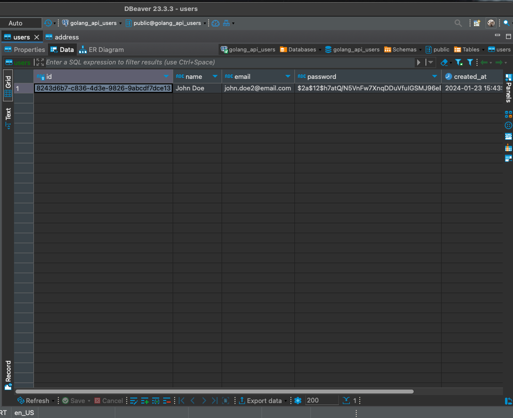
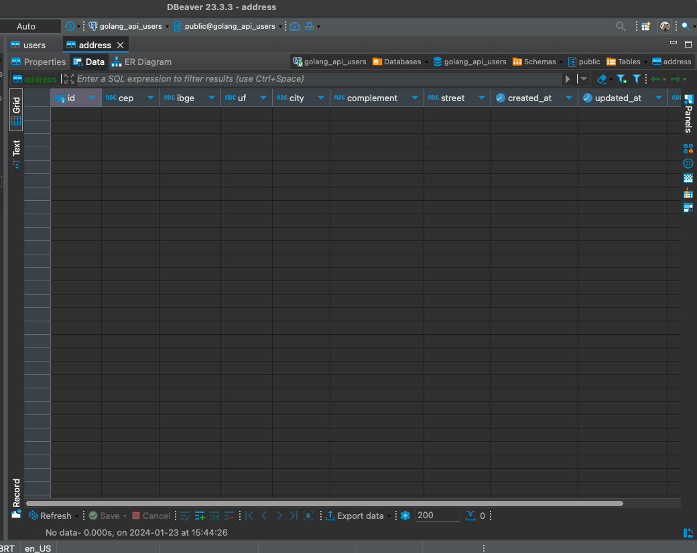

## O que vamos fazer?

Na parte 6 do nosso crud vamos finalizar nosso repository, salvando os dados do usuários no banco de dados utilizando o [sqlc](https://sqlc.dev/).

Se ainda não viu os posts anteriores leia eles primeiro.

[parte 1](/posts/api-golang-parte-1/) |
[parte 2](/posts/api-golang-parte-2/) |
[parte 3](/posts/api-golang-parte-3/) |
[parte 4](/posts/api-golang-parte-4/) |
[parte 5](/posts/api-golang-parte-5/) |

## Criando a tabela de endereços

Primeiramente vamos criar uma tabela de endereços, nela vamos salvar os endereços dos nossos usuários, poderíamos salvar esses dados na mesma tabela do usuário, porém decidi separar para utilizarmos relacionamentos e transactions com o postgres.

Vamos criar uma nova migration com o comando `make create_migration`. Criamos esse comando na [parte 2](https://wiliamvj.com/posts/api-golang-parte-2/), com a nova migration criada, vamos escrever o sql na migration up:

```sql
  CREATE TABLE address (
    id CHAR(36) NOT NULL PRIMARY KEY,
    cep VARCHAR(255) NOT NULL,
    ibge VARCHAR(255) NOT NULL,
    uf VARCHAR(255) NOT NULL,
    city VARCHAR(255) NOT NULL,
    complement VARCHAR(255) NULL,
    street VARCHAR(255) NOT NULL,
    created_at TIMESTAMP(3) NOT NULL DEFAULT CURRENT_TIMESTAMP,
    updated_at TIMESTAMP(3) NOT NULL,
    user_id VARCHAR(36) UNIQUE NOT NULL,

    FOREIGN KEY (user_id) REFERENCES users(id) ON DELETE CASCADE
  );
```

Criamos os campos que pegamos na api do viacep e adicionamos um relacionamento com o usuário (one to one), onde um usuário tem um endereço e um endereço pertence a um usuário.

Na migration down podemos fazer o sql que desfaz o que fizemos acima:

```sql
  DROP TABLE IF EXISTS address;
```

Agora podemos rodar o comando `make migrate_up`, não se esqueça de garantir que o banco de dados esteja rodando, se você clonou o repositório, basta usar o comando `docker compose up -d` que já vai subir um container com o postgres.

Com isso temos nossa tabela relacionanda com o usuário.

## Criando as queries

Primeiro vamos criar nossas queries para salvar um usuário, buscar um usuário pelo id, buscar todos os usuários, deletar usuário, atualizar um usuário e atualizar a senha do usuário.

### CreateUser

Essa query vai ser responsável por salvar um novo usuário:

```sql
  -- name: CreateUser :exec
  INSERT INTO users (id, name, email, password, created_at, updated_at)
  VALUES ($1, $2, $3, $4, $5, $6);
```

Não se esqueça das [queries annotations](https://docs.sqlc.dev/en/latest/reference/query-annotations.html) do sqlc.

### FindUserByEmail

Essa query vai ser responsável por buscar um usuário pelo e-mail:

```sql
  -- name: FindUserByEmail :one
  SELECT u.id, u.name, u.email FROM users u WHERE u.email = $1;
```

### FindUserByID

Essa query vai ser responsável por buscar um usuário pelo ID e também vamos retornar o endereço fazendo um join:

```sql
  -- name: FindUserByID :one
  SELECT u.id, u.name, u.email, u.created_At, u.updated_at, a.cep, a.uf, a.city, a.complement, a.street
  FROM users u
  JOIN address a ON a.user_id = u.id
  WHERE u.id = $1;
```

### UpdateUser

Essa query vai ser responsável por atualizar o usuário, usei os [nullable parameters](https://docs.sqlc.dev/en/stable/howto/named_parameters.html#nullable-parameters) do sqlc, isso ajuda a lidar com dados nulos, como atualizar dados é opcional, caso o usuário deseja atualizar apenas o `name` por exemplo, o resto dos dados não é anulado. Sem isso precisaríamos fazer algumas validações a mais:

```sql
  -- name: UpdateUser :exec
  UPDATE users SET
  name = COALESCE(sqlc.narg('name'), name),
  email = COALESCE(sqlc.narg('email'), email),
  updated_at = $2
  WHERE id = $1;
```

### DeleteUser

Essa query vai ser responsável por deletar um usuário pelo id, consequentemente deleta o endereço, pois criamos o relacionamento com a opção `DELETE CASCADE`:

```sql
  -- name: DeleteUser :exec
  DELETE FROM users WHERE id = $1;
```

### FindManyUsers

Essa query vai ser responsável por buscar todos os usuários com seus endereços, exatamente o que fizemos no `FindUserByID` mas agora sem o `WHERE`:

```sql
  -- name: FindManyUsers :many
  SELECT u.id, u.name, u.email, u.created_At, u.updated_at, a.cep, a.uf, a.city, a.complement, a.street
  FROM users u
  JOIN address a ON a.user_id = u.id
  ORDER BY u.created_at DESC;
```

### UpdatePassword

Essa query vai ser responsável por atualizar apenas a senha do usuário:

```sql
  -- name: UpdatePassword :exec
  UPDATE users SET password = $2, updated_at = $3 WHERE id = $1;
```

### GetUserPassword

Essa query vai ser responsável por buscar apenas a senha do usuário:

```sql
  -- name: GetUserPassword :one
  SELECT u.password FROM users u WHERE u.id = $1;
```

### CreateUserAddress

Essa query vai ser responsável por criar o endereço do usuário na tabelas `address`:

```sql
  -- name: CreateUserAddress :exec
  INSERT INTO address (id, user_id, cep, ibge, uf, city, complement, street, created_at, updated_at)
  VALUES ($1, $2, $3, $4, $5, $6, $7, $8, $9, $10);
```

### CreateUserAddress

Por fim, essa query vai atualizar o endereço do usuário, usando o [nullable parameters](https://docs.sqlc.dev/en/stable/howto/named_parameters.html#nullable-parameters) do sqlc:

```sql
  -- name: UpdateUserAddress :exec
  UPDATE address SET
  cep = COALESCE(sqlc.narg('cep'), cep),
  ibge = COALESCE(sqlc.narg('ibge'), ibge),
  uf = COALESCE(sqlc.narg('uf'), uf),
  city = COALESCE(sqlc.narg('city'), city),
  complement = COALESCE(sqlc.narg('complement'), complement),
  street = COALESCE(sqlc.narg('street'), street),
  updated_at = $2
  WHERE user_id = $1;
```

### Gerando o código sqlc

Com as queries escritas vamos rodar o sqlc para fazer sua mágica e gerar o código, vamos rodar com o comando:

```bash
  sqlc generate
```

Se notar na pasta **internal/database/sqlc** vai perceber que foi gerado bastante código, lembrando que não é preciso alterar nada da pasta sqlc.

## Finalizando o repository

Agora vamos ajustar nosso repository, até o momento apenas implementamos, agora vamos chamar o sqlc para fazer as execuções no nosso banco.

### CreateUser

```go
  func (r *repository) CreateUser(ctx context.Context, u *entity.UserEntity) error {
    err := r.queries.CreateUser(ctx, sqlc.CreateUserParams{
      ID:        u.ID,
      Name:      u.Name,
      Email:     u.Email,
      Password:  u.Password,
      CreatedAt: u.CreatedAt,
      UpdatedAt: u.UpdatedAt,
    })
    if err != nil {
      return err
    }
    err = r.queries.CreateUserAddress(ctx, sqlc.CreateUserAddressParams{
      ID:         uuid.New().String(),
      UserID:     u.ID,
      Cep:        u.Address.CEP,
      Ibge:       u.Address.IBGE,
      Uf:         u.Address.UF,
      City:       u.Address.City,
      Complement: sql.NullString{String: u.Address.Complement, Valid: u.Address.Complement != ""},
      Street:     u.Address.Street,
      CreatedAt:  time.Now(),
      UpdatedAt:  time.Now(),
    })
    if err != nil {
      return err
    }
    return nil
  }
```

No código acima, chamamos q nossa `queries` que iniciamos lá no `main.go` (`queries := sqlc.New(dbConnection)`), chamamos o `CreateUser` que definimos na annotation (`-- name: CreateUser :exec`), por fim o sqlc criou uma struct `CreateUserParams` dentro da pasta sqlc, nela vamos passar nossos dados. Depois de criar o usuário e se não houver erro, criamos o endereço com `CreateUserAddress`, nosso repository será bastante simples já que a única responsabilidade dele é chamar o sqlc fazer as tarefas no banco e retornar dados ou um erro, nada mais que isso.

Reparou em um problema? no caso do método `CreateUser` realiza duas tarefas no nosso banco, imagine que se ao salvar o endereço ocorra um erro? Nosso usuário vai ficar sem endereço e isso começa a degradar nosso banco de dados, isso é um problema grave! A forma correta de tratar esse problema seria salvar esses dados de forma atômica, vamos fazer isso com transactions, mas antes vamos finalizar o repository.

### FindUserByEmail

```go
  func (r *repository) FindUserByEmail(ctx context.Context, email string) (*entity.UserEntity, error) {
    user, err := r.queries.FindUserByEmail(ctx, email)
    if err != nil {
      return nil, err
    }
    userEntity := entity.UserEntity{
      ID:    user.ID,
      Name:  user.Name,
      Email: user.Email,
    }
    return &userEntity, nil
  }
```

Buscar nosso usuário pelo e-mail é bem simples, passamos o contexto e o e-mail e depois tratamos para retornar o `UserEntity`, nesse caso o `FindUserByEmail` poderia retornar apenas um `boolean`, já utilizar apenas para saber se um usuário existe ou não, mas vamos manter assim por enquanto.

### FindUserByID

```go
  func (r *repository) FindUserByID(ctx context.Context, id string) (*entity.UserEntity, error) {
    user, err := r.queries.FindUserByID(ctx, id)
    if err != nil {
      return nil, err
    }
    userEntity := entity.UserEntity{
      ID:    user.ID,
      Name:  user.Name,
      Email: user.Email,
      Address: entity.UserAddress{
        CEP:        user.Cep,
        UF:         user.Uf,
        City:       user.City,
        Complement: user.Complement.String,
        Street:     user.Street,
      },
      CreatedAt: user.CreatedAt,
      UpdatedAt: user.UpdatedAt,
    }
    return &userEntity, nil
  }
```

Muito semelhante ao `FindUserByEmail`, porém agora nosso critério de busca é pelo `ID` e retornamos o endereço.

### UpdateUser

```go
  func (r *repository) UpdateUser(ctx context.Context, u *entity.UserEntity) error {
    err := r.queries.UpdateUser(ctx, sqlc.UpdateUserParams{
      ID:        u.ID,
      Name:      sql.NullString{String: u.Name, Valid: u.Name != ""},
      Email:     sql.NullString{String: u.Email, Valid: u.Email != ""},
      UpdatedAt: u.UpdatedAt,
    })
    if err != nil {
      return err
    }
    err = r.queries.UpdateUserAddress(ctx, sqlc.UpdateUserAddressParams{
      UserID:     u.ID,
      Cep:        sql.NullString{String: u.Address.CEP, Valid: u.Address.CEP != ""},
      Ibge:       sql.NullString{String: u.Address.IBGE, Valid: u.Address.IBGE != ""},
      Uf:         sql.NullString{String: u.Address.UF, Valid: u.Address.UF != ""},
      City:       sql.NullString{String: u.Address.City, Valid: u.Address.City != ""},
      Complement: sql.NullString{String: u.Address.Complement, Valid: u.Address.Complement != ""},
      Street:     sql.NullString{String: u.Address.Street, Valid: u.Address.Street != ""},
      UpdatedAt:  time.Now(),
    })
    if err != nil {
      return err
    }
    return nil
  }
```

Para atualizar um usuário também é muito simples, a única diferença que temos do `CreateUser` é que precisamos tratar os dados que são opcionais, como utilizamos o nullable parameters do sqlc, foi gerado a struct dessa forma:

```go
  type UpdateUserParams struct {
    ID        string
    UpdatedAt time.Time
    Name      sql.NullString
    Email     sql.NullString
  }
```

Por isso usamos o `sql.NullString` caso o dado seja do tipo não `null` no contexto que estamos, então devemos atualizar, caso contrário não alteramos nada no banco.

Novamente o método `UpdateUser` atualiza o usuário e endereço, temos o mesmo problema do `CreateUser` e vamos resolver com transactions.

### DeleteUser

```go
  func (r *repository) DeleteUser(ctx context.Context, id string) error {
    err := r.queries.DeleteUser(ctx, id)
    if err != nil {
      return err
    }
    return nil
  }
```

Esse deve ser o mais simples, apenas deletamos o usuário, sem retorar nada.

### FindManyUsers

```go
  func (r *repository) FindManyUsers(ctx context.Context) ([]entity.UserEntity, error) {
    users, err := r.queries.FindManyUsers(ctx)
    if err != nil {
      return nil, err
    }
    var usersEntity []entity.UserEntity
    for _, user := range users {
      userEntity := entity.UserEntity{
        ID:    user.ID,
        Name:  user.Name,
        Email: user.Email,
        Address: entity.UserAddress{
          CEP:        user.Cep,
          UF:         user.Uf,
          City:       user.City,
          Street:     user.Street,
          Complement: user.Complement.String,
        },
        CreatedAt: user.CreatedAt,
        UpdatedAt: user.UpdatedAt,
      }
      usersEntity = append(usersEntity, userEntity)
    }
    return usersEntity, nil
  }
```

Para buscar todos os usuário também não tem segredo, a única coisa diferente que fazemos é um `for` para mapear os dados para um slice de `entity.UserEntity`.

### UpdatePassword

```go
  func (r *repository) UpdatePassword(ctx context.Context, pass, id string) error {
    err := r.queries.UpdatePassword(ctx, sqlc.UpdatePasswordParams{
      ID:        id,
      Password:  pass,
      UpdatedAt: time.Now(),
    })
    if err != nil {
      return err
    }
    return nil
  }
```

Para atualizar a senha do usuário, apenas passamos a nova senha, id e um nova data para informar sua atualização.

### GetUserPassword

```go
  func (r *repository) GetUserPassword(ctx context.Context, id string) (string, error) {
    pass, err := r.queries.GetUserPassword(ctx, id)
    if err != nil {
      return "", err
    }
    return pass, nil
  }
```

Por fim, esse método usamos apenas para buscar a senha do usuário, alterei para retornar apenas uma `string` nos últimos posts ele retornava um ponteiro do `entity.UserEntity`, não se esqueça de alterar na interface `user_interface_repository`.

Nosso repository está quase pronto, como pode perceber é bastante simples e com pouca responsabilidade no nosso projeto, antes de partir para as transactions vamos fazer alguns ajustes na nossa api.

## Ajustando o service

Vamos precisar ajustar algumas coisas no service, alguns tratamentos que acabei esquecendo de passar.

No método `CreateUser` do service, precisamos tratar ao verificar se o usuário existe pelo e-mail se o repository retornar um erro e esse erro for diferente de um erro do tipo `sql.ErrNoRows`, então temos um erro que devemos retornar, isso garante que seja retornado apenas um erro que não esperamos, quando o postgres do pacote pg não encontra um registro no banco é retornado um `sql.ErrNoRows` que nada mais é que um `errors.New("sql: no rows in result set")`.

```go
  userExists, err := s.repo.FindUserByEmail(ctx, u.Email)
  if err != nil {
    if err != sql.ErrNoRows { // adicione esse if
      slog.Error("error to search user by email", "err", err, slog.String("package", "userservice"))
      return err
    }
  }
```

Precisamos ajustar também no método `UpdateUser`, caso o erro seja do tipo `sql.ErrNoRows` significa que não encontrou o usuário.

```go
  _, err := s.repo.FindUserByID(ctx, id)
  if err != nil {
    if err == sql.ErrNoRows {
      slog.Error("user not found", slog.String("package", "userservice"))
      return errors.New("user not found")
    }
    slog.Error("error to search user by id", "err", err, slog.String("package", "userservice"))
    return err
  }
```

Caso o usuário informe um e-mail para atualização, precisamos validar também:

```go
  if u.Email != "" {
    userExists, err := s.repo.FindUserByEmail(ctx, u.Email)
    if err != nil {
      if err != sql.ErrNoRows {
        slog.Error("error to search user by email", "err", err, slog.String("package", "userservice"))
        return errors.New("error to search user by email")
      }
    }
    if userExists != nil {
      slog.Error("user already exists", slog.String("package", "userservice"))
      return errors.New("user already exists")
    }
    updateUser.Email = u.Email
  }
```

## Alterando o response

Precisamos adicionar o address ao response, vamos alterar o `user_response.go`:

```go
  type UserResponse struct {
    ID        string      `json:"id"`
    Name      string      `json:"name"`
    Email     string      `json:"email"`
    Address   UserAddress `json:"address"`
    CreatedAt time.Time   `json:"created_at"`
    UpdatedAt time.Time   `json:"updated_at"`
  }

  type UserAddress struct {
    CEP        string `json:"cep"`
    UF         string `json:"uf"`
    City       string `json:"city"`
    Complement string `json:"complement,omitempty"`
    Street     string `json:"street"`
  }
```

## Alterando o auth

Vamos modificar o `auth_service.go` não vamos mais retornar a senha no método `FindUserByEmail`, para isso vamos buscar a senha do usuários com o método `GetUserPassword`:

```go
  pass, err := s.repo.GetUserPassword(ctx, user.ID)
  if err != nil {
    slog.Error("error to search user password", "err", err, slog.String("package", "userservice"))
    return nil, errors.New("error to search user password")
  }
```

Agora para comparar as senhas usamos o `pass`:

```go
  err = bcrypt.CompareHashAndPassword([]byte(pass), []byte(u.Password))
```

o mesmo no método `UpdateUserPassword` do `user_service.go`:

```go
  oldPass, err := s.repo.GetUserPassword(ctx, id)
  if err != nil {
    slog.Error("error to get user password", "err", err, slog.String("package", "userservice"))
    return err
  }
```

Agora usamos o `oldPass` para comparar:

```go
 // compare passwords
  err = bcrypt.CompareHashAndPassword([]byte(oldPass), []byte(u.OldPassword))
  if err != nil {
    slog.Error("invalid password", slog.String("package", "userservice"))
    return errors.New("invalid password")
  }
  // compare new password with password in database
  err = bcrypt.CompareHashAndPassword([]byte(oldPass), []byte(u.Password))
  if err == nil {
    slog.Error("new password is equal to old password", slog.String("package", "userservice"))
    return errors.New("new password is equal to old password")
  }
```

## Melhorando o arquivo http

Nosso arquivo `http_client.http` precisamos definir o token de autenticação de forma manual após fazer login, vamos usar um "trick" do [rest client](https://github.com/Huachao/vscode-restclient) para deixar dinâmico:

```http
# @name login
POST http://localhost:8080/auth/login HTTP/1.1
content-type: application/json

{
  "email": "john.doe3@email.com",
  "password": "12345678@"
}
@token = { {login.response.body.access_token} }
```

Definimos um nome para esse endpoint com o `@name login`, depois pegamos o token da resposta e colocamos no `@token`, agora podemos usar o `token` nos demais endpoints, dessa forma:

```http
GET http://localhost:8080/user/list-all HTTP/1.1
content-type: application/json
Authorization: Bearer { {token} }
```

Agora não precisamos mais ficar copiando o token e colocando em cada endpoint 😎.

Se quiser saber mais sobre esse truques veja aqui nas [docs](https://github.com/Huachao/vscode-restclient).

## Trabalhando com transactions

Temos um problema para salvar e editar um usuário, como são dois comandos executados um após o outro (salvar usuário e salvar endereço) e não queremos um usuário sem endereço e um endereço sem usuário, caso ocorra um erro ao salvar qualquer um dos dados, o outro já aconteceu, por exemplo:

```go
func (r *repository) CreateUser(ctx context.Context, u *entity.UserEntity) error {
    err := r.queries.CreateUser(ctx, sqlc.CreateUserParams{
      ID:        u.ID,
      Name:      u.Name,
      Email:     u.Email,
      Password:  u.Password,
      CreatedAt: u.CreatedAt,
      UpdatedAt: u.UpdatedAt,
    })
    if err != nil {
      return err
    }
    err = r.queries.CreateUserAddress(ctx, sqlc.CreateUserAddressParams{
      ID:         uuid.New().String(),
      UserID:     u.ID,
      Cep:        u.Address.CEP,
      Ibge:       u.Address.IBGE,
      Uf:         u.Address.UF,
      City:       u.Address.City,
      Complement: sql.NullString{String: u.Address.Complement, Valid: u.Address.Complement != ""},
      Street:     u.Address.Street,
      CreatedAt:  time.Now(),
      UpdatedAt:  time.Now(),
    })
    if err != nil {
      return err
    }
    return nil
  }
```

Perceba que criamos primeiro o usuário, esse comando já foi efetuado no banco, caso ocorra um erro ao salvar o endereço o usuário criado no primeiro comando o usuário vai ficar sem endereço, isso gera um problema sério para a nossa aplicação, precisamos garantir que seja salvo todos os dados ou nada seja salvo em caso de erro, por isso precisamos fazer isso de forma atômica.

Como assim? Utilizando transactions o comando de salvar o usuário e o endereço entram em uma única transação, que por sua vez só pode ter dois resultados possíveis ou salvamos todos os dados corretamente ou nada é salvo. Digamos que aconteça um erro ao salvar o endereço, mas o usuário já foi salvo, utilizando transaction o usuário seria removido do banco (roll back), pois o comando de salvar endereço falhou, se tudo ocorrer com sucesso tudo é salvo (commit). Uma transação pode ter várias operações, no nosso exemplo vamos utilizar apenas duas que são salvar o usuário e seu endereço ou é tudo salvo com sucesso ou nada é salvo.

Transactions são um assunto um pouco mais complexo, não vou me aprofundar, quero apenas mostrar a forma correta de executar vários comandos no banco de dados sem perder dados e degradar o banco.

Vou mostrar um exemplo do problema:

```go
func (r *repository) CreateUser(ctx context.Context, u *entity.UserEntity) error {
    err := r.queries.CreateUser(ctx, sqlc.CreateUserParams{
      ID:        u.ID,
      Name:      u.Name,
      Email:     u.Email,
      Password:  u.Password,
      CreatedAt: u.CreatedAt,
      UpdatedAt: u.UpdatedAt,
    })
    if err != nil {
      return err
    }
    return errors.New("error")
    err = r.queries.CreateUserAddress(ctx, sqlc.CreateUserAddressParams{
      ID:         uuid.New().String(),
      UserID:     u.ID,
      Cep:        u.Address.CEP,
      Ibge:       u.Address.IBGE,
      Uf:         u.Address.UF,
      City:       u.Address.City,
      Complement: sql.NullString{String: u.Address.Complement, Valid: u.Address.Complement != ""},
      Street:     u.Address.Street,
      CreatedAt:  time.Now(),
      UpdatedAt:  time.Now(),
    })
    if err != nil {
      return err
    }
    return nil
  }
```

Adicionei um return `return errors.New("error")` logo após salvar o usuário, vamos testar e chamar o endpoint de criação de usuário:



O usuário foi criado com sucesso.



Porém o endereço não foi salvo, devido ao return que adicionamos para simular um erro.

### Utilizando transactions

O sqlc já oferece suporte a transactions, veja nas [docs](https://docs.sqlc.dev/en/latest/howto/transactions.html).

Vamos criar uma pasta chamada **transaction** dentro da pasta **repository** e um arquivo chamado `run_transaction.go`:

```go
  func Run(ctx context.Context, c *sql.DB, fn func(*sqlc.Queries) error) error {
    tx, err := c.BeginTx(ctx, nil)
    if err != nil {
      return err
    }
    q := sqlc.New(tx)
    err = fn(q)
    if err != nil {
      if errRb := tx.Rollback(); errRb != nil {
        return fmt.Errorf("error on rollback: %v, original error: %w", errRb, err)
      }
      return err
    }
    return tx.Commit()
  }
```

Esse código vamos utilizar para injetar durante a execução do sqlc, ele vai ser responsável por dar `rollBack` e caso de erro e fazer o `commit` em caso de sucesso.

Perceba que é bem semelhante ao que fazemos no main iniciando o sqlc com `sqlc.New(tx)`, o `BeginTx` pode ser um pouco mais complexo de entender, ele vai recebe um o `nil` se trata do isolate level, podemos definir níveis de isolamento para a nossa transação, mas como disse é um assunto mais complexo, vamos deixar o isolamento padrão. Veja mais sobre isolate level nesse [post](https://medium.com/nerd-for-tech/understanding-database-isolation-levels-c4ebcd55c6b9).

Bom, com a nossa função pronta, podemos alterar o método `CreateUser` do nosso repository, ficando assim:

```go
  func (r *repository) CreateUser(ctx context.Context, u *entity.UserEntity) error {
    err := transaction.Run(ctx, r.db, func(q *sqlc.Queries) error {
      var err error
      err = q.CreateUser(ctx, sqlc.CreateUserParams{
        ID:        u.ID,
        Name:      u.Name,
        Email:     u.Email,
        Password:  u.Password,
        CreatedAt: u.CreatedAt,
        UpdatedAt: u.UpdatedAt,
      })
      if err != nil {
        return err
      }
      err = q.CreateUserAddress(ctx, sqlc.CreateUserAddressParams{
        ID:         uuid.New().String(),
        UserID:     u.ID,
        Cep:        u.Address.CEP,
        Ibge:       u.Address.IBGE,
        Uf:         u.Address.UF,
        City:       u.Address.City,
        Complement: sql.NullString{String: u.Address.Complement, Valid: u.Address.Complement != ""},
        Street:     u.Address.Street,
        CreatedAt:  time.Now(),
        UpdatedAt:  time.Now(),
      })
      if err != nil {
        return err
      }
      return nil
    })
    if err != nil {
      slog.Error("error to create user and address, roll back applied", "err", err)
      return err
    }
    return nil
  }
```

Agora usamos a função `Run` que criamos, passamos o contexto, conexão com o banco e o ponteiro das nossas queries do sqlc, a partir de agora tudo que acontecer dentro dessa função é uma transaction única. Também precisamos usar as queries do sqlc está no parâmetro `q` da função anônima, antes usávamos do `r.queries`, se houver qualquer erro agora nossa transaction vai fazer um rollback, se tudo ocorrer com sucesso vamos ter um commit da transação.

Você pode fazer novamente o teste e colocar o `return errors.New("error")` antes de salvar o endereço do usuário, depois olhe no banco, vai perceber que o usuário não foi salvo, inclusive nossa api já vai retornar um erro 400 para o cliente.

### Implementando no UpdateUser

Vamos alterar também nosso método `UpdateUser`:

```go
  func (r *repository) UpdateUser(ctx context.Context, u *entity.UserEntity) error {
    err := transaction.Run(ctx, r.db, func(q *sqlc.Queries) error {
      var err error
      err = r.queries.UpdateUser(ctx, sqlc.UpdateUserParams{
        ID:        u.ID,
        Name:      sql.NullString{String: u.Name, Valid: u.Name != ""},
        Email:     sql.NullString{String: u.Email, Valid: u.Email != ""},
        UpdatedAt: u.UpdatedAt,
      })
      if err != nil {
        return err
      }
      err = r.queries.UpdateUserAddress(ctx, sqlc.UpdateUserAddressParams{
        UserID:     u.ID,
        Cep:        sql.NullString{String: u.Address.CEP, Valid: u.Address.CEP != ""},
        Ibge:       sql.NullString{String: u.Address.IBGE, Valid: u.Address.IBGE != ""},
        Uf:         sql.NullString{String: u.Address.UF, Valid: u.Address.UF != ""},
        City:       sql.NullString{String: u.Address.City, Valid: u.Address.City != ""},
        Complement: sql.NullString{String: u.Address.Complement, Valid: u.Address.Complement != ""},
        Street:     sql.NullString{String: u.Address.Street, Valid: u.Address.Street != ""},
        UpdatedAt:  time.Now(),
      })
      if err != nil {
        return err
      }
      return nil
    })
    if err != nil {
      slog.Error("error to update user and address, roll back applied", "err", err)
      return err
    }
    return nil
  }
```

Agora com a função `Run` feita, podemos usar facilmente onde precisar efetuar mais de um comando no banco de dados.

## Atualizando as docs

Para finalizar vamos gerar novamente as nossas docs, já que modificamos o response, basta rodar o comando:

```bash
  swag init -g internal/handler/routes/docs_route.go
```

## Considerações finais

Nesse post conseguimos finalizar a nosso repository, persistindo os dados no banco, também utilizamos transactions, deixando nossa api mais robusta.

## Próximos passos

Estamos chegando na reta final da nossa série, espero que esteja curtindo. Na parte 7 vamos implementar a parte de produtos, desde o handler até o repository.

## Link do repositório

[repositório](https://github.com/wiliamvj/api-users-golang) do projeto

Se inscreva e receba um aviso sobre novos posts, [participar](https://wiliamvj.substack.com/)

[Gopher credits](https://github.com/egonelbre/gophers)
