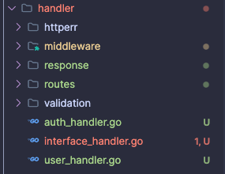
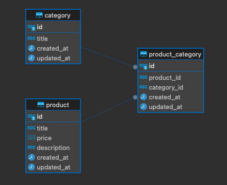
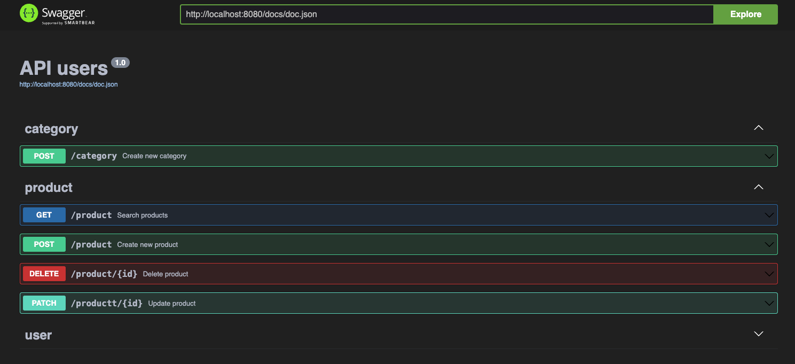

## O que vamos fazer?

Chegamos na última parte do nosso crud, na parte 7 vamos criar a funcionalidade de cadastro de produtos e categorias, vamos criar a funcionalidade de cadastrar produto e categoria, editar produto , listar todos os produtos e deletar produto.

Vamos trabalhar com relacionamentos many to many, uma categoria pode ter muitos produtos e um produto pode ter muitas categorias. Vamos fazer tudo neste último post, por isso deve ser um dos maiores da nossa série.

Se ainda não viu os posts anteriores leia eles primeiro.

[parte 1](/posts/api-golang-parte-1/) |
[parte 2](/posts/api-golang-parte-2/) |
[parte 3](/posts/api-golang-parte-3/) |
[parte 4](/posts/api-golang-parte-4/) |
[parte 5](/posts/api-golang-parte-5/) |
[parte 6](/posts/api-golang-parte-6/) |

## refatorando nosso handler

Primeiramente vamos fazer um ajuste no handler, estávamos separando o handler unicamente para o user, depois iriamos separar para product e category, porém dessa maneira gera uma complexidade maior ao passar a referência do servidor criado com go-chi, por isso resolvi refatorar e fazer um único handler.

Vamos mover o `user_handler.go`, `auth_handler.go` e `user_interface_handler.go` para a raiz da pasta **handler**, vamos também renomear o arquivo `user_interface_handler.go` para `interface_handler.go`, vamos ter apenas uma interface. Depois de mover você pode deletar a pasta **userhandler**, ficando assim:



Vamos renomear as funções e interface do handler alterado `interface_handler.go`:

`NewUserHandler` para `NewHandler`

`UserHandler` para `Handler`

Precisamos alterar também o nome dos pacotes dos arquivos movidos de `package userhandler` para `package handler`.

Vamos ajustar nosso `main.go`:

```go
  newHandler := handler.NewHandler(newUserService)

  // init routes
  router := chi.NewRouter()
  routes.InitRoutes(router, newHandler)
  routes.InitDocsRoutes(router)
```

## Criando as entities

Precisamos criar a entidade product e category, nosso produto e categoria terá relacionamento many-to-many, para criar o product é obrigatório passar pelo menos uma categoria.

Vamos criar um arquivo `category_entity.go` na pasta **entity**:

```go
  type CategoryEntity struct {
    ID        string    `json:"id"`
    Title     string    `json:"title"`
    CreatedAt time.Time `json:"created_at"`
    UpdatedAt time.Time `json:"updated_at"`
  }
```

Vamos criar um outro arquivo `product_entity.go` na pasta **entity**:

```go
  type ProductEntity struct {
    ID          string    `json:"id"`
    Title       string    `json:"title"`
    Price       int32     `json:"price"`
    Categories  []string  `json:"categories"`
    Description string    `json:"description"`
    CreatedAt   time.Time `json:"created_at"`
    UpdatedAt   time.Time `json:"updated_at"`
  }

  type ProductCategoryEntity struct {
    ID         string    `json:"id"`
    ProductID  string    `json:"product_id"`
    CategoryID string    `json:"category_id"`
    CreatedAt  time.Time `json:"created_at"`
    UpdatedAt  time.Time `json:"updated_at"`
  }

  type ProductWithCategoryEntity struct {
    ID          string           `json:"id"`
    Title       string           `json:"title"`
    Price       int32            `json:"price"`
    Description string           `json:"description"`
    Categories  []CategoryEntity `json:"categories"`
    CreatedAt   time.Time        `json:"created_at"`
  }
```

Teremos 3 entidades:

- `ProductEntity`: vamos usar para criar o produto.

- `ProductCategoryEntity`: vamos usar para criar o relacionamento entre produto e categoria.

- `ProductWithCategoryEntity`: vamos usar para montar um retorno onde trazemos o produto e suas categorias.

Qual o motivo da entidade `ProductCategoryEntity`? Como nosso produto terá relacionamento many-to-many precisamos criar uma terceira tabela, ela será responsável por ligar uma categoria a um produto, vai ser nessa tabela conhecida como tabela intermediária/junção/ligação pode ter várias nomenclaturas. Para ficar mais claro, veja a imagem abaixo:



## Criando os handlers category e product

Vamos iniciar criando os métodos necessário no na interface handler que acabamos de alterar:

```go
  func NewHandler(userService userservice.UserService,
    categoryService categoryservice.CategoryService,
    productservice productservice.ProductService) Handler {
    return &handler{
      userService:     userService,
      categoryService: categoryService,
      productservice:  productservice,
    }
  }

  type handler struct {
    userService     userservice.UserService
    categoryService categoryservice.CategoryService
    productservice  productservice.ProductService
  }
```

Primeiro definimos que agora ao gerar uma nova instância do `Handler` vamos receber 3 services, user, product e category.

```go
  type Handler interface {
    CreateUser(w http.ResponseWriter, r *http.Request)
    UpdateUser(w http.ResponseWriter, r *http.Request)
    GetUserByID(w http.ResponseWriter, r *http.Request)
    DeleteUser(w http.ResponseWriter, r *http.Request)
    FindManyUsers(w http.ResponseWriter, r *http.Request)
    UpdateUserPassword(w http.ResponseWriter, r *http.Request)
    Login(w http.ResponseWriter, r *http.Request)

    CreateCategory(w http.ResponseWriter, r *http.Request)

    CreateProduct(w http.ResponseWriter, r *http.Request)
    UpdateProduct(w http.ResponseWriter, r *http.Request)
    DeleteProduct(w http.ResponseWriter, r *http.Request)
    FindManyProducts(w http.ResponseWriter, r *http.Request)
  }
```

Nossa interface ficou assim, com os métodos de usuário que já existiam porém agora adicionamos novos métodos. Para a categoria vamos fazer apenas de criação, vou deixar para vocês implementarem os demais, para produto vamos fazer o de criação, atualização, deletar e buscar vários, também vou deixar o método de buscar um único produto pelo id para vocês implementarem.

### category handler

Crie um arquivo chamado `category_handler`, nas pasta **handler** esse enpdoint vai ser bastante simples, vamos adicionar poucos dados a nossa categoria, vamos criar também nosso dto, crie um arquivo chamado `category_dto.go` na pasta **dto**.

```go
  package dto

  type CreateCategoryDto struct {
    Title string `json:"title" validate:"required,min=3,max=30"`
  }
```

Nossa categoria vai receber apenas um título, nada mais. Adicione outros dados se desejar.

```go
  func (h *handler) CreateCategory(w http.ResponseWriter, r *http.Request) {
    var req dto.CreateCategoryDto

    if r.Body == http.NoBody {
      slog.Error("body is empty", slog.String("package", "categoryhandler"))
      w.WriteHeader(http.StatusBadRequest)
      msg := httperr.NewBadRequestError("body is required")
      json.NewEncoder(w).Encode(msg)
      return
    }
    err := json.NewDecoder(r.Body).Decode(&req)
    if err != nil {
      slog.Error("error to decode body", "err", err, slog.String("package", "categoryhandler"))
      w.WriteHeader(http.StatusBadRequest)
      msg := httperr.NewBadRequestError("error to decode body")
      json.NewEncoder(w).Encode(msg)
      return
    }
    httpErr := validation.ValidateHttpData(req)
    if httpErr != nil {
      slog.Error(fmt.Sprintf("error to validate data: %v", httpErr), slog.String("package", "categoryhandler"))
      w.WriteHeader(httpErr.Code)
      json.NewEncoder(w).Encode(httpErr)
      return
    }
    err = h.categoryService.CreateCategory(r.Context(), req)
    if err != nil {
      slog.Error(fmt.Sprintf("error to create category: %v", err), slog.String("package", "categoryhandler"))
      w.WriteHeader(http.StatusBadRequest)
    }
    w.WriteHeader(http.StatusCreated)
  }
```

O handler vai ser basicamente igual ao que já fizemos aos usuários, a sua ide vai acusar o erro no `categoryService.CreateCategory` pois ainda não criamos o service, para o handler do category é apenas isso.

### product handler

Crie um arquivo chamado `product_handler`, nas pasta **handler**, vamos criar também nosso dto, crie um arquivo chamado `product_dto.go` na pasta **dto**.

```go
  package dto

  type CreateProductDto struct {
    Title       string   `json:"title" validate:"required,min=3,max=40"`
    Price       int32    `json:"price" validate:"required,min=1"`
    Categories  []string `json:"categories" validate:"required,min=1,dive,uuid4"`
    Description string   `json:"description" validate:"required,min=3,max=500"`
  }

  type UpdateProductDto struct {
    Title       string   `json:"title" validate:"omitempty,min=3,max=40"`
    Price       int32    `json:"price" validate:"omitempty,min=1"`
    Categories  []string `json:"categories" validate:"omitempty,min=1,dive,uuid4"`
    Description string   `json:"description" validate:"omitempty,min=3,max=500"`
  }

  type FindProductDto struct {
    Search     string   `json:"search" validate:"omitempty,min=2,max=40"`
    Categories []string `json:"categories" validate:"omitempty,min=1,dive,uuid4"`
  }
```

Vamos ter 3 dtos para o product `CreateProductDto`, `UpdateProductDto` e para filtrar `FindProductDto`.

Validamos as categories com uso do `dive` para validar cada elemento do array, isso com o [go playground validator](https://github.com/go-playground/validator) ajuda muito a validação, as demais validações já utilizamos.

`CreateProduct`:

```go
  func (h *handler) CreateProduct(w http.ResponseWriter, r *http.Request) {
    var req dto.CreateProductDto

    if r.Body == http.NoBody {
      slog.Error("body is empty", slog.String("package", "producthandler"))
      w.WriteHeader(http.StatusBadRequest)
      msg := httperr.NewBadRequestError("body is required")
      json.NewEncoder(w).Encode(msg)
      return
    }
    err := json.NewDecoder(r.Body).Decode(&req)
    if err != nil {
      slog.Error("error to decode body", "err", err, slog.String("package", "producthandler"))
      w.WriteHeader(http.StatusBadRequest)
      msg := httperr.NewBadRequestError("error to decode body")
      json.NewEncoder(w).Encode(msg)
      return
    }
    httpErr := validation.ValidateHttpData(req)
    if httpErr != nil {
      slog.Error(fmt.Sprintf("error to validate data: %v", httpErr), slog.String("package", "producthandler"))
      w.WriteHeader(httpErr.Code)
      json.NewEncoder(w).Encode(httpErr)
      return
    }

    err = h.productservice.CreateProduct(r.Context(), req)
    if err != nil {
      if err.Error() == "category not found" {
        w.WriteHeader(http.StatusNotFound)
        msg := httperr.NewNotFoundError("category not found")
        json.NewEncoder(w).Encode(msg)
        return
      }
      slog.Error(fmt.Sprintf("error to create category: %v", err), slog.String("package", "categoryhandler"))
      w.WriteHeader(http.StatusBadRequest)
    }
    w.WriteHeader(http.StatusCreated)
  }
```

`UpdateProduct`:

```go
  func (h *handler) UpdateProduct(w http.ResponseWriter, r *http.Request) {
    var req dto.UpdateProductDto

    productID := chi.URLParam(r, "id")
    if productID == "" {
      slog.Error("product id is required", slog.String("package", "producthandler"))
      w.WriteHeader(http.StatusBadRequest)
      msg := httperr.NewBadRequestError("product id is required")
      json.NewEncoder(w).Encode(msg)
      return
    }
    _, err := uuid.Parse(productID)
    if err != nil {
      slog.Error(fmt.Sprintf("error to parse product id: %v", err), slog.String("package", "producthandler"))
      w.WriteHeader(http.StatusBadRequest)
      msg := httperr.NewBadRequestError("invalid product id")
      json.NewEncoder(w).Encode(msg)
      return
    }
    if r.Body == http.NoBody {
      slog.Error("body is empty", slog.String("package", "producthandler"))
      w.WriteHeader(http.StatusBadRequest)
      msg := httperr.NewBadRequestError("body is required")
      json.NewEncoder(w).Encode(msg)
      return
    }
    err = json.NewDecoder(r.Body).Decode(&req)
    if err != nil {
      slog.Error("error to decode body", "err", err, slog.String("package", "producthandler"))
      w.WriteHeader(http.StatusBadRequest)
      msg := httperr.NewBadRequestError("error to decode body")
      json.NewEncoder(w).Encode(msg)
      return
    }
    httpErr := validation.ValidateHttpData(req)
    if httpErr != nil {
      slog.Error(fmt.Sprintf("error to validate data: %v", httpErr), slog.String("package", "producthandler"))
      w.WriteHeader(httpErr.Code)
      json.NewEncoder(w).Encode(httpErr)
      return
    }
    err = h.productservice.UpdateProduct(r.Context(), productID, req)
    if err != nil {
      if err.Error() == "product not found" {
        w.WriteHeader(http.StatusNotFound)
        msg := httperr.NewNotFoundError("product not found")
        json.NewEncoder(w).Encode(msg)
        return
      }
      if err.Error() == "category not found" {
        w.WriteHeader(http.StatusNotFound)
        msg := httperr.NewNotFoundError("category not found")
        json.NewEncoder(w).Encode(msg)
        return
      }
      slog.Error(fmt.Sprintf("error to update category: %v", err), slog.String("package", "categoryhandler"))
      w.WriteHeader(http.StatusBadRequest)
    }
    w.WriteHeader(http.StatusOK)
  }
```

`DeleteProduct`:

```go
  func (h *handler) DeleteProduct(w http.ResponseWriter, r *http.Request) {
    productID := chi.URLParam(r, "id")
    if productID == "" {
      slog.Error("product id is required", slog.String("package", "producthandler"))
      w.WriteHeader(http.StatusBadRequest)
      msg := httperr.NewBadRequestError("product id is required")
      json.NewEncoder(w).Encode(msg)
      return
    }
    _, err := uuid.Parse(productID)
    if err != nil {
      slog.Error(fmt.Sprintf("error to parse product id: %v", err), slog.String("package", "producthandler"))
      w.WriteHeader(http.StatusBadRequest)
      msg := httperr.NewBadRequestError("invalid product id")
      json.NewEncoder(w).Encode(msg)
      return
    }
    err = h.productservice.DeleteProduct(r.Context(), productID)
    if err != nil {
      if err.Error() == "product not found" {
        w.WriteHeader(http.StatusNotFound)
        msg := httperr.NewNotFoundError("product not found")
        json.NewEncoder(w).Encode(msg)
        return
      }
      slog.Error(fmt.Sprintf("error to delete category: %v", err), slog.String("package", "categoryhandler"))
      w.WriteHeader(http.StatusBadRequest)
    }
    w.WriteHeader(http.StatusOK)
  }
```

`FindManyProducts`:

```go
  func (h *handler) FindManyProducts(w http.ResponseWriter, r *http.Request) {
    var req dto.FindProductDto

    err := json.NewDecoder(r.Body).Decode(&req)
    if err != nil {
      slog.Error("error to decode body", "err", err, slog.String("package", "producthandler"))
      w.WriteHeader(http.StatusBadRequest)
      msg := httperr.NewBadRequestError("error to decode body")
      json.NewEncoder(w).Encode(msg)
      return
    }
    httpErr := validation.ValidateHttpData(req)
    if httpErr != nil {
      slog.Error(fmt.Sprintf("error to validate data: %v", httpErr), slog.String("package", "producthandler"))
      w.WriteHeader(httpErr.Code)
      json.NewEncoder(w).Encode(httpErr)
      return
    }
    products, err := h.productservice.FindManyProducts(r.Context(), req)
    if err != nil {
      slog.Error(fmt.Sprintf("error to find many products: %v", err), slog.String("package", "producthandler"))
      w.WriteHeader(http.StatusBadRequest)
    }
    w.WriteHeader(http.StatusOK)
    json.NewEncoder(w).Encode(products)
  }
```

Esses serão nossos métodos, tudo que já vimos nos posts anteriores, sem segredo.

## Criando os services category e product

### category service

Vamos criar um pasta dentro do **service** chamado **categoryservice** e um arquivo `category_interface_service.go`:

```go
  func NewCategoryService(repo categoryrepository.CategoryRepository) CategoryService {
    return &service{
      repo,
    }
  }

  type service struct {
    repo categoryrepository.CategoryRepository
  }

  type CategoryService interface {
    CreateCategory(ctx context.Context, u dto.CreateCategoryDto) error
  }
```

Assim igual ao handler o service será simples, agora vamos implementar, crie outro arquivo chamado `category_service.go`

```go
  func (s *service) CreateCategory(ctx context.Context, u dto.CreateCategoryDto) error {
    categoryEntity := entity.CategoryEntity{
      ID:        uuid.New().String(),
      Title:     u.Title,
      CreatedAt: time.Now(),
      UpdatedAt: time.Now(),
    }
    err := s.repo.CreateCategory(ctx, &categoryEntity)
    if err != nil {
      return errors.New("error to create category")
    }
    return nil
  }
```

Somente isso é suficiente para criar a nossa category.

### product service

Vamos criar um pasta dentro do **service** chamado **productservice** e um arquivo `product_interface_service.go`:

```go
  func NewProductService(repo productrepository.ProductRepository) ProductService {
    return &service{
      repo,
    }
  }

  type service struct {
    repo productrepository.ProductRepository
  }

  type ProductService interface {
    CreateProduct(ctx context.Context, u dto.CreateProductDto) error
    UpdateProduct(ctx context.Context, id string, u dto.UpdateProductDto) error
    DeleteProduct(ctx context.Context, id string) error
    FindManyProducts(ctx context.Context, d dto.FindProductDto) ([]response.ProductResponse, error)
  }
```

Repare que temos um `response.ProductResponse`, precisamos criar também, crie na pasta **response** um arquivo chamado `product_response.go` e outro chamado `category_response.go`:

`category_response.go`:

```go
  type CategoryResponse struct {
    ID    string `json:"id"`
    Title string `json:"title"`
  }
```

Isso é o que vamos retornar da categoria na busca de produtos.

`product_response.go`:

```go
  type ProductResponse struct {
    ID          string             `json:"id"`
    Title       string             `json:"title"`
    Price       int32              `json:"price"`
    Description string             `json:"description,omitempty"`
    Categories  []CategoryResponse `json:"categories"`
    CreatedAt   time.Time          `json:"created_at"`
  }
```

Como um produto pode ter muitas categorias, vamos retornar um slice de `CategoryResponse`.

Vamos implementar nosso service, começando pelo `CreateProduct`:

```go
  func (s *service) CreateProduct(ctx context.Context, u dto.CreateProductDto) error {
    productId := uuid.New().String()
    productEntity := entity.ProductEntity{
      ID:          productId,
      Title:       u.Title,
      Price:       u.Price,
      Categories:  u.Categories,
      Description: u.Description,
      CreatedAt:   time.Now(),
      UpdatedAt:   time.Now(),
    }
    var categories []entity.ProductCategoryEntity
    for _, categoryID := range u.Categories {
      exists, err := s.repo.GetCategoryByID(ctx, categoryID)
      if err != nil || !exists {
        slog.Error("category not found", slog.String("category_id", categoryID), slog.String("package", "productservice"))
        return errors.New("category not found")
      }
      categories = append(categories, entity.ProductCategoryEntity{
        ID:         uuid.New().String(),
        ProductID:  productId,
        CategoryID: categoryID,
        CreatedAt:  time.Now(),
        UpdatedAt:  time.Now(),
      })
    }
    err := s.repo.CreateProduct(ctx, &productEntity, categories)
    if err != nil {
      return err
    }
    return nil
  }
```

No service vamos apenas criar o `ProductEntity` para repassar ao nosso repositório, depois fazemos um for para criar a entidade da categoria, como o produto pode ter várias categorias, é necessário.

Nessa parte você pode ver a vantagem de deixar a responsabilidade da criação do id do banco pelo service e não pelo banco, dessa forma não precisamos salvar o produto no banco para saber o id, dessa forma conseguimos salvar o produto e categoria todos de uma única vez, ainda vai dar erro no repositório `CreateProduct` e `GetCategoryByID`, ainda vamos implementar.

Nesse mesmo `for` já verificamos se a categoria existe.

`UpdateProduct`:

```go
  func (s *service) UpdateProduct(ctx context.Context, id string, u dto.UpdateProductDto) error {
    exists, err := s.repo.GetProductByID(ctx, id)
    if err != nil || !exists {
      slog.Error("product not found", slog.String("product_id", id), slog.String("package", "productservice"))
      return errors.New("product not found")
    }
    // validate categories if they exist
    var categories []entity.ProductCategoryEntity
    if len(u.Categories) > 0 {
      for _, categoryID := range u.Categories {
        exists, err := s.repo.GetCategoryByID(ctx, categoryID)
        if err != nil || !exists {
          slog.Error("category not found", slog.String("category_id", categoryID), slog.String("package", "productservice"))
          return errors.New("category not found")
        }
      }
      // search for all categories of the product
      productCategories, err := s.repo.GetCategoriesByProductID(ctx, id)
      if err != nil {
        return errors.New("error getting categories by product id")
      }
      // remove all categories that are not in u.Categories
      for _, productCategory := range productCategories {
        found := false
        for _, categoryID := range u.Categories {
          if productCategory == categoryID {
            found = true
            break
          }
        }
        // if not found, then we can delete it
        if !found {
          err = s.repo.DeleteProductCategory(ctx, id, productCategory)
          if err != nil {
            return errors.New("error deleting product category")
          }
        }
      }

      for _, categoryID := range u.Categories {
        found := false
        for _, productCategory := range productCategories {
          if productCategory == categoryID {
            found = true
            break
          }
        }
        if !found {
          categories = append(categories, entity.ProductCategoryEntity{
            ID:         uuid.New().String(),
            ProductID:  id,
            CategoryID: categoryID,
            CreatedAt:  time.Now(),
            UpdatedAt:  time.Now(),
          })
        }
      }
    }
    productEntity := entity.ProductEntity{
      ID:          id,
      Title:       u.Title,
      Price:       u.Price,
      Description: u.Description,
      Categories:  u.Categories,
      UpdatedAt:   time.Now(),
    }
    err = s.repo.UpdateProduct(ctx, &productEntity, categories)
    if err != nil {
      return err
    }
    return nil
  }
```

Esse deve é o método mais complexo, nessa função além de atualizar o produto, atualizamos também as categorias desse produto, mas existem algumas regras, ao atualizar o produto e o campo `categories` for informado no dto vamos verificar se todos os ids de categorias informadas já estão associadas ao produto, se não estiver, vamos criar se estiver não fazemos nada e caso tenha uma categoria associada a esse produto que não esteja no slice `categories` informada no dto, vamos deletar, existem diversas formas de implementar, poderíamos criar outros endpoits para remover uma categoria de um produto, associar uma categoria, mas em um único endpoint deixas um pouco mais simples de trabalhar.

```go
  for _, categoryID := range u.Categories {
    exists, err := s.repo.GetCategoryByID(ctx, categoryID)
    if err != nil || !exists {
      slog.Error("category not found", slog.String("category_id", categoryID), slog.String("package", "productservice"))
      return errors.New("category not found")
    }
  }
```

Primeiro verificamos se as categorias informadas no `categories` existem.

```go
  productCategories, err := s.repo.GetCategoriesByProductID(ctx, id)
  if err != nil {
    return errors.New("error getting categories by product id")
  }
```

Agora buscamos todas as categorias associadas a esse produto, vamos utilizar principalmente para remover as categorias associadas e não informadas no `u.Categories`

Por último colocamos os dados no slice `productEntity` para enviar ao repositório `UpdateProduct`.

`DeleteProduct`:

```go
  func (s *service) DeleteProduct(ctx context.Context, id string) error {
    exists, err := s.repo.GetProductByID(ctx, id)
    if err != nil || !exists {
      slog.Error("product not found", slog.String("product_id", id), slog.String("package", "productservice"))
      return errors.New("product not found")
    }
    err = s.repo.DeleteProduct(ctx, id)
    if err != nil {
      return err
    }
    return nil
  }
```

Esse é mais simples, apenas deletamos o produto e como vamos usar `DELETE CASCADE` os registros da tabela de ligação serão deletados junto.

`FindManyProducts`:

```go
  func (s *service) FindManyProducts(ctx context.Context, d dto.FindProductDto) ([]response.ProductResponse, error) {
    products, err := s.repo.FindManyProducts(ctx, d)
    if err != nil {
      return nil, err
    }
    var productsResponse []response.ProductResponse
    for _, p := range products {
      var categories []response.CategoryResponse
      for _, c := range p.Categories {
        categories = append(categories, response.CategoryResponse{
          ID:    c.ID,
          Title: c.Title,
        })
      }
      productsResponse = append(productsResponse, response.ProductResponse{
        ID:          p.ID,
        Title:       p.Title,
        Description: p.Description,
        Price:       p.Price,
        Categories:  categories,
        CreatedAt:   p.CreatedAt,
      })
    }
    if len(productsResponse) == 0 {
      return []response.ProductResponse{}, nil
    }
    return productsResponse, nil
  }
```

Por último vamos ter o `FindManyProducts` para listar os produtos, mas sem segredo, apenas mapeamos o que recebemos do repository, o repository vai retornar um slice da entidade `ProductWithCategoryEntity` que criamos anteriormente.

Com isso já temos o service e handler implementados.

## Criando o repository

Primeiro vamos criar os arquivos, crie uma pasta dentro de **repository** chamado **categoryrepository** e **productrepository** e os arquivos
`product_interface_repository.go`, `product_repository.go` e `category_interface_repository.go`, `category_repository.go`.

`category_interface_repository.go`:

```go
  func NewCategoryRepository(db *sql.DB, q *sqlc.Queries) CategoryRepository {
    return &repository{
      db,
      q,
    }
  }

  type repository struct {
    db      *sql.DB
    queries *sqlc.Queries
  }

  type CategoryRepository interface {
    CreateCategory(ctx context.Context, c *entity.CategoryEntity) error
  }
```

`product_interface_repository.go`:

```go
  func NewProductRepository(db *sql.DB, q *sqlc.Queries) ProductRepository {
    return &repository{
      db,
      q,
    }
  }

  type repository struct {
    db      *sql.DB
    queries *sqlc.Queries
  }

  type ProductRepository interface {
    CreateProduct(ctx context.Context, p *entity.ProductEntity, c []entity.ProductCategoryEntity) error
    GetCategoryByID(ctx context.Context, id string) (bool, error)
    GetProductByID(ctx context.Context, id string) (bool, error)
    UpdateProduct(ctx context.Context, p *entity.ProductEntity, c []entity.ProductCategoryEntity) error
    GetCategoriesByProductID(ctx context.Context, id string) ([]string, error)
    DeleteProductCategory(ctx context.Context, productID, categoryID string) error
    DeleteProduct(ctx context.Context, id string) error
    FindManyProducts(ctx context.Context, d dto.FindProductDto) ([]entity.ProductWithCategoryEntity, error)
  }
```

Com isso deixamos nossa interface pronta.

### criando o sql

Vamos criar nosso sql, vamos começar pela migration, rode o comando:

```bash
  make create_migration
```

Vamos ter uma nova migration vazia na pasta **migrations**

```sql
  CREATE TABLE category (
    id VARCHAR(36) NOT NULL PRIMARY KEY,
    title VARCHAR(255) NOT NULL,
    created_at TIMESTAMP(3) NOT NULL DEFAULT CURRENT_TIMESTAMP,
    updated_at TIMESTAMP(3) NOT NULL
  );

  CREATE TABLE product (
    id VARCHAR(36) NOT NULL PRIMARY KEY,
    title VARCHAR(255) NOT NULL,
    price INTEGER NOT NULL,
    description TEXT NULL,
    created_at TIMESTAMP(3) NOT NULL DEFAULT CURRENT_TIMESTAMP,
    updated_at TIMESTAMP(3) NOT NULL
  );

  CREATE TABLE product_category (
    id VARCHAR(36) NOT NULL PRIMARY KEY,
    product_id VARCHAR(36) NOT NULL,
    category_id VARCHAR(36) NOT NULL,
    created_at TIMESTAMP(3) NOT NULL DEFAULT CURRENT_TIMESTAMP,
    updated_at TIMESTAMP(3) NOT NULL,
    FOREIGN KEY (product_id) REFERENCES product(id) ON DELETE CASCADE,
    FOREIGN KEY (category_id) REFERENCES category(id) ON DELETE CASCADE,
    UNIQUE (product_id, category_id)
  );
```

Este vai ser nosso sql responsável por criar as tabelas que precisamos a tabela `product_category` é a tabela de ligação, onde podemos term inúmeros registros para um único produto.

```sql
  DROP TABLE IF EXISTS product_category;
  DROP TABLE IF EXISTS product;
  DROP TABLE IF EXISTS category;
```

Esse sql acima é o que desfaz nossa migration.

Rodando as migrations com o comando:

```bash
  make migration_up
```

Agora ao acessar o banco, as tabelas já constam no banco, não se esqueça de iniciar o container com

```bash
docker-compose up -d
```

### criando as consultas

Crie dois arquivos na pasta **queries** chamado `categories.sql` e `products.sql`:

`categories.sql`:

```sql
  -- name: CreateCategory :exec
  INSERT INTO category (id, title, created_at, updated_at)
  VALUES ($1, $2, $3, $4);
```

Vamos ter apenas uma query de criação

`products.sql`:

```sql
  -- name: CreateProduct :exec
  INSERT INTO product (id, title, description, price, created_at, updated_at)
  VALUES ($1, $2, $3, $4, $5, $6);

  -- name: CreateProductCategory :exec
  INSERT INTO product_category (id, product_id, category_id, created_at, updated_at)
  VALUES ($1, $2, $3, $4, $5);

  -- name: GetCategoryByID :one
  SELECT EXISTS (SELECT 1 FROM category WHERE id = $1) AS category_exists;

  -- name: GetProductByID :one
  SELECT EXISTS (SELECT 1 FROM product WHERE id = $1) AS product_exists;

  -- name: UpdateProduct :exec
  UPDATE product
  SET
  title = COALESCE(sqlc.narg('title'), title),
  description = COALESCE(sqlc.narg('description'), description),
  price = COALESCE(sqlc.narg('price'), price),
  updated_at = $2
  WHERE id = $1;

  -- name: GetCategoriesByProductID :many
  SELECT pc.category_id FROM product_category pc WHERE pc.product_id = $1;

  -- name: DeleteProductCategory :exec
  DELETE FROM product_category WHERE product_id = $1 AND category_id = $2;

  -- name: DeleteProduct :exec
  DELETE FROM product WHERE id = $1;

  -- name: FindManyProducts :many
  SELECT
  p.id,
  p.title,
  p.description,
  p.price,
  p.created_at
  FROM product p
  JOIN product_category pc ON pc.product_id = p.id
  WHERE
    (pc.category_id  = ANY(@categories::TEXT[]) OR @categories::TEXT[] IS NULL)
    AND (
      p.title ILIKE '%' || COALESCE(@search, sqlc.narg('search'), '') || '%'
      OR
      p.description ILIKE '%' || COALESCE(@search, sqlc.narg('search'), '') || '%'
    )
  ORDER BY p.created_at DESC;

  -- name: GetProductCategories :many
  SELECT c.id, c.title FROM category c
  JOIN product_category pc ON pc.category_id = c.id
  WHERE pc.product_id = $1;
```

para o product vamos ter mais queries, mas todas simples, a mais "elaborada" vai ser a de buscar produto `GetProductCategories`, mas tem um problema causado pelo sqlc nessa query.

A query `GetProductCategories` devolve vários produtos, e deveria retornar todas as categorias associadas ao produto de uma única vez, lembrando que o produto pode ter inúmeras categorias, para isso bastaria adicionar um `JOIN` na tabela `category`, porém o sqlc não consegue gerar a struct aninhada com o slice `Category`, como assim?

Se mudar a query para isso:

```sql
  -- name: FindManyProducts :many
  SELECT
  p.id,
  p.title,
  p.description,
  p.price,
  p.created_at
  c.* // retornando a category
  FROM product p
  JOIN product_category pc ON pc.product_id = p.id
  JOIN category c ON c.id = pc.category_id //adicionando o join
  WHERE
    (pc.category_id  = ANY(@categories::TEXT[]) OR @categories::TEXT[] IS NULL)
    AND (
      p.title ILIKE '%' || COALESCE(@search, sqlc.narg('search'), '') || '%'
      OR
      p.description ILIKE '%' || COALESCE(@search, sqlc.narg('search'), '') || '%'
    )
  ORDER BY p.created_at DESC;
```

e rodar o comando `sqlc generate`, o sqlc vai gerar o código e fazer o scan, se acessar o arquivo gerado chamado `products.sql.go` na pasta **sqlc** vamos ter a struct de retorno da `FindManyProducts`:

```go
  type FindManyProductsRow struct {
    ID          string
    Title       string
    Description sql.NullString
    Price       int32
    CreatedAt   time.Time
    ID_2        string
    Title_2     string
    CreatedAt_2 time.Time
    UpdatedAt   time.Time
  }
```

Repare que o sqlc normaliza tudo na mesma struct, mas o que precisamos seria algo do tipo:

```go
  type FindManyProductsRow struct {
    ID          string
    Title       string
    Description sql.NullString
    Price       int32
    CreatedAt   time.Time
    Categories []Categories
  }

  type FindManyProductsCategoriesRow struct {
    ID          string
    Title       string
  }
```

Porém o sqlc não faz isso no momento, porém conseguimos aninhar isso usando o `sqlc.embed`, alterando a query ficaria assim:

```sql
  -- name: FindManyProducts :many
  SELECT
  p.id,
  p.title,
  p.description,
  p.price,
  p.created_at,
  sqlc.embed(c) // usando o sqlc embed
  FROM product p
  JOIN product_category pc ON pc.product_id = p.id
  JOIN category c ON c.id = pc.category_id
  WHERE
    (pc.category_id  = ANY(@categories::TEXT[]) OR @categories::TEXT[] IS NULL)
    AND (
      p.title ILIKE '%' || COALESCE(@search, sqlc.narg('search'), '') || '%'
      OR
      p.description ILIKE '%' || COALESCE(@search, sqlc.narg('search'), '') || '%'
    )
  ORDER BY p.created_at DESC;
```

Agora no arquivo gerado pelo sqlc teremos:

```go
  type FindManyProductsRow struct {
    ID          string
    Title       string
    Description sql.NullString
    Price       int32
    CreatedAt   time.Time
    Category    Category
  }
```

o sqlc aninhou porém não é um slice, como precisamos, já existe diversas questões sobre isso no repositório do sqlc, caso queira ver uma das discussões [acesse aqui](https://github.com/sqlc-dev/sqlc/discussions/2643).

A solução seria fazer a consulta sem usar o sqlc, porém ficaria extenso demais abordar isso, a solução mais simples para não se prolongar é buscar os produtos, depois fazer um `for` e buscar as categorias de cada produto, por isso usamos a query `GetProductCategories`.

Ainda sobre a query `FindManyProducts`, fiz uma busca bem simples por categorias e texto, buscando por `title` ou `description`, é umas busca onde podemos passar um slice de categories, e vai retornar se o produto tiver alguma das categories.

Já a busca usando o `search` fazemos a busca muito simples, porém se tivermos um produto com o título `Avião` e no search buscar por `aviao` não vai retornar resultados, por conta do caracter especial `~`. Existem várias soluções para isso, uma delas seria criar um novo campos chamado `search` por exemplo, esse campos seria salvo os palavras normalizadas, digamos que o títulos seja `Avião Voador`, no campos search ficaria `Avião Voador,aviao voador`, assim conseguimos buscar com e sem caracter especial.

Este é apenas uma das soluções, porém gera um certo trabalho manter esse campo sempre atualizado. Podemos utilizar também uma extensão do Postgres chamado [unaccent](https://www.postgresql.org/docs/current/unaccent.html), com essa extensão não precisamos normalizar os dados, isso é feito em tempo de pesquisa. Mas não vamos abordar no momento, talvez em um outro post.

## implementando o repository

### category repository

`CreateCategory`:

```go
  func (r *repository) CreateCategory(ctx context.Context, c *entity.CategoryEntity) error {
    err := r.queries.CreateCategory(ctx, sqlc.CreateCategoryParams{
      ID:        c.ID,
      Title:     c.Title,
      CreatedAt: c.CreatedAt,
      UpdatedAt: c.UpdatedAt,
    })
    if err != nil {
      return err
    }
    return nil
  }
```

Apenas salvamos a nova categoria.

### product repository

`CreateProduct`:

```go
  func (r *repository) CreateProduct(ctx context.Context, p *entity.ProductEntity, c []entity.ProductCategoryEntity) error {
    err := transaction.Run(ctx, r.db, func(q *sqlc.Queries) error {
      var err error
      err = q.CreateProduct(ctx, sqlc.CreateProductParams{
        ID:          p.ID,
        Title:       p.Title,
        Price:       p.Price,
        Description: sql.NullString{String: p.Description, Valid: p.Description != ""},
        CreatedAt:   p.CreatedAt,
        UpdatedAt:   p.UpdatedAt,
      })
      if err != nil {
        return err
      }
      for _, category := range c {
        err = q.CreateProductCategory(ctx, sqlc.CreateProductCategoryParams{
          ID:         category.ID,
          ProductID:  p.ID,
          CategoryID: category.CategoryID,
          CreatedAt:  category.CreatedAt,
          UpdatedAt:  category.UpdatedAt,
        })
        if err != nil {
          return err
        }
      }
      return nil
    })
    if err != nil {
      slog.Error("error to create product, roll back applied", "err", err)
      return err
    }
    return nil
  }
```

Na criação de produtos usamos as transactions, primeiro salvamos o produto e depois fazemos um `for` para salvar cada `CreateProductCategory`.

`GetCategoryByID`:

```go
  func (r *repository) GetCategoryByID(ctx context.Context, id string) (bool, error) {
    exists, err := r.queries.GetCategoryByID(ctx, id)
    if err != nil || err == sql.ErrNoRows {
      return false, err
    }
    return exists, nil
  }
```

Usamos para buscar uma categoria pelo id, apenas para validar se existe.

`GetProductByID`:

```go
  func (r *repository) GetProductByID(ctx context.Context, id string) (bool, error) {
    exists, err := r.queries.GetProductByID(ctx, id)
    if err != nil || err == sql.ErrNoRows {
      return false, err
    }
    return exists, nil
  }
```

Buscamos um produto pelo id, apenas para validar se existe.

`UpdateProduct`:

```go
  func (r *repository) UpdateProduct(ctx context.Context, p *entity.ProductEntity, c []entity.ProductCategoryEntity) error {
    err := transaction.Run(ctx, r.db, func(q *sqlc.Queries) error {
      var err error
      err = q.UpdateProduct(ctx, sqlc.UpdateProductParams{
        ID:          p.ID,
        Title:       sql.NullString{String: p.Title, Valid: p.Title != ""},
        Price:       sql.NullInt32{Int32: p.Price, Valid: p.Price != 0},
        Description: sql.NullString{String: p.Description, Valid: p.Description != ""},
        UpdatedAt:   p.UpdatedAt,
      })
      if err != nil {
        return err
      }
      for _, category := range c {
        err = q.CreateProductCategory(ctx, sqlc.CreateProductCategoryParams{
          ID:         category.ID,
          ProductID:  p.ID,
          CategoryID: category.CategoryID,
          CreatedAt:  category.CreatedAt,
          UpdatedAt:  category.UpdatedAt,
        })
        if err != nil {
          return err
        }
      }
      return nil
    })
    if err != nil {
      slog.Error("error to update product, roll back applied", "err", err)
      return err
    }
    return nil
  }
```

Para atualizar o produto é semelhante a criação, utilizamos transaction e utilizamos o `sql.NullString` e `sql.NullInt32` para tratar valores possivelmente nulos.

`GetCategoriesByProductID`:

```go
  func (r *repository) GetCategoriesByProductID(ctx context.Context, id string) ([]string, error) {
    categories, err := r.queries.GetCategoriesByProductID(ctx, id)
    if err != nil {
      return nil, err
    }
    return categories, nil
  }
```

Retornamos os ids das categorias de um produto.

`DeleteProductCategory`:

```go
  func (r *repository) DeleteProductCategory(ctx context.Context, productID, categoryID string) error {
    err := r.queries.DeleteProductCategory(ctx, sqlc.DeleteProductCategoryParams{
      ProductID:  productID,
      CategoryID: categoryID,
    })
    if err != nil {
      return err
    }
    return nil
  }
```

Usamos para deletar um registro da tabela de ligação.

`DeleteProduct`:

```go
  func (r *repository) DeleteProduct(ctx context.Context, id string) error {
    err := r.queries.DeleteProduct(ctx, id)
    if err != nil {
      return err
    }
    return nil
  }
```

Deleta o nosso produto pelo id.

`FindManyProducts`:

```go
  func (r *repository) FindManyProducts(ctx context.Context, d dto.FindProductDto) ([]entity.ProductWithCategoryEntity, error) {
    products, err := r.queries.FindManyProducts(ctx, sqlc.FindManyProductsParams{
      Categories: d.Categories,
      Search:     sql.NullString{String: d.Search, Valid: d.Search != ""},
    })
    if err != nil {
      return nil, err
    }
    var response []entity.ProductWithCategoryEntity
    for _, p := range products {
      var category []entity.CategoryEntity
      categories, err := r.queries.GetProductCategories(ctx, p.ID)
      if err != nil {
        return nil, err
      }
      for _, c := range categories {
        category = append(category, entity.CategoryEntity{
          ID:    c.ID,
          Title: c.Title,
        })
      }
      response = append(response, entity.ProductWithCategoryEntity{
        ID:          p.ID,
        Title:       p.Title,
        Description: p.Description.String,
        Price:       p.Price,
        Categories:  category,
        CreatedAt:   p.CreatedAt,
      })
    }
    return response, nil
  }
```

Por último, buscamos o produto, aqui tem o que mencionei sobre a busca de categorias

```go
  for _, c := range categories {
      category = append(category, entity.CategoryEntity{
      ID:    c.ID,
      Title: c.Title,
    })
  }
```

Nesse `for` buscamos as categorias de cada produto do índice do primeiro `for`.

## Ajustando a main

Tudo pronto! mas para rodar, precisamos instanciar nossos services no `main.go` e passar para o handler:

```go
 // user
  userRepo := userrepository.NewUserRepository(dbConnection, queries)
  newUserService := userservice.NewUserService(userRepo)

  // category
  categoryRepo := categoryrepository.NewCategoryRepository(dbConnection, queries)
  newCategoryService := categoryservice.NewCategoryService(categoryRepo)

  // product
  productRepo := productrepository.NewProductRepository(dbConnection, queries)
  productsService := productservice.NewProductService(productRepo)

  newHandler := handler.NewHandler(newUserService, newCategoryService, productsService)

  // init routes
  router := chi.NewRouter()
  routes.InitRoutes(router, newHandler)
  routes.InitDocsRoutes(router)
```

Agora podemos rodas nossa aplicação e testar com `go run cmd/webserver/main.go`:

adicionando as chamadas no `gttp_client.http`:

```http
### Products

## CreateProduct
POST http://localhost:8080/product HTTP/1.1
content-type: application/json
Authorization: Bearer {{token}}

{
  "title": "Samsung",
  "description": "Celular bacana",
  "categories": ["category_id"],
  "price": 39900
}

###

## UpdateProduct
PATCH http://localhost:8080/product/37545729-e891-40b5-946c-8e7d55bd686b HTTP/1.1
content-type: application/json
Authorization: Bearer {{token}}

{
  "categories": ["category_id]
}

###

## DeleteProduct
DELETE http://localhost:8080/product/f720e1ce-cb88-4f72-a765-0250c1a525e3 HTTP/1.1
content-type: application/json
Authorization: Bearer {{token}}

###

## FindManyProducts
GET http://localhost:8080/product HTTP/1.1
content-type: application/json
Authorization: Bearer {{token}}

{
  "categories": ["ee78a1ab-c441-4c67-8b62-74fa16797ace"]
}
```

Agora é só brincar fazer as chamadas e criar produtos e categorias.


## Documentando

Para finalizar, precisamos apenas documentar nossos novos endpoints.

`category_handler.go`:

```go
  // Create category
  //	@Summary		Create new category
  //	@Description	Endpoint for create category
  //	@Tags			category
  //	@Accept			json
  //	@Produce		json
  //	@Param			body	body	dto.CreateCategoryDto	true	"Create category dto"	true
  //	@Success		200
  //	@Failure		400	{object}	httperr.RestErr
  //	@Failure		500	{object}	httperr.RestErr
  //	@Router			/category [post]
  func (h *handler) CreateCategory(w http.ResponseWriter, r *http.Request) {}
```

`product_handler.go`:

```go
// Create product
//	@Summary		Create new product
//	@Description	Endpoint for create product
//	@Tags			product
//	@Accept			json
//	@Produce		json
//	@Param			body	body	dto.CreateProductDto	true	"Create product dto"	true
//	@Success		200
//	@Failure		400	{object}	httperr.RestErr
//	@Failure		500	{object}	httperr.RestErr
//	@Router			/product [post]
func (h *handler) CreateProduct(w http.ResponseWriter, r *http.Request) {}
```

```go
// Update product
//	@Summary		Update product
//	@Description	Endpoint for update product
//	@Tags			product
//	@Accept			json
//	@Produce		json
//	@Param			body	body	dto.UpdateProductDto	true	"Update product dto"	true
//	@Param			id		path	string					true	"product id"
//	@Success		200
//	@Failure		400	{object}	httperr.RestErr
//	@Failure		500	{object}	httperr.RestErr
//	@Router			/productt/{id} [patch]
func (h *handler) UpdateProduct(w http.ResponseWriter, r *http.Request) {}
```

```go
// Delete product
//	@Summary		Delete product
//	@Description	Endpoint for update product
//	@Tags			product
//	@Accept			json
//	@Produce		json
//	@Param			id	path	string	true	"product id"
//	@Success		200
//	@Failure		400	{object}	httperr.RestErr
//	@Failure		500	{object}	httperr.RestErr
//	@Router			/product/{id} [delete]
func (h *handler) DeleteProduct(w http.ResponseWriter, r *http.Request)
```

```go
//  Search products
//	@Summary		Search products
//	@Description	Endpoint for search product
//	@Tags			product
//	@Accept			json
//	@Produce		json
//	@Param			body	body		dto.FindProductDto	true	"Search products"	true
//	@Success		200		{object}	response.ProductResponse
//	@Failure		400		{object}	httperr.RestErr
//	@Failure		500		{object}	httperr.RestErr
//	@Router			/product [get]
func (h *handler) FindManyProducts(w http.ResponseWriter, r *http.Request) {}
```

Vamos rodar dois comandos do swag, o primeiro para formatar:

```bash
  swag fmt
```

O segundo para gerar a documentação no padrão open api.

```bash
  swag init -g internal/handler/routes/docs_route.go
```

Show! Agora rodando o projeto e acessando a url `http://localhost:8080/docs/index.html#/` vamos ter nossa documentação pronta:



## Considerações finais

Nesse posta vimos mais sobre como usar sqlc, transactions, e praticamos um pouco mais do que abordamos nos posts anteriores.

É isso galera, este é o último post da nossa série. Mas você deve estar se perguntando e os testes? Bom, não pretendo abordar os teste nesse série, para não ficar algo imenso. Mas seguindo a [pirâmide de teste](https://medium.com/creditas-tech/a-pir%C3%A2mide-de-testes-a0faec465cc2), o teste unitário não agregaria muito valor a nossa api, uma vez que boa parte da nossa api é pegar dado e salvar no banco, com teste unitário teríamos que criar mocks do banco, não estaríamos testado nada de fato, mas claro que os teste unitários também são importantes, mas no nosso cenário não iria gerar muito valor ao nosso código.

Por isso pretendo trazer outro post separado fazendo teste de integração da nossa api utilizando [test containers](https://testcontainers.com/), esse tipo de teste vai agregar valor a nossa api, fazendo testes onde não vamos utilizar mocks.

Se inscreva na [newsletter](https://wiliamvj.substack.com/) para ficar por dentro das atualizações.

Espero que vocês tenham curtido a série.

## Link do repositório

[repositório](https://github.com/wiliamvj/api-users-golang) do projeto

Se inscreva e receba um aviso sobre novos posts, [participar](https://wiliamvj.substack.com/)

[Gopher credits](https://github.com/egonelbre/gophers)
