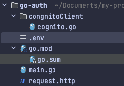
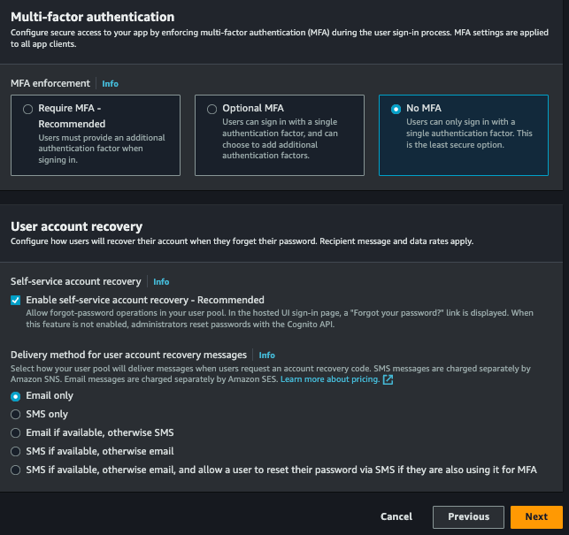
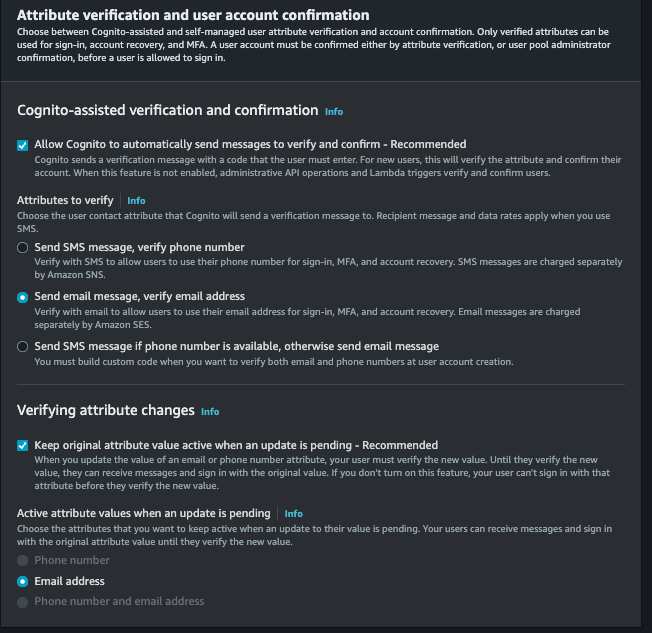
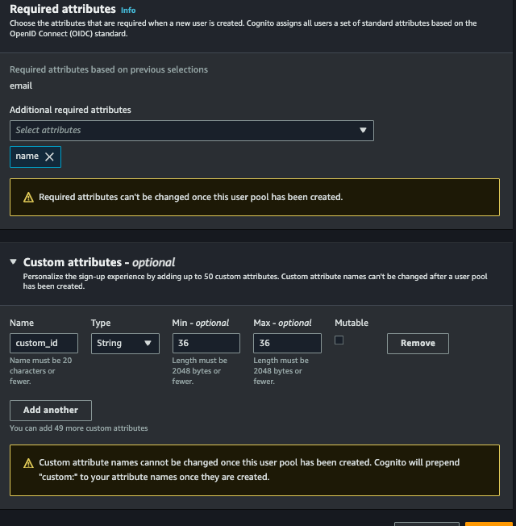
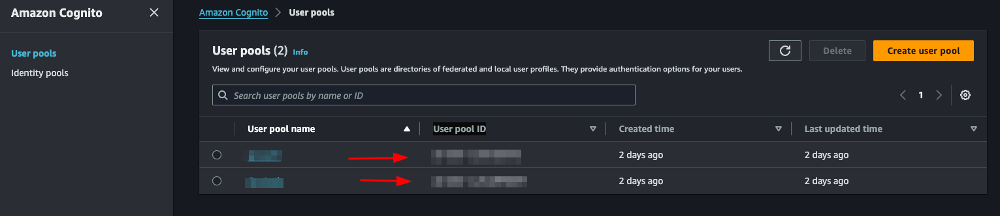
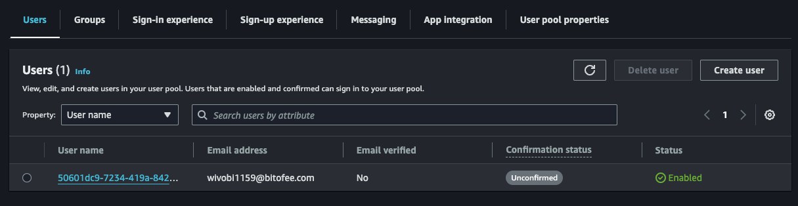
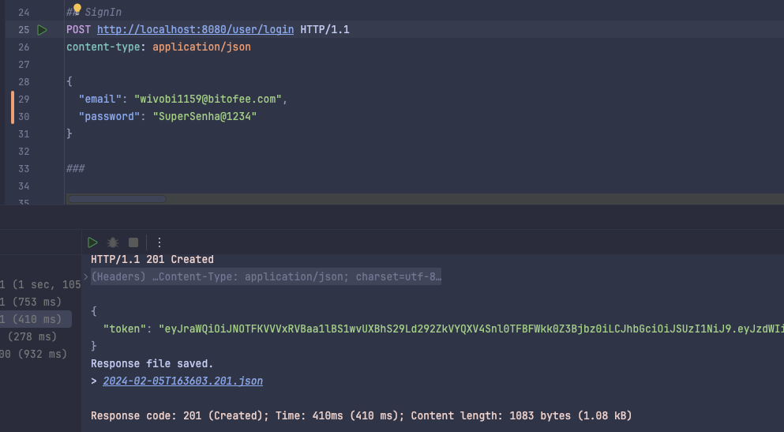

## What is cognito?

The authentication of an application is something very important in the system, but also very sensitive, there are various implementations, security, validation to be considered.

I decided to make a post demonstrating a about [Cognito](https://aws.amazon.com/pt/pm/cognito/), a very nice tool from AWS that can help you in the authentication and validation of the user for Web and mobile applications that many people do not know.

Cognito is an AWS platform responsible for creating and validating user access data, as well as being able to register users and store their information, in addition to generating OAuth tokens, and Cognito can also provide all user validation.

We can create some user data such as: email, name, phone, birthdate, nickname, gender, website and many others, we can also place custom fields.

Cognito still allows us to work with "federated providers", known as social logins, such as Google, Facebook and GitHub, we are not going to address this post, but it is possible to do it with cognito.

## What are we going to do?

We are going to make some endpoints to show how cognito works, we are going to create a user, confirm email, login, search for a user using the token provided by cognito, update information.

## Setting up the project

We are going to do something very simple, we are not going to worry about the project father, we want to address only the use of knowledge.

To create the endpoints we are going to use [gin](https://github.com/gin-gonic/gin).

Let's create the following files:

- The entrypoint of our application `main.go` at the root of the project

- `.env` To save cognitive credentials

- A paste called **cognitoClient** and inside a file called `cognito.go`

- There is a file called `request.http`, to complete your requests.

The structure will be as follows:



## Setting up Cognito on AWS

Before starting the code, we will configure the cognito in AWS, to access the panel and search by cognito, after we will create our pool, select the option **Add user directories to your app**.

For **Provider types**, select the **Cognito user pool** option, you can choose to allow login using email, user name and phone, you can only opt for email, select what you prefer, select assim to first stage:


I need to configure some more things, let's go!

- **Password policy mode** allows you to select a specific policy, let's deixar the **Cognito defaults**.
- **Multi-factor authentication** allows our login to have two-factor authentication, let's go without, but you can implement it if desired, you can opt for **No MFA**.
- Finally, or **User account recovery**, you can choose ways to recover your account, you can just choose email.




Next step:

- **Self-service sign-up**, we will allow any person to do so, leave selected.
- **Cognito-assisted verification and confirmation**, allow cognito to be responsible for confirming the user's identity, check it, and also select the option **Send email message, verify email address**.
- **Verifying attribute changes**, check this option, so that updating the user's email needs to be validated again.
- **Required attributes**, select the fields that you want to make mandatory to create a new user, you will select the options, email (and the name) and the name will also be required by your father.
- **Custom attributes**, it is optional, but you can add custom fields, for example, you will create a field called `custom_id` which will be any `uuid`.

This stage also occurred:






Next, select the **Send email with Cognito** option, so we do not need to configure anything to trigger the emails.

In the next step, in **User pool name** put the name you want in **App client name**, also put the name you want and continue.

In the last stage we will not need to alter anything, just finish and create the user pool.

With everything, access or cognito > User pools, select the pool that you just created, this part will list all the users of your application, and it is possible to revoke the user's token, deactivate, verify among other functionalities.

We are going to specify the id of the pool, to be able to use the [Go sdk](https://aws.amazon.com/pt/developer/tools/) for aws, for access to the created pool **App integration** > **App client list** and see our **Client ID**:


Let's save this id in our `.env` file:

```yaml
COGNITO_CLIENT_ID=client_id
```

Remembering that you still need to have the AWS credentials, usually located in the `/Users/your-user/.aws` directory, if you haven't configured it yet, see [here](https://docs.aws.amazon.com/pt_br/cli/latest/userguide/cli-chap-configure.html) how to do it.

## Implementing cognito

Let's separate the cognito part into another file.

### Registering the user

Inside the `cognito.go` file, we will initialize our cognito and create our interface:

```go
  package congnitoClient

  import (
    "github.com/aws/aws-sdk-go/aws"
    "github.com/aws/aws-sdk-go/aws/session"
    cognito "github.com/aws/aws-sdk-go/service/cognitoidentityprovider"
    "github.com/google/uuid"
  )

  type User struct {
    Name     string `json:"name" binding:"required"`
    Email    string `json:"email" binding:"required,email"`
    Password string `json:"password" binding:"required"`
  }

  type CognitoInterface interface {
    SignUp(user *User) error
  }

  type cognitoClient struct {
    cognitoClient *cognito.CognitoIdentityProvider
    appClientID   string
  }

  func NewCognitoClient(appClientId string) CognitoInterface {
    config := &aws.Config{Region: aws.String("us-east-1")}
    sess, err := session.NewSession(config)
    if err != nil {
      panic(err)
    }
    client := cognito.New(sess)

    return &cognitoClient{
      cognitoClient: client,
      appClientID:   appClientId,
    }
  }

  func (c *cognitoClient) SignUp(user *User) error {
    return nil
  }
```

First we create a struct called `User`, this struct will have the user fields that we need to save in cognito.

Then we create an `interface` called `CognitoInterface`, we will have the methods that we will use, first we will only have `SignUp` which will receive a pointer to the `User` struct.

Then we will have another struct called `cognitoClient` that will contain our instance for `NewCognitoClient` that will be our constructor.

As mentioned, `NewCognitoClient` will be like our constructor, it is where we will create the session with AWS and return this connection. This connection could be a global variable, in our case we will not do this, it is up to you to check which is the best approach for your use case.

Now let's implement `SignUp`:

```go
  func (c *cognitoClient) SignUp(user *User) error {
    userCognito := &cognito.SignUpInput{
      ClientId: aws.String(c.appClientID),
      Username: aws.String(user.Email),
      Password: aws.String(user.Password),
      UserAttributes: []*cognito.AttributeType{
        {
          Name:  aws.String("name"),
          Value: aws.String(user.Name),
        },
        {
          Name:  aws.String("email"),
          Value: aws.String(user.Email),
        },
        {
          Name:  aws.String("custom:custom_id"),
          Value: aws.String(uuid.NewString()),
        },
      },
    }
    _, err := c.cognitoClient.SignUp(userCognito)
    if err != nil {
      return err
    }
    return nil
  }
```

We will use the `AttributeType` from Cognito to assemble the parameters that we will send to the `SignUp` of the AWS SDK, note that the `custom_id` which is our custom field, needs to be placed `custom` before, without this it will not be accepted, we just created a uuid with the Google package, this field is just to show how to use custom attributes.

The `ClientId` field refers to the `COGNITO_CLIENT_ID` of our env, we will pass it on when starting `main.go`.

This is what we need to save the user, simple isn't it?

Don't forget to start the project with:

```bash
  go mod init <your project name>
```

And install the necessary packages:

```bash
  go mod tidy
```

### Confirming the account

Let's create another function to verify the user's account via email. To verify the account, the user will need to enter the code sent by email. Let's create a new struct and add the new `ConfirmAccount` method to the interface:

```go
  type UserConfirmation struct {
    Email string `json:"email" binding:"required,email"`
    Code  string `json:"code" binding:"required"`
  }
```

```go
  type CognitoInterface interface {
    SignUp(user *User) error
    ConfirmAccount(user *UserConfirmation) error
  }
```

Now let's implement:

```go
  func (c *cognitoClient) ConfirmAccount(user *UserConfirmation) error {
    confirmationInput := &cognito.ConfirmSignUpInput{
      Username:         aws.String(user.Email),
      ConfirmationCode: aws.String(user.Code),
      ClientId:         aws.String(c.appClientID),
    }
    _, err := c.cognitoClient.ConfirmSignUp(confirmationInput)
    if err != nil {
      return err
    }
    return nil
  }
```

It's very simple, we will use the `ConfirmSignUpInput` from the cognito package to assemble the parameters, remembering that the `Username` is the user's email. Finally, we will call `ConfirmSignUp` passing the `confirmationInput`.

Remembering that we only returned the error, you could improve and check the types of error messages.

### Login

This should be the functionality that will be used the most, let's create a method called `SignIn` and a struct:

```go
  type UserLogin struct {
    Email    string `json:"email" binding:"required,email"`
    Password string `json:"password" binding:"required"`
  }
```

```go
  type CognitoInterface interface {
    SignUp(user *User) error
    ConfirmAccount(user *UserConfirmation) error
    SignIn(user *UserLogin) (string, error)
  }
```

Our `SignIn` will receive a `UserLogin`.

Let's implement:

```go
  func (c *cognitoClient) SignIn(user *UserLogin) (string, error) {
    authInput := &cognito.InitiateAuthInput{
      AuthFlow: aws.String("USER_PASSWORD_AUTH"),
      AuthParameters: aws.StringMap(map[string]string{
        "USERNAME": user.Email,
        "PASSWORD": user.Password,
      }),
      ClientId: aws.String(c.appClientID),
    }
    result, err := c.cognitoClient.InitiateAuth(authInput)
    if err != nil {
      return "", err
    }
    return *result.AuthenticationResult.AccessToken, nil
  }
```

We will use the `InitiateAuth` function from the aws cognito package, we need to pass the `username` (user's email), `password` and the `AuthFlow`, this field refers to the type of access that we will allow, in our case `USER_PASSWORD_AUTH`.

> If you receive an error like this:

> `You trusted all proxies, this is NOT safe. We recommend you to set a value`

It will be necessary to enable the `ALLOW_USER_PASSWORD_AUTH` flow, to configure it access cognito on the aws panel, go to:

**User pools** > **Selecione seu pool** > **App integration** > **App client list** > **Selecione um client**, will open this screen:


Click on **edit** and in **Authentication flows** select the option **ALLOW_USER_PASSWORD_AUTH** then save, with this you can now log in with the user's password and email.

### Listando um usuário

Para mostrar como utilizar o token jwt fornecido pelo cognito vamos criar um endpoint que mostra os dados do usuário salvos no cognito apenas com o token.

Let's create another function called `GetUserByToken` that will receive a token and return a struct of type `GetUserOutput` that we will get from the cognito package.

```go
  type CognitoInterface interface {
    SignUp(user *User) error
    ConfirmAccount(user *UserConfirmation) error
    SignIn(user *UserLogin) (string, error)
    GetUserByToken(token string) (*cognito.GetUserOutput, error)
  }
```

If you click on `GetUserOutput` you will see what is inside this struct

```go
  type GetUserOutput struct {
    _ struct{} `type:"structure"`
    MFAOptions []*MFAOptionType `type:"list"`
    PreferredMfaSetting *string `type:"string"`
    UserAttributes []*AttributeType `type:"list" required:"true"`
    UserMFASettingList []*string `type:"list"`
    Username *string `min:"1" type:"string" required:"true" sensitive:"true"`
  }
```

inside the `_ struct{}` there are custom attributes that we created for our user, in our case the `custom_id`.

Let's implement:

```go
  func (c *cognitoClient) GetUserByToken(token string) (*cognito.GetUserOutput, error) {
    input := &cognito.GetUserInput{
      AccessToken: aws.String(token),
    }
    result, err := c.cognitoClient.GetUser(input)
    if err != nil {
      return nil, err
    }
    return result, nil
  }
```

We use `GetUser` from the cognito package, it only needs an `AccessToken` which is the token provided by cognito itself.

### Updating password

Finally, we will update the user's password. To do this, we will need the email address and the new password. We already have the `UserLogin` struct with the fields we need. We will reuse it. If you wish, create a new one just for this function. Let's create the `UpdatePassword` function:

```go
  type CognitoInterface interface {
    SignUp(user *User) error
    ConfirmAccount(user *UserConfirmation) error
    SignIn(user *UserLogin) (string, error)
    GetUserByToken(token string) (*cognito.GetUserOutput, error)
    UpdatePassword(user *UserLogin) error
  }
```

Let's implement:

```go
  func (c *cognitoClient) UpdatePassword(user *UserLogin) error {
    input := &cognito.AdminSetUserPasswordInput{
      UserPoolId: aws.String(os.Getenv("COGNITO_USER_POOL_ID")),
      Username:   aws.String(user.Email),
      Password:   aws.String(user.Password),
      Permanent:  aws.Bool(true),
    }
    _, err := c.cognitoClient.AdminSetUserPassword(input)
    if err != nil {
      return err
    }
    return nil
  }
```

We will use the `AdminSetUserPassword` function from the cognito package, we need to pass the user's email and the new password, in addition we have to pass the `UserPoolId`, we will put the `COGNITO_USER_POOL_ID` in the `.env` file, to search in aws just access your pool and copy the `User pool ID`



We will also pass `Permanent`, informing that it is a permanent password, you could pass `false`, so Cognito would create a temporary password for the user, this will depend on the strategy you will use in your application.

## Creating the main

Let's create our `main.go`, this will be the file where we will start cognito and create our routes.

```go
  func main() {
    err := godotenv.Load()
    if err != nil {
      panic(err)
    }
    cognitoClient := congnitoClient.NewCognitoClient(os.Getenv("COGNITO_CLIENT_ID"))
    r := gin.Default()

    fmt.Println("Server is running on port 8080")
    err = r.Run(":8080")
    if err != nil {
      panic(err)
    }
  }
```

First we will load our envs with the [godotenv](https://github.com/joho/godotenv) package, then we start our cognito client, passing the `COGNITO_CLIENT_ID`, which we got earlier, then we start gin and create a server, that's enough.

## Creating the endpoints

### Creating a user

Let's create a function inside the `main.go` file itself, let's call it `CreateUser`:

```go
  func CreateUser(c *gin.Context, cognito congnitoClient.CognitoInterface) error {
    var user congnitoClient.User
    if err := c.ShouldBindJSON(&user); err != nil {
      return errors.New("invalid json")
    }
    err := cognito.SignUp(&user)
    if err != nil {
      return errors.New("could not create use")
    }
    return nil
  }
```

Something simple, we just convert what we receive in the body to our struct using gin's `ShouldBindJSON`, then we call the `SignUp` that we created in `cognito.go`.

Now let's create the endpoint inside the `main.go` function:

```go
  r.POST("user", func(context *gin.Context) {
		err := CreateUser(context, cognitoClient)
		if err != nil {
			context.JSON(http.StatusBadRequest, gin.H{"error": err.Error()})
			return
		}
		context.JSON(http.StatusCreated, gin.H{"message": "user created"})
	})
```

We call the function we just created `CreateUser`, if there is an error we throw a `StatusBadRequest`, if it is successful a `StatusCreated`, let's test.

Let's do a `go mod tidy` downloading all the packages, then we'll run the application with `go run main.go`

Now we can create a call in the `request.http` file and execute:

```http
POST http://localhost:8080/user HTTP/1.1
content-type: application/json

{
  "Name": "John Doe",
  "email": "wivobi1159@bitofee.com",
  "password": "Pass@1234"
}
```

If everything is correct we will receive the message:

```json
{
  "message": "user created"
}
```

Now entering the Cognito panel on AWS, and accessing the pool then the users, we will have our user there:



### Confirming a user

Note that the user we created above is not confirmed, let's confirm it!

Create a function called `ConfirmAccount` in the `main.go` file:

```go
  func ConfirmAccount(c *gin.Context, cognito congnitoClient.CognitoInterface) error {
    var user congnitoClient.UserConfirmation
    if err := c.ShouldBindJSON(&user); err != nil {
      return errors.New("invalid json")
    }
    err := cognito.ConfirmAccount(&user)
    if err != nil {
      return errors.New("could not confirm user")
    }
    return nil
  }
```

Same concept we used before, let's convert the body to the `UserConfirmation` struct and pass it to `ConfirmAccount` in `cognito.go`.

Let's create the endpoint:

```go
  r.POST("user/confirmation", func(context *gin.Context) {
		err := ConfirmAccount(context, cognitoClient)
		if err != nil {
			context.JSON(http.StatusBadRequest, gin.H{"error": err.Error()})
			return
		}
		context.JSON(http.StatusCreated, gin.H{"message": "user confirmed"})
	})
```

It's also simple, we just handle the error and return a message, let's create our call and test it:

```http
POST http://localhost:8080/user/confirmation HTTP/1.1
content-type: application/json

{
  "email": "wivobi1159@bitofee.com",
  "code": "363284"
}
```

We will receive the message:

```json
{
  "message": "user confirmed"
}
```

Now accessing Cognito again on the AWS panel, notice that the user is confirmed, remembering that you need to enter a valid email, you can use a temporary email to play around, but it needs to be valid, as Cognito will send the confirmation code and it needs to be a valid code to confirm successfully.


### Login

Now let's create our token, to do this in the `main.go` file create a function called `SignIn`, this function will return an error and a token.

```go
  func SignIn(c *gin.Context, cognito congnitoClient.CognitoInterface) (string, error) {
    var user congnitoClient.UserLogin
    if err := c.ShouldBindJSON(&user); err != nil {
      return "", errors.New("invalid json")
    }
    token, err := cognito.SignIn(&user)
    if err != nil {
      return "", errors.New("could not sign in")
    }
    return token, nil
  }
```

Same pattern as the other functions, we convert the body to the `UserLogin` struct and pass it to `SignIn` of `cognito.go`.

Let's create the endpoint:

```go
  r.POST("user/login", func(context *gin.Context) {
		token, err := SignIn(context, cognitoClient)
		if err != nil {
			context.JSON(http.StatusBadRequest, gin.H{"error": err.Error()})
			return
		}
		context.JSON(http.StatusCreated, gin.H{"token": token})
	})
```

Now we return a `token` to the user, let's create the call and test:

```http
POST http://localhost:8080/user/login HTTP/1.1
content-type: application/json

{
  "email": "wivobi1159@bitofee.com",
  "password": "Pass@1234"
}
```

When making the call we will receive our jwt token:

```json
{
  "token": "token_here"
}
```



If we get the jwt token we can see what's inside, using the website [jwt.io](https://jwt.io/).

### Listing a user

Now we will list the user data saved in cognito using only the token, to do this create a function called `GetUserByToken` in `main.go` and we will need a struct to represent the response that we will return to the user, we will create it in `main` as well:

```go
  type UserResponse struct {
    ID            string `json:"id"`
    Name          string `json:"name"`
    Email         string `json:"email"`
    CustomID      string `json:"custom_id"`
    EmailVerified bool   `json:"email_verified"`
  }

  func main() {}
```

Now the function:

```go
  func GetUserByToken(c *gin.Context, cognito congnitoClient.CognitoInterface) (*UserResponse, error) {
    token := strings.TrimPrefix(c.GetHeader("Authorization"), "Bearer ")
    if token == "" {
      return nil, errors.New("token not found")
    }
    cognitoUser, err := cognito.GetUserByToken(token)
    if err != nil {
      return nil, errors.New("could not get user")
    }
    user := &UserResponse{}
    for _, attribute := range cognitoUser.UserAttributes {
      switch *attribute.Name {
      case "sub":
        user.ID = *attribute.Value
      case "name":
        user.Name = *attribute.Value
      case "email":
        user.Email = *attribute.Value
      case "custom:custom_id":
        user.CustomID = *attribute.Value
      case "email_verified":
        emailVerified, err := strconv.ParseBool(*attribute.Value)
        if err == nil {
          user.EmailVerified = emailVerified
        }
      }
    }
    return user, nil
  }
```

This will be the biggest function, we need to map what we receive from Cognito to our `UserResponse` struct, we do this with a `for` and a `switch`, of course we could improve it, but for the sake of example we will keep it like this. Also to map custom attributes we need to put `custom` before, like `custom:custom_id`.

We also check if the user passed the token in the header, if not we return an error.

Let's create the endpoint:

```go
  r.GET("user", func(context *gin.Context) {
		user, err := GetUserByToken(context, cognitoClient)
		if err != nil {
			if err.Error() == "token not found" {
				context.JSON(http.StatusUnauthorized, gin.H{"error": "token not found"})
				return
			}
			context.JSON(http.StatusBadRequest, gin.H{"error": err.Error()})
			return
		}
		context.JSON(http.StatusOK, gin.H{"user": user})
	})
```

We perform the same validation as the other endpoints, but now we check the error type and if it is of the `token not found` type we return a `StatusUnauthorized`.

Let's test:

```http
GET http://localhost:8080/user HTTP/1.1
content-type: application/json
Authorization: Bearer token_jwt
```

Vamos receber o usuário:

```json
{
  "user": {
    "id": "50601dc9-7234-419a-8427-2a4bda92d33f",
    "name": "John Doe",
    "email": "wivobi1159@bitofee.com",
    "custom_id": "cb748d09-40de-457a-af23-ed9483d69f8d",
    "email_verified": true
  }
}
```

### Updating password

Finally, let's create the `UpdatePassword` function that will update the user's password:

```go
  func UpdatePassword(c *gin.Context, cognito congnitoClient.CognitoInterface) error {
    token := strings.TrimPrefix(c.GetHeader("Authorization"), "Bearer ")
    if token == "" {
      return errors.New("token not found")
    }
    var user congnitoClient.UserLogin
    if err := c.ShouldBindJSON(&user); err != nil {
      return errors.New("invalid json")
    }
    err := cognito.UpdatePassword(&user)
    if err != nil {
      return errors.New("could not update password")
    }
    return nil
  }
```

We also make it mandatory to inform the token in the header, the rest of the function is what we have already done previously.

Let's create the last endpoint:

```go
  r.PATCH("user/password", func(context *gin.Context) {
		err := UpdatePassword(context, cognitoClient)
		if err != nil {
			if err.Error() == "token not found" {
				context.JSON(http.StatusUnauthorized, gin.H{"error": "token not found"})
				return
			}
			context.JSON(http.StatusBadRequest, gin.H{"error": err.Error()})
			return
		}
		context.JSON(http.StatusOK, gin.H{"message": "password updated"})
	})
```

Let's make the call:

```http
PATCH http://localhost:8080/user/password HTTP/1.1
content-type: application/json
Authorization: Bearer token_jwt

{
  "email": "wivobi1159@bitofee.com",
  "password": "NovaSenha2@2222"
}
```

Now when you update your password and try to log in you will receive an error, and if you use the new password, everything will work.

## Final considerations

In this post we talk a little about Cognito, one of the many AWS services that many people don't know about but that helps a lot in the evolution of your system.

Cognito's practicality goes beyond what I've discussed. Making a basic login is simple, but Cognito stands out for already providing you with an account verification system "ready", a login option with social networks (which can be quite annoying to implement without Coginito), two-factor authentication, among others, and it also has AWS security to protect user data.

Cognito has more functionality, it's worth seeing all of them in the [documentation](https://docs.aws.amazon.com/pt_br/cognito/latest/developerguide/what-is-amazon-cognito.html#what-is-amazon-cognito-features).

## Repository link

Project [repository](https://github.com/wiliamvj/go-auth-cognito)

Subscribe and receive notification of new posts, [participate](https://wiliamvj.substack.com/)