## O que é o cognito?

A parte de autenticação de uma aplicação é algo muito importante do sistema, mas também muito sensível, existem diversas implementações, segurança, validações a se considerar.

Pensando nisso abordar um pouco sobre o [Cognito](https://aws.amazon.com/pt/pm/cognito/), uma ferramenta muito bacana da AWS que pode ajudar você na parte de autenticação e validação do usuário para aplicações web e mobile e que muitas pessoas não conhecem.

O Cognito é uma plataforma da aws responsável por armazenar e validar dados de acesso de usuários, com o cognito você consegue cadastrar usuário e armazenar suas informações, além de gerar tokens do tipo OAuth o cognito também consegue prover toda a validação de usuários.

Conseguimos armazenar alguns dados do usuário como: email, name, phone, birthdate, nickname, gender, website e muitos outros, também conseguimos colocar campos personalizados.

O cognito ainda nos permite trabalhar com "provedores federados", conhecidos como login social, como Google, Facebook e GitHub, não vamos abordar nesse post, mas é possível de fazer com o cognito.

## O que vamos vamos fazer

Vamos fazer alguns endpoints para mostrar como o cognito funciona, vamos criar um usuário, confirmar e-mail, login, buscar um usuário usando o token fornecido pelo cognito, atualização de senha.

## Configurando o projeto

Vamos fazer algo bem simples, não vamos nos preocupar com padrão de projeto, queremos abordar apenas o uso do cognito.

Para criar os endpoints vamos utilizar o [gin](https://github.com/gin-gonic/gin).

Vamos criar os seguintes arquivos:

- O entrypoint da nossa aplicação `main.go` na raiz do projeto

- `.env` Para salvar as credencias do cognito

- Uma pasta chamada **cognitoClient** e dentro um arquivo chamado `cognito.go`

- E um arquivo chamado `request.http`, para fazer as requisições

A estrutura vai ficar assim:

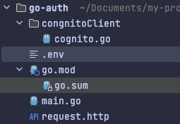

## Configurando o cognito na AWS

Antes de iniciar o código, vamos configurar o cognito na AWS, para isso acesse o painel e busque por cognito, depois disso vamos criar nosso pool, selecione a opção **Add user directories to your app**.

Para o **Provider types** selecione a opção **Cognito user pool**, você pode optar por permitir login usando e-mail, user name e telefone, vou optar apenas por e-mail, selecione o que preferir, vai ficar assim a primeira etapa:

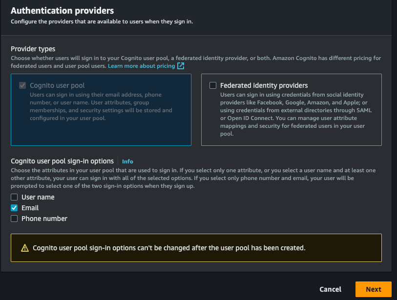

É preciso configurar mais algumas coisas, vamos lá!

- O **Password policy mode** permite que você escolhe uma politica de senha, vamos deixar o **Cognito defaults**.
- O **Multi-factor authentication** permite que nosso login tenhao autentiação de dois fatores, vamos deixar sem, mas você pode implementar se deseja, vou optar por **No MFA**.
- Por fim, o **User account recovery**, você pode escolher formas de recuperar a conta, vou escolher apenas e-mail.

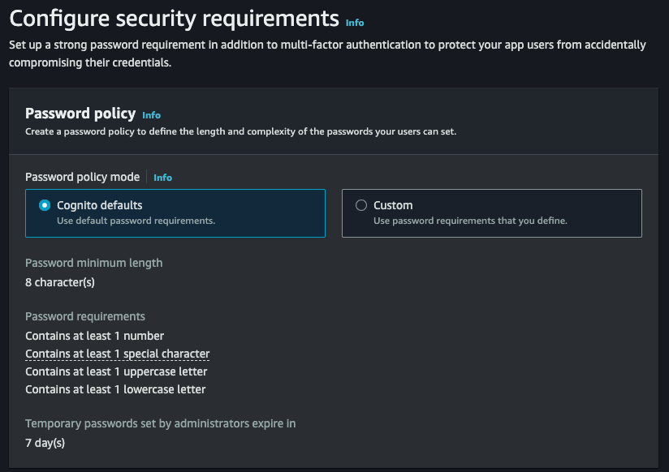

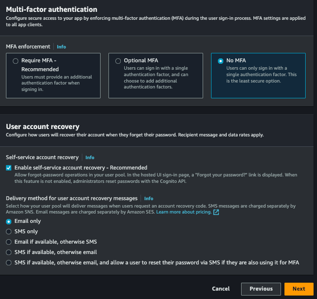

Próxima etapa:

- **Self-service sign-up**, vamos permitir que qualquer pessoa possa fazer uma conta, deixe selecionado.
- **Cognito-assisted verification and confirmation**, permita que o cognito se responsabilize por confirmar a identidade do usuário, deixe marcado, e também seleciona a opção **Send email message, verify email address**.
- **Verifying attribute changes**, deixe marcado essa opção, para que ao atualizar o e-mail do usuário seja necessário validar novamente.
- **Required attributes**, selecione os campos que deseja tornar obrigatórios para criar um novo usuário, vou deixar as opções, email (já é obrigatório) e name, a senha também já é obrigatório por padrão.
- **Custom attributes**, é opcional, mas você pode adicionar campos personalizados, para exemplo, vou criar um campo chamado `custom_id` que vai ser um `uuid` qualquer.

Ficou assim essa etapa:

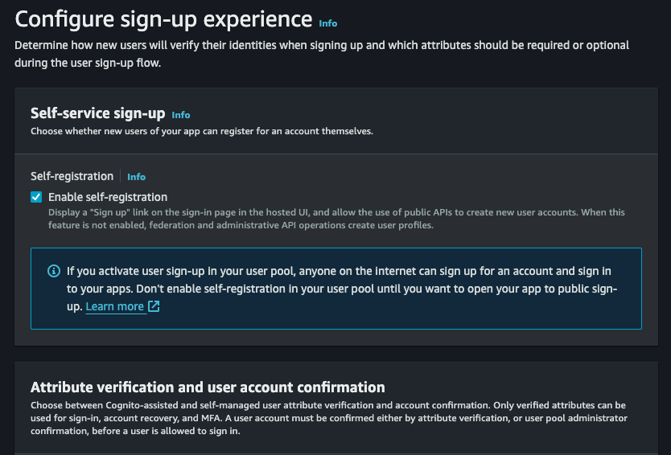

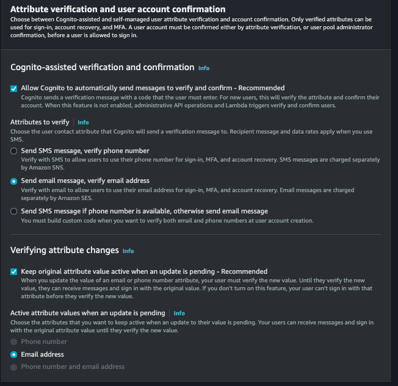

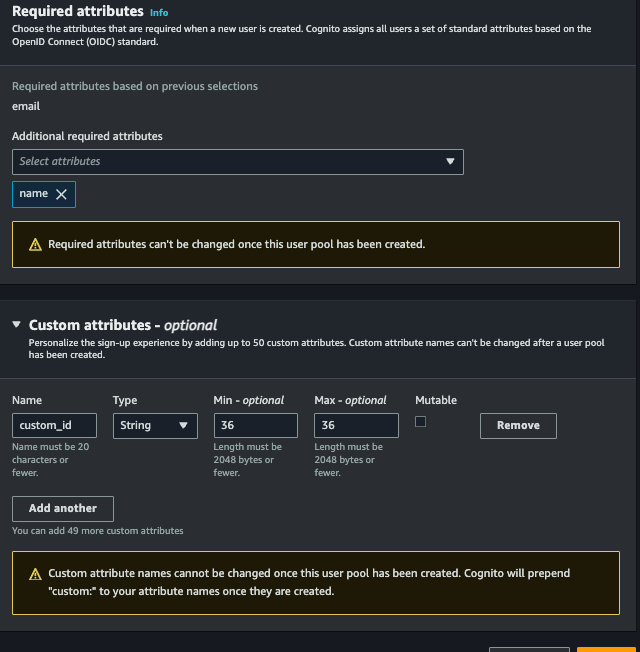

Seguindo, selecione a opção **Send email with Cognito**, assim não precisamos configurar nada para disparar os e-mails.

Na próxima etapa, em **User pool name** coloque o nome que desejar em **App client name**, coloque também o nome que desejar e prossiga.

Na última etapa não vamos precisar alterar nada, basta finalizar e criar o user pool.

Com tudo feito, acesse o cognito > User pools, selecione o pool que acabou de criar, nessa parte vai ficar listado todos os usuários da sua aplicação, sendo possível revogar token do usuário, desativar, verificar entre outras funcionalidades.

Vamos precisar do id do pool, para poder utilizar o [sdk do Go](https://aws.amazon.com/pt/developer/tools/) para a aws, para isso acesse o pool criado **App integration** > **App client list** e vai ver o nosso **Client ID**:

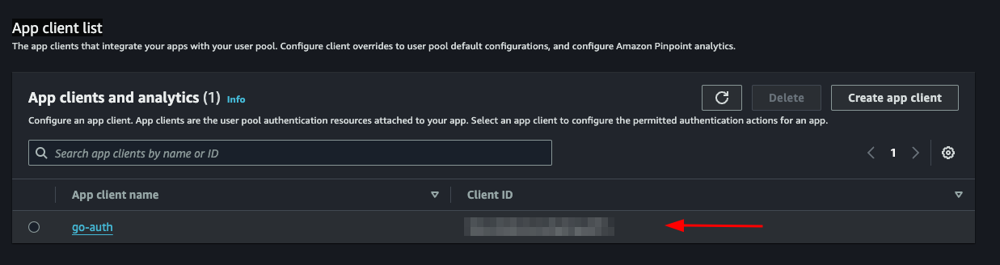

Vamos salvar esse id no nosso arquivo `.env`:

```yaml
COGNITO_CLIENT_ID=client_id
```

Lembrando que ainda é necessário ter as credencias da aws, geralmente fica dentro do diretório `/Users/seu-usuário/.aws`, caso não tenha configurado ainda, veja [aqui](https://docs.aws.amazon.com/pt_br/cli/latest/userguide/cli-chap-configure.html) como fazer.

## Implementando o cognito

Vamos separar a parte do cognito em outro arquivo.

### Cadastrando o usuário

Dentro do arquivo `cognito.go`, vamos inicializar nosso cognito e criar nossa interface:

```go
  package congnitoClient

  import (
    "github.com/aws/aws-sdk-go/aws"
    "github.com/aws/aws-sdk-go/aws/session"
    cognito "github.com/aws/aws-sdk-go/service/cognitoidentityprovider"
    "github.com/google/uuid"
  )

  type User struct {
    Name     string `json:"name" binding:"required"`
    Email    string `json:"email" binding:"required,email"`
    Password string `json:"password" binding:"required"`
  }

  type CognitoInterface interface {
    SignUp(user *User) error
  }

  type cognitoClient struct {
    cognitoClient *cognito.CognitoIdentityProvider
    appClientID   string
  }

  func NewCognitoClient(appClientId string) CognitoInterface {
    config := &aws.Config{Region: aws.String("us-east-1")}
    sess, err := session.NewSession(config)
    if err != nil {
      panic(err)
    }
    client := cognito.New(sess)

    return &cognitoClient{
      cognitoClient: client,
      appClientID:   appClientId,
    }
  }

  func (c *cognitoClient) SignUp(user *User) error {
    return nil
  }
```

Primeiro criamos uma struct chamada `User`, essa struct vai ter os campos do usuário que precisamos para salvar no cognito.

Depois criamos uma `interface` chamada `CognitoInterface`, vamos ter os métodos que vamos usar, primeiramente teremos apenas o `SignUp` que vai receber um ponteiro da struct `User`.

Depois teremos outra struct chamada `cognitoClient` que vai conter nossa instância para o `NewCognitoClient` que vai ser nosso construtor.

Como mencionando o `NewCognitoClient` vai ser como se fosse nosso construtor, é nele que vamos fazer a sessão com a aws e retornar essa conexão. Essa conexão poderia se uma variável global, no nosso caso não vamos fazer isso, vai de você verificar qual a melhor abordagem para o seu caso de uso.

Agora vamos implementar o `SignUp`:

```go
  func (c *cognitoClient) SignUp(user *User) error {
    userCognito := &cognito.SignUpInput{
      ClientId: aws.String(c.appClientID),
      Username: aws.String(user.Email),
      Password: aws.String(user.Password),
      UserAttributes: []*cognito.AttributeType{
        {
          Name:  aws.String("name"),
          Value: aws.String(user.Name),
        },
        {
          Name:  aws.String("email"),
          Value: aws.String(user.Email),
        },
        {
          Name:  aws.String("custom:custom_id"),
          Value: aws.String(uuid.NewString()),
        },
      },
    }
    _, err := c.cognitoClient.SignUp(userCognito)
    if err != nil {
      return err
    }
    return nil
  }
```

Vamos usar o `AttributeType` do cognito para montar os parâmetros que vamos enviar para o `SignUp` do sdk da aws, repare que o `custom_id` que é o nosso campo personalizado, precisa que coloque o `custom` antes, sem isso não vai ser aceito, apenas criamos um uuid com o pacote do google, esse campo é apenas para mostrar como utilizar atributos personalizados.

O campo `ClientId` é referente ao `COGNITO_CLIENT_ID` da nossa env, vamos repassar quando for iniciar o `main.go`.

Isso é o que precisamos para salvar o usuário, simples não é?

Não se esqueça de iniciar o projeto com com:

```bash
  go mod init <nome do seu projeto>
```

E instalar os pacotes necessários:

```bash
  go mod tidy
```

### Confirmando a conta

Vamos criar outra função para verificar a conta do usuário via e-mail, para verificar a conta o usuário vai precisar informar o código enviado por e-mail, vamos criar uma nova struct e adicionar o novo método `ConfirmAccount` na interface:

```go
  type UserConfirmation struct {
    Email string `json:"email" binding:"required,email"`
    Code  string `json:"code" binding:"required"`
  }
```

```go
  type CognitoInterface interface {
    SignUp(user *User) error
    ConfirmAccount(user *UserConfirmation) error
  }
```

Agora vamos implementar:

```go
  func (c *cognitoClient) ConfirmAccount(user *UserConfirmation) error {
    confirmationInput := &cognito.ConfirmSignUpInput{
      Username:         aws.String(user.Email),
      ConfirmationCode: aws.String(user.Code),
      ClientId:         aws.String(c.appClientID),
    }
    _, err := c.cognitoClient.ConfirmSignUp(confirmationInput)
    if err != nil {
      return err
    }
    return nil
  }
```

É bem simples, vamos utilizar o `ConfirmSignUpInput` do pacote cognito para montar os parâmetros, lembrando que o `Username` é o e-mail do usuário. Por último vamos chamar o `ConfirmSignUp` passando o `confirmationInput`.

Lembrando que apenas retornamos o erro, você poderia aprimorar e verificar os tipos de mensagem de erro.

### Login

Esse deve ser a funcionalidade que mais vai ser utilizada, vamos criar um método chamado `SignIn` e uma struct:

```go
  type UserLogin struct {
    Email    string `json:"email" binding:"required,email"`
    Password string `json:"password" binding:"required"`
  }
```

```go
  type CognitoInterface interface {
    SignUp(user *User) error
    ConfirmAccount(user *UserConfirmation) error
    SignIn(user *UserLogin) (string, error)
  }
```

Nosso `SignIn` vai receber um `UserLogin`.

Vamos implementar:

```go
  func (c *cognitoClient) SignIn(user *UserLogin) (string, error) {
    authInput := &cognito.InitiateAuthInput{
      AuthFlow: aws.String("USER_PASSWORD_AUTH"),
      AuthParameters: aws.StringMap(map[string]string{
        "USERNAME": user.Email,
        "PASSWORD": user.Password,
      }),
      ClientId: aws.String(c.appClientID),
    }
    result, err := c.cognitoClient.InitiateAuth(authInput)
    if err != nil {
      return "", err
    }
    return *result.AuthenticationResult.AccessToken, nil
  }
```

Vamos utilizar o função `InitiateAuth` do pacote cognito da aws, precisamos passar o `username` (e-mail do usuário), `password` e o `AuthFlow`, esse campo se refere ao tipo de acesso que vamos permitir, no nosso caso o `USER_PASSWORD_AUTH`.

> Caso receba algum erro do tipo:

> `You trusted all proxies, this is NOT safe. We recommend you to set a value`

Será necessário habilitar o flow `ALLOW_USER_PASSWORD_AUTH`, para configurar acesse o cognito no painel da aws, vá em:

**User pools** > **Selecione seu pool** > **App integration** > **App client list** > **Selecione um client**, vai abrir esse tela:

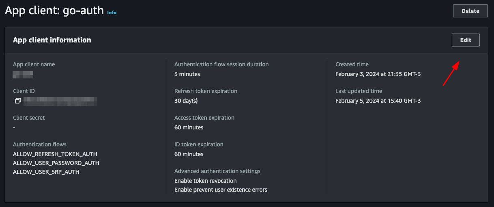

Clique em **edit** e em **Authentication flows** selecione a opção **ALLOW_USER_PASSWORD_AUTH** depois salve, com isso você já pode fazer login com senha e e-mail do usuário.

### Listando um usuário

Para mostrar como utilizar o token jwt fornecido pelo cognito vamos criar um endpoint que mostra os dados do usuário salvos no cognito apenas com o token.

Vamos criar outra função chamada `GetUserByToken` que vai receber um token e vai retornar uma struct do tipo `GetUserOutput` que vamos pegar do pacote do cognito.

```go
  type CognitoInterface interface {
    SignUp(user *User) error
    ConfirmAccount(user *UserConfirmation) error
    SignIn(user *UserLogin) (string, error)
    GetUserByToken(token string) (*cognito.GetUserOutput, error)
  }
```

Se clicar no `GetUserOutput` vai ver o que tem dentro dessa struct

```go
  type GetUserOutput struct {
    _ struct{} `type:"structure"`
    MFAOptions []*MFAOptionType `type:"list"`
    PreferredMfaSetting *string `type:"string"`
    UserAttributes []*AttributeType `type:"list" required:"true"`
    UserMFASettingList []*string `type:"list"`
    Username *string `min:"1" type:"string" required:"true" sensitive:"true"`
  }
```

dentro da `_ struct{}` vai atributos personalizados que criamos para o nosso usuário, no nosso caso o `custom_id`.

Vamos implementar:

```go
  func (c *cognitoClient) GetUserByToken(token string) (*cognito.GetUserOutput, error) {
    input := &cognito.GetUserInput{
      AccessToken: aws.String(token),
    }
    result, err := c.cognitoClient.GetUser(input)
    if err != nil {
      return nil, err
    }
    return result, nil
  }
```

Utilizamos o `GetUser` do pacote cognito, ele precisa apenas de um `AccessToken` que é o token fornecido pelo próprio cognito.

### Atualizando a senha

Por último vamos atualizar a senha do usuário para isso vamos precisar do e-mail e a nova senha, já temos a struct `UserLogin` com os campos que precisamos, vamos reaproveitar, se desejar crie uma nova apenas para essa função. Vamos criar a função `UpdatePassword`:

```go
  type CognitoInterface interface {
    SignUp(user *User) error
    ConfirmAccount(user *UserConfirmation) error
    SignIn(user *UserLogin) (string, error)
    GetUserByToken(token string) (*cognito.GetUserOutput, error)
    UpdatePassword(user *UserLogin) error
  }
```

Vamos implementar:

```go
  func (c *cognitoClient) UpdatePassword(user *UserLogin) error {
    input := &cognito.AdminSetUserPasswordInput{
      UserPoolId: aws.String(os.Getenv("COGNITO_USER_POOL_ID")),
      Username:   aws.String(user.Email),
      Password:   aws.String(user.Password),
      Permanent:  aws.Bool(true),
    }
    _, err := c.cognitoClient.AdminSetUserPassword(input)
    if err != nil {
      return err
    }
    return nil
  }
```

Vamos usar a função `AdminSetUserPassword` do pacote cognito, precisamos passar o e-mail do usuário e a nova senha, além disso temos que passar o `UserPoolId`, vamos colocar no arquivo `.env` o `COGNITO_USER_POOL_ID`, para buscar na aws basta acessar seu pool e copiar o `User pool ID`

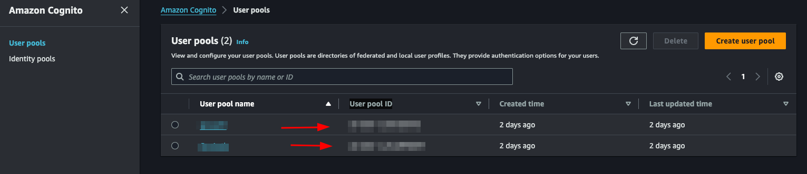

Também vamos passar o `Permanent`, informado que se trata de uma senha permanente, você poderia passar um `false`, assim o cognito iria criar uma senha temporário para o usuário, isso vai depender da estratégia que vai usar na sua aplicação.

## Criando a main

Vamos criar nosso `main.go`, vai ser nesse arquivo que vamos iniciar o cognito e criar nossas rotas.

```go
  func main() {
    err := godotenv.Load()
    if err != nil {
      panic(err)
    }
    cognitoClient := congnitoClient.NewCognitoClient(os.Getenv("COGNITO_CLIENT_ID"))
    r := gin.Default()

    fmt.Println("Server is running on port 8080")
    err = r.Run(":8080")
    if err != nil {
      panic(err)
    }
  }
```

Primeiro vamos carregar nossas envs com o pacote [godotenv](https://github.com/joho/godotenv), depois iniciamos nosso cognito client, passando o `COGNITO_CLIENT_ID`, que pegamos anteriormente, depois iniciamos o gin e criamos um server, isso é o suficiente.

## Criando os endpoints

### Criando um usuário

Vamos criar uma função dentro do próprio arquivo `main.go`, vamos chamar de `CreateUser`:

```go
  func CreateUser(c *gin.Context, cognito congnitoClient.CognitoInterface) error {
    var user congnitoClient.User
    if err := c.ShouldBindJSON(&user); err != nil {
      return errors.New("invalid json")
    }
    err := cognito.SignUp(&user)
    if err != nil {
      return errors.New("could not create use")
    }
    return nil
  }
```

Algo simples, apenas convertemos o que recebemos no body para nossa struct usando o `ShouldBindJSON` do gin, depois chamamos o `SignUp` que criamos no `cognito.go`.

Agora vamos criar o endpoint dentro da função `main.go`:

```go
  r.POST("user", func(context *gin.Context) {
		err := CreateUser(context, cognitoClient)
		if err != nil {
			context.JSON(http.StatusBadRequest, gin.H{"error": err.Error()})
			return
		}
		context.JSON(http.StatusCreated, gin.H{"message": "user created"})
	})
```

Chamamos a função que acabamos de criar `CreateUser`, se houver um erro lançamos um `StatusBadRequest`, caso tenha um sucesso um `StatusCreated`, vamos testar.

Vamos fazer um `go mod tidy` baixando todos os pacotes, depois vamos rodar a aplicação com `go run main.go`

Agora podemos criar uma chamada no arquivo `request.http` e executar:

```http
POST http://localhost:8080/user HTTP/1.1
content-type: application/json

{
  "Name": "John Doe",
  "email": "wivobi1159@bitofee.com",
  "password": "SuperSenha@1234"
}
```

Se tudo estiver correto vamos receber a mensagem:

```json
{
  "message": "user created"
}
```

Agora entrando no painel do cognito na aws, e acessando o pool depois os usuários, vamos ter nosso usuário lá dentro:

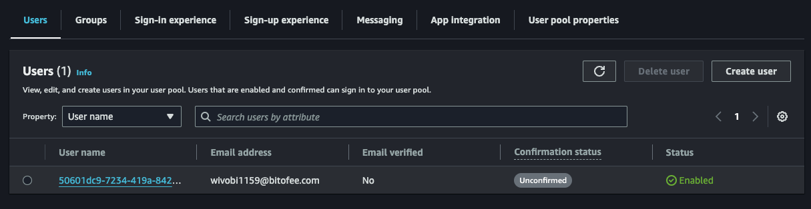

### Confirmando um usuário

Repare que o usuário que criamos logo acima não está confirmado, vamos confirmar!

Crie uma função chamada `ConfirmAccount` no arquivo `main.go`:

```go
  func ConfirmAccount(c *gin.Context, cognito congnitoClient.CognitoInterface) error {
    var user congnitoClient.UserConfirmation
    if err := c.ShouldBindJSON(&user); err != nil {
      return errors.New("invalid json")
    }
    err := cognito.ConfirmAccount(&user)
    if err != nil {
      return errors.New("could not confirm user")
    }
    return nil
  }
```

Mesmo conceito que já usamos, convertamos o body para a struct `UserConfirmation` e repassamos ao `ConfirmAccount` do `cognito.go`.

Vamos criar o endpoint:

```go
  r.POST("user/confirmation", func(context *gin.Context) {
		err := ConfirmAccount(context, cognitoClient)
		if err != nil {
			context.JSON(http.StatusBadRequest, gin.H{"error": err.Error()})
			return
		}
		context.JSON(http.StatusCreated, gin.H{"message": "user confirmed"})
	})
```

Também é simples, só tratamos o erro e retornamos uma mensagem, vamos criar nossa chamada e testar:

```http
POST http://localhost:8080/user/confirmation HTTP/1.1
content-type: application/json

{
  "email": "wivobi1159@bitofee.com",
  "code": "363284"
}
```

Vamos receber a mensagem:

```json
{
  "message": "user confirmed"
}
```

Agora acessando novamente o cognito no painel da aws, repare que o usuário está confirmado, lembrando que precisa colocar um e-mail válido, pode usar e-mail temporário para brincar, mas precisa ser válido, pois o cognito vai enviar o código de confirmação e precisa ser um código válido para confirmar com sucesso.

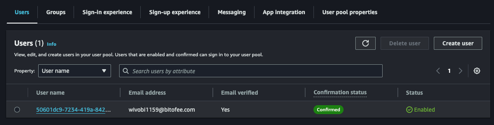

### Login

Agora vamos criar nosso token, para isso no arquivo `main.go` crie uma função chamada `SignIn`, essa função vai retornar um erro e um token.

```go
  func SignIn(c *gin.Context, cognito congnitoClient.CognitoInterface) (string, error) {
    var user congnitoClient.UserLogin
    if err := c.ShouldBindJSON(&user); err != nil {
      return "", errors.New("invalid json")
    }
    token, err := cognito.SignIn(&user)
    if err != nil {
      return "", errors.New("could not sign in")
    }
    return token, nil
  }
```

Mesmo padrão das demais funções, convertamos o body para a struct `UserLogin` e repassamos ao `SignIn` do `cognito.go`.

Vamos criar o endpoint:

```go
  r.POST("user/login", func(context *gin.Context) {
		token, err := SignIn(context, cognitoClient)
		if err != nil {
			context.JSON(http.StatusBadRequest, gin.H{"error": err.Error()})
			return
		}
		context.JSON(http.StatusCreated, gin.H{"token": token})
	})
```

Agora retornamos um `token` ao usuário, vamos criar a chamada e testa:

```http
POST http://localhost:8080/user/login HTTP/1.1
content-type: application/json

{
  "email": "wivobi1159@bitofee.com",
  "password": "SuperSenha@1234"
}
```

Ao fazer a chamada vamos receber nosso token jwt:

```json
{
  "token": "token_here"
}
```

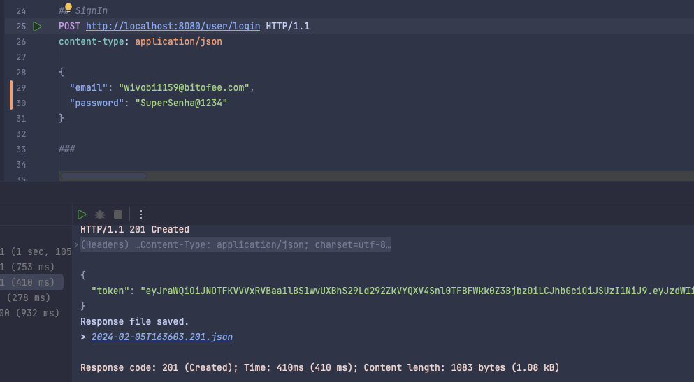

Se pegar o token jwt podemos ver o que tem dentro, usando o site [jwt.io](https://jwt.io/).

### Listando um usuário

Agora vamos listar os dados do usuário salvos no cognito apenas usando o token, para isso crie uma função chamada `GetUserByToken` no `main.go` e vamos precisar de uma struct para representar o response que vamos devolver ao usuário, vamos criar no `main` também:

```go
  type UserResponse struct {
    ID            string `json:"id"`
    Name          string `json:"name"`
    Email         string `json:"email"`
    CustomID      string `json:"custom_id"`
    EmailVerified bool   `json:"email_verified"`
  }

  func main() {}
```

Agora a função:

```go
  func GetUserByToken(c *gin.Context, cognito congnitoClient.CognitoInterface) (*UserResponse, error) {
    token := strings.TrimPrefix(c.GetHeader("Authorization"), "Bearer ")
    if token == "" {
      return nil, errors.New("token not found")
    }
    cognitoUser, err := cognito.GetUserByToken(token)
    if err != nil {
      return nil, errors.New("could not get user")
    }
    user := &UserResponse{}
    for _, attribute := range cognitoUser.UserAttributes {
      switch *attribute.Name {
      case "sub":
        user.ID = *attribute.Value
      case "name":
        user.Name = *attribute.Value
      case "email":
        user.Email = *attribute.Value
      case "custom:custom_id":
        user.CustomID = *attribute.Value
      case "email_verified":
        emailVerified, err := strconv.ParseBool(*attribute.Value)
        if err == nil {
          user.EmailVerified = emailVerified
        }
      }
    }
    return user, nil
  }
```

Essa vai ser a maior função, precisamos mapear o que recebemos do cognito para a nossa struct `UserResponse`, fazemos isso com um `for` e um `switch`, claro que poderíamos aprimorar, mas para exemplificar vamos manter assim. Inclusive para mapear atributos personalizados é preciso colocar o `custom` antes, como o `custom:custom_id`.

Também verificamos se o usuário passou o token no header, caso não informe retornamos um erro.

Vamos criar o endpoint:

```go
  r.GET("user", func(context *gin.Context) {
		user, err := GetUserByToken(context, cognitoClient)
		if err != nil {
			if err.Error() == "token not found" {
				context.JSON(http.StatusUnauthorized, gin.H{"error": "token not found"})
				return
			}
			context.JSON(http.StatusBadRequest, gin.H{"error": err.Error()})
			return
		}
		context.JSON(http.StatusOK, gin.H{"user": user})
	})
```

Fazemos a mesma validação dos outros endpoints, porém agora verificamos o tipo do erro e caso seja do tipo `token not found` retornamos um `StatusUnauthorized`.

Vamos testar:

```http
GET http://localhost:8080/user HTTP/1.1
content-type: application/json
Authorization: Bearer token_jwt
```

Vamos receber o usuário:

```json
{
  "user": {
    "id": "50601dc9-7234-419a-8427-2a4bda92d33f",
    "name": "John Doe",
    "email": "wivobi1159@bitofee.com",
    "custom_id": "cb748d09-40de-457a-af23-ed9483d69f8d",
    "email_verified": true
  }
}
```

### Atualizando a senha

Por último, vamos fazer a função `UpdatePassword` que vai atualizar a senha do usuário:

```go
  func UpdatePassword(c *gin.Context, cognito congnitoClient.CognitoInterface) error {
    token := strings.TrimPrefix(c.GetHeader("Authorization"), "Bearer ")
    if token == "" {
      return errors.New("token not found")
    }
    var user congnitoClient.UserLogin
    if err := c.ShouldBindJSON(&user); err != nil {
      return errors.New("invalid json")
    }
    err := cognito.UpdatePassword(&user)
    if err != nil {
      return errors.New("could not update password")
    }
    return nil
  }
```

Também colocamos a obrigatoriedade de informar o token no header, o resto do função ´o que já fizemos anteriormente.

Vamos criar o último endpoint:

```go
  r.PATCH("user/password", func(context *gin.Context) {
		err := UpdatePassword(context, cognitoClient)
		if err != nil {
			if err.Error() == "token not found" {
				context.JSON(http.StatusUnauthorized, gin.H{"error": "token not found"})
				return
			}
			context.JSON(http.StatusBadRequest, gin.H{"error": err.Error()})
			return
		}
		context.JSON(http.StatusOK, gin.H{"message": "password updated"})
	})
```

Vamos fazer a chamada:

```http
PATCH http://localhost:8080/user/password HTTP/1.1
content-type: application/json
Authorization: Bearer token_jwt

{
  "email": "wivobi1159@bitofee.com",
  "password": "NovaSenha2@2222"
}
```

Pronto, agora ao atualizar a senha e tentar efetuar o login vai receber um erro, e se usar a nova senha, tudo vai funcionar.

## Considerações finais

Nesse post abordamos um pouco sobre o cognito um dos muitos serviços da aws que muita gente não conhece mas que ajuda muito na evolução do seu sistema.

A praticidade do cognito vai além do que abordei, fazer um login básico é simples, mas o cognito se destaca por já lhe entregar "pronto" um sistema de verificação de conta, opção login com redes sociais (que pode ser bem chato de implementar sem o coginito), autenticação de dois fatores entre outros, e ainda tem a segurança da aws para proteger os dados do usuário.

O cognito tem mais funcionalidade, vale a pena ver todas na [documentação](https://docs.aws.amazon.com/pt_br/cognito/latest/developerguide/what-is-amazon-cognito.html#what-is-amazon-cognito-features).

## Link do repositório

[repositório](https://github.com/wiliamvj/go-auth-cognito) do projeto

Se inscreva e receba um aviso sobre novos posts, [participar](https://wiliamvj.substack.com/)
