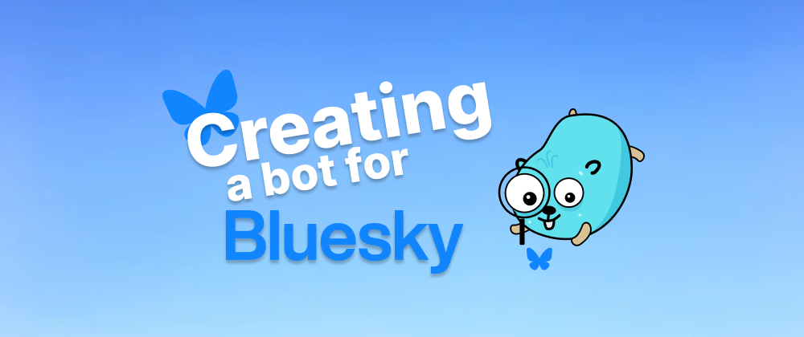
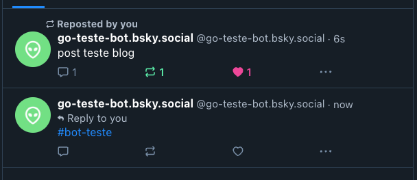

## How the bot will work

We will develop a bot for the social network [Bluesky](https://bsky.app/), we will use Golang for this, this bot will monitor some hashtags via websocket,
if it finds one of these hashtags it will make a repost and like the original post.

We will cover some really cool things like, websocket, [AT](https://atproto.com/pt) (protocol used by bluesky), [CAR](https://ipld.io/specs/transport/car/carv1/) (Content Addressable aRchive) and [CBOR](https://surrealdb.com/blog/understanding-cbor) (Concise Binary Object Representation) are two formats used to store and transmit data efficiently.

## Project structure

The project will have a simple structure, within `internal` we will have a package called `bot` with all the code to run the bot,
within `utils` we will have some functions to help us.

In the `.env` file we will have the bluesky credentials to access [api](https://docs.bsky.app/docs/get-started).


## Setting up credentials

To authenticate to the bluesky API we need to provide an `identifier` and a `password`, but we cannot use the password to access our account,
to do this we will create an **App Passwords**, just access your account in bluesky, access settings and then **App Passwords**.

With this generated password, place it inside the `.env` file, like this:

```yml
BLUESKY_IDENTIFIER=<seu_identificador>
BLUESKY_PASSWORD=<seu_app_password>
```

## Generating the API token

Whenever our bot identifies a new hashtag that we are monitoring, a reply will be made, but we need a Bearer token to be able to make the repost,
we will create a function that generates the token, we will do this in the `get-token.go` file.

First we define a global variable for the API url.

```go
var (
  API_URL = "https://bsky.social/xrpc"
)
```

Now we define our struct with the data that will be returned by the API.

```go
type DIDDoc struct {
  Context            []string `json:"@context"`
  ID                 string   `json:"id"`
  AlsoKnownAs        []string `json:"alsoKnownAs"`
  VerificationMethod []struct {
    ID                 string `json:"id"`
    Type               string `json:"type"`
    Controller         string `json:"controller"`
    PublicKeyMultibase string `json:"publicKeyMultibase"`
  } `json:"verificationMethod"`
  Service []struct {
    ID              string `json:"id"`
    Type            string `json:"type"`
    ServiceEndpoint string `json:"serviceEndpoint"`
  } `json:"service"`
}

type DIDResponse struct {
  DID             string `json:"did"`
  DIDDoc          DIDDoc `json:"didDoc"`
  Handle          string `json:"handle"`
  Email           string `json:"email"`
  EmailConfirmed  bool   `json:"emailConfirmed"`
  EmailAuthFactor bool   `json:"emailAuthFactor"`
  AccessJwt       string `json:"accessJwt"`
  RefreshJwt      string `json:"refreshJwt"`
  Active          bool   `json:"active"`
}
```

Now we will create the `getToken` function that returns a `DIDResponse` (you can give it whatever name you want).

```go
func getToken() (*DIDResponse, error) {
  requestBody, err := json.Marshal(map[string]string{
    "identifier": os.Getenv("BLUESKY_IDENTIFIER"),
    "password":   os.Getenv("BLUESKY_PASSWORD"),
  })
  if err != nil {
    return nil, fmt.Errorf("failed to marshal request body: %w", err)
  }

  url := fmt.Sprintf("%s/com.atproto.server.createSession", API_URL)

  resp, err := http.Post(url, "application/json", bytes.NewBuffer(requestBody))
  if err != nil {
    return nil, fmt.Errorf("failed to send request: %w", err)
  }
  defer resp.Body.Close()

  if resp.StatusCode != http.StatusOK {
    return nil, fmt.Errorf("unexpected status code: %d", resp.StatusCode)
  }

  var tokenResponse DIDResponse
  if err := json.NewDecoder(resp.Body).Decode(&tokenResponse); err != nil {
    return nil, fmt.Errorf("failed to decode response: %w", err)
  }

  return &tokenResponse, nil
}
```

This function calls the bluesky endpoint `com.atproto.server.createSession`, we will receive some data, but what matters for now is the `accessJwt` which is what we will need to authorize our bot via Bearer, with that the function to generate the token is ready.

## Creating the Websocket

This will be the most complex function of the bot, we will need to consume the bluesky endpoint.

First, let's create a variable to save the endpoint, see more in the [docs](https://docs.bsky.app/docs/advanced-guides/firehose)

```go
var (
  wsURL = "wss://bsky.network/xrpc/com.atproto.sync.subscribeRepos"
)
```

Now let's create the structs:

```go
type RepoCommitEvent struct {
  Repo   string      `cbor:"repo"`
  Rev    string      `cbor:"rev"`
  Seq    int64       `cbor:"seq"`
  Since  string      `cbor:"since"`
  Time   string      `cbor:"time"`
  TooBig bool        `cbor:"tooBig"`
  Prev   interface{} `cbor:"prev"`
  Rebase bool        `cbor:"rebase"`
  Blocks []byte      `cbor:"blocks"`

  Ops []RepoOperation `cbor:"ops"`
}

type RepoOperation struct {
  Action string      `cbor:"action"`
  Path   string      `cbor:"path"`
  Reply  *Reply      `cbor:"reply"`
  Text   []byte      `cbor:"text"`
  CID    interface{} `cbor:"cid"`
}

type Reply struct {
  Parent Parent `json:"parent"`
  Root   Root   `json:"root"`
}

type Parent struct {
  Cid string `json:"cid"`
  Uri string `json:"uri"`
}

type Root struct {
  Cid string `json:"cid"`
  Uri string `json:"uri"`
}

type Post struct {
  Type  string `json:"$type"`
  Text  string `json:"text"`
  Reply *Reply `json:"reply"`
}
```

We will also use the [Gorilla Websocket](https://github.com/gorilla/websocket) package, download the package with:

```bash
go get github.com/gorilla/websocket
```

the `Websocket` function initially looks like this:

```go
func Websocket() error {
  conn, _, err := websocket.DefaultDialer.Dial(wsURL, nil)
  if err != nil {
    slog.Error("Failed to connect to WebSocket", "error", err)
    return err
  }
  defer conn.Close()

  for {
    _, message, err := conn.ReadMessage()
    if err != nil {
      slog.Error("Error reading message from WebSocket", "error", err)
      continue
    }
  }
}
```

With this we can now read messages received via websocket with an infinite `for`, but the messages are encoded in [CBOR](https://surrealdb.com/blog/understanding-cbor).

### What is CBOR?

CBOR (Concise Binary Object Representation) is a binary data format that is used to represent data in a compact and efficient way.
It is similar to JSON, but instead of using human-readable text, it uses binary bytes, which makes it smaller and faster to transmit and process.

To decode it we will need to use [this package](github.com/fxamacker/cbor/v2).

```go
decoder := cbor.NewDecoder(bytes.NewReader(message))
```

Just turn the `message` into a `reader`, like this:

```go
func Websocket() error {
  conn, _, err := websocket.DefaultDialer.Dial(wsURL, nil)
  if err != nil {
    slog.Error("Failed to connect to WebSocket", "error", err)
    return err
  }
  defer conn.Close()

  slog.Info("Connected to WebSocket", "url", wsURL)

  for {
     _, message, err := conn.ReadMessage()
    if err != nil {
      slog.Error("Error reading message from WebSocket", "error", err)
      continue
    }

    decoder := cbor.NewDecoder(bytes.NewReader(message))

    for {
      var evt RepoCommitEvent
      err := decoder.Decode(&evt)
      if err == io.EOF {
        break
      }
      if err != nil {
        slog.Error("Error decoding CBOR message", "error", err)
        break
      }
    }
  }
}
```

- `decoder.Decode(&evt)`: The decoder is responsible for reading the received data and decoding it from the CBOR format to the `RepoCommitEvent` type. The `evt` stores the decoded data.

- `if err == io.EOF { break }`: If the decoder reaches the end of the data (there are no more messages), it returns `io.EOF` (end of file). When this happens, the loop is interrupted with `break`, because there is no more data to process.

#### Creating the handleEvent

Let's create a function to process the event:

```go
func handleEvent(evt RepoCommitEvent) error {
  for _, op := range evt.Ops {
    if op.Action == "create" {
      if len(evt.Blocks) > 0 {
        err := handleCARBlocks(evt.Blocks, op)
        if err != nil {
          slog.Error("Error handling CAR blocks", "error", err)
          return err
        }
      }
    }
  }

  return nil
}
```

- `evt` parameter: The function receives an `evt` parameter, which is an event of type `RepoCommitEvent`. This event contains a list of `Ops` operations and possibly `Blocks` data blocks related to these operations.

- Loop over `Ops`: The `evt` event can contain multiple operations. The code iterates through each of these operations using the `for _, op := range evt.Ops` loop.

- Checking the `op.Action == "create"` action: For each operation, the code checks if the associated action is `create`, that is, if the operation is creating something new in bluesky, such as a post or other type of content.

- If there are Blocks `len(evt.Blocks) > 0`: If the create operation is detected, the code checks if the event contains `Blocks` data blocks. These blocks contain additional information that may be related to the operation.

- Processing `handleCARBlocks` Blocks: If blocks are present, the `handleCARBlocks` function is called to process these blocks. This function is responsible for interpreting the data within the blocks (We will cover CAR below).

#### What is CAR?

CAR (Content Addressable Archive) is an archive format that stores data efficiently and securely using content addressing. This means that each piece of data is identified by its content rather than a specific location.

**Here is a simple explanation:**

Content Identified by Hash: Each block of data in a CAR file is identified by a hash (a unique identifier generated from the content of the data). This ensures that the same piece of data always has the same identifier.

Used in IPFS and IPLD: CAR is widely used in systems such as IPFS (InterPlanetary File System) and IPLD (InterPlanetary Linked Data), where data is distributed and retrieved over the network based on content rather than location like bluesky.

Data Blocks: A CAR file can store multiple blocks of data, and each block can be retrieved individually using its content identifier (CID).

Efficient and Safe: Since a block's identifier depends on its content, it is easy to verify that the data is correct and has not been altered.

This is a very simple explanation, if you want to go deeper, I recommend accessing [this](https://ipld.io/specs/transport/car/carv1/).

#### Creating the handleCARBlocks

This will be the most complex function of the bot:

```go
func handleCARBlocks(blocks []byte, op RepoOperation) error {
  if len(blocks) == 0 {
    return errors.New("no blocks to process")
  }

  reader, err := carv2.NewBlockReader(bytes.NewReader(blocks))
  if err != nil {
    slog.Error("Error creating CAR block reader", "error", err)
    return err
  }

  for {
    block, err := reader.Next()
    if err == io.EOF {
        break
    }
    if err != nil {
      slog.Error("Error reading CAR block", "error", err)
      break
    }

    if opTag, ok := op.CID.(cbor.Tag); ok {
      if cidBytes, ok := opTag.Content.([]byte); ok {
        c, err := decodeCID(cidBytes)
        if err != nil {
          slog.Error("Error decoding CID from bytes", "error", err)
          continue
        }

        if block.Cid().Equals(c) {
          var post Post
          err := cbor.Unmarshal(block.RawData(), &post)
          if err != nil {
            slog.Error("Error decoding CBOR block", "error", err)
            continue
          }

          if post.Text == "" || post.Reply == nil {
            continue
          }

          if utils.FilterTerms(post.Text) {
            repost(&post) // we will still create
          }
        }
      }
    }
  }

  return nil
}
```

We will still create the `repost()` function, we will pass a pointer to `*Post` as a parameter.

_Remember that our bot only monitors post comments, if a post is created and the hashtag we are monitoring is inserted, the repost will not be made, this
validation `if post.Text == "" || post.Reply == nil` will prevent it, it is necessary to have a `reply` and this only happens if it is a comment on a post._

The `handleCARBlocks` function processes data blocks in CAR format. Let's understand step by step what the function does in a simple way:

- Initial Block Verification:

```go
if len(blocks) == 0 {
  return errors.New("no blocks to process")
}
```

If the blocks are empty, the function returns an error saying that there are no blocks to process.

- Creating a CAR Block Reader:

```go
reader, err := carv2.NewBlockReader(bytes.NewReader(blocks))
```

The function creates a block reader to interpret the data contained in the CAR file, we are using the packages [carV2](https://github.com/ipld/go-car) and [go-cid](github.com/ipfs/go-cid)

To install, run:

```bash
  go install github.com/ipld/go-car/cmd/car@latest
```

```bash
  go get github.com/ipfs/go-cid
```

- Reading the Blocks:

```go
for {
  block, err := reader.Next()
    if err == io.EOF {
      break
    }
}
```

The function enters a loop to read all data blocks one by one. When all blocks are read (i.e. the end is reached), the loop stops.

- Checking the CID:

```go
if opTag, ok := op.CID.(cbor.Tag); ok {
  if cidBytes, ok := opTag.Content.([]byte); ok {
    c, err := decodeCID(cidBytes)
```

The function checks whether the operation contains a CID (Content Identifier) ​​that can be decoded. This CID identifies the specific content of the block.

- Comparing and Decoding the Block:

```go
if block.Cid().Equals(c) {
  var post Post
  err := cbor.Unmarshal(block.RawData(), &post)
```

If the block read has the same CID as the operation, the block content is decoded into a format that the function understands, such as a "Post".

- Filtering the Post:

```go
if post.Text == "" || post.Reply == nil {
  continue
}
if utils.FilterTerms(post.Text) {
  repost(&post)
}
```

If the post has text and a `reply`, it is filtered with a function called `FilterTerms`. If it passes the filter, it is reposted.

#### Creating `decodeCID`

The `decodeCID` function is responsible for decoding a content identifier (CID) from a set of bytes. It takes these bytes and tries to transform them into a CID that can be used to identify blocks of data.

```go
func decodeCID(cidBytes []byte) (cid.Cid, error) {
  var c cid.Cid
  c, err := cid.Decode(string(cidBytes))
  if err != nil {
    return c, fmt.Errorf("error decoding CID: %w", err)
  }

  return c, nil
}
```

With that, we have the `Websocket` ready.

## Creating the Hashtag Filter

Let's create the following within `utils` in `filter-terms.go`:

```go
var (
  terms = []string{"#hashtag2", "#hashtag1"}
)

func FilterTerms(text string) bool {
  for _, term := range terms {
    if strings.Contains(strings.ToLower(text), strings.ToLower(term)) {
      return true
    }
  }
  return false
}
```

It is in this function that we define the hashtags to be monitored, in a simple way we receive a `text` that comes from the websocket and filter it based on the `terms`.

## Creating createRecord

Let's create a function called `createRecord` in the `create-record.go` file, which will be responsible for creating a repost or a like, depending on the `$type` that is sent via parameter.

First, let's create a struct with the parameters we will need:

```go
type CreateRecordProps struct {
  DIDResponse *DIDResponse
  Resource    string
  URI         string
  CID         string
}
```

- `DIDResponse`: We will use it to extract the authorization token.
- `Resource`: It will be used to inform whether we are going to do a like or repost.
- `URI`: It will be used to inform the uri of the original post.
- `CID`: This is what we extracted from the CAR, used as an identifier.

The final function will look like this:

```go
func createRecord(r *CreateRecordProps) error {
  body := map[string]interface{}{
    "$type":      r.Resource,
    "collection": r.Resource,
    "repo":       r.DIDResponse.DID,
    "record": map[string]interface{}{
      "subject": map[string]interface{}{
        "uri": r.URI,
        "cid": r.CID,
      },
      "createdAt": time.Now(),
    },
  }

  jsonBody, err := json.Marshal(body)
  if err != nil {
    slog.Error("Error marshalling request", "error", err, "resource", r.Resource)
    return err
  }

  url := fmt.Sprintf("%s/com.atproto.repo.createRecord", API_URL)
  req, err := http.NewRequest("POST", url, bytes.NewBuffer(jsonBody))
  if err != nil {
    slog.Error("Error creating request", "error", err, "r.Resource", r.Resource)
    return nil
    }
  req.Header.Set("Authorization", fmt.Sprintf("Bearer %s", r.DIDResponse.AccessJwt))
  req.Header.Set("Content-Type", "application/json")

  client := &http.Client{}
  resp, err := client.Do(req)
  if err != nil {
    slog.Error("Error sending request", "error", err, "r.Resource", r.Resource)
    return nil
  }
  if resp.StatusCode != http.StatusOK {
    slog.Error("Unexpected status code", "status", resp, "r.Resource", r.Resource)
    return nil
  }

  slog.Info("Published successfully", "resource", r.Resource)

  return nil
}
```

It's simple to understand, we make a `POST` to the `API_URL/com.atproto.repo.createRecord` endpoint, informing that we are going to create a record, in the `body` we inform the `$type`, which informs the bluesky API the type of record we are going to create, then we assemble the request, inserting the bearer token and we do some error handling, simple, isn't it?

This way we can use the `createRecord` function to create several records, changing only the `$type`.

## Sending the repost and like to Bluesky

With `createRecord` ready, it's simple to create the `repost`, let's do this in the `repost.go` file:

```go
func repost(p *Post) error {
  token, err := getToken()
  if err != nil {
    slog.Error("Error getting token", "error", err)
    return err
  }

  resource := &CreateRecordProps{
    DIDResponse: token,
    Resource:    "app.bsky.feed.repost",
    URI:         p.Reply.Root.Uri,
    CID:         p.Reply.Root.Cid,
  }

  err = createRecord(resource)
  if err != nil {
    slog.Error("Error creating record", "error", err, "resource", resource.Resource)
    return err
  }

  resource.Resource = "app.bsky.feed.like"
  err = createRecord(resource)
  if err != nil {
    slog.Error("Error creating record", "error", err, "resource", resource.Resource)
    return err
  }

  return nil
}
```

We receive a pointer to the `*Post` from the `Websocket()` function, we set up the `CreateRecordProps` informing that we are going to make a repost through the `app.bsky.feed.repost` resource, and finally we call `createRecord`.

After creating the post, we will give it a like (optional), just call `createRecord` again, but now with the `app.bsky.feed.like` resource, since we created the resource in a variable, just set a new value, which is what we do `resource.Resource = "app.bsky.feed.like"`.

With that, we can now make the repost and the like.

## Creating a health check

This part is optional, it will be used only for deployment, it will be used by the hosting service to check if our bot is still working, it is a very simple endpoint that only returns a status code `200`.

Let's do it in the `health-check.go` file:

```go
func HealthCheck(w http.ResponseWriter, r *http.Request) {
  w.WriteHeader(http.StatusOK)
}
```

The `HealthCheck` function returns only a `w.WriteHeader(http.StatusOK)`, this could be done directly in the `main.go` file, which is where we will start our web server, but I chose to separate it.

## Getting the bot up and running

Well, now we just need to get everything running, let's do that in `main.go`:

```go
func main() {
  slog.Info("Starting bot")
  err := godotenv.Load()
  if err != nil {
    slog.Error("Error loading .env file")
  }

  go func() {
    http.HandleFunc("/health", bot.HealthCheck)
    slog.Info("Starting health check server on :8080")

    if err := http.ListenAndServe(":8080", nil); err != nil {
      log.Fatal("Failed to start health check server:", err)
    }
  }()

  err = bot.Websocket()
  if err != nil {
    log.Fatal(err)
  }
}
```

Very simple too:

- `err := godotenv.Load()`: We use the [godotenv](https://github.com/joho/godotenv) package to be able to access the variables of the `.env` locally.
- `go func()`: We start our webserver for the `HealthCheck` in a goroutine.
- `err = bot.Websocket()`: Finally we start the `Websocket`.

Now, let's run:

```bash
go run cdm/main.go
```

We will have the bot running:

```bash
2024/09/13 09:11:31 INFO Starting bot
2024/09/13 09:11:31 INFO Starting health check server on :8080
2024/09/13 09:11:32 INFO Connected to WebSocket url=wss://bsky.network/xrpc/com.atproto.sync.subscribeRepos
```

We can test it on Bluesky, I used the hashtag **#bot-teste** for testing purposes, let's create a post and comment on it:



See that the repost was made and now it has the like, and in the terminal we have the logs:

```bash
2024/09/13 09:14:16 INFO Published successfully resource=app.bsky.feed.repost
2024/09/13 09:14:16 INFO Published successfully resource=app.bsky.feed.like
```

## Final considerations

We have covered how to create a bot for the Bluesky social network, using Golang and various technologies such as Websockets, AT Protocol, CAR and CBOR.

The bot is responsible for monitoring specific hashtags and, when it finds one of them, it reposts and likes the original post.

This is just one of the features we can do with the bot, the Bluesky API is very complete and allows for several possibilities, you can use this bot and add new features 🐹.

## Links

[repository](https://github.com/wiliamvj/go-vagas) of the project

Subscribe and receive notification of new posts, [participate](https://wiliamvj.substack.com/)

[bot profile on Bluesky](https://bsky.app/profile/govagas.bsky.social)

[Bluesky documentation](https://bsky.app/profile/govagas.bsky.social)

[Gopher credits](https://github.com/MariaLetta/free-gophers-pack)