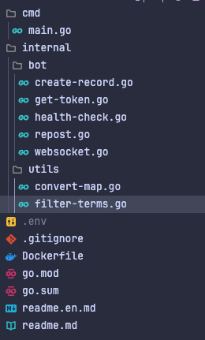

## Como vai funcionar o bot

Vamos desenvolver um bot para a rede social Bluesky, vamos utilizar Golang para isso, esse bot vai monitorar algumas hashtags via websocket,
caso encontre uma dessas hashtags ele vai fazer um repost e dar um like no post original.

Vamos abordar algumas coisas bem bacanas como, websocket, [AT](https://atproto.com/pt) (protocolo usado pelo bluesky), [CAR](https://ipld.io/specs/transport/car/carv1/) (Content Addressable aRchive) e [CBOR](https://surrealdb.com/blog/understanding-cbor) (Concise Binary Object Representation) são dois formatos utilizados para armazenar e transmitir dados de forma eficiente.

## Estrutura do projeto

O projeto vai ter uma estrutura simples, dentro de `internal` teremos um pacote chamado `bot` com todos o código para rodar o bot,
dentro de `utils` teremos algumas funções para nos ajudar.

No arquivo `.env` teremos as credenciais do bluesky para ter acesso a [api](https://docs.bsky.app/docs/get-started).



## Configurando as credenciais

Para se autenticar na api do bluesky precisamos informar um `identifier` e um `password`, mas não podemos usar o password que utilizamos para acessar a nossa conta,
para isso vamos criar um **App Passwords**, basta acessar sua conta no bluesky, acessar configurações e depois **App Passwords**.

Com essa senha gerada, coloque dentro do arquivo `.env`, ficando desta forma:

```yml
  BLUESKY_IDENTIFIER=<seu_identificador>
  BLUESKY_PASSWORD=<seu_app_password>
```

## Gerando o token da API

Sempre que nosso bot identificar uma nova hashtag que estamos monitorando, será feito um respost, porém precisamos de um Bearer token para poder fazer o repost,
vamos criar uma funcão que gera o token, vamos fazer isso no arquivo `get-token.go`.

Primeiro definimos uma váriavel global para a url da api.

```go
  var (
    API_URL = "https://bsky.social/xrpc"
  )
```

Agora definimos nossa struct, com os dados que serão retornados pela a api.

```go
  type DIDDoc struct {
    Context            []string `json:"@context"`
    ID                 string   `json:"id"`
    AlsoKnownAs        []string `json:"alsoKnownAs"`
    VerificationMethod []struct {
      ID                 string `json:"id"`
      Type               string `json:"type"`
      Controller         string `json:"controller"`
      PublicKeyMultibase string `json:"publicKeyMultibase"`
    } `json:"verificationMethod"`
    Service []struct {
      ID              string `json:"id"`
      Type            string `json:"type"`
      ServiceEndpoint string `json:"serviceEndpoint"`
    } `json:"service"`
  }

  type DIDResponse struct {
    DID             string `json:"did"`
    DIDDoc          DIDDoc `json:"didDoc"`
    Handle          string `json:"handle"`
    Email           string `json:"email"`
    EmailConfirmed  bool   `json:"emailConfirmed"`
    EmailAuthFactor bool   `json:"emailAuthFactor"`
    AccessJwt       string `json:"accessJwt"`
    RefreshJwt      string `json:"refreshJwt"`
    Active          bool   `json:"active"`
  }
```

Agora criamos a funcão `getToken` que retorna um `DIDResponse`.

```go
  func getToken() (*DIDResponse, error) {
    requestBody, err := json.Marshal(map[string]string{
      "identifier": os.Getenv("BLUESKY_IDENTIFIER"),
      "password":   os.Getenv("BLUESKY_PASSWORD"),
    })
    if err != nil {
      return nil, fmt.Errorf("failed to marshal request body: %w", err)
    }

    url := fmt.Sprintf("%s/com.atproto.server.createSession", API_URL)

    resp, err := http.Post(url, "application/json", bytes.NewBuffer(requestBody))
    if err != nil {
      return nil, fmt.Errorf("failed to send request: %w", err)
    }
    defer resp.Body.Close()

    if resp.StatusCode != http.StatusOK {
      return nil, fmt.Errorf("unexpected status code: %d", resp.StatusCode)
    }

    var tokenResponse DIDResponse
    if err := json.NewDecoder(resp.Body).Decode(&tokenResponse); err != nil {
      return nil, fmt.Errorf("failed to decode response: %w", err)
    }

    return &tokenResponse, nil
  }
```

Essa função chama o endpoint do bluesky `com.atproto.server.createSession` e vamos receber um além de alguns dados o `accessJwt` que é o que vamos precisar para nosso bot,
com isso a função para gerar o token está pronto.

## Criando o Websocket

Essa será a função mais complexa do bot, vamos precisar consumir o endpoint do bluesky.

Primeiro vamos criar uma váriavel para salvar o endpoint, veja mais nas [docs](https://docs.bsky.app/docs/advanced-guides/firehose)

```go
  var (
    wsURL = "wss://bsky.network/xrpc/com.atproto.sync.subscribeRepos"
  )
```

Agora vamos criar as structs:

```go
  type RepoCommitEvent struct {
    Repo   string      `cbor:"repo"`
    Rev    string      `cbor:"rev"`
    Seq    int64       `cbor:"seq"`
    Since  string      `cbor:"since"`
    Time   string      `cbor:"time"`
    TooBig bool        `cbor:"tooBig"`
    Prev   interface{} `cbor:"prev"`
    Rebase bool        `cbor:"rebase"`
    Blocks []byte      `cbor:"blocks"`

    Ops []RepoOperation `cbor:"ops"`
  }

  type RepoOperation struct {
    Action string      `cbor:"action"`
    Path   string      `cbor:"path"`
    Reply  *Reply      `cbor:"reply"`
    Text   []byte      `cbor:"text"`
    CID    interface{} `cbor:"cid"`
  }

  type Reply struct {
    Parent Parent `json:"parent"`
    Root   Root   `json:"root"`
  }

  type Parent struct {
    Cid string `json:"cid"`
    Uri string `json:"uri"`
  }

  type Root struct {
    Cid string `json:"cid"`
    Uri string `json:"uri"`
  }

  type Post struct {
    Type  string `json:"$type"`
    Text  string `json:"text"`
    Reply *Reply `json:"reply"`
  }
```

Também vamos usar o pacote [Gorilla Websocket](https://github.com/gorilla/websocket), baixe o pacote com:

```bash
  go get github.com/gorilla/websocket
```

a função `Websocket` fica assim inicialmente:

```go
  func Websocket() error {
    conn, _, err := websocket.DefaultDialer.Dial(wsURL, nil)
    if err != nil {
      slog.Error("Failed to connect to WebSocket", "error", err)
      return err
    }
    defer conn.Close()

    for {
      _, message, err := conn.ReadMessage()
      if err != nil {
        slog.Error("Error reading message from WebSocket", "error", err)
        continue
      }
    }
  }
```

Com isso já conseguimos ler as mensagens recebidas via websoket com um `for` infinito, mas as mensagens vem codificadas em [CAR](https://ipld.io/specs/transport/car/carv1/).

#### O que é CBOR?

CBOR (Concise Binary Object Representation) é um formato de dados binário que é usado para representar dados de forma compacta e eficiente. 
Ele é parecido com o JSON, mas em vez de usar texto legível, ele usa bytes binários, o que o torna menor e mais rápido para ser transmitido e processado.

Para decodificar ele vamos precisar usar [este pacote](github.com/fxamacker/cbor/v2).

```go
  decoder := cbor.NewDecoder(bytes.NewReader(message))
```

Basta transformar o `message` em um `reader`, e com isso vamos ter isso:

```go
  func Websocket() error {
    conn, _, err := websocket.DefaultDialer.Dial(wsURL, nil)
    if err != nil {
      slog.Error("Failed to connect to WebSocket", "error", err)
      return err
    }
    defer conn.Close()

    slog.Info("Connected to WebSocket", "url", wsURL)

    for {
      _, message, err := conn.ReadMessage()
      if err != nil {
        slog.Error("Error reading message from WebSocket", "error", err)
        continue
      }

      decoder := cbor.NewDecoder(bytes.NewReader(message))

      for {
        var evt RepoCommitEvent
        err := decoder.Decode(&evt)
        if err == io.EOF {
          break
        }
        if err != nil {
          slog.Error("Error decoding CBOR message", "error", err)
          break
        }

      }
    }
  }
```

- `decoder.Decode(&evt)`: O decoder é responsável por ler os dados recebidos e decodificá-los do formato CBOR para o tipo `RepoCommitEvent`. O `evt` armazena os dados decodificados.

- `if err == io.EOF { break }`: Se o decoder chegar ao final dos dados (não houver mais mensagens), ele retorna `io.EOF`. Quando isso acontece, o loop é interrompido com break, porque não há mais dados para processar.

#### Criando o `handleEvent`

Vamos criar uma função para processar o evento:

```go
  func handleEvent(evt RepoCommitEvent) error {
    for _, op := range evt.Ops {
      if op.Action == "create" {
        if len(evt.Blocks) > 0 {
          err := handleCARBlocks(evt.Blocks, op)
          if err != nil {
            slog.Error("Error handling CAR blocks", "error", err)
            return err
          }
        }
      }
    }

    return nil
  }
```

- Parâmetro `evt`: A função recebe um parâmetro evt, que é um evento de commit `RepoCommitEvent`. Este evento contém uma lista de operações (Ops) e possivelmente blocos de dados (Blocks) relacionados a essas operações.

- Loop sobre `Ops`: O evento `evt` pode conter várias operações. O código percorre cada uma dessas operações usando o loop `for _, op := range evt.Ops`.

- Verificação da Ação `op.Action == "create"`: Para cada operação, o código verifica se a ação associada é "create", ou seja, se a operação está criando algo novo no bluesky, como um post ou outro tipo de conteúdo.

- Se há Blocos `len(evt.Blocks) > 0`: Se a operação de criação for detectada, o código verifica se o evento contém blocos de dados (Blocks). Esses blocos contêm informações adicionais que podem estar relacionadas à operação.

- Processamento dos Blocos `handleCARBlocks`: Se os blocos estiverem presentes, a função `handleCARBlocks` é chamada para processar esses blocos. Essa função é responsável por interpretar os dados dentro dos blocos (Vamos abordar o CAR abaixo).

#### O que é CAR?

CAR (Content Addressable aRchive) é um formato de arquivo que armazena dados de forma eficiente e segura usando endereçamento por conteúdo. Isso significa que cada pedaço de dado é identificado pelo seu conteúdo em vez de um local específico.

Aqui está uma explicação simples:

Conteúdo Identificado por Hash: Cada bloco de dados em um arquivo CAR é identificado por um hash (um identificador único gerado a partir do conteúdo do dado). Isso garante que o mesmo dado sempre tenha o mesmo identificador.

Usado em IPFS e IPLD: CAR é amplamente utilizado em sistemas como IPFS (InterPlanetary File System) e IPLD (InterPlanetary Linked Data), onde os dados são distribuídos e recuperados pela rede com base no conteúdo, em vez de localização como o bluesky.

Blocos de Dados: Um arquivo CAR pode armazenar vários blocos de dados, e cada bloco pode ser recuperado individualmente usando seu identificador de conteúdo (CID - Content Identifier).

Eficiente e Seguro: Como o identificador de um bloco depende do seu conteúdo, é fácil verificar se os dados estão corretos e não foram alterados.

#### Criando o `handleCARBlocks`

Essa será a mais complexa do bot:

```go
  func handleCARBlocks(blocks []byte, op RepoOperation) error {
    if len(blocks) == 0 {
      return errors.New("no blocks to process")
    }

    reader, err := carv2.NewBlockReader(bytes.NewReader(blocks))
    if err != nil {
      slog.Error("Error creating CAR block reader", "error", err)
      return err
    }

    for {
      block, err := reader.Next()
      if err == io.EOF {
        break
      }
      if err != nil {
        slog.Error("Error reading CAR block", "error", err)
        break
      }

      if opTag, ok := op.CID.(cbor.Tag); ok {
        if cidBytes, ok := opTag.Content.([]byte); ok {
          c, err := decodeCID(cidBytes)
          if err != nil {
            slog.Error("Error decoding CID from bytes", "error", err)
            continue
          }

          if block.Cid().Equals(c) {
            var post Post
            err := cbor.Unmarshal(block.RawData(), &post)
            if err != nil {
              slog.Error("Error decoding CBOR block", "error", err)
              continue
            }

            if post.Text == "" || post.Reply == nil {
              continue
            }

            if utils.FilterTerms(post.Text) {
              repost(&post)
            }
          }
        }
      }
    }

    return nil
  }
```

A função `handleCARBlocks` processa blocos de dados no formato CAR. Vamos entender passo a passo o que a função faz de forma simples:

- Verificação Inicial dos Blocos:

```go
  if len(blocks) == 0 {
      return errors.New("no blocks to process")
  }
```

Se os blocos estiverem vazios, a função retorna um erro dizendo que não há blocos para processar.

- Criando um Leitor de Blocos CAR:

```go
  reader, err := carv2.NewBlockReader(bytes.NewReader(blocks))
```

A função cria um leitor de blocos para interpretar os dados contidos no arquivo CAR, estamos usando os pacotes [carV2](https://github.com/ipld/go-car) e [go-cid](github.com/ipfs/go-cid)

Para instalar execute:

```bash
  go install github.com/ipld/go-car/cmd/car@latest
```

```bash
  go get github.com/ipfs/go-cid
```

- Lendo os Blocos:

```go
  for {
      block, err := reader.Next()
      if err == io.EOF {
          break
      }
  }
```

A função entra em um loop para ler todos os blocos de dados um por um. Quando todos os blocos são lidos (ou seja, o fim é alcançado), o loop para.

- Verificando o CID:

```go
  if opTag, ok := op.CID.(cbor.Tag); ok {
      if cidBytes, ok := opTag.Content.([]byte); ok {
          c, err := decodeCID(cidBytes)
```

A função verifica se a operação contém um CID (Content Identifier) que pode ser decodificado. Esse CID identifica o conteúdo específico do bloco.

- Comparando e Decodificando o Bloco:

```go
  if block.Cid().Equals(c) {
      var post Post
      err := cbor.Unmarshal(block.RawData(), &post)
```

Se o bloco lido tem o mesmo CID que a operação, o conteúdo do bloco é decodificado para um formato que a função entende, como um "Post".

- Filtrando o Post:

```go
  if post.Text == "" || post.Reply == nil {
      continue
  }
  if utils.FilterTerms(post.Text) {
      repost(&post)
  }
```

Se o post tiver texto e uma resposta `reply`, ele é filtrado com uma função chamada `FilterTerms`. Se passar no filtro, ele é repostado.

#### Criando o `decodeCID`

A função `decodeCID` é responsável por decodificar um identificador de conteúdo (CID) a partir de um conjunto de bytes. Ela pega esses bytes e tenta transformá-los em um CID que pode ser usado para identificar blocos de dados.

```go
  func decodeCID(cidBytes []byte) (cid.Cid, error) {
    var c cid.Cid
    c, err := cid.Decode(string(cidBytes))
    if err != nil {
      return c, fmt.Errorf("error decoding CID: %w", err)
    }

    return c, nil
  }
```

Com isso temos o `Websocket` pronto.

## Criando o Websocket

Vamos criar dentro do `utils` no `filter-terms.go` o seguinte:

```go
  var (
    terms = []string{"#hashtag2", "#hashtag1"}
  )

  func FilterTerms(text string) bool {
    for _, term := range terms {
      if strings.Contains(strings.ToLower(text), strings.ToLower(term)) {
        return true
      }
    }
    return false
  }
```

É nessa função que deinimos as hashtags a seremo monitoradas, de forma simples recebemos um  `text` que vem do websocket e filtramos com base nos `terms`.