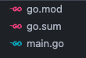
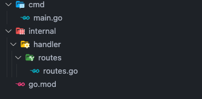

Today we are going to see all the power that a CLI (Command line interface) can bring to development, a CLI can help us perform tasks more effectively and lightly through commands via terminal, without needing an interface. For example, [git](https://git-scm.com/) and [Docker](https://www.docker.com/) , we practically use their CLI all the time, when we execute a `git commit -m "commit message"` or `docker ps -a` we are using a CLI. I'm going to leave an [article](https://dev.to/bboyakers/what-is-a-cli-53a6) that details what a CLI is.

In this post we will create a boilerplate for Go projects, where with just 1 command via CLI, the entire project structure will be created.

## Go e CLI

Well, Go is extremely powerful for building CLI, it is one of the most used languages for this, no wonder it is widely used among DevOps, precisely because it is so powerful and simple.

Just to give an example of the power of Go for CLI builds, you may have already used or at least heard of [Docker](https://www.docker.com/), [Kubernetes](https://github.com/kubernetes/kubernetes), [Prometheus](https://github.com/prometheus/prometheus), [Terraform](https://github.com/hashicorp/terraform), but what do they all have in common? They all have a large part of their usability via CLI and are developed in Go 🐿.

## Starting a CLI with Go

Go has a package to handle CLI natively. But let's cover it quickly, the purpose of the post is to use the [Cobra CLI](https://github.com/spf13/cobra) package, which will facilitate the construction of our CLI.

Let's use the [flag](https://pkg.go.dev/flag) package

```go
  package main

  import (
    "flag"
    "fmt"
    "time"
  )

  func main() {
    dateFlag := flag.Bool("date", false, "Display the current date")
    flag.Parse()

    if *dateFlag {
      currentTime := time.Now()
      fmt.Println("Current date", currentTime.Format("2006-01-02 15:04:05"))
    }
  }
```

In this example above, we created a `date` flag, passing this flag returns the current date, something very simple, running the project with `go run main.go --date`, we will have the value `Current date 2023-11 -15 12:26:14`.

```go
  dateFlag := flag.Bool("date", false, "Display the current date")
```

In the code above, we create a flag, the first argument `date` is the flag name, false as the default value means that if you run the program without explicitly specifying the `--date` flag, the value associated with `dateFlag` will be `false`. This allows the program to have a specific default behavior if this flag is not provided when the program is executed, while the third argument `Display the current date` is the detail of what this flag does.

If we run:

```bash
  go run main.go -h
```

We received:

```bash
  -date
    Display the current date
```

We can use the flag with `--date` or `-date`, Go already does the automatic check.
We can make our entire boilerplate with this approach, but let's make it a little easier and use the [Cobra CLI](https://github.com/spf13/cobra) package.

## Cobra CLI

This package is widely used for powerful CLI builds, it is used for example for [Kubernetes CLI](https://kubernetes.io/) and [GitHub CLI](https://github.com/cli/cli), in addition to offering some cool features such as automatic completion of [shell](<https://pt.wikipedia.org/wiki/Shell_(computa%C3%A7%C3%A3o)>), automatic recognition of flags (the tags) , and you can use `-h` or `-help` for example, among other facilities.

## Creating the project

Our project will be very simple, we will only have `main.go` and `go.mod` and consequently our `go.sum`, we will start the project with the command:

```bash
  go mod init github.com/wiliamvj/boilerplate-cli-go
```

_You can use whatever name you want_, by convention we generally create the name of the project as the link to our repository.

ending up like this:



Now let's download the Cobra package with the command:

```bash
  go get -u github.com/spf13/cobra@latest
```

The boilerplate will have a very simple structure, the idea is to create a structure widely used by the Go community, see how it will look:



- **cmd**: [here](https://github.com/golang-standards/project-layout/tree/master/cmd) where we will leave the `main.go` that starts our app.
- **internal**: [in this paste](https://github.com/golang-standards/project-layout/tree/master/internal) where all the code for our application should be located.
  - **handler**: Here will be the files responsible for receiving our http requests, you may also know them as controllers.
    - **routes**: Here we will organize our routes.

It's not the complete framework, we're just creating the basics for our example.

All of our code will focus on our `main.go`.

```go
  package main

  import (
    "fmt"
    "os"

    "github.com/spf13/cobra"
  )

  func main() {
    var rootCommand = &cobra.Command{}
    var projectName, projectPath string

    var cmd = &cobra.Command{
      Use:   "create",
      Short: "Create boilerplate for a new project",
      Run: func(cmd *cobra.Command, args []string) {
        // validations
        if projectName == "" {
          fmt.Println("You must supply a project name.")
          return
        }
        if projectPath == "" {
          fmt.Println("You must supply a project path.")
          return
        }
        fmt.Println("Creating project...")
      },
    }

    cmd.Flags().StringVarP(&projectName, "name", "n", "", "Name of the project")
    cmd.Flags().StringVarP(&projectPath, "path", "p", "", "Path where the project will be created")

    rootCommand.AddCommand(cmd)
    rootCommand.Execute()
  }
```

The code above is just to start our CLI, we will only have two variables:

- `projectName`: it will be the name of our project that we will capture in the input of our CLI.
- `projectPath`: will be the path where the boilerplate will be created, we will capture it in the CLI input.
- `&cobra.Command{}`: starts the Cobra cli.
- `Run:` It receives an anonymous function, it is in this function that we capture the user input entered in the CLI and validate it, our validation is simple, we just check if the `projectName` and `projectPath` are not null.
- `cmd.Flags()`: Here we create the flags with flags, so you can use `-name` or `-n`, both will be accepted, we also include the description of what this flag does.
- `rootCommand.AddCommand(cmd)`: We add our `cmd` to the `rootCommand` created at the beginning of our `main.go`.
- `rootCommand.Execute()`: Finally, we run our CLI.

That's all we need to get our CLI working, of course without our boilerplate logic, but with that we can use it via the terminal. Lets test!

_We can build the project or use it without build_

With build:

```bash
  go build -o cli .
```

A file called `cli` will be created at the root, we will run the binary from our CLI:

```bash
  ./cli --help
```

We will have an output like this:

```bash
  Usage:
    [command]

  Available Commands:
    completion  Generate the autocompletion script for the specified shell
    create      Create boilerplate for a new project
    help        Help about any command

  Flags:
    -h, --help   help for this command

  Use " [command] --help" for more information about a command.
```

See that we already have tips on how to use the command we created `create Create boilerplate for a new project`, if we run:

```bash
  ./cli create --help
```

We will have:

```bash
  Create boilerplate for a new project

  Usage:
    create [flags]

  Flags:
    -h, --help          help for create
    -n, --name string   Name of the project
    -p, --path string   Path where the project will be created
```

Let's run it now by passing our flags:

```bash
  ./cli create -n my-project -p ~/documents
```

We will have our `Creating project...` message, indicating that it worked, but nothing happens yet, as we have not implemented the logic.

We can also create subcommands, new flags, new validations, but for now let's leave it like that, if you want you can create more options, see [documentation](https://pkg.go.dev/github.com/spf13/cobra#section-documentation) of the Cobra package.

## Creating the boilerplate

With our CLI ready, let's now go through the boilerplate logic, which is very simple, we will have to create the folders, then we will need to create the files and finally open the files and insert the code, for this we will use the [os](https://pkg.go.dev/os) package a lot of Go, which allows you to access operating system resources.

Let's first get the main directory and validate if there already exists a folder with the name that will be used to create our project:

```go
  globalPath := filepath.Join(projectPath, projectName)

  if _, err := os.Stat(globalPath); err == nil {
    fmt.Println("Project directory already exists.")
    return
  }
```

If we pass the `projectName` as **test** and the `projectPath` as `/documents`, this validates that there is no other folder in **documents** called **test**, if there is we return and return a error message.

You can modify and, if there is a folder with the same name, change the name of `projectName` or delete the folder that already exists, but for now we will just return an error.

```go
  if err := os.Mkdir(globalPath, os.ModePerm); err != nil {
    log.Fatal(err)
  }
```

In this part, we will create the directory in the path that was entered using our `-p` flag, if we use:

```bash
  ./cli create -n my-project -p ~/documents
```

### Starting Go

A folder called **my-project** will be created in the **documents** directory.

```go
  startGo := exec.Command("go", "mod", "init", projectName)
  startGo.Dir = globalPath
  startGo.Stdout = os.Stdout
  startGo.Stderr = os.Stderr
  err := startGo.Run()
  if err != nil {
    log.Fatal(err)
  }
```

In the code above we execute the command to start the project in Go, it will be created in the root directory we chose, in our example it will run within **documents/my-project**, this will create the file `go.mod` and will set the module name to **my-projects**.

- `exec.Command`: Create the command that we will run in the terminal, in this case it will be `go mod init my-project`.
- `startGo.Dir`: Determine where this command will run, in the example it will run in **documents/my-project**.
- `startGo.Stdout`: It will place the command return in the terminal, it will return `go: creating new go.mod: module my-project`.
- `startGo.Stderr`: Redirects the output of a possible error to where the program is being executed.
- `startGo.Run()`: Finally, we execute everything.

### Creating the folders

Let's create our folders, they are **cmd**, **internal**, **handler** and **routes**.

```go
  cmdPath := filepath.Join(globalPath, "cmd")
    if err := os.Mkdir(cmdPath, os.ModePerm); err != nil {
    log.Fatal(err)
  }
  internalPath := filepath.Join(globalPath, "internal")
  if err := os.Mkdir(internalPath, os.ModePerm); err != nil {
    log.Fatal(err)
  }
  handlerPath := filepath.Join(internalPath, "handler")
    if err := os.Mkdir(handlerPath, os.ModePerm); err != nil {
    log.Fatal(err)
  }
  routesPath := filepath.Join(handlerPath, "routes")
    if err := os.Mkdir(routesPath, os.ModePerm); err != nil {
    log.Fatal(err)
  }
```

This code above creates the necessary folders in sequence, using `os.Mkdir`, ([see the docs](https://pkg.go.dev/os#Mkdir)), for the **handler** and **folders** **routes**, we need to access the **internal** folder, as they will be created within **internal**, for this we use `Join` to merge the path, resulting in:

- `handlerPath`: **documents/my-project/internal**
- `routesPath`: **documents/my-project/internal/handler**

### Creating the files

With the folders created, let's create the files, for example we will create `main.go` of course and `routes.go`, inside the **routes** folder.

```go
  mainPath := filepath.Join(cmdPath, "main.go")
  mainFile, err := os.Create(mainPath)
  if err != nil {
    log.Fatal(err)
  }
  defer mainFile.Close()

  routesFilePath := filepath.Join(routesPath, "routes.go")
  routesFile, err := os.Create(routesFilePath)
  if err != nil {
    log.Fatal(err)
  }
  defer routesFile.Close()
```

Above we created the `main.go` and `routes.go` files.

- `mainPath`: we determine the path, using the `mainPath` used to create the **cmd** folder.
- `os.Create(mainPath)`: we create the file, in the specified directory. (**documents/my-project/cmd**)
- `routesFilePath`: we determine the path, using the `routesPath` used to create the **routes** folder.
- `os.Create(routesFilePath)`: We create the file, in the specified directory. (**documents/my-project/internal/handler/routes**)
- `defer routesFile.Close()`: We close the file, `defer`, using this GO reserved word, we guarantee that the last thing to happen is to close the file. See more about `defer` [here](https://go.dev/blog/defer-panic-and-recover).

### Writing to files

With the folders and files created, now let's write to the `main.go` and `routes.go` files, let's do something simple, just for example, to organize better, we will separate them into functions that write to each file.

```go
  func WriteMainFile(mainPath string) error {
    packageContent := []byte(`package main

  import "fmt"

  func main() {
    fmt.Println("Hello World!")
  }
  `)

    mainFile, err := os.OpenFile(mainPath, os.O_WRONLY|os.O_APPEND, 0666)
    if err != nil {
      return err
    }
    defer mainFile.Close()

    _, err = mainFile.Write(packageContent)
    if err != nil {
      return err
    }

    return nil
  }
```

In the function above, we have `mainPath` as a parameter, which is the file path, we will add a simple code, which will just log a _Hello World_.

- `packageContent`: We create the code that will be written to the file.
- `os.OpenFile`: We open the file specified in `mainPath`.
- `defer mainFile.Close()`: We close the file last with `defer`.
- `mainFile.Write`: Finally, we write it to the file, and handle the error if any.

`O_WRONLY` and `O_APPEND`, are constants used to define the opening mode of a file, `O_WRONLY` indicates that the file will be opened only for writing, `O_APPEND` means that the added content will be added to the end of the file, without overwrite existing content.

```go
  func WriteRoutesFile(routesFilePath string) error {
    packageContent := []byte(`package routes

  // your code here
  `)

    routesFile, err := os.OpenFile(routesFilePath, os.O_WRONLY|os.O_APPEND, 0666)
    if err != nil {
      return err
    }
    defer routesFile.Close()

    _, err = routesFile.Write(packageContent)
    if err != nil {
      return err
    }

    return nil
  }
```

We do the same for the `routes.go` file.

Now just call the new functions in the `main` function, looking like this:

```go
  mainPath := filepath.Join(cmdPath, "main.go")
  mainFile, err := os.Create(mainPath)
  if err != nil {
    log.Fatal(err)
  }
  defer mainFile.Close()
  if err := WriteMainFile(mainPath); err != nil {
    log.Fatal(err)
  }

  routesFilePath := filepath.Join(routesPath, "routes.go")
  routesFile, err := os.Create(routesFilePath)
    if err != nil {
    log.Fatal(err)
  }
  defer routesFile.Close()
  if err := WriteRoutesFile(routesFilePath); err != nil {
    log.Fatal(err)
  }
```

### Final code

```go
  package main

  import (
    "fmt"
    "log"
    "os"
    "os/exec"
    "path/filepath"

    "github.com/spf13/cobra"
  )

  func main() {
    var rootCommand = &cobra.Command{}
    var projectName, projectPath string

    var cmd = &cobra.Command{
      Use:   "create",
      Short: "Create boilerplate for a new project",
      Run: func(cmd *cobra.Command, args []string) {
        if projectName == "" {
          fmt.Println("You must supply a project name.")
          return
        }
        if projectPath == "" {
          fmt.Println("You must supply a project path.")
          return
        }
        fmt.Println("Creating project...")

        globalPath := filepath.Join(projectPath, projectName)

        if _, err := os.Stat(globalPath); err == nil {
          fmt.Println("Project directory already exists.")
          return
        }
        if err := os.Mkdir(globalPath, os.ModePerm); err != nil {
          log.Fatal(err)
        }

        startGo := exec.Command("go", "mod", "init", projectName)
        startGo.Dir = globalPath
        startGo.Stdout = os.Stdout
        startGo.Stderr = os.Stderr
        err := startGo.Run()
        if err != nil {
          log.Fatal(err)
        }

        cmdPath := filepath.Join(globalPath, "cmd")
        if err := os.Mkdir(cmdPath, os.ModePerm); err != nil {
          log.Fatal(err)
        }
        internalPath := filepath.Join(globalPath, "internal")
        if err := os.Mkdir(internalPath, os.ModePerm); err != nil {
          log.Fatal(err)
        }
        handlerPath := filepath.Join(internalPath, "handler")
        if err := os.Mkdir(handlerPath, os.ModePerm); err != nil {
          log.Fatal(err)
        }
        routesPath := filepath.Join(handlerPath, "routes")
        fmt.Println(routesPath)
        if err := os.Mkdir(routesPath, os.ModePerm); err != nil {
          log.Fatal(err)
        }

        mainPath := filepath.Join(cmdPath, "main.go")
        mainFile, err := os.Create(mainPath)
        if err != nil {
          log.Fatal(err)
        }
        defer mainFile.Close()
        if err := WriteMainFile(mainPath); err != nil {
          log.Fatal(err)
        }

        routesFilePath := filepath.Join(routesPath, "routes.go")
        routesFile, err := os.Create(routesFilePath)
        if err != nil {
          log.Fatal(err)
        }
        defer routesFile.Close()
        if err := WriteRoutesFile(routesFilePath); err != nil {
          log.Fatal(err)
        }
      },
    }

    cmd.Flags().StringVarP(&projectName, "name", "n", "", "Name of the project")
    cmd.Flags().StringVarP(&projectPath, "path", "p", "", "Path where the project will be created")

    rootCommand.AddCommand(cmd)
    rootCommand.Execute()
  }

  func WriteMainFile(mainPath string) error {
    packageContent := []byte(`package main

  import "fmt"

  func main() {
    fmt.Println("Hello World!")
  }
  `)

    mainFile, err := os.OpenFile(mainPath, os.O_WRONLY|os.O_APPEND, 0666)
    if err != nil {
      return err
    }
    defer mainFile.Close()

    _, err = mainFile.Write(packageContent)
    if err != nil {
      return err
    }

    return nil
  }

  func WriteRoutesFile(routesFilePath string) error {
    packageContent := []byte(`package routes

    // your code here
  `)

    routesFile, err := os.OpenFile(routesFilePath, os.O_WRONLY|os.O_APPEND, 0666)
    if err != nil {
      return err
    }
    defer routesFile.Close()

    _, err = routesFile.Write(packageContent)
    if err != nil {
      return err
    }

    return nil
  }
```

## Testing the CLI

Well, with everything ready, let's test it! To do this, we will compile our code with the good old `go build`.

```bash
  go build -o cli .
```

Running the CLI:

```bash
  ./cli create -n my-project -p ~/documents
```

Let's get the answer:

```bash
  Creating project...
  go: creating new go.mod: module my-project
```

Accessing our project and opening it in Visual Studio Code with:

```bash
  cd /documents/my-project && code .
```

We will have our boilerplate created:


If we run the project created via CLI, we can see that everything works.

```bash
  go run cmd/main.go

  output:
    Hello World!
```

With this we finish creating our CLI that creates a boilerplate.

## Final considerations

Our boilerplate could be even more automated, we could, for example, install a package like the [Go Chi](https://go-chi.io/) package, creating standard endpoints, all using the CLI, you can even create your own framework, have you ever thought that with just one command your initial project is already configured?

With knowledge in CLI creation, you have great power in your hands!

## Repository link

[repository](https://github.com/wiliamvj/boilerplate-cli-go/blob/main/main.go) of the project
