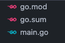
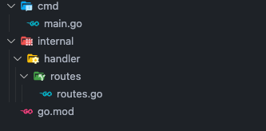
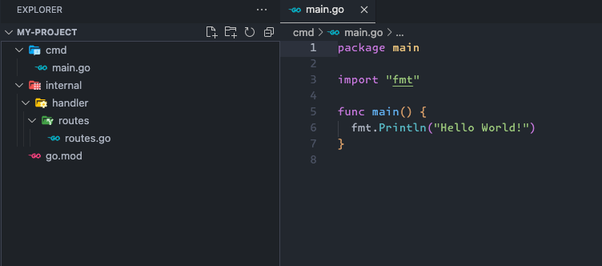

Hoje vamos ver todo o poder quem uma CLI (Command line interface) pode trazer para o desenvolvimento, uma CLI pode nos ajudar a executar tarefas de forma mais eficaz e leve através de comandos via terminal, sem precisar de uma interface. Como por exemplo o [git](https://git-scm.com/) e o [Docker](https://www.docker.com/) , praticamente usamos a CLI deles o tempo inteiro, quando executamos um `git commit -m "commit message"` ou `docker ps -a` estamos utilizando uma CLI. Vou deixar um [artigo](https://dev.to/bboyakers/what-is-a-cli-53a6) que detalha melhor o que é uma CLI.

Nesse post vamos criar um boilerplate para projetos em GO, onde com apenas 1 comando via CLI, vai ser criado toda a estrutura do projeto.

## GO e CLI

Bom, o Go é extremamente poderoso para contrução de CLI, é umas das linguagens mais utilizadas para isso, não é atoa que é a amplamente utilizada entre os DevOps, justamente por ser tão poderosa e simples.

Só para dar um exemplo do poder do Go para construções de CLI, você já deve ter utilizado ou pelo menos ouviu falar do [Docker](https://www.docker.com/), [Kubernetes](https://github.com/kubernetes/kubernetes), [Prometheus](https://github.com/prometheus/prometheus), [Terraform](https://github.com/hashicorp/terraform),mas o que todos eles tem em comum? todos eles tem grande parte da sua usabilidade via CLI e são desenvolvidos em Go 🐿.

## Iniciando uma CLI com GO

O Go tem um pacote para lidar com CLI de forma nativa. Mas vamos abordar de forma rápida, o intuito do post é utilizar o pacote [Cobra CLI](https://github.com/spf13/cobra), que vai facilitar a construção da nossa CLI.

Vamos utilizar o pacote [flag](https://pkg.go.dev/flag)

```go
  package main

  import (
    "flag"
    "fmt"
    "time"
  )

  func main() {
    dateFlag := flag.Bool("date", false, "Exibir a data atual")
    flag.Parse()

    if *dateFlag {
      currentTime := time.Now()
      fmt.Println("Data atual:", currentTime.Format("2006-01-02 15:04:05"))
    }
  }
```

Nesse exemplo acima, criamos uma flag `date`, ao passar essa flag é retornado a data atual, algo bem simples, rodando o projeto com `go run main.go --date`, vamos ter o valor `Data atual: 2023-11-15 12:26:14`.

```go
  dateFlag := flag.Bool("date", false, "Exibir a data atual")
```

No código acima, criamos uma flag, o primeiro argumento `date` é o nome de flag, o false como valor padrão significa que, se você rodar o programa sem especificar explicitamente a flag --date, o valor associado a `dateFlag` será `false`. Isso permite que o programa tenha um comportamento padrão específico caso essa flag não seja fornecida quando o programa é executado, já o terceiro argumento `Exibir a data atual` é o detalhe do que essa flag faz.

Se rodarmos:

```bash
  go run main.go -h
```

Recebemos:

```bash
  -date
    Exibir a data atual
```

Podemos usar a flag com `--date` ou `-date`, o Go já faz a verificação automática.

Podemos fazer todo o nosso boilerplate com essa abordage, porém vamos facilitar um pouco e usar o pacote [Cobra CLI](https://github.com/spf13/cobra).

## Cobra CLI

Esse pacote é muito utilizado para contruções de CLI poderosas, é utilizado por exemplo para o [Kubernetes CLI](https://kubernetes.io/) e [GitHub CLI](https://github.com/cli/cli), além de oferecer alguns recursos bacanas como preenchimento automático do [shell](<https://pt.wikipedia.org/wiki/Shell_(computa%C3%A7%C3%A3o)>), reconhecimento automático de sinalizadores (as tags), podendo utilizar `-h` ou `-help` por exemplo, entre outras facilidades.

## Criando o projeto

Nosso projeto vai ser bem simples, vamos ter apenas o `main.go` e o `go.mod` e consequentemente nosso `go.sum`, vamos iniciar o projeto com o comando:

```bash
  go mod init github.com/wiliamvj/boilerplate-cli-go
```

_Você pode utilizar o nome que desejar_, por convenção geralmente criamos o nome do projeto sendo o link do nosso repositório.

ficando assim:



Agora vamos baixar o pacote Cobra com o comando:

```bash
  go get -u github.com/spf13/cobra@latest
```

Nosso boilerplate vai ter uma estrutura bem simples, a ideia é criar uma estrutura muito utilizada pela comunidade em Go, veja como vai ficar:



- **cmd**: [Aqui](https://github.com/golang-standards/project-layout/tree/master/cmd) é onde vamos deixar o `main.go` que inicia nosso app.
- **internal**: [Nessa pasta](https://github.com/golang-standards/project-layout/tree/master/internal) onde deve ficar todo o código da nossa aplicação.
  - **handler**: Aqui vai ficar os arquivos responsáveis por receber nossas solicitações http, você pode conhecer também como controllers.
    - **routes**: Aqui vamos organizar nossas rotas.

Não é a estrutura completa, estamos apenas criando o básico para o nosso exemplo.

Todo o nosso código vai se concentrar em nosso `main.go`.

```go
  package main

  import (
    "fmt"
    "os"

    "github.com/spf13/cobra"
  )

  func main() {
    var rootCommand = &cobra.Command{}
    var projectName, projectPath string

    var cmd = &cobra.Command{
      Use:   "create",
      Short: "Create boilerplate for a new project",
      Run: func(cmd *cobra.Command, args []string) {
        // validations
        if projectName == "" {
          fmt.Println("You must supply a project name.")
          return
        }
        if projectPath == "" {
          fmt.Println("You must supply a project path.")
          return
        }
        fmt.Println("Creating project...")
      },
    }

    cmd.Flags().StringVarP(&projectName, "name", "n", "", "Name of the project")
    cmd.Flags().StringVarP(&projectPath, "path", "p", "", "Path where the project will be created")

    rootCommand.AddCommand(cmd)
    rootCommand.Execute()
  }
```

O código acima é apenas para iniciar o nosso CLI, vamos ter apenas duas váriaveis:

- `projectName`: será o nome do nosso projeto que vamos capturar no input da nossa CLI.
- `projectPath`: será o caminho onde o boilerplate será criado, vamos capturar no input do CLI.
- `&cobra.Command{}`: inicia o pacote Cobra.
- `Run:` Recebe uma funcão anônima, é nessa função que capturamos o input do usuário digitado no CLI e validamos, nossa validação é simples, apenas verificamos se o `projectName` e o `projectPath` não são nulos.
- `cmd.Flags()`: Aqui criamos as flags com sinalizadores, dessa forma pode ser usado `-name` ou `-n`, ambos serão aceitos, também colocamos a descrição do que esse sinalizado faz.
- `rootCommand.AddCommand(cmd)`: Adicionamos nosso `cmd` ao `rootCommand` criado no inicio do nosso `main.go`.
- `rootCommand.Execute()`: Por fim, executamos nossa CLI.

Isso é tudo que precisamos para deixar nossa CLI funcionando, claro que sem a lógica do nosso boilerplate, mas com isso já conseguimos utilizar via terminal. Vamos testar!

_Podemos fazer um build do projeto o usar sem o build_

Com build:

```bash
  go build -o cli .
```

Vai criar na raiz um arquivo chamado `cli`, vamos rodar o binário da nossa CLI:

```bash
  ./cli --help
```

Vamos ter uma saida igual a essa:

```bash
  Usage:
    [command]

  Available Commands:
    completion  Generate the autocompletion script for the specified shell
    create      Create boilerplate for a new project
    help        Help about any command

  Flags:
    -h, --help   help for this command

  Use " [command] --help" for more information about a command.
```

Veja que já temos as dicas de como utilizar o comando que criamos `create  Create boilerplate for a new project`, se rodarmos:

```bash
  ./cli create --help
```

Teremos:

```
  Create boilerplate for a new project

  Usage:
    create [flags]

  Flags:
    -h, --help          help for create
    -n, --name string   Name of the project
    -p, --path string   Path where the project will be created
```

Vamos rodar agora passando nossas flags:

```bash
  ./cli create -n my-project -p ~/documents
```

Vamos ter nossa mensagem `Creating project...`, indicando que funcionou, mas nada ainda acontece, pois não implementamos a lógica.

Podemos ainda criar subcomandos, novas flags, novas validações, mas por enquanto vamos deixar assim, se quiser você pode criar mais opções, veja a [documentação](https://pkg.go.dev/github.com/spf13/cobra#section-documentation) do pacote Cobra.

## Criando o boilerplate

Com a nossa CLI pronta, vamos agora a lógica do boilerplate, que é bem simples, teremos que criar as pastas, depois precisamos criar os arquivos e por fim abrir os arquivos e inserir o código, para isso vamos utilizar bastante o pacote [os](https://pkg.go.dev/os) do Go, que permite acessar recursos do sistema operacional.

Vamos primeiro pegar o diretório principal e validar se já existe uma pasta com o nome que vai se usado para criar o nosso projeto:

```go
  globalPath := filepath.Join(projectPath, projectName)

  if _, err := os.Stat(globalPath); err == nil {
    fmt.Println("Project directory already exists.")
    return
  }
```

Se passarmos o `projectName` como **test** e o `projectPath` como `/documents`, isso valida se não existe nenhuma outra pasta em **documents** chamado **test**, se existir returnamos e devolvemos uma mensagem de erro.

Você pode modificar e caso exista uma pasta com mesmo nome, alterar o nome do `projectName` ou deletar a pasta que já existe, mas por hora vamos apenas retornar erro.

```go
  if err := os.Mkdir(globalPath, os.ModePerm); err != nil {
    log.Fatal(err)
  }
```

Nessa parte, vamos criar o diretório no caminho que foi informado usando nossa flag `-p`, se usarmos:

```bash
  ./cli create -n my-project -p ~/documents
```

### Iniciando o Go

Vai ser criado uma pasta chamada **my-project** no diretório **documents**.

```go
  startGo := exec.Command("go", "mod", "init", projectName)
  startGo.Dir = globalPath
  startGo.Stdout = os.Stdout
  startGo.Stderr = os.Stderr
  err := startGo.Run()
  if err != nil {
    log.Fatal(err)
  }
```

No código acima executamos o comando para iniciar o projeto em Go, vai ser criado no diretório raiz que escolhemos, no nosso exemplo vai rodar dentro de **documents/my-project**, isso vai criar o arquivo `go.mod` e vai definir o nome do módulo como **my-projects**.

- `exec.Command`: Cria o comando que vamos rodar no terminal, no caso vai ser `go mod init my-project`.
- `startGo.Dir`: Determinar onde vai rodar esse comando, no exemplo vai rodar em **documents/my-project**.
- `startGo.Stdout`: Vai colocar no terminal o retorno do comando, vai retornar `go: creating new go.mod: module my-project`.
- `startGo.Stderr `: Redireciona a saida de um possivel erro para onde o programa está sendo executado.
- `startGo.Run()`: Por fim, executamos tudo.

### Criando as pastas

Vamos criar nossas pastas, são elas **cmd**, **internal**, **handler** e **routes**.

```go
  cmdPath := filepath.Join(globalPath, "cmd")
    if err := os.Mkdir(cmdPath, os.ModePerm); err != nil {
    log.Fatal(err)
  }
  internalPath := filepath.Join(globalPath, "internal")
  if err := os.Mkdir(internalPath, os.ModePerm); err != nil {
    log.Fatal(err)
  }
  handlerPath := filepath.Join(internalPath, "handler")
    if err := os.Mkdir(handlerPath, os.ModePerm); err != nil {
    log.Fatal(err)
  }
  routesPath := filepath.Join(handlerPath, "routes")
    if err := os.Mkdir(routesPath, os.ModePerm); err != nil {
    log.Fatal(err)
  }
```

Esse código acima cria na sequência as pastas necessárias, usando `os.Mkdir`, ([veja nas docs](https://pkg.go.dev/os#Mkdir)), para as pastas **handler** e **routes**, precisamos acessar a pasta **internal**, pois serão criadas dentro da **internal**, para isso pegamos usando o `Join` mesclamos o caminho, ficando:

- `handlerPath`: **documents/my-project/internal**
- `routesPath`: **documents/my-project/internal/handler**

### Criando os arquivos

Com as pastas criadas, vamos criar os aquivos, para exemplo vamos criar o `main.go` é claro e o `routes.go`, dentro da pasta **routes**.

```go
  mainPath := filepath.Join(cmdPath, "main.go")
  mainFile, err := os.Create(mainPath)
  if err != nil {
    log.Fatal(err)
  }
  defer mainFile.Close()

  routesFilePath := filepath.Join(routesPath, "routes.go")
  routesFile, err := os.Create(routesFilePath)
  if err != nil {
    log.Fatal(err)
  }
  defer routesFile.Close()
```

Acima criamos os arquivos `main.go` e `routes.go`.

- `mainPath`: determinamos o caminho, usando o `mainPath` usado para criar a pasta **cmd**.
- `os.Create(mainPath)`: Criamos o arquivo, no diretório especificado. (**documents/my-project/cmd**)
- `routesFilePath`: determinamos o caminho, usando o `routesPath` usado para criar a pasta **routes**.
- `os.Create(routesFilePath)`: Criamos o arquivo, no diretório especificado. (**documents/my-project/internal/handler/routes**)
- `defer routesFile.Close()`: Fechamos o arquivo, `defer`, usando essa palavra reservada do GO, garantimos que a última coisa a acontecer é fechar o arquivo. Veja mais sobre o `defer` [aqui](https://go.dev/blog/defer-panic-and-recover).

### Escrevendo nos arquivos

Com as pastas e arquivos criados, agora vamos escrever nos arquivos `main.go` e `routes.go`, vamos fazer algo simples, apenas para exemplo, para organizar melhor, vamos separar em funções que escrevem em cada arquivo.

```go
  func WriteMainFile(mainPath string) error {
    packageContent := []byte(`package main

  import "fmt"

  func main() {
    fmt.Println("Hello World!")
  }
  `)

    mainFile, err := os.OpenFile(mainPath, os.O_WRONLY|os.O_APPEND, 0666)
    if err != nil {
      return err
    }
    defer mainFile.Close()

    _, err = mainFile.Write(packageContent)
    if err != nil {
      return err
    }

    return nil
  }
```

Na função acima, recemos por parâmetro o `mainPath`, que é o caminho do arquivo, vamos adiciona um código simples, que apenas fazer o log de um _Hello World_.

- `packageContent`: Criamos o código que vai ser escrito no arquivo.
- `os.OpenFile`: Abrimos o arquivo especificado em `mainPath`.
- `defer mainFile.Close()`: Fechamos o arquivo por último com `defer`.
- `mainFile.Write`: Por fim, escrevemos no arquivo, e tratamos o erro se houver.

`O_WRONLY` e `O_APPEND`, são constantes usadas para definir modo de abertura de um arquivo, `O_WRONLY` indica que o arquivo será aberto apenas para escrita, `O_APPEND`isso faz com o conteúdo adicionado serão acrescentados no fim do arquivo, sem sobrescrever o conteúdo existente.

```go
  func WriteRoutesFile(routesFilePath string) error {
    packageContent := []byte(`package routes

  // Seu código aqui
  `)

    routesFile, err := os.OpenFile(routesFilePath, os.O_WRONLY|os.O_APPEND, 0666)
    if err != nil {
      return err
    }
    defer routesFile.Close()

    _, err = routesFile.Write(packageContent)
    if err != nil {
      return err
    }

    return nil
  }
```

Fazemos o mesmo para o arquivo `routes.go`.

Agora basta chamar as novas funções na função `main`, ficando assim:

```go
  mainPath := filepath.Join(cmdPath, "main.go")
  mainFile, err := os.Create(mainPath)
  if err != nil {
    log.Fatal(err)
  }
  defer mainFile.Close()
  if err := WriteMainFile(mainPath); err != nil {
    log.Fatal(err)
  }

  routesFilePath := filepath.Join(routesPath, "routes.go")
  routesFile, err := os.Create(routesFilePath)
    if err != nil {
    log.Fatal(err)
  }
  defer routesFile.Close()
  if err := WriteRoutesFile(routesFilePath); err != nil {
    log.Fatal(err)
  }
```

### Código final

```go
  package main

  import (
    "fmt"
    "log"
    "os"
    "os/exec"
    "path/filepath"

    "github.com/spf13/cobra"
  )

  func main() {
    var rootCommand = &cobra.Command{}
    var projectName, projectPath string

    var cmd = &cobra.Command{
      Use:   "create",
      Short: "Create boilerplate for a new project",
      Run: func(cmd *cobra.Command, args []string) {
        if projectName == "" {
          fmt.Println("You must supply a project name.")
          return
        }
        if projectPath == "" {
          fmt.Println("You must supply a project path.")
          return
        }
        fmt.Println("Creating project...")

        globalPath := filepath.Join(projectPath, projectName)

        if _, err := os.Stat(globalPath); err == nil {
          fmt.Println("Project directory already exists.")
          return
        }
        if err := os.Mkdir(globalPath, os.ModePerm); err != nil {
          log.Fatal(err)
        }

        startGo := exec.Command("go", "mod", "init", projectName)
        startGo.Dir = globalPath
        startGo.Stdout = os.Stdout
        startGo.Stderr = os.Stderr
        err := startGo.Run()
        if err != nil {
          log.Fatal(err)
        }

        cmdPath := filepath.Join(globalPath, "cmd")
        if err := os.Mkdir(cmdPath, os.ModePerm); err != nil {
          log.Fatal(err)
        }
        internalPath := filepath.Join(globalPath, "internal")
        if err := os.Mkdir(internalPath, os.ModePerm); err != nil {
          log.Fatal(err)
        }
        handlerPath := filepath.Join(internalPath, "handler")
        if err := os.Mkdir(handlerPath, os.ModePerm); err != nil {
          log.Fatal(err)
        }
        routesPath := filepath.Join(handlerPath, "routes")
        fmt.Println(routesPath)
        if err := os.Mkdir(routesPath, os.ModePerm); err != nil {
          log.Fatal(err)
        }

        mainPath := filepath.Join(cmdPath, "main.go")
        mainFile, err := os.Create(mainPath)
        if err != nil {
          log.Fatal(err)
        }
        defer mainFile.Close()
        if err := WriteMainFile(mainPath); err != nil {
          log.Fatal(err)
        }

        routesFilePath := filepath.Join(routesPath, "routes.go")
        routesFile, err := os.Create(routesFilePath)
        if err != nil {
          log.Fatal(err)
        }
        defer routesFile.Close()
        if err := WriteRoutesFile(routesFilePath); err != nil {
          log.Fatal(err)
        }
      },
    }

    cmd.Flags().StringVarP(&projectName, "name", "n", "", "Name of the project")
    cmd.Flags().StringVarP(&projectPath, "path", "p", "", "Path where the project will be created")

    rootCommand.AddCommand(cmd)
    rootCommand.Execute()
  }

  func WriteMainFile(mainPath string) error {
    packageContent := []byte(`package main

  import "fmt"

  func main() {
    fmt.Println("Hello World!")
  }
  `)

    mainFile, err := os.OpenFile(mainPath, os.O_WRONLY|os.O_APPEND, 0666)
    if err != nil {
      return err
    }
    defer mainFile.Close()

    _, err = mainFile.Write(packageContent)
    if err != nil {
      return err
    }

    return nil
  }

  func WriteRoutesFile(routesFilePath string) error {
    packageContent := []byte(`package routes

  // Seu código aqui
  `)

    routesFile, err := os.OpenFile(routesFilePath, os.O_WRONLY|os.O_APPEND, 0666)
    if err != nil {
      return err
    }
    defer routesFile.Close()

    _, err = routesFile.Write(packageContent)
    if err != nil {
      return err
    }

    return nil
  }
```

## Testando a CLI

Bom, com tudo pronto, vamos testar! Para isso vamos compilar nosso código com o bom e velho `go build`.

```bash
  go build -o cli .
```

Executando a CLI:

```bash
  ./cli create -n my-project -p ~/documents
```

Vamos ter o retorno:

```bash
  Creating project...
  go: creating new go.mod: module my-project
```

Acessando nosso projeto e abrindo no Visual Studio Code com:

```bash
  cd /documents/my-project && code .
```

Teremos noss boilerplate criado:



Se rodarmos o projeto criado via CLI, podemos ver que tudo funciona.

```bash
  go run cmd/main.go

  output:
    Hello World!
```

Com isso finalizamos a criação de nossa CLI que cria um boilerplate.

## Considerações finais

Vimos o poder que uma CLI pode nos proporcionar, sem contar a rapidez da sua execução. Usando o pacote [Cobra CLI](https://github.com/spf13/cobra) temos ainda mais facilidade, a criação de um boilerplate é apenas um exemplo, podemos automatizar muitas tarefas.

O nosso boilerplate poderia ser ainda mais automatizado, conseguimos por exemplo instalar um pacote como o [Go Chi](https://go-chi.io/), criando endpoints padrões, tudo isso usando a CLI, você pode até mesmo criar seu próprio framework, já pensou que com apenas 1 comando seu projeto inicial já vem todo configurado?

Com o conhecimento em na criação de CLI, você tem um grande poder em suas mãos!

## Link do repositório

[repositório](https://github.com/wiliamvj/boilerplate-cli-go/blob/main/main.go) do projeto
