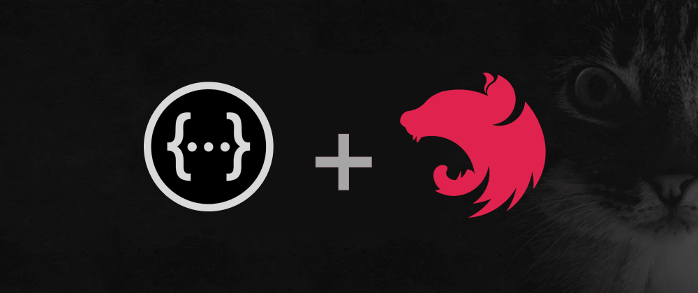
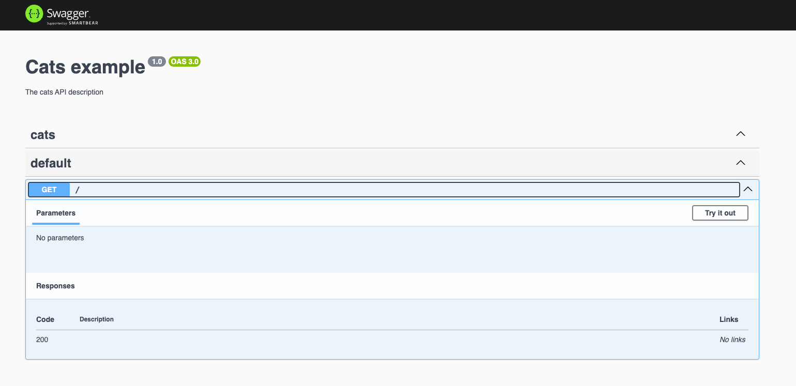
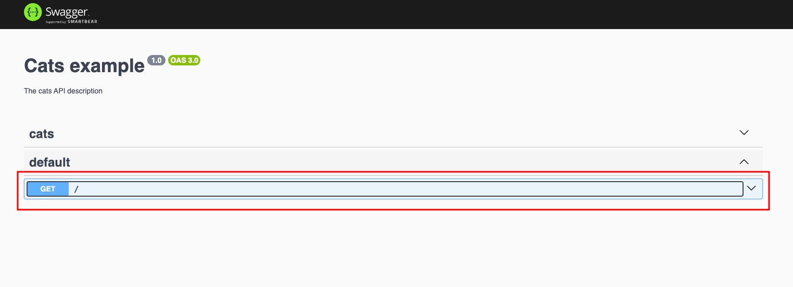
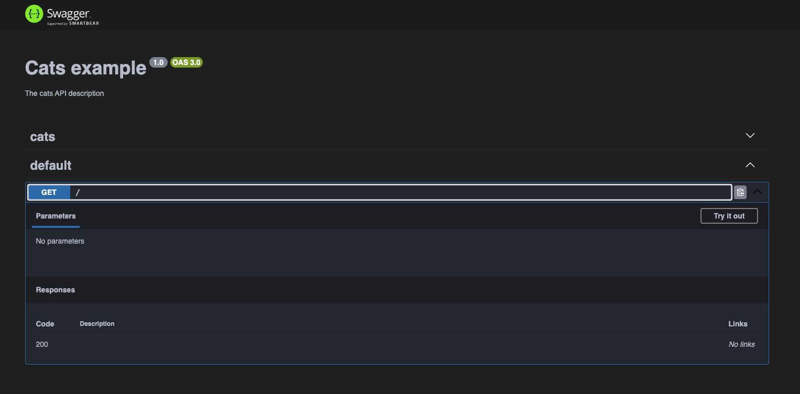
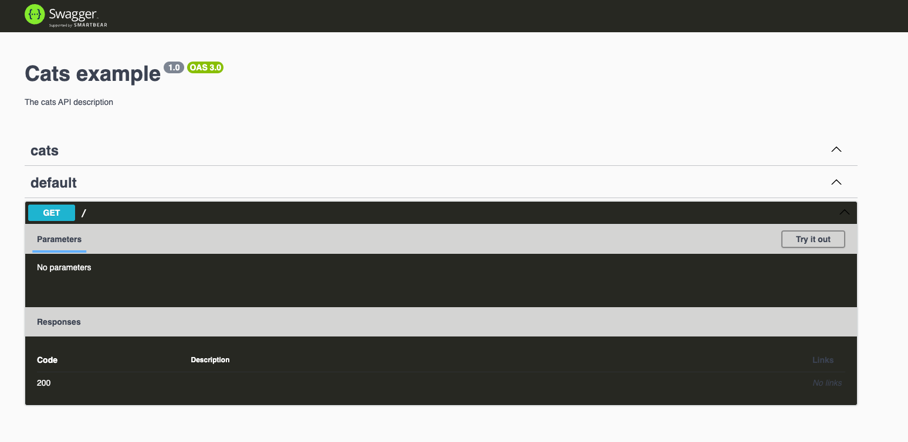

O tema padrão claro do [Swagger](https://swagger.io/) já incomodou você? Isso já me incomodou muito e hoje vou mostrar como deixar em Dark mode para quem utiliza o NestJS.

## O que é o Swagger?

Vou explicar de forma bem resumida, o Swagger é uma aplicação open source que facilita a documentação da sua API, fornece ao usuário que vai consumir sua API uma forma simples de usar sua rotas, ver os erros retornados, dados retornados entre outros. O Swagger utiliza o padrão da [OpenAPI](https://www.openapis.org/).

Por padrão o tema do SwaggerUi é branco:


Mas, como podemos deixar esse tema dark? Bom, existem duas formas de fazer isso usando NestJS, ainda não temos suporte nativamente do Swagger para isso (existe um PR aberto, para implementar essa opção, veja [aqui](https://github.com/swagger-api/swagger-ui/issues/5327)), mas até a data da publicação este post ainda não foi implementado.

Vamos criar um projeto com NestJS:

```ts
npm i -g @nestjs/cli
nest new swagger-dark-mode
```

Agora, vamos instalar e configurar o swagger no NestJS, conforme a [documentação](https://docs.nestjs.com/openapi/introduction):

```ts
npm install --save @nestjs/swagger
```

No fim, nosso `main.js` deve ficar assim:

```ts
import { NestFactory } from '@nestjs/core';
import { AppModule } from './app.module';
import { DocumentBuilder, SwaggerModule } from '@nestjs/swagger';

async function bootstrap() {
  const app = await NestFactory.create(AppModule);
  const config = new DocumentBuilder()
    .setTitle('Cats example')
    .setDescription('The cats API description')
    .setVersion('1.0')
    .addTag('cats')
    .build();
  const document = SwaggerModule.createDocument(app, config);
  SwaggerModule.setup('api', app, document);

  await app.listen(3000);
}
bootstrap();
```

Rodando o projeto com `npm run start:dev` e acessando a api (http://localhost:3000/api), temos essa tela:



Agora, vamos deixar em modo dark, como dito anteriormente, não existe o suporte nativo do swagger para dark mode, mas vamos injetar nosso CSS, para isso vamos ajustar as configs do swagger no nosso `main.ts`

```ts
import { NestFactory } from '@nestjs/core';
import { AppModule } from './app.module';
import {
  DocumentBuilder,
  SwaggerCustomOptions,
  SwaggerModule,
} from '@nestjs/swagger';

async function bootstrap() {
  const app = await NestFactory.create(AppModule);

  const config = new DocumentBuilder()
    .setTitle('Cats example')
    .setDescription('The cats API description')
    .setVersion('1.0')
    .addTag('cats')
    .build();
  const document = SwaggerModule.createDocument(app, config);

  const myCustom: SwaggerCustomOptions = {
    customSiteTitle: 'Swagger dark mode',
    customCss: ``,
    swaggerOptions: {
      docExpansion: 'none',
      apisSorter: 'alpha',
    },
  };

  SwaggerModule.setup('api', app, document, myCustom);

  await app.listen(3000);
}
bootstrap();
```

Separamos algumas configs em `myCustom`, o `SwaggerCustomOptions` nos permite informar algumas opções:

`customSiteTitle`: Alteramos o title da nossa documentação.
`customCss`: Aqui é onde vamos colocar nosso css personalizado.
`docExpansion`: Podemos determinar se cada rota abre expandido ou recolhido:

Conforme exemplo abaixo, isso facilita quando sua documentação possui muitas rotas.



`apisSorter`: Usando a opção `alpha`, vai ordenar as tags por ordem alfabética.

Existem muitas outras opções, você pode conferir acessando a tipagem do `SwaggerCustomOptions`.

## Custom CSS

Vamos ao css, vou deixar aqui um gist ([clicando aqui](https://gist.github.com/wiliamvj/066c27807cf1abbe9ce318cbab2b8681)), com o css que já deixa em dark mode, mas você pode editar como quiser, ou buscar temas já prontos.

Ficaria assim:

```ts
import { NestFactory } from '@nestjs/core';
import { AppModule } from './app.module';
import {
  DocumentBuilder,
  SwaggerCustomOptions,
  SwaggerModule,
} from '@nestjs/swagger';
import { css } from './swagger/custom-css';

async function bootstrap() {
  const app = await NestFactory.create(AppModule);

  const config = new DocumentBuilder()
    .setTitle('Cats example')
    .setDescription('The cats API description')
    .setVersion('1.0')
    .addTag('cats')
    .build();
  const document = SwaggerModule.createDocument(app, config);

  const myCustom: SwaggerCustomOptions = {
    customSiteTitle: 'Swagger dark mode',
    customCss: css,
    swaggerOptions: {
      docExpansion: 'none',
      apisSorter: 'alpha',
    },
  };

  SwaggerModule.setup('api', app, document, myCustom);

  await app.listen(3000);
}
bootstrap();
```

Apenas importamos o nosso css e colocamos em `customCss` e pronto, dark mode funcionando:



Com o css, podemos alterar qualquer coisa do layout padrão.

## Swagger Themes

Existe outra forma de utilizar o dark mode no swagger com NestJS, usando o pacote [swagger-themes](https://www.npmjs.com/package/swagger-themes#use-with-nestjs).

Veja como ficaria o nosso `main.ts`, utilizar esse pacote:

```ts
import { NestFactory } from '@nestjs/core';
import { AppModule } from './app.module';
import {
  DocumentBuilder,
  SwaggerCustomOptions,
  SwaggerModule,
} from '@nestjs/swagger';
import { SwaggerTheme } from 'swagger-themes';

async function bootstrap() {
  const app = await NestFactory.create(AppModule);

  const config = new DocumentBuilder()
    .setTitle('Cats example')
    .setDescription('The cats API description')
    .setVersion('1.0')
    .addTag('cats')
    .build();
  const document = SwaggerModule.createDocument(app, config);

  const theme = new SwaggerTheme('v3');

  const myCustom: SwaggerCustomOptions = {
    customSiteTitle: 'Swagger dark mode',
    customCss: theme.getBuffer('dark'),
    swaggerOptions: {
      docExpansion: 'none',
      apisSorter: 'alpha',
    },
  };

  SwaggerModule.setup('api', app, document, myCustom);

  await app.listen(3000);
}
bootstrap();
```

Fica bem mais simples, basta instanciar o `SwaggerTheme` com `const theme = new SwaggerTheme('v3');` e depois no `customCss`, informar o tema desejado `theme.getBuffer('dark')`.

Temos algumas opções de temas como, _dark_, _monokai_, _material_ entre outros, veja as opções na documentação do [swagger-themes](https://www.npmjs.com/package/swagger-themes), veja como ficaria o _monokai_:



Mas se podemos usar o [swagger-theme](https://www.npmjs.com/package/swagger-themes), por que deveríamos alterar o CSS manualmente?

## Conclusão

Bom, alterando o CSS manualmente, temos o poder e liberdade de alterar o tema da forma que desejarmos, podemos alterar cores, logo, textos, entre outros, mas se você deseja apenas colocar um tema dark, usar o [swagger-theme](https://www.npmjs.com/package/swagger-themes) pode ser a forma mais fácil e rápida de fazer isso.
