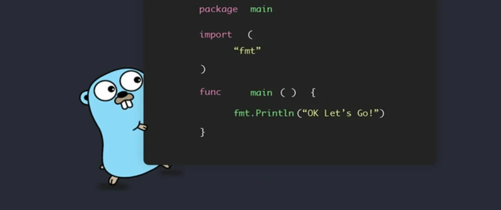

O pacote [fmt](https://pkg.go.dev/fmt) é um pacote padrão do Go e muito utilizado, porém para quem esta iniciando em Go pode parecer um pouco confuso.

## Afinal o que é o pacote fmt?

O pacote fmt (format) é utilizado para formatar os dados de entrada e saída, é muito utilizado para debugs, formatação, interação entre usuário e stdout entre outros. O pacote fmt é muito poderoso e existem muitas possibilidades, vamos abordar as formas mais comuns de utilizar esse pacote.

Como o Go utiliza tipagem forte, logar o valor no [stdout](<https://pt.wikipedia.org/wiki/Fluxos_padr%C3%A3o#:~:text=%C3%A9%20FILE%20*stdin%20.-,Sa%C3%ADda%20padr%C3%A3o%20(stdout),os%20programas%20precisam%20de%20sa%C3%ADda.>) não é como em JavaScript por exemplo, que utilizamos `console.log("Hello World!")` e colocamos praticamente qualquer tipo de dado, em Go para cada tipo de dado, tem seu formatador adequado.

Se você deseja apenas exibir o valor no terminal para fim de debug, você pode utilizar o Print, existe algumas variações:

- `Print`
- `Println`
- `Printf`

`fmt.Print` é o mais simples, apenas imprime no stdout o valor que for informado:

```go
package main

import "fmt"

func main() {
  t := "Hello World!"

  fmt.Print(t)
	fmt.Print(t)
}
```

Saida:

```bash
Hello World!Hello World!%
```

Como você pode perceber, fica um pouco estranho a formatação, mas podemos separar em outra linha, para isso usamos o `fmt.Prinltn`.

`fmt.Println`: Tem a mesma funcionalidade do `fmt.Print`, mas com quebra de linha, também podemos passar alguns parâmetros.

```go
package main

import "fmt"

func main() {
  t := "Hello World!"

  fmt.Println(t)
  fmt.Println(t)
}
```

Saida:

```bash
Hello World!
Hello World!
```

Como podemos ver, já ficou melhor a formatação, podemos passar mais valores:

```go
package main

import "fmt"

func main() {
  t := "Hello World!"
  p := "em GO"

  fmt.Println(t, p)
  fmt.Println(t)
}
```

Saida:

```bash
Hello World! em GO
Hello World!
```

`fmt.Printf`: Usamos o `fmt.Printf` quando queremos passar variáveis.

```go
package main

import "fmt"

func main() {
  p := "em GO"

  fmt.Printf("Hello Word! %s", p)
}
```

Saida:

```bash
Hello Word! em GO
```

Temos o basicamente o mesmo resultado do exemplo usando `fmt.Prinln` , mas agora podemos imprimir o valor da variável com mais controle, porém se utilizarmos da seguinte forma:

```go
package main

import "fmt"

func main() {
  p := "em GO"

  fmt.Printf("Hello Word! %s", p)
  fmt.Printf("Hello Word! %s", p)
}
```

Saida:

```bash
Hello Word! em GOHello Word! em GO
```

Temos o problema da formatação da linha, para isso podemos usar o `\n` isso faz com que a linha seja quebrada.

```go
func main() {
  p := "em GO"

  fmt.Printf("Hello Word! %s \n", p)
  fmt.Printf("Hello Word! %s", p)
}
```

## Formatadores

Mas afinal, o que significa o `%s`?

São formatadores muito utilizados no pacote fmt, eles determinam o tipo do dado que você deseja logar

`%s` - Vai retornar a string da variável

```go
func main() {
  p := "em GO"

  fmt.Printf("Hello Word! %s \n", p)
}
```

Saida:

```bash
Hello Word! em GO
```

Mas e se a minha variável `p` for um int? Nesse caso vai ficar assim:

```go
func main() {
  p := 10

  fmt.Printf("Hello Word! %s \n", p)
}
```

Saida:

```bash
Hello Word! %!s(int=10)
```

Desta forma não funciona, pois o `p` é um `int`, mas o `%s` só aceita strings, `%!s` significa que houve um erro ao tentar formatar.

`%v` - Este é um formatter de valor genérico. Ele pode ser usado para imprimir o valor de uma variedade de tipos de dados, incluindo strings, números, estruturas, slices e muito mais.

Usando o exemplo acima, se usarmos o `%v` vai funcionar perfeitamente:

```go
func main() {
  p := 10

  fmt.Printf("Hello Word! %s \n", p)
}
```

Saida:

```bash
Hello Word! 10
```

o fmt apenas troca o `%v` pelo valor do `p`.

`%d` - Para o nosso exemplo este seria o formatter mais adequado, ele é usado para informar que o formatter vai receber um tipo `int`.

```bash
func main() {
  p := 10

  fmt.Printf("Hello Word! %d \n", p)
}
```

Saida:

```bash
Hello Word! 10
```

`%f` - Este formatter é para tipo `float`

```bash
func main() {
  p := 10.5

  fmt.Printf("Hello Word! %f \n", p)
}
```

Saida:

```bash
Hello Word! 10.500000
```

Existem mais algumas coisas legais que podem ser feita com formatadores, digamos que deseja limitar o número de casas decimais do float, você pode fazer o seguinte:

```go
func main() {
  p := 10.5

  fmt.Printf("Hello Word! %.2f \n", p)
}
```

Saida:

```bash
Hello Word! 10.50
```

usando `%.2f` indica que queremos apenas 2 casas decimais.

Podemos também logar structs, veja um exemplo:

```go
type Person struct {
  Name string
}

func main() {
  p := Person{"John"}

  fmt.Printf("Hi! %s", p)
}
```

Saida:

```bash
Hi! {John}
```

Para structs geralmente usamos o `%v`, se quiser ter mais detalhes da struct, para fins de debug, você pode usar o formater `%#v`

```go
type Person struct {
  Name string
  Age  int
}

func main() {
  p := Person{"John", 28}

  fmt.Printf("Hi! %#v", p)
}
```

Saida:

```go
Hi! main.Person{Name:"John", Age:28}
```

Existem muitas opções de formatadores, você pode ver nas [docs](https://pkg.go.dev/fmt) as opções possíveis.

Digamos que você não quer colocar no stdout (logar) o valor, quer apenas concatenar as variáveis, é possível? Sim! você pode usar o `fmt.Sprint`

```go
func main() {
  n := "John Doe"
  p := fmt.Sprintf("Hi! %s", n)

  fmt.Println(p)
}
```

Saida:

```bash
Hi! John Doe
```

Estamos concatenando o valor de `n` com a string `Hi!`, depois “logamos” usando o `fmt.Println`.

O `fmt.Sprint` tem a mesma funcionalidade do `fmt.Print`, porém não é enviado para o stdout.

Uma coisa bacana é que o `fmt.Sprint` transforma tudo em string, seria equivalente ao `toString` do JavaScript.

Mas o fmt possui outras funcionalidades, como `fmt.ErrorF` que além de logar um erro, retorna o erro.

```go
package main

import (
  "encoding/json"
  "errors"
  "fmt"
)

type Person struct {
  Name string
}

func ReturnPerson() (*Person, error) {
  var person Person
  err := json.Unmarshal([]byte(`{"name": "John"}`), &person)
  if err != nil {
    return nil, err
  }
  return &person, nil
}

func main() {
  _, err := ReturnPerson()
  if err != nil {
    fmt.Println("error to return person", err)
    return
  }
}
```

No exemplo acima, a função `ReturnPerson()` retorna um ponteiro de `Person` ou `error`, mas não temos detalhes de log do erro, precisaríamos colocar antes do return, para detalhar melhor o log:

```go
func main() {
  _, err := ReturnPerson()
  if err != nil {
    fmt.Println("error to return person", err)
    return
  }
}
```

Se utilizarmos o `fmt.Errorf`, podemos simplificar o código:

```go
func ReturnPerson() (*Person, error) {
  var person Person
  err := json.Unmarshal([]byte(`"name": "John"}`), &person) // json errado para capturar um erro
  if err != nil {
    return nil, fmt.Errorf("error to unmarshal person: %w", err)
  }
  return &person, nil
}

func main() {
  _, err := ReturnPerson()
  if err != nil {
    return
  }
}
```

Colocando o `fmt.Errorf` no retorno do erro da função `ReturnPerson()` , vamos ter o erro com uma mensagem mais clara e também o erro original, ao utilizar o `ReturnPerson()` não precisamos colocar mais detalhes, apenas tratar o erro ou apenas fazer um `return` .

É claro que o pacote fmt não é recomendado para criar logs em produção, ele afeta consideravelmente a performance do seu código, para isso é recomendado utilizar o pacote padrão para [log](https://pkg.go.dev/log) do Go, pacotes de terceiros como o [zap log](https://github.com/uber-go/zap) da Uber, que é muito utilizado para fazer logs ou até o recém chegado no Go o [slog](https://pkg.go.dev/log/slog).

## Considerações finais

Nesses exemplos simples você pode perceber como é simples entender o pacote fmt do Go, mesmo que o uso dos formatadores podem ser confusos no inicio, mas com o tempo fica muito claro.
É um dos pacotes padrão do Go mais utilizados e possui muitos recursos que facilitam sua vida no dia a dia, entender seu funcionamento básico pode te ajudar muito.

Até a próxima!
