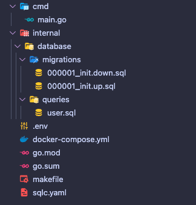

## Introduction

Dealing with SQL often becomes complicated and tiring, dealing with so many queries, indexing, performance, security, transactions and everything that involves the use of SQL, with this in mind, the use of ORM is increasingly being adopted, aiming to make our lives easier.

The use of ORM is generally recommended due to its practicality of use, agility, delivery of safer and faster queries (not always), however not everything is perfect, the use of ORM ends up limiting us when it is necessary to make a more complex query, The vast majority of ORMs do not offer good performance with complex queries or even do not have support, thus requiring the use of SQL in the ORM itself.

In Go, the community encourages the use of ORM, although [GORM](https://gorm.io/) is an excellent ORM, its use may make sense in small applications that do not occur in a more complex query.

## Using it in Go then?

We can use [GORM](https://gorm.io/), as I mentioned, we can make our queries and just use the database driver, like [pq](github.com/lib/pq) for PostgreSQL (it's the most laborious option, but with full control), but as the purpose of the post is to talk about SQLC, let's use it.

## What is SQLC?

[SQLC](https://sqlc.dev/) is a package to facilitate the execution and manipulation of our database queries, it automatically generates the code according to the SQL query we write.

SQLC does the most boring part for us, which is receiving data from the database and passing it to our struct, for example, and already generates the interfaces for us.

It may seem strange, will it generate Go code? It can't be good, I thought the same way, until I used it.

## Installing SQLC

We need to install SQLC on our machine, but like any GO package, it's very simple, see how in the [docs](https://docs.sqlc.dev/en/stable/overview/install.html), remembering that for while SQLC only supports PostgreSQL, MySQL and SQLite.

## Creating the project

Let's go to the code, for this we will create a simple project:



Let's just have our `main.go`, which will initiate the connection with the PostgreSQL database and make our application run:

```go
  package main

  import (
    "database/sql"
    "fmt"
    "log"
    "os"

    "github.com/joho/godotenv"
    _ "github.com/lib/pq"
  )

  func main() {
    // load .env file
    godotenv.Load()

    postgresURI := os.Getenv("DATABASE_URL")
    db, err := sql.Open("postgres", postgresURI)
    if err != nil {
      log.Panic(err)
    }
    err = db.Ping()
    if err != nil {
      db.Close()
      log.Panic(err)
    }

    fmt.Println("Connected to database")

    // keep the program running
    select {}
  }
```

In the **internal/database** folder, the `queries.sql` file will be where we will leave our queries.
In the **internal/database/migrations** folder, we will leave the migration that will create our tables, I already made a post on how to use golang-migrate, see [here](https://wiliamvj.com/posts/migrations-golang/).

To run the migrations, make sure your PostgreSQL database is running on port `5432` (I will leave a `docker-compose` file in the repository), then run the migration with:

```bash
  make migrate_up
```

To undo the migration run:

```bash
  make migrate_down
```

## Running SQLC

Finally, let's generate our query and run SQLC, but first just check if you are actually installing SQLC on your machine with the command:

```bash
  sqlc version
```

If you receive a version `v1.20.0` for example, everything is fine (it doesn't have to be the same version as the example).

We first need to create an SLQC config file, called `sqlc.yaml` in the root of the project, in it we will define the database we will use, folder paths and other configs.

```yaml
version: '2'
sql:
  - schema: 'internal/database/migrations'
    queries: 'internal/database/queries'
    engine: 'postgresql'
    gen:
      go:
        package: 'db'
        out: 'internal/database/db'
```

- `schema`: where our table structure file is located in the database.
- `queries`: Folder with the queries we are going to create.
- `out`: This is where SQLC will generate your code.

Let's create a query called `user.sql` that adds a user to the database, see how it looks using SQLC:

```sql
  -- name: CreateOneUser :exec
  INSERT INTO users (id, name, email, password, created_at, updated_at)
  VALUES ($1, $2, $3, $4, $5, $6);

```

O SQLC utiliza anotações para as queries, veja:

- `--name`: Indicates the name of the query, it will be used as the name of the interface.
- `exec`: Indicates that we want to execute the query, there are several, see [here](https://docs.sqlc.dev/en/stable/reference/query-annotations.html) in the docs.

Let's create the files with the SQLC command:

```bash
  sqlc generate
```

You will notice that a simple call **db** will be generated within the **database** folder, this folder is for the exclusive use of SQLC and should not be changed.

SQLC created 3 files, let's see them:

`db.go`: This is where SQLC handles the database connection, transactions and queries.

```go
  type DBTX interface {
    ExecContext(context.Context, string, ...interface{}) (sql.Result, error)
    PrepareContext(context.Context, string) (*sql.Stmt, error)
    QueryContext(context.Context, string, ...interface{}) (*sql.Rows, error)
    QueryRowContext(context.Context, string, ...interface{}) *sql.Row
  }

  func New(db DBTX) *Queries {
    return &Queries{db: db}
  }

  type Queries struct {
    db DBTX
  }

  func (q *Queries) WithTx(tx *sql.Tx) *Queries {
    return &Queries{
      db: tx,
    }
  }
```

`models.go`: This is where SQLC creates our models, according to the structure of our database.

```go
  type Post struct {
    ID        string
    AuthorID  string
    Title     string
    Body      string
    CreatedAt time.Time
    UpdatedAt time.Time
  }

  type User struct {
    ID        string
    Name      string
    Email     string
    Password  string
    CreatedAt time.Time
    UpdatedAt time.Time
  }
```

`user.sql.go`: This is where SQLC creates the functions that we are going to execute and our structs to send the parameters:

```go
  const createOneUser = `-- name: CreateOneUser :exec
  INSERT INTO users (id, name, email, password, created_at, updated_at)
  VALUES ($1, $2, $3, $4, $5, $6)
  `

  type CreateOneUserParams struct {
    ID        string
    Name      string
    Email     string
    Password  string
    CreatedAt time.Time
    UpdatedAt time.Time
  }

  func (q *Queries) CreateOneUser(ctx context.Context, arg CreateOneUserParams) error {
    _, err := q.db.ExecContext(ctx, createOneUser,
      arg.ID,
      arg.Name,
      arg.Email,
      arg.Password,
      arg.CreatedAt,
      arg.UpdatedAt,
    )
    return err
  }
```

SQLC also leaves the query that will be executed, in our case in `createOneUser`.

## Creating a record with SQLC

Let's save a user using SQLC, in our case we will save the user when starting our application, but in real use, it would be created when receiving a `POST` request from a controller for example.

Let's create inside the **internal** folder, a folder called **handler** and the file called `user.go`:

```go
  package handler

  import (
    "context"
    "time"

    "github.com/google/uuid"
    "github.com/wiliamvj/golang-sqlc/internal/database/db"
  )

  type UserHandler struct {
    Queries *db.Queries
  }

  func CreateUser(ctx context.Context, h *UserHandler) error {
    err := h.Queries.CreateOneUser(ctx, db.CreateOneUserParams{
      ID:        uuid.New().String(),
      Name:      "John Doe",
      Email:     "john.doe@email.com",
      Password:  "123456",
      CreatedAt: time.Now(),
      UpdatedAt: time.Now(),
    })
    if err != nil {
      fmt.Println("Error creating user", err)
      return err
    }
    fmt.Println("User created")
    return nil
  }
```

We create a struct, which will receive a pointer to the queries created by SQLC, then we use the `CreateOneUser` function created by SQLC and pass the expected parameters, this is enough to save it in the database, let's now call `CreateUser` in `main .go`, simulating a request.

```go
   // start slqc queries
  slqcQueries := db.New(dbConnection)
  q := handler.UserHandler{
    Queries: slqcQueries,
  }
  handler.CreateUser(context.Background(), &q)
```

We start in SQLC by passing the connection to the database to `db.New`, then we start the `UserHandler` struct and finally we call the `CreateUser` function.

`main.go` complete:

```go
  func main() {
    // load .env file
    godotenv.Load()

    postgresURI := os.Getenv("DATABASE_URL")
    dbConnection, err := sql.Open("postgres", postgresURI)
    if err != nil {
      log.Panic(err)
    }
    err = dbConnection.Ping()
    if err != nil {
      dbConnection.Close()
      log.Panic(err)
    }

    fmt.Println("Connected to database")

    // start slqc queries
    slqcQueries := db.New(dbConnection)
    q := handler.UserHandler{
      Queries: slqcQueries,
    }
    handler.CreateUser(context.Background(), &q)

    // keep the program running
    select {}
  }
```

Now if you start the application, we will receive the `User created` log:`:

```bash
  Connected to database
  User created
```

If we try to run again, we will receive an error, this is because our email is unique in the database, and already exists, the correct thing is before saving in the database, check if there is already a record with the same email, but we won't do this for now.

```bash
  Connected to database
  Error creating user pq: duplicate key value violates unique constraint "users_email_key"
```

Now, let's save our post, let's create the user and then create the post, let's do this to exemplify a problem we will face:

Creating query `post.sql` in the **queries** folder to save the post:

```sql
  -- name: CreateOnePost :exec
  INSERT INTO posts (id, title, body, author_id, created_at, updated_at)
  VALUES ($1, $2, $3, $4, $5, $6);
```

Let's run the sqlc command again to update the files:

```bash
  sqlc generate
```

With the files updated, let's create the post within `user.go`

```go
  type UserHandler struct {
    Queries *db.Queries
  }

  func CreateUser(ctx context.Context, h *UserHandler) error {
    userID := uuid.New().String()

    err := h.Queries.CreateOneUser(ctx, db.CreateOneUserParams{
      ID:        userID,
      Name:      "John Doe",
      Email:     "john.doe@email.com",
      Password:  "123456",
      CreatedAt: time.Now(),
      UpdatedAt: time.Now(),
    })
    if err != nil {
      fmt.Println("Error creating user", err)
      return err
    }
    fmt.Println("User created")

    // create post
    err = h.Queries.CreateOnePost(ctx, db.CreateOnePostParams{
      ID:        uuid.New().String(),
      Title:     "SLQC with Golang",
      Body:      "This is a post about SLQC with Golang",
      AuthorID:  userID,
      CreatedAt: time.Now(),
      UpdatedAt: time.Now(),
    })
    if err != nil {
      fmt.Println("Error creating post", err)
      return err
    }
    fmt.Println("Post created")
    return nil
  }
```

We did the same process when saving the user, but notice that I separated the user id into a variable called `userID`, as we need the id to save the post, since we have a one-to-many relationship, where a user can having many posts and a post has only one user, is just an example.

When running the project again, we will be successful in saving the user and the post, but first remember to delete all records, as we do not validate if there are already user records with the same email, it will give an error.

```bash
  Connected to database
  User created
  Post created
```

Our user and post were created successfully, but when we create "cascade" records, if one of them fails for some reason the others can still be created, let's see how to solve this with transactions.

## Transactions

Transactions are a set of operations that are treated as a single operation, in our example when creating a user we then create a post, the two operations depend on each other, so we use transactions.

A transaction can only succeed or fail, if it succeeds, we save all the records, in our example a user and a post will be created, but if it fails, no records will be created, if the post creation fails, a `will be done. rollback` in previous operations, i.e. the user will not be saved. This ensures that all operations performed are written successfully, but if it fails, no operations are saved.

SQLC allows us to work with this, let's take an example, imagine that whenever you create a user it is mandatory to create a post, but what if the post creation fails? Let's change `user.go`, forcing an error, we will always try to save a post with the same `id`, on the second attempt it will speak, as we will have a record with the same `id` in the database.

```go
  func CreateUser(ctx context.Context, h *UserHandler) error {
    userID := uuid.New().String()
    userEmail := fmt.Sprintf("john.doe-%v@email.com", time.Now().Unix())

    err := h.Queries.CreateOneUser(ctx, db.CreateOneUserParams{
      ID:        userID,
      Name:      "John Doe",
      Email:     userEmail,
      Password:  "123456",
      CreatedAt: time.Now(),
      UpdatedAt: time.Now(),
    })
    if err != nil {
      fmt.Println("Error creating user", err)
      return err
    }
    fmt.Println("User created")

    // create post
    err = h.Queries.CreateOnePost(ctx, db.CreateOnePostParams{
      ID:        "093eb8c7-d09d-464d-aa55-99ee7c1b7488",
      Title:     "SLQC with Golang",
      Body:      "This is a post about SLQC with Golang",
      AuthorID:  userID,
      CreatedAt: time.Now(),
      UpdatedAt: time.Now(),
    })
    if err != nil {
      fmt.Println("Error creating post", err)
      return err
    }
    fmt.Println("Post created")
    return nil
  }
```

We left the `id` of the post always the same, I also added `userEmail` to generate a unique email whenever we start our application, we received the error on the second attempt:

```bash
  Connected to database
  User created
  Error creating post pq: duplicate key value violates unique constraint "posts_pkey"
```

But if you notice in the `users` table the user is always created, let's use transactions.

## Using transactions with SQLC

To use transactions, we will inject a function into SQLX that executes our queries, looking like this:

```go
  func runWithTX(ctx context.Context, c *sql.DB, fn func(*db.Queries) error) error {
    tx, err := c.BeginTx(ctx, nil)
    if err != nil {
      return err
    }
    q := db.New(tx)
    err = fn(q)
    if err != nil {
      if errRb := tx.Rollback(); errRb != nil {
        return fmt.Errorf("error on rollback: %v, original error: %w", errRb, err)
      }
      return err
    }
    return tx.Commit()
  }
```

This function will be the one we will use to execute queries with transactions, we pass the connection to the database, we start the connection with transaction with `BeginTx`, passing the context and `nil`, `nil` refers to _isolation level_ (not we will address it at the moment, but see [here](https://www.postgresql.org/docs/current/transaction-iso.html) what it is about, we start `db.New(tx)`, as we have already seen , but now using transactions, then we execute our query, if there is an error we do `tx.Rollback()`, if there is no error `tx.Commit()` ending everything.

For this to work, we need to update the `CreateUser` function:

```go
  func CreateUser(ctx context.Context, h *UserHandler) error {
    userID := uuid.New().String()
    userEmail := fmt.Sprintf("john.doe-%v@email.com", time.Now().Unix())

    err := runWithTX(ctx, h.Db, func(q *db.Queries) error {
      var err error
      err = q.CreateOneUser(ctx, db.CreateOneUserParams{
        ID:        userID,
        Name:      "John Doe",
        Email:     userEmail,
        Password:  "123456",
        CreatedAt: time.Now(),
        UpdatedAt: time.Now(),
      })
      if err != nil {
        fmt.Println("Error creating user", err)
        return err
      }
      fmt.Println("User created")

      // create post
      err = q.CreateOnePost(ctx, db.CreateOnePostParams{
        ID:        "193eb8c7-d09d-464d-aa55-99ee7c1b7488",
        Title:     "SLQC with Golang",
        Body:      "This is a post about SLQC with Golang",
        AuthorID:  userID,
        CreatedAt: time.Now(),
        UpdatedAt: time.Now(),
      })
      if err != nil {
        fmt.Println("Error creating post", err)
        return err
      }
      fmt.Println("Post created")
      return nil
    })
    if err != nil {
      fmt.Println("Error creating user and post, roll back applied", err)
      return err
    }
    return nil
  }
```

Now we use `runWithTX`, and when using sqlc queries, we no longer use `h.Queries`, we use `q`, which comes from the function we injected, thus executing using transactions, now if you run the application, see the mistake:

```bash
  Connected to database
  User created
  Error creating post pq: duplicate key value violates unique constraint "posts_pkey"
  Error creating user and post, roll back applied pq: duplicate key value violates unique constraint "posts_pkey"
```

In the log `creating user and post, roll back applied`, you can see that the transactions ran, if you look in the database, no user is now saved due to the error in creating the post, if you remove the `id` of the post which is fixed, and put the
`uuid.New().String()`, and run the application, everything will work normally.

We only covered a simple example about transactions, it is a more complex subject, I will leave the sqlc [documentation](https://docs.sqlc.dev/en/stable/howto/transactions.html) about transactions.

## Final considerations

As you can see, using sqlc gives us full control over our SQL, sqlc is also quite simple to use. If you don't want to use ORM, using sqlc can be an option, it removes the most manual work of transforming data known as "data hydration".

SQL has several "tricks" that can facilitate data manipulation such as [Overriding types](https://docs.sqlc.dev/en/stable/howto/overrides.html), [Naming parameters](https:// docs.sqlc.dev/en/stable/howto/named_parameters.html) and many others, it's worth looking at the docs.

## Repository link

project [repository](https://github.com/wiliamvj/golang-sqlc)

[Gopher credits](https://github.com/egonelbre/gophers)
