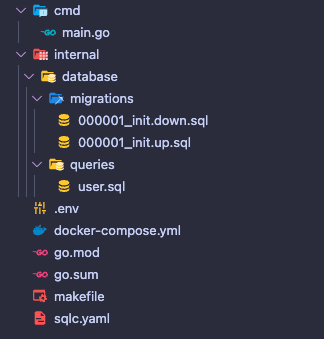

## Introdução

Lidar com o SQL muitas vezes se torna complicado e cansativo, lidar com tantas queries, indexações, performance, segurança, transações e tudo que envolve o uso do SQL, pensando nisso cada vez mais é adotado o uso de ORM, visando facilitar nossas vidas.

O Uso de ORM geralmente é recomendado devido sua a praticidade de uso, agilidade, entrega de queries mais seguras e rápidas (nem sempre), porém nem tudo é perfeito, o uso de ORM acaba nos limitando quando é preciso fazer uma query mais complexa, a grande maioria dos ORM não oferecem uma boa performance com queries complexas ou até mesmo não tem suporte, precisando então usar SQL no próprio ORM.

Em Go, a comunidade desencoraja o uso de ORM, apesar do [GORM](https://gorm.io/) ser um excelente ORM, o uso dele pode sim fazer sentido em pequenas aplicações que não necessitam de uma query mais complexa.

## O que ultilizar com Go então?

Podemos usar o [GORM](https://gorm.io/), como mencionei, podemos fazer nossas queries e usar apenas o driver do banco de dados, como o [pq](github.com/lib/pq) para PostgreSQL (é a opção mais trabalhosa, porém com controle total), mas como o intuito do post é falar sobre o SQLC, vamos usar ele.

## O que é o SQLC?

[SQLC](https://sqlc.dev/) é um pacote para facilitar a execução e manipulação das nossas consultas ao banco, ele gera o código automaticamente de acordo com a query SQL que escrevemos.

O SQLC faz a parte mais chata para nós, que é receber os dados do banco e passar para nossa struct por exemplo, e já gera as interfaces para nós.

Pode parecer estranho, vai gerar código Go? Não deve ser bom, eu pensava da mesma forma, até utilizar.

## Instalando o SQLC

Precisamos instalar o SQLC na nossa máquina, mas como qualquer pacote em GO, é bem simples, veja como nas [docs](https://docs.sqlc.dev/en/stable/overview/install.html), lembrando que por enquanto o SQLC tem suporte apenas a PostgreSQL, MySQL e SQLite.

## Criando o projeto

Vamos ao código, para isso vamos criar um projeto simples:



Vamos apenas ter nosso `main.go`, que vai iniciar a conexão com o banco PostgreSQL e fazer nossa aplicação rodar:

```go
  package main

  import (
    "database/sql"
    "fmt"
    "log"
    "os"

    "github.com/joho/godotenv"
    _ "github.com/lib/pq"
  )

  func main() {
    // load .env file
    godotenv.Load()

    postgresURI := os.Getenv("DATABASE_URL")
    db, err := sql.Open("postgres", postgresURI)
    if err != nil {
      log.Panic(err)
    }
    err = db.Ping()
    if err != nil {
      db.Close()
      log.Panic(err)
    }

    fmt.Println("Connected to database")

    // keep the program running
    select {}
  }
```

Na pasta **internal/database**, no arquivo `queries.sql` vai ser onde vamos deixar nossas queries.
Na pasta **internal/database/migrations**, vamos deixar a migration que vai criar as nossas tabelas, já fiz um post de como usar o golang-migrate, veja [aqui](https://wiliamvj.com/posts/migrations-golang/).

Para rodar as migrations, verifique se o seu banco PostgreSQL está rodando na porta `5432` (vou deixar um arquivo `docker-compose` no repositório), depois rode a migration com:

```bash
  make migrate_up
```

para desfazer a migration rode:

```bash
  make migrate_down
```

## Executando o SQLC

Finalmente, vamos gerar nossa query e rodar o SQLC, mas antes só verifique se está realmente instalando o SQLC na sua máquina com o comando

```bash
  sqlc version
```

Se receber uma versão `v1.20.0` por exemplo, está tudo certo (não precisa ser a mesma versão do exemplo).

Precisamos antes criar um arquivo de config do SLQC, chamado `sqlc.yaml` na raiz do projeto, nele vamos definir o banco que vamos usar, caminho das pastas e outras configs.

```yaml
version: "2"
sql:
    - schema: "internal/database/migrations"
      queries: "internal/database/queries"
      engine: "postgresql"
      gen:
          go:
              package: "db"
              out: "internal/database/db"
```

- `schema`: onde fica nosso arquivo da estrutura da nossa tabela no banco de dados.
- `queries`: Pasta com as queries que vamos criar.
- `out`: Aqui é onde o SQLC vai gerar seu código.

Vamos criar uma query chamada `user.sql` que adiciona um usuário no banco, veja como fica usando o SQLC:

```sql
  -- name: CreateOneUser :exec
  INSERT INTO users (id, name, email, password, created_at, updated_at)
  VALUES ($1, $2, $3, $4, $5, $6);

```

O SQLC utiliza anotações para as queries, veja:

- `--name`: Indica o nome da query, será usado como o nome da interface.
- `exec`: Indica que queremos executar a query, existem várias, veja [aqui](https://docs.sqlc.dev/en/stable/reference/query-annotations.html) nas docs.

Vamos criar os arquivos com o comando do SQLC:

```bash
  sqlc generate
```

Você vai perceber que vai ser gerado uma basta chamada **db** dentro da pasta **database**, essa pasta é de uso exclusivo do SQLC e não deve ser alterada.

O SQLC criou 3 arquivos, vamos ver eles:

`db.go`: Aqui é onde o SQLC lida com a conexão do banco, transactions e as queries.

```go
  type DBTX interface {
    ExecContext(context.Context, string, ...interface{}) (sql.Result, error)
    PrepareContext(context.Context, string) (*sql.Stmt, error)
    QueryContext(context.Context, string, ...interface{}) (*sql.Rows, error)
    QueryRowContext(context.Context, string, ...interface{}) *sql.Row
  }

  func New(db DBTX) *Queries {
    return &Queries{db: db}
  }

  type Queries struct {
    db DBTX
  }

  func (q *Queries) WithTx(tx *sql.Tx) *Queries {
    return &Queries{
      db: tx,
    }
  }
```

`models.go`: Aqui é onde o SQLC cria os nossos models, de acordo com a estrutura do nosso banco.

```go
  type Post struct {
    ID        string
    AuthorID  string
    Title     string
    Body      string
    CreatedAt time.Time
    UpdatedAt time.Time
  }

  type User struct {
    ID        string
    Name      string
    Email     string
    Password  string
    CreatedAt time.Time
    UpdatedAt time.Time
  }
```

`user.sql.go`: Aqui é onde o SQLC cria as funções que vamos executar e nossas structs para envio dos parâmetros:

```go
  const createOneUser = `-- name: CreateOneUser :exec
  INSERT INTO users (id, name, email, password, created_at, updated_at)
  VALUES ($1, $2, $3, $4, $5, $6)
  `

  type CreateOneUserParams struct {
    ID        string
    Name      string
    Email     string
    Password  string
    CreatedAt time.Time
    UpdatedAt time.Time
  }

  func (q *Queries) CreateOneUser(ctx context.Context, arg CreateOneUserParams) error {
    _, err := q.db.ExecContext(ctx, createOneUser,
      arg.ID,
      arg.Name,
      arg.Email,
      arg.Password,
      arg.CreatedAt,
      arg.UpdatedAt,
    )
    return err
  }
```

O SQLC também deixa a query que vai ser executada, no nosso caso em `createOneUser`.

## Criando um registro com SQLC

Vamos salvar um usuário com uso do SQLC, no nosso caso vamos salvar o usuário quando iniciar nossa aplicação, mas em uso real, seria criado quando receber uma requisição `POST` de um controller por exemplo.

Vamos criar dentro da pasta **internal**, uma pasta chamada **handler** e o arquivo chamado `user.go`:

```go
  package handler

  import (
    "context"
    "time"

    "github.com/google/uuid"
    "github.com/wiliamvj/golang-sqlc/internal/database/db"
  )

  type UserHandler struct {
    Queries *db.Queries
  }

  func CreateUser(ctx context.Context, h *UserHandler) error {
    err := h.Queries.CreateOneUser(ctx, db.CreateOneUserParams{
      ID:        uuid.New().String(),
      Name:      "John Doe",
      Email:     "john.doe@email.com",
      Password:  "123456",
      CreatedAt: time.Now(),
      UpdatedAt: time.Now(),
    })
    if err != nil {
      fmt.Println("Error creating user", err)
      return err
    }
    fmt.Println("User created")
    return nil
  }
```

Criamos uma struct, que vai receber um ponteiro das queries criadas pelo SQLC, depois usamos a função `CreateOneUser` criada pelo SQLC e passamos os parâmetros esperados, isso é o suficiente para salvar no banco, vamos agora chamar o `CreateUser` no `main.go`, simulando uma requisição.

```go
   // start slqc queries
  slqcQueries := db.New(dbConnection)
  q := handler.UserHandler{
    Queries: slqcQueries,
  }
  handler.CreateUser(context.Background(), &q)
```

Iniciamos no SQLC passando para o `db.New` a conexão com o banco, depois iniciamos a struct `UserHandler` e por fim chamamos a função `CreateUser`.

`main.go` completo:

```go
  func main() {
    // load .env file
    godotenv.Load()

    postgresURI := os.Getenv("DATABASE_URL")
    dbConnection, err := sql.Open("postgres", postgresURI)
    if err != nil {
      log.Panic(err)
    }
    err = dbConnection.Ping()
    if err != nil {
      dbConnection.Close()
      log.Panic(err)
    }

    fmt.Println("Connected to database")

    // start slqc queries
    slqcQueries := db.New(dbConnection)
    q := handler.UserHandler{
      Queries: slqcQueries,
    }
    handler.CreateUser(context.Background(), &q)

    // keep the program running
    select {}
  }
```

Agora se iniciar a aplicação, vamos receber o log `User created`:

```bash
  Connected to database
  User created
```

Se tentar rodar novamente, vamos receber um erro, isso porque nosso e-mail é único no banco, e já existe, o correto é antes de salvar no banco, verificar se já existe um registro com o mesmo e-mail, mas não vamos fazer isso por enquanto.

```bash
  Connected to database
  Error creating user pq: duplicate key value violates unique constraint "users_email_key"
```

Agora, vamos salvar nosso post, vamos criar o usuário e logo em seguida criar o post, vamos fazer isso para exemplificar um problema que vamos enfrentar:

Criando query `post.sql`na pasta **queries** para salvar o post:

```sql
  -- name: CreateOnePost :exec
  INSERT INTO posts (id, title, body, author_id, created_at, updated_at)
  VALUES ($1, $2, $3, $4, $5, $6);
```

Vamos rodar novamente o comando do sqlc para atualizar os arquivos:

```bash
  sqlc generate
```

Com os arquivos atualizados, vamos criar o post dentro do `user.go`

```go
  type UserHandler struct {
    Queries *db.Queries
  }

  func CreateUser(ctx context.Context, h *UserHandler) error {
    userID := uuid.New().String()

    err := h.Queries.CreateOneUser(ctx, db.CreateOneUserParams{
      ID:        userID,
      Name:      "John Doe",
      Email:     "john.doe@email.com",
      Password:  "123456",
      CreatedAt: time.Now(),
      UpdatedAt: time.Now(),
    })
    if err != nil {
      fmt.Println("Error creating user", err)
      return err
    }
    fmt.Println("User created")

    // create post
    err = h.Queries.CreateOnePost(ctx, db.CreateOnePostParams{
      ID:        uuid.New().String(),
      Title:     "SLQC with Golang",
      Body:      "This is a post about SLQC with Golang",
      AuthorID:  userID,
      CreatedAt: time.Now(),
      UpdatedAt: time.Now(),
    })
    if err != nil {
      fmt.Println("Error creating post", err)
      return err
    }
    fmt.Println("Post created")
    return nil
  }
```

Fizemos o mesmo processo ao salvar o usuário, mas perceba que separei o id do usuário en uma variável chamada `userID`, pois precisamos do id para salvar o post, uma vez que temos um relacionamento one-to-many, onde um usuário pode ter muitos posts e um post tem apenas 1 usuário, é apenas um exemplo.

Ao rodar o projeto novamente, vamos ter sucesso ao salvar o usuário e o post, mas antes lembre-se de apagar todos os registros, como não validamos se já existe registros de usuário com mesmo e-mail, vai dar erro.

```bash
  Connected to database
  User created
  Post created
```

Nosso usuário e nosso post foram criados com sucesso, porém quando criamos registros em "cascata", se um deles falhar por algum motivo os demais ainda podem ser criados, vamos ver como resolver isso com transactions.

## Transactions

As transactions são um conjunto de operações que são tratadas como uma única operação, no nosso exemplo ao criar um usuário em seguida já criamos um post, as duas operações depende uma da outra, então usamos as transações.

Uma transação só pode ter sucesso ou falhar, se tiver sucesso, salvamos todos os registros, em nosso exemplo será criado um usuário e um post, mas se falhar, não será criado nenhum registros, caso a criação do post falhe, será feito um `rollback` nas operações anteriores, ou seja o usuário não será salvo. Isso garante que todas as operações realizadas sejam escritas com sucesso, mas se falhar nenhuma operação é salva.

O SQLC nos permite trabalhar com isso, vamos a um exemplo, imagine que sempre que criar um usuário seja obrigatório criar um post, mas e se a criação do post falhar? Vamos alterar o `user.go`, forçando um erro, vamos sempre tentar salvar um post com o mesmo `id`, na segunda tentativa já vai falar, pois teremos no banco um registro com o mesmo `id`.

```go
  func CreateUser(ctx context.Context, h *UserHandler) error {
    userID := uuid.New().String()
    userEmail := fmt.Sprintf("john.doe-%v@email.com", time.Now().Unix())

    err := h.Queries.CreateOneUser(ctx, db.CreateOneUserParams{
      ID:        userID,
      Name:      "John Doe",
      Email:     userEmail,
      Password:  "123456",
      CreatedAt: time.Now(),
      UpdatedAt: time.Now(),
    })
    if err != nil {
      fmt.Println("Error creating user", err)
      return err
    }
    fmt.Println("User created")

    // create post
    err = h.Queries.CreateOnePost(ctx, db.CreateOnePostParams{
      ID:        "093eb8c7-d09d-464d-aa55-99ee7c1b7488",
      Title:     "SLQC with Golang",
      Body:      "This is a post about SLQC with Golang",
      AuthorID:  userID,
      CreatedAt: time.Now(),
      UpdatedAt: time.Now(),
    })
    if err != nil {
      fmt.Println("Error creating post", err)
      return err
    }
    fmt.Println("Post created")
    return nil
  }
```

Deixamos o `id` do post sempre o mesmo, também coloquei o `userEmail` para gerar um e-mail único sempre que iniciar nossa aplicação, recebemos o erro na segunda tentativa:

```bash
  Connected to database
  User created
  Error creating post pq: duplicate key value violates unique constraint "posts_pkey"
```

Mas se você perceber na tabela `users` o usuário é sempre criado, vamos então usar transactions.

## Utilizando transactions com SQLC

Para utilizar transactions, vamos injetar uma função no SQLX que executa nossa queries, ficando assim:

```go
  func runWithTX(ctx context.Context, c *sql.DB, fn func(*db.Queries) error) error {
    tx, err := c.BeginTx(ctx, nil)
    if err != nil {
      return err
    }
    q := db.New(tx)
    err = fn(q)
    if err != nil {
      if errRb := tx.Rollback(); errRb != nil {
        return fmt.Errorf("error on rollback: %v, original error: %w", errRb, err)
      }
      return err
    }
    return tx.Commit()
  }
```

Essa função vai ser a que vamos usar para executar as queries com transactions, passamos a conexão com o banco, iniciamos a conexão com transaction com `BeginTx`, passando o contexto e `nil`, o `nil` é referente _isolation level_ (não vamos abordar no momento, mas veja [aqui](https://www.postgresql.org/docs/current/transaction-iso.html) do que se trata, iniciamos o `db.New(tx)`, conforme já vimos, mas agora usando transactions, depois executamos nossa query, se der erro fazemos `tx.Rollback()`, se não houver erro `tx.Commit()` finalizando tudo.

Para isso funcionar, precisamos atualizar a função `CreateUser`:

```go
  func CreateUser(ctx context.Context, h *UserHandler) error {
    userID := uuid.New().String()
    userEmail := fmt.Sprintf("john.doe-%v@email.com", time.Now().Unix())

    err := runWithTX(ctx, h.Db, func(q *db.Queries) error {
      var err error
      err = q.CreateOneUser(ctx, db.CreateOneUserParams{
        ID:        userID,
        Name:      "John Doe",
        Email:     userEmail,
        Password:  "123456",
        CreatedAt: time.Now(),
        UpdatedAt: time.Now(),
      })
      if err != nil {
        fmt.Println("Error creating user", err)
        return err
      }
      fmt.Println("User created")

      // create post
      err = q.CreateOnePost(ctx, db.CreateOnePostParams{
        ID:        "193eb8c7-d09d-464d-aa55-99ee7c1b7488",
        Title:     "SLQC with Golang",
        Body:      "This is a post about SLQC with Golang",
        AuthorID:  userID,
        CreatedAt: time.Now(),
        UpdatedAt: time.Now(),
      })
      if err != nil {
        fmt.Println("Error creating post", err)
        return err
      }
      fmt.Println("Post created")
      return nil
    })
    if err != nil {
      fmt.Println("Error creating user and post, roll back applied", err)
      return err
    }
    return nil
  }
```

Agora utilizamos o `runWithTX`, e ao usar as queries do sqlc, não usamos mais o `h.Queries`, usamos o `q`, que vem da função que injetamos, assim executando utilizando transactions, agora se rodas a aplicação, veja o erro:

```bash
  Connected to database
  User created
  Error creating post pq: duplicate key value violates unique constraint "posts_pkey"
  Error creating user and post, roll back applied pq: duplicate key value violates unique constraint "posts_pkey"
```

No log `creating user and post, roll back applied`, pode perceber que a transactions rodou, se olhar no banco, nenhum usuário agora é salvo devido ao erro na criação do post, se remover o `id` do post que está fixo, e colocar novamente o
`uuid.New().String()`, e rodar a aplicação, tudo funcionará normalmente.

Abordamos apenas um exemplo simples sobre transactions, é um assunto mais complexo, vou deixar a [documentação](https://docs.sqlc.dev/en/stable/howto/transactions.html) do sqlc sobre transactions.

## Considerações finais

Como podem perceber o uso do sqlc nos possibilita controle total sobre nosso SQL, o sqlc também é bastante simples de utilizar. Se você não quer usar ORM a utilização do sqlc pode ser uma opção, remove o trabalho mais braçal que é ficar transformando dados conhecido como "hidratação de dados".

O sqlc tem vários "truques" que podem facilitar a manipulação de dados como [Overriding types](https://docs.sqlc.dev/en/stable/howto/overrides.html), [Naming parameters](https://docs.sqlc.dev/en/stable/howto/named_parameters.html) e muitos outros, vale a pena olhar as docs.

## Link do repositório

[repositório](https://github.com/wiliamvj/golang-sqlc) do projeto

[Gopher credits](https://github.com/egonelbre/gophers)
