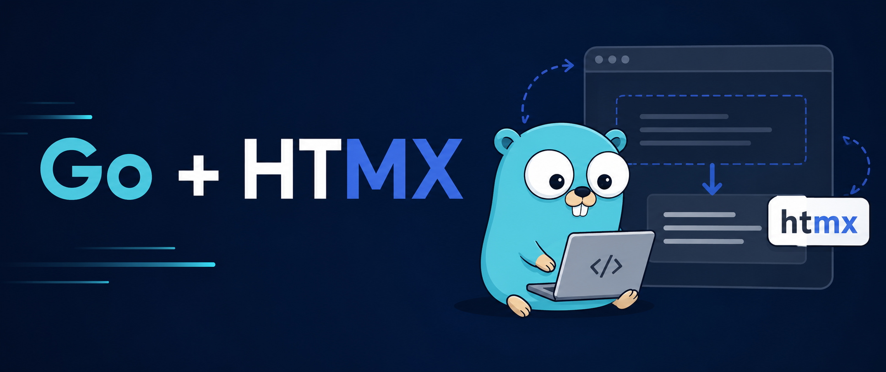
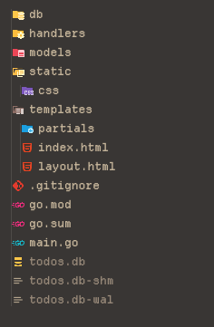
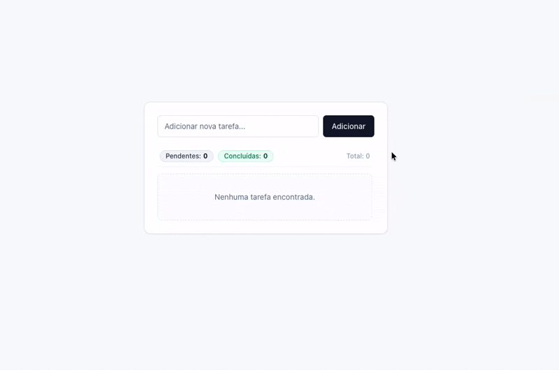

Vamos construir uma aplicação simples TODO list utilizando Golang, HTMX, SQLite e Tailwind CSS. A proposta é mostrar como desenvolver uma aplicação web moderna sem depender de frameworks JavaScript complexos, aproveitando a renderização no servidor e atualizações parciais das páginas.

Durante o desenvolvimento veremos como estruturar o projeto em Go, criar as rotas da aplicação, persistir os dados com SQLite e utilizar o HTMX para atualizar a interface de forma dinâmica, sem recarregar a página. Para o visual, usaremos o Tailwind CSS.

## Estrutura do nosso projeto de exemplo



- **db**: Responsável pela conexão com o banco de dados SQLite e inicialização da base.
- **handlers**: Contém os handlers HTTP da aplicação, responsáveis por processar as requisições e renderizar os templates HTML.
- **models**: Define as estruturas (models) utilizadas pela aplicação, como a entidade `Todo`.
- **static/css**: Arquivos estáticos utilizados pela aplicação, como fontes e estilos personalizados.
- **templates**: Contém todos os templates HTML da aplicação.
  - **partials**: Templates parciais reutilizáveis, como o componente de exibição de uma tarefa.
- **main.go**: Ponto de entrada da aplicação, responsável por configurar as dependências, registrar as rotas e iniciar o servidor HTTP.

## O que é HTMX?

**HTMX** é uma biblioteca JavaScript que permite adicionar interatividade às aplicações web de forma declarativa, diretamente no HTML. Em vez de escrever código JavaScript complexo para fazer requisições AJAX e atualizar partes da página, você utiliza atributos HTML simples.

A ideia central do HTMX é estender o HTML para permitir que qualquer elemento da página possa fazer requisições HTTP e atualizar partes específicas do DOM com a resposta do servidor. Tudo isso sem recarregar a página inteira.

Isso se encaixa perfeitamente com aplicações Go que renderizam templates no servidor, pois o HTMX trabalha com respostas HTML parciais — exatamente o que os templates Go já fazem nativamente.

### Por que usar HTMX com Go?

Utilizar HTMX em uma aplicação Go traz várias vantagens:

**1 - Simplicidade**: Não precisa configurar uma API rest completa com JSON. O servidor responde diretamente com HTML e o HTMX injeta esse HTML no local correto da página.
**2 - Menos JavaScript**: A lógica de interatividade fica no HTML, não em arquivos `.js` ou `.ts`. O servidor Go continua sendo o local da regra de negócios da aplicação.
**3 - Renderização no Servidor**: Aproveita todo o poder dos templates nativos do Go (`html/template`) para renderizar componentes parciais que o HTMX substitui dinamicamente.
**4 - Progressivo**: Você pode adicionar HTMX em partes específicas da aplicação sem reescrever tudo. Uma página tradicional pode ganhar interatividade gradualmente.
**5 - Leveza**: A biblioteca leve, sem dependências.

## Configurando o Projeto

Vamos começar pela estrutura base. O `main.go` configura o servidor, carrega os templates e registra as rotas:

```go
package main

import (
	"fmt"
	"html/template"
	"log"
	"net/http"
	"os"
	"path/filepath"
	"strings"

	"htmx/db"
	"htmx/handlers"
)

func main() {
	database := db.InitDB()
	defer database.Close()

	tmpl, err := parseTemplates()
	if err != nil {
		log.Fatalf("Erro ao carregar templates: %v", err)
	}

	todoHandler := handlers.NewTodoHandler(database, tmpl)

	mux := http.NewServeMux()

	fs := http.FileServer(http.Dir("static"))
	mux.Handle("/static/", http.StripPrefix("/static/", fs))

	mux.HandleFunc("/dashboard", todoHandler.Index)
	mux.HandleFunc("/todos/create", todoHandler.Create)
	mux.HandleFunc("/todos/toggle", todoHandler.Toggle)
	mux.HandleFunc("/todos/delete", todoHandler.Delete)
	mux.HandleFunc("/", todoHandler.Index)

	fmt.Println("Servidor rodando em http://localhost:8080")
	log.Fatal(http.ListenAndServe(":8080", mux))
}

func parseTemplates() (*template.Template, error) {
	funcMap := template.FuncMap{
		"add": func(a, b int) int { return a + b },
		"sub": func(a, b int) int { return a + b },
	}

	tmpl := template.New("").Funcs(funcMap)

	err := filepath.Walk("templates", func(path string, info os.FileInfo, err error) error {
		if err != nil {
			return err
		}

		if !info.IsDir() && strings.HasSuffix(path, ".html") {
			b, err := os.ReadFile(path)
			if err != nil {
				return err
			}

			name := filepath.Base(path)
			_, err = tmpl.New(name).Parse(string(b))
			if err != nil {
				return err
			}
		}
		return nil
	})

	return tmpl, err
}
```

A função `parseTemplates` carrega todos os arquivos `.html` do diretório templates e registra funções auxiliares no `FuncMap`, no caso, add e sub, que usaremos mais tarde para calcular estatísticas das tarefas.

## Os Templates da Aplicação

A aplicação utiliza uma estrutura de templates em camadas. O `layout.html` é o esqueleto da página e inclui o HTMX via CDN:

```html
<!doctype html>
<html lang="pt-BR">
  <head>
    <meta charset="UTF-8" />
    <meta name="viewport" content="width=device-width, initial-scale=1.0" />
    <title>TODO</title>
    <link rel="stylesheet" href="/static/css/app.css" />
    <script src="https://cdn.tailwindcss.com"></script>
    <script src="https://unpkg.com/htmx.org@2.0.0"></script>
  </head>
  <body
    class="bg-slate-50 min-h-screen flex items-center justify-center p-4 antialiased text-slate-900"
  >
    <div
      class="w-full max-w-md bg-white rounded-xl border border-slate-200 shadow-sm overflow-hidden"
    >
      {{ template "index.html" . }}
    </div>
  </body>
</html>
```

Note que o HTMX é carregado simplesmente com uma tag `<script>`. Não há build, nem bundler, nem configuração extra.

O template `index.html` contém o formulário de criação e a lista de tarefas:

```html
<div class="p-6 space-y-6">
  <form
    id="todo-form"
    hx-post="/todos/create"
    hx-target="#todo-list"
    hx-swap="innerHTML scroll:no-change"
    hx-on:htmx:after-request="document.getElementById('todo-form').reset()"
    class="flex gap-2"
  >
    <input
      type="text"
      name="title"
      placeholder="Adicionar nova tarefa..."
      required
      class="flex h-10 w-full rounded-md border border-slate-200 bg-white px-3 py-2 text-sm ring-offset-white placeholder:text-slate-500 focus-visible:outline-none focus-visible:ring-2 focus-visible:ring-slate-950 focus-visible:ring-offset-2"
    />

    <button
      type="submit"
      class="inline-flex items-center justify-center rounded-md text-sm font-medium transition-colors focus-visible:outline-none focus-visible:ring-2 focus-visible:ring-slate-950 focus-visible:ring-offset-2 bg-slate-900 text-slate-50 hover:bg-slate-900/90 h-10 px-4 py-2 shrink-0"
    >
      Adicionar
    </button>
  </form>

  <div id="todo-list" class="max-h-[360px] overflow-y-auto pr-1">
    {{ template "todo-list.html" . }}
  </div>
</div>
```

Aqui entram os atributos do HTMX. Vamos entender cada um:

- `hx-post`: Quando o formulário for enviado, o HTMX intercepta o evento e faz uma requisição `POST` para `/todos/create`, em vez de recarregar a página.

- `hx-target"`: Define qual elemento será atualizado com a resposta do servidor. No caso, a `div` com id `todo-list`.

- `hx-swap=`: Especifica como o conteúdo será inserido. `innerHTML` substitui o conteúdo interno do target.

- `hx-on:htmx:after-request"`: Escuta o evento `htmx:after-request` (disparado após a requisição terminar) e executa o JavaScript para limpar o formulário, deixando o input pronto para a próxima tarefa.

Veja mais tags do HTMX [aqui](https://htmx.org/reference/).

O template `todo-list.html` renderiza a lista e as estatísticas:

```html
<div
  class="sticky top-0 bg-white z-10 flex items-center justify-between text-xs text-slate-500 pb-2 px-1 border-b border-slate-100 mb-3"
>
  {{ $total := len . }} {{ $completed := 0 }} {{ range . }} {{ if .Completed }}
  {{ $completed = add $completed 1 }} {{ end }} {{ end }}

  <div class="flex gap-2">
    <span
      class="inline-flex items-center rounded-full bg-slate-100 px-2.5 py-0.5 text-xs font-medium text-slate-700 border border-slate-200"
    >
      Pendentes:
      <strong class="ml-1 text-slate-900">{{ sub $total $completed }}</strong>
    </span>
    <span
      class="inline-flex items-center rounded-full bg-emerald-50 px-2.5 py-0.5 text-xs font-medium text-emerald-700 border border-emerald-200/60"
    >
      Concluídas:
      <strong class="ml-1 text-emerald-900">{{ $completed }}</strong>
    </span>
  </div>

  <span class="font-medium text-slate-400">Total: {{ $total }}</span>
</div>

<ul class="space-y-2">
  {{ range . }} {{ template "todo-item.html" . }} {{ else }}
  <p
    class="text-sm text-slate-500 text-center py-8 border border-dashed border-slate-200 rounded-lg bg-slate-50/50"
  >
    Nenhuma tarefa encontrada.
  </p>
  {{ end }}
</ul>
```

E cada item da lista é um template parcial reutilizável, `todo-item.html`:

```html
<li
  id="todo-{{ .ID }}"
  class="flex items-center justify-between p-3 rounded-lg border border-slate-100 bg-slate-50/50 hover:bg-slate-100/50 transition-colors"
>
  <div class="flex items-center space-x-3">
    <!-- prettier-ignore -->
    <input
      type="checkbox"
      {{ if .Completed }} checked {{ end }}
      hx-post="/todos/toggle?id={{ .ID }}"
      hx-target="#todo-list"
      hx-swap="innerHTML scroll:no-change"
      class="h-4 w-4 rounded border-slate-300 text-slate-900 focus:ring-slate-950 cursor-pointer"
    />
    <span
      class="text-sm font-medium {{ if .Completed }}line-through text-slate-400{{ else }}text-slate-700{{ end }}"
    >
      {{ .Title }}
    </span>
  </div>

  <button
    hx-delete="/todos/delete?id={{ .ID }}"
    hx-target="#todo-list"
    hx-swap="innerHTML scroll:no-change"
    class="inline-flex items-center justify-center rounded-md text-sm font-medium text-slate-400 hover:text-red-600 hover:bg-red-50 h-8 w-8 transition-colors"
  >
    <svg
      xmlns="http://www.w3.org/2000/svg"
      width="16"
      height="16"
      viewBox="0 0 24 24"
      fill="none"
      stroke="currentColor"
      stroke-width="2"
      stroke-linecap="round"
      stroke-linejoin="round"
    >
      <path d="M3 6h18"></path>
      <path d="M19 6v14c0 1-1 2-2 2H7c-1 0-2-1-2-2V6"></path>
      <path d="M8 6V4c0-1 1-2 2-2h4c1 0 2 1 2 2v2"></path>
    </svg>
  </button>
</li>
```

No item da tarefa, temos mais dois atributos HTMX em ação:

- `hx-post="/todos/toggle?id={{ .ID }}"`: no checkbox: ao marcar ou desmarcar, faz uma requisição `POST` para alternar o status da tarefa e atualiza a lista.

- `hx-delete="/todos/delete?id={{ .ID }}"`: no botão de excluir: faz uma requisição `DELETE` para remover a tarefa. O HTMX suporta os métodos HTTP padrão diretamente nos atributos.

Em ambos os casos, `hx-target="#todo-list"` e `hx-swap="innerHTML scroll:no-change"` garantem que apenas a lista seja re-renderizada, mantendo o resto da página intacto.

## Os Handlers no Go

Os handlers processam as requisições e respondem com HTML parcial. Veja o handler de criação:

```go
func (h *TodoHandler) Create(w http.ResponseWriter, r *http.Request) {
	if r.Method != http.MethodPost {
		http.Error(w, "Método não permitido", http.StatusMethodNotAllowed)
		return
	}

	title := r.FormValue("title")
	if strings.TrimSpace(title) == "" {
		w.WriteHeader(http.StatusBadRequest)
		return
	}

	_, err := h.db.Exec("INSERT INTO todos (title, completed) VALUES (?, ?)", title, false)
	if err != nil {
		http.Error(w, err.Error(), http.StatusInternalServerError)
		return
	}

	todos, err := h.getAllTodos()
	if err != nil {
		http.Error(w, err.Error(), http.StatusInternalServerError)
		return
	}

	err = h.tmpl.ExecuteTemplate(w, "todo-list.html", todos)
	if err != nil {
		log.Printf("Erro ao renderizar template todo-list.html: %v", err)
		http.Error(w, err.Error(), http.StatusInternalServerError)
	}
}
```

O ponto importante aqui é a última linha: `h.tmpl.ExecuteTemplate(w, "todo-list.html", todos)`. Em vez de retornar JSON, o handler renderiza o template `todo-list.html` diretamente na resposta HTTP. O HTMX recebe esse HTML e o injeta no `#todo-list` da página. O mesmo padrão se repete nos handlers de `toggle` e `delete`:

```go
func (h *TodoHandler) Toggle(w http.ResponseWriter, r *http.Request) {
	// ... validação e update no banco ...

	todos, err := h.getAllTodos()
	if err != nil {
		http.Error(w, err.Error(), http.StatusInternalServerError)
		return
	}

	err = h.tmpl.ExecuteTemplate(w, "todo-list.html", todos)
	if err != nil {
		http.Error(w, err.Error(), http.StatusInternalServerError)
	}
}

func (h *TodoHandler) Delete(w http.ResponseWriter, r *http.Request) {
	// ... validação e delete no banco ...

	todos, err := h.getAllTodos()
	if err != nil {
		http.Error(w, err.Error(), http.StatusInternalServerError)
		return
	}

	err = h.tmpl.ExecuteTemplate(w, "todo-list.html", todos)
	if err != nil {
		http.Error(w, err.Error(), http.StatusInternalServerError)
	}
}
```

Toda a lógica de estado da aplicação fica no servidor. O HTMX apenas orquestra as requisições e atualizações do DOM.

**Como Funciona o Fluxo?**

1 - Carregamento Inicial: O usuário acessa `/dashboard`. O handler Index renderiza o `layout.html` completo, que inclui o `index.html` e a lista inicial de tarefas.

2 - Adicionar Tarefa: O usuário digita no formulário e clica em "Adicionar". O HTMX intercepta o submit, faz POST para` /todos/create` e recebe o HTML da lista atualizada. O conteúdo de `#todo-list` é substituído. O formulário é limpo pelo evento `htmx:afterRequest`.

3 - Marcar como Concluída: O usuário clica no checkbox. O HTMX faz `POST` para `/todos/toggle`. O servidor atualiza o banco, busca todas as tarefas e renderiza `todo-list.html` com os novos dados. A lista é atualizada e o checkbox reflete a mudança.

4 - Excluir Tarefa: O usuário clica no ícone para deletar. O HTMX faz `DELETE` para `/todos/delete`. O servidor remove do banco e retorna a lista sem a tarefa excluída.

#### Veja como ficou nosso projetinho

Vamos rodar o projeto com `go run .` ou `go run main.go`, certifique-se de estar na raiz do projeto.



## O Banco de Dados

A persistência é feita com SQLite.

```go
package db

import (
	"database/sql"
	"log"

	_ "modernc.org/sqlite"
)

func InitDB() *sql.DB {
  db, err := sql.Open("sqlite", "todos.db");
 	if err != nil {
		log.Fatalf("Erro ao abrir banco de dados: %v", err)
	}

	db.SetMaxOpenConns(1)

	query := `
	CREATE TABLE IF NOT EXISTS todos (
		id INTEGER PRIMARY KEY AUTOINCREMENT,
		title TEXT NOT NULL,
		completed BOOLEAN NOT NULL DEFAULT 0
	);`

	_, err = db.Exec(query)
	if err != nil {
		log.Fatalf("Erro ao criar tabela: %v", err)
	}

	return db
}
```

## Nem Tudo São Flores: Contras de Usar HTMX

**1 - Tudo na Mão**: Diferente de React ou Vue, onde você tem um ecossistema enorme de bibliotecas e componentes prontos (`npm install` e pronto), com HTMX você precisa construir cada interação do zero. Não existe um `react-select` ou `vue-datepicker` para importar — ou você escreve o componente inteiro em templates Go ou não tem.

**2 - Gerenciamento de Estado Manual**: Frameworks modernos têm soluções robustas para estado global (Redux, Context API). Com HTMX, o estado vive apenas no servidor. Isso é ótimo até você precisar sincronizar múltiplas partes da interface sem recarregar tudo. Aí você acaba criando hacks no HTML ou fazendo mais requisições do que gostaria.

**3 - Dev Experience Mais Lenta**: Sem Hot Module Replacement, sem `vite` recarregando só o que mudou. Toda alteração no template exige refresh do navegador. Para quem está acostumado com a fluidez de um `npm run dev` em React, isso pesa no dia a dia.

**4 - Limite para Aplicações Complexas**: HTMX brilha em CRUDs e dashboards. Mas se você precisa de uma interface altamente interativa — drag and drop complexo, edição em tempo real, gráficos dinâmicos com estado local rico — a abordagem "servidor primeiro" começa a travar. Você acaba escrevendo JavaScript anyway, só que de forma menos estruturada.

**5 - Dependência Total do Servidor**: Cada clique, cada toggle, cada filtro faz uma requisição HTTP. Em conexões lentas ou instáveis, a experiência do usuário sofre. SPAs modernas podem cachear dados e funcionar offline; com HTMX, se o servidor cair, a interface para.

**6 - Reatividade Limitada**: Não há binding bidirecional automático. Se um campo de formulário precisa atualizar outro elemento da tela em tempo real enquanto o usuário digita, você precisa configurar eventos HTMX manualmente. Em Vue ou React, isso é `v-model` ou `useState` e pronto.

## Conclusão

O HTMX se encaixa naturalmente no ecossistema Go. Ao invés de criar uma API REST separada e um frontend em React ou Vue, você mantém tudo no servidor: rotas, lógica de negócio, templates HTML. O HTMX adiciona a camada de interatividade de forma declarativa, diretamente no markup.

Essa abordagem é ideal para aplicações internas, dashboards, CRUDs e qualquer projeto onde a simplicidade e a velocidade de desenvolvimento são prioridades. Você escreve menos código, tem menos camadas para manter e ainda entrega uma experiência moderna ao usuário.

Mas é importante ter claro que HTMX não é bala de prata. Se você está construindo algo que exige muita interatividade no cliente, estado complexo compartilhado entre componentes ou precisa funcionar com pouca dependência do servidor, frameworks como React, Vue ou Angular ainda são a escolha mais adequada. A chave é escolher a ferramenta certa para o problema certo e para aplicações simples e diretas, HTMX + Go é uma combinação poderosa e produtiva.

## Links úteis

- [Repositório](https://github.com/wiliamvj/htmx) do exemplo
- [Documentação do HTMX](https://htmx.org/docs/)
- [Templates no Go](https://pkg.go.dev/html/template)
