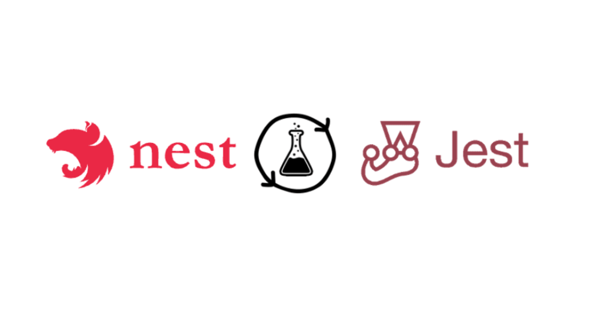

## O que são contratos?

Contratos são uma forma de separar as responsabilidades entre as partes que utilizam essa implementação, contratos são muito utilizados no contexto de desenvolvimento de software seguindo o padrão DDD (Domain-Driven Design).

Digamos que temos um service chama `UserService`, este service precisa fazer uma chamada no banco de dados e buscar dados do usuário. Para isso temos uma camada de repository, que é responsável por se comunicar com o banco de dados. Neste exemplo, ficaria assim:

`controller` > `service` > `repository`

Imagine que você vai escrever um teste unitário para a camada de service, porém como se trata de um teste unitário, você não deveria chamar o repository e chamar o banco de dados, para isso entra o contrato.

Ficaria assim:

`controller` > `service` > `contract` > `repository`

Vamos ao código:
No exemplo abaixo temos um service simples, que busca o usuário pelo id, chamando diretamente o nosso repository.

```typescript
@Injectable()
export class UserService {
 constructor(private repository: UserRepository) {}

  async findUserById(id: string): Promise<User | null> {
    const findUser = await this.repository.findById(id)
    if !findUser throw new NotFoundException("user not found")
  }
}
```

Abaixo nosso repository, no exemplo utilizamos o ORM Prisma, mas poderia ser qualquer outro. Buscamos o user pelo ID, caso não encontre retornamos `null`, se não, retornamos o usuário.

```typescript
@Injectable()
export class UserRepository {
  constructor(private prisma: PrismaService) {}

  async findById(id: string): Promise<User | null> {
    const findUser = await this.prisma.findUnique({
      where: { id },
    });

    if (!findUser) return null;

    return findUser;
  }
}
```

Agora, imagine fazer o teste unitário do nosso service, você precisaria fazer mocks do seu repository, porém ele depende da conexão com o Prisma, então precisaria criar um mock dessa conexão também, isso torna o teste mais demorado e cansativo. Mas pode ser resolvido com contratos.

Vamos lá, abaixo criamos um contrato usando classe abstrata:

```typescript
export abstract class UserContractRepository {
  abstract findById(id: string): Promise<User | null>;
}
```

Agora, basta implementar essa classe, dessa forma todos que utilizarem esse contrato precisam implementar o método `findById`, vamos alterar o service para utilizar o contrato:

```typescript
@Injectable()
export class UserService {
  constructor(private repository: UserContractRepository) {}

  async findUserById(id: string): Promise<User | null> {
    const findUser = await this.repository.findById(id);
    if (!findUser) throw new NotFoundException('user not found');
  }
}
```

No service quase nada é alterado, ao invés de chamar diretamente o repository, vamos chamar o contrato.

Vamos alterar o repository:

```typescript
@Injectable()
export class UserRepository implements UserContractRepository {
  constructor(private prisma: PrismaService) {}

  async findById(id: string): Promise<User | null> {
    const findUser = await this.prisma.user.findUnique({
      where: { id },
    });

    if (!findUser) return null;

    return findUser;
  }
}
```

No repository, agora usamos o implements, com isso o editor de código já acusa erro, caso você não tenha a implementação completa do `UserContractRepository`, no exemplo, temos apenas o `findById` que recebe uma string por parâmetro e devolve um `User` ou `null`, portanto implementamos o `UserContractRepository`, se adicionar mais métodos no `UserContractRepository`, vai precisar adicionar no `UserRepository`.

```typescript
export abstract class UserContractRepository {
  abstract findById(id: string): Promise<User | null>;
  abstract createUser(user: User): Promise<void>;
}
```

Agora, temos o `createUser`, o `UserRepository` já deve acusar erro, por não implementa por completo o `UserContractRepository`. Vamos implementar:

```typescript
@Injectable()
export class UserRepository implements UserContractRepository {
  constructor(private prisma: PrismaService) {}

  async findById(id: string): Promise<User | null> {
    const findUser = await this.prisma.user.findUnique({
      where: { id },
    });

    if (!findUser) return null;

    return findUser;
  }

  async createUser(user: User): Promise<void> {
    const findUser = await this.prisma.user.create({
      data: user,
    });
  }
}
```

Para funcionar corretamente em NestJs, só precisamos alterar nosso module, para que ao chamar o `UserContractRepository` seja utilizado a classe `UserRepository`, é bem simples:

```typescript
@Module({
  providers: [
    {
      provide: UserContractRepository,
      useClass: UserRepository
    }
  ]
})
```

Afinal, qual a vantagem disso?

Agora como temos uma camada entre o service e repository, para os testes unitários não precisamos mais chamar o repository diretamente, basta criar uma implementação fake que implementa o `UserContractRepository` e utilizar nos testes, e ainda, se precisarmos trocar o prisma por outro ORM, como TypeORM por exemplo, não precisamos alterar nosso service, basta criar um novo repository e implementar o `UserContractRepository`.

Vamos fazer um repository fake, normalmente chamamos de in memory:

```typescript
export class UserRepositoryInMemory implements UserContractRepository {
  async findById(id: string): Promise<User | null> {
    return
  }

  async createUser(user: User): Promise<void> {
    return
}
```

## Retornando um mock

No exemplo acima, não retornamos nada, mas você poderia retornar um mock do User, desta forma:

```typescript
const userMock: User = {
  id: "id_mock",
  name: "John Doe",
  email: "john.doe@mail.com"
}

export class UserRepositoryInMemory implements UserContractRepository {
  async findById(id: string): Promise<User | null> {
    return userMock
  }

  async createUser(user: User): Promise<void> {
    return
}
```

Podemos simular ainda mais o comportamento do repository, verificando se o ID do user é o mesmo do `userMock`:

```typescript
const userMock: User = {
  id: "id_mock",
  name: "John Doe",
  email: "john.doe@mail.com"
}

export class UserRepositoryInMemory implements UserContractRepository {
  async findById(id: string): Promise<User | null> {
    if(id !== userMock.id) return null

    return userMock
  }

  async createUser(user: User): Promise<void> {
    return
}
```

Vamos ver como fazer o teste unitário usando Jest

```typescript
let sut: UserService;
let repository: UserContractRepository;

beforeEach(async () => {
  const module: TestingModule = await Test.createTestingModule({
    providers: [
      UserService,
      {
        provide: UserContractRepository,
        useClass: UserRepositoryInMemory,
      },
    ],
  }).compile();

  sut = module.get < UserService > UserService;
  repository = module.get < UserContractRepository > UserContractRepository;
});
```

Usamos a mesma lógica utilizada no module, mas agora chamando o repository in memory, desta forma não precisamos lidar com com a implementação do prisma ORM por exemplo.

O teste ficaria assim:

```typescript
describe('findUserById', () => {
  it('should be able to return user by id', async () => {
    const result = await sut.findUserById("id_mock");

    expect(result).toBeTruthy();
    expect(result).toHaveProperty('id');
    expect(result).toHaveProperty('name');
    expect(result).toHaveProperty('email');
  });
```

Veja como fica simples fazer um teste com contratos, você pode simular erro também, usando o `spyOn` do jest, por exemplo:

```typescript
describe('findUserById', () => {
  it('should not be able to return user by id', async () => {
  jest.spyOn(repository, 'findById').mockResolvedValueOnce(null);

    expect(() => {
      return sut.findUserById("id_mock");
    }).rejects.toThrow(NotFoundException);
  });
```

Mas como temos nosso in memory, com o tratamento para retorna null caso o ID do usuário seja diferente, bastaria passar um ID errado:

```typescript
describe('findUserById', () => {
  it('should not be able to return user by id', async () => {

    expect(() => {
      return sut.findUserById("id_mock_wrong");
    }).rejects.toThrow(NotFoundException);
  });
```

## Conclusão

Em conclusão, o uso de contratos no NestJS pode ser uma abordagem muito eficaz para facilitar os testes unitários e melhorar a manutenção do código. Ao separar a interface do repositório em um contrato, você cria uma camada intermediária entre o serviço e o repositório, permitindo que você crie implementações alternativas para fins de teste, como o `UserRepositoryInMemory`. Isso tem várias vantagens:

**1. Facilita os testes unitários:** Com o contrato em vigor, você pode criar implementações de repositório fictícias que se comportam conforme necessário para cada teste, sem a necessidade de interagir com o banco de dados real ou a camada de persistência.

**2. Isolamento de testes:** Isolar o serviço a ser testado de suas dependências externas, como o ORM ou outros serviços, é fundamental para testes unitários eficazes. Contratos ajudam a alcançar essa isolamento.

**3. Flexibilidade:** Se você decidir mudar de um ORM para outro, como de Prisma para TypeORM, os serviços não precisam ser alterados. Basta criar um novo repositório que implemente o contrato existente e fazer a troca no módulo.

**4. Melhor aderência ao DDD:** A abordagem de contratos se alinha bem com os princípios do Domain-Driven Design (DDD), onde a ênfase é colocada na clareza das interfaces entre as diferentes camadas da aplicação.

**5. Testes de erro mais simples:** Você pode facilmente simular diferentes cenários de erro, como retornar “null” ou lançar exceções, para garantir que seu serviço lida adequadamente com essas situações.

No geral, o uso de contratos no NestJS é uma prática recomendada que pode tornar seu código mais testável, mais flexível e mais robusto. Isso ajuda a manter seu código limpo e facilita a evolução e manutenção do sistema ao longo do tempo.
