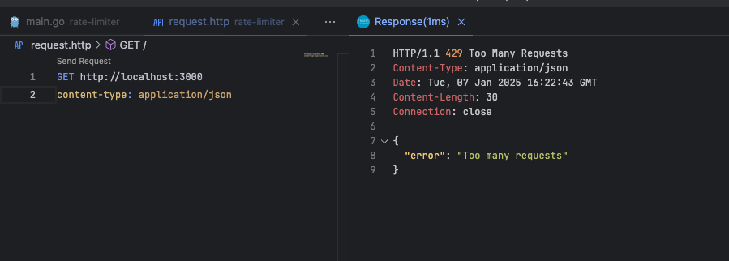

In web systems, it is common for the same client (whether a user or a service) to make multiple requests to a server in a short period of time. Depending on the volume of traffic, this can result in server overload, slow processing, and even failures in systems that are unable to handle this number of requests.

**Rate Limiter** is a technique used to control the number of requests a client can make to a server during a given period. It acts as a "gatekeeper", limiting the number of calls to an API or service within a time window.

### Why Use Rate Limiter?

Using Rate Limiter in an application is a good practice for several reasons:

**1 - Abuse Protection**: Prevents a client from making excessive or malicious requests, such as denial of service (DoS) attacks, that can overload the system.

**2 - Resource Usage Balance**: Limiting the number of requests helps ensure that server resources are used efficiently and that other users are not harmed.

**3 - Improves Performance**: By limiting requests, you can ensure that the application continues to function smoothly, even with a high number of simultaneous accesses.

**4 - User Experience**: By limiting excessive request traffic, you prevent users from being blocked or experiencing slowness in the application.

**5 - Security**: Helps prevent brute force attacks or attempts to exploit vulnerabilities by limiting the number of requests per second.

### Practical Example Using Rate Limiter in Go with Chi

Now, let's analyze an example of implementing Rate Limiter in a Go application using the [chi](https://github.com/go-chi/chi) package, widely used to manage routing.

We will use the [golang.org/x/time/rate](https://pkg.go.dev/golang.org/x/time/rate) package which provides tools for creating and managing rate limiters based on the Token Bucket algorithm.

The code below shows how to implement this functionality in an application that uses Go's `http.Handler` to control the number of requests made by a client.

```go
package main

import (
	"encoding/json"
	"net/http"
	"strings"
	"time"

	"github.com/go-chi/chi"
	"golang.org/x/time/rate"
)

func main() {
	r := chi.NewRouter()

	// Applies the RateLimiter globally, limiting 5 requests per second and a burst of 10 requests
	r.Use(RateLimiter(rate.Limit(5), 10, 1*time.Second))

	// Define a route for testing
	r.Get("/", func(w http.ResponseWriter, r *http.Request) {
		w.Write([]byte("Requisição bem-sucedida"))
	})

	http.ListenAndServe(":3000", r)
}

// RateLimiter middleware to limit a client's requests
func RateLimiter(limit rate.Limit, burst int, waitTime time.Duration) func(next http.Handler) http.Handler {
	limiterMap := make(map[string]*rate.Limiter)
	lastRequestMap := make(map[string]time.Time)

	return func(next http.Handler) http.Handler {
		return http.HandlerFunc(func(w http.ResponseWriter, r *http.Request) {
			// Capture the client IP
      ip := strings.Split(r.RemoteAddr, ":")[0]

			// Checks if the IP already has a Limiter configured
			limiter, exists := limiterMap[ip]
			if !exists {
				limiter = rate.NewLimiter(limit, burst)
				limiterMap[ip] = limiter
			}

			// Check if the client made a recent request and wait for the timeout if necessary
			lastRequestTime, lastRequestExists := lastRequestMap[ip]
			if lastRequestExists && time.Since(lastRequestTime) < waitTime {
				w.Header().Set("Content-Type", "application/json")
				w.WriteHeader(http.StatusTooManyRequests)
				json.NewEncoder(w).Encode(map[string]string{"error": "Too many requests"})
				return
			}

			// Check if the limit has been reached
			if !limiter.Allow() {
				lastRequestMap[ip] = time.Now()
				w.Header().Set("Content-Type", "application/json")
				w.WriteHeader(http.StatusTooManyRequests)
				json.NewEncoder(w).Encode(map[string]string{"error": "Too many requests"})
			}

			// If everything is ok, move on to the next handler
			next.ServeHTTP(w, r)
		})
	}
}
```

### How Does the Code Work?

**1 - IP Mapping and Limitation**: The code uses two maps: one to store the limiters (`limiterMap`) and another to record the last request made by an IP (`lastRequestMap`). The client IP is obtained from the `r.RemoteAddr` variable.

**2 - Request Control**: For each request, it is checked whether the IP already has a limiter configured. If it does not, a new one is created with the defined limit and burst.

**3 - Check**: Before allowing a request to pass, the code checks whether the client is trying to make a new request within a defined time interval. If the time is not enough, it returns a **429 (Too Many Requests)** error.

**4 - Request Limitation**: The `rate.Limiter.Allow()` is the method that checks whether the client can make the request or if it has reached the limit. If the limit is reached, the request is blocked and a 429 error is returned.

- **Burst**: this is the maximum number of requests that a client can make immediately, without having to wait for the limit to be replenished. It defines a "tolerance" for traffic spikes above the normal rate configured in the Rate Limiter.

When trying to make many requests in a short space of time, we receive the error:



### What Can Be Used in Rate Limiter?

Rate Limiting is a technique that can be applied in several ways to identify and limit a client's usage. In our case, we use the client's IP address as a key to track requests and apply restrictions. However, there are other approaches depending on the type of application and usage scenario. Here are some possibilities:

**1 - By IP (as in our example):**

- Ideal for limiting requests coming from specific addresses. It is useful in public APIs or in applications accessed by a wide variety of clients.
- Advantage: Simple to implement and effective against abuse of the same address.
- Limitation: Does not work well in shared networks (such as NAT), where several users share the same IP.

**2 - By Authentication Token:**

- Useful for APIs where users are authenticated with tokens (JWT, OAuth, etc.). In this case, you track requests based on the token sent by the client.
- Advantage: More granular and can differentiate users even on shared networks.
- Limitation: Requires the application to support authentication.

**3 - By Client ID:**

- Common in APIs that provide access keys for each client (such as API keys).
- Advantage: Works well in scenarios where there is integration between services and each client is identified by a unique key.
- Limitation: Does not prevent abuse if the key is shared or exposed.

**4 - Per User Session:**

- In applications with sessions (cookies or session tokens), the unique session identifier can be used to limit requests.
- Advantage: Focused on individual experiences within the application.
- Limitation: Need to manage sessions and store identifiers.

**5 - By Route or Endpoint:**

1 - Useful for limiting calls to specific high-load endpoints (such as searches or uploads). Can be combined with other strategies, such as IP or token.
2 - Advantage: Protects critical endpoints from abuse.
4 - Limitation: Requires granular configuration for each route.

There are other ways to limit.

In the code example, we use the IP address (`r.RemoteAddr`) because it is a simple and efficient approach for public API scenarios or applications where client identification is not done with tokens or sessions.

### Final considerations

Implementing a Rate Limiter is an effective way to ensure the security and stability of your application, as well as offering a more balanced user experience. In the example above, we showed how to integrate it to limit client requests efficiently.
This is an essential technique to protect your services against abuse, attacks and ensure that traffic is distributed appropriately.

## Links

[repository](https://github.com/wiliamvj/rate-limiter) of the example
