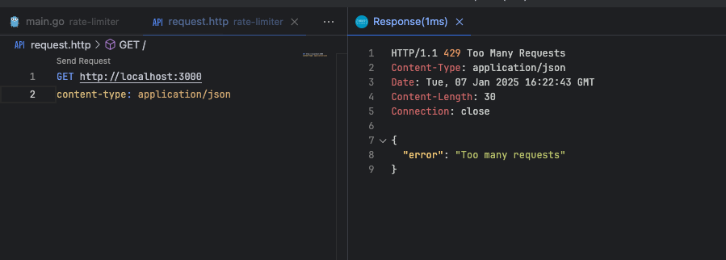

Em sistemas web, é comum que um mesmo cliente (seja um usuário ou serviço) faça múltiplas requisições a um servidor em um curto período de tempo. Dependendo do volume de tráfego, isso pode resultar em sobrecarga nos servidores, lentidão no processamento e até mesmo falhas nos sistemas que não conseguem lidar com essa quantidade de requisições.

**Rate Limiter** é uma técnica usada para controlar a quantidade de requisições que um cliente pode fazer a um servidor durante um determinado período. Ele atua como um "guardião", limitando o número de chamadas para uma API ou serviço dentro de uma janela de tempo.

### Por Que Usar Rate Limiter?

Utilizar Rate Limiter em uma aplicação é uma boa prática por várias razões:

**1 - Proteção Contra Abusos**: Evita que um cliente faça requisições excessivas ou maliciosas, como ataques de negação de serviço (DoS), que podem sobrecarregar o sistema.

**2 - Equilíbrio no Uso de Recursos**: Limitar o número de requisições ajuda a garantir que os recursos do servidor sejam usados de forma eficiente e que outros usuários não sejam prejudicados.

**3 - ** a Performance**: Com a limitação de requisições, é possível garantir que a aplicação continue funcionando de forma fluída, mesmo com um número elevado de acessos simultâneos.

**4 - Experiência do Usuário**: Ao limitar o tráfego de requisições excessivas, você evita que usuários fiquem bloqueados ou experimentem lentidão na aplicação.

**5 - Segurança**: Ajuda a evitar ataques de força bruta ou tentativas de exploração de vulnerabilidades, limitando a quantidade de requisições por segundo.

### Exemplo Prático Usando Rate Limiter em Go com Chi

Agora, vamos analisar um exemplo de implementação de Rate Limiter em uma aplicação Go usando o pacote [chi](https://github.com/go-chi/chi), muito utilizado para gerenciar roteamento.

Vamos utilizar o pacote [golang.org/x/time/rate](https://pkg.go.dev/golang.org/x/time/rate) que fornece ferramentas para criar e gerenciar limitadores de taxa baseados no algoritmo Token Bucket.

O código abaixo mostra como implementar essa funcionalidade em uma aplicação que utiliza o `http.Handler` do Go para controlar o número de requisições feitas por um cliente.


```go
package main

import (
	"encoding/json"
	"net/http"
	"strings"
	"time"

	"github.com/go-chi/chi"
	"golang.org/x/time/rate"
)

func main() {
	r := chi.NewRouter()

	// Aplica o RateLimiter globalmente, limitando 5 requisições por segundo e um burst de 10 requisições
	r.Use(RateLimiter(rate.Limit(5), 10, 1*time.Second))

	// Define uma rota para testes
	r.Get("/", func(w http.ResponseWriter, r *http.Request) {
		w.Write([]byte("Requisição bem-sucedida"))
	})

	http.ListenAndServe(":3000", r)
}

// RateLimiter middleware para limitar as requisições de um cliente
func RateLimiter(limit rate.Limit, burst int, waitTime time.Duration) func(next http.Handler) http.Handler {
	limiterMap := make(map[string]*rate.Limiter)
	lastRequestMap := make(map[string]time.Time)

	return func(next http.Handler) http.Handler {
		return http.HandlerFunc(func(w http.ResponseWriter, r *http.Request) {
			// Captura o IP do cliente
      ip := strings.Split(r.RemoteAddr, ":")[0]

			// Verifica se o IP já possui um Limiter configurado
			limiter, exists := limiterMap[ip]
			if !exists {
				limiter = rate.NewLimiter(limit, burst)
				limiterMap[ip] = limiter
			}

			// Verifica se o cliente fez uma requisição recente e aguarda o tempo de espera, se necessário
			lastRequestTime, lastRequestExists := lastRequestMap[ip]
			if lastRequestExists && time.Since(lastRequestTime) < waitTime {
				w.Header().Set("Content-Type", "application/json")
				w.WriteHeader(http.StatusTooManyRequests)
				json.NewEncoder(w).Encode(map[string]string{"error": "Too many requests"})
				return
			}

			// Verifica se o limite foi atingido
			if !limiter.Allow() {
				lastRequestMap[ip] = time.Now()
				w.Header().Set("Content-Type", "application/json")
				w.WriteHeader(http.StatusTooManyRequests)
				json.NewEncoder(w).Encode(map[string]string{"error": "Too many requests"})
			}

			// Se tudo estiver certo, passa para o próximo handler
			next.ServeHTTP(w, r)
		})
	}
}
```

### Como Funciona o Código?

**1 - Mapeamento de IP e Limitação**: O código utiliza dois mapas: um para armazenar os limitadores (`limiterMap`) e outro para registrar a última requisição feita por um IP (`lastRequestMap`). O IP do cliente é obtido da variável `r.RemoteAddr`.

**2 - Controle de Requisições**: Para cada requisição, é verificado se o IP já possui um limitador configurado. Caso não tenha, é criado um novo com o limite e o burst definidos.

**3 - Verificação do Tempo de Espera**: Antes de permitir que uma requisição passe, o código verifica se o cliente está tentando fazer uma nova requisição dentro de um intervalo de tempo definido. Se o tempo não for suficiente, ele retorna um erro **429 (Too Many Requests)**.

**4 - Limitação de Requisições**: O `rate.Limiter.Allow()` é o método que verifica se o cliente pode fazer a requisição ou se ele atingiu o limite. Se o limite for atingido, a requisição é bloqueada e um erro 429 é retornado.

- **Burst**: é a quantidade máxima de requisições que um cliente pode fazer de forma imediata, sem precisar esperar pelo reabastecimento do limite. Ele define uma "tolerância" para picos de tráfego acima da taxa normal configurada no Rate Limiter.

Ao tentar fazer muitas requisições em pouco espaço de tempo, recebemos o erro:



### O Que Pode Ser Usado no Rate Limiter?

O Rate Limiter é uma técnica que pode ser aplicada de várias formas para identificar e limitar o uso de um cliente. No nosso caso, utilizamos o endereço IP do cliente como chave para rastrear as requisições e aplicar as restrições. Contudo, há outras abordagens dependendo do tipo de aplicação e do cenário de uso. Aqui estão algumas possibilidades:

**1 - Por IP (como no nosso exemplo):**

- Ideal para limitar requisições vindas de endereços específicos. É útil em APIs públicas ou em aplicações acessadas por uma grande variedade de clientes.
- Vantagem: Simples de implementar e eficaz contra abusos de um mesmo endereço.
- Limitação: Não funciona bem em redes compartilhadas (como NAT), onde vários usuários compartilham o mesmo IP.

**2 - Por Token de Autenticação:**

- Útil para APIs onde os usuários são autenticados com tokens (JWT, OAuth, etc.). Nesse caso, você rastreia as requisições com base no token enviado pelo cliente.
- Vantagem: Mais granular e pode diferenciar usuários mesmo em redes compartilhadas.
- Limitação: Necessita que a aplicação suporte autenticação.

**3 - Por Identificador de Cliente (Client ID):**

- Comum em APIs que fornecem chaves de acesso para cada cliente (como chaves de API).
- Vantagem: Funciona bem em cenários onde há integração entre serviços e cada cliente é identificado por uma chave única.
- Limitação: Não impede abusos se a chave for compartilhada ou exposta.

**4 - Por Sessão de Usuário:**

- Em aplicações com sessões (cookies ou tokens de sessão), o identificador único da sessão pode ser usado para limitar as requisições.
- Vantagem: Focado em experiências individuais dentro da aplicação.
- Limitação: Necessário gerenciar sessões e armazenar identificadores.

**5 - Por Rota ou Endpoint:**

1 - Útil para limitar chamadas em endpoints específicos de alta carga (como buscas ou uploads). Pode ser combinado com outras estratégias, como IP ou token.
2 - Vantagem: Protege endpoints críticos de abusos.
4 - Limitação: Requer configuração granular para cada rota.

Existem outras formas de limitar.

No exemplo do código, utilizamos o endereço IP (`r.RemoteAddr`) porque é uma abordagem simples e eficiente para cenários de APIs públicas ou aplicações onde a identificação do cliente não é feita com tokens ou sessões.

### Conclusão

A implementação de Rate Limiter é uma forma eficaz de garantir a segurança e a estabilidade da sua aplicação, além de oferecer uma experiência de usuário mais equilibrada. No exemplo acima, mostramos como integrá-lo, para limitar as requisições de clientes de forma eficiente.
Essa é uma técnica essencial para proteger seus serviços contra abusos, ataques e garantir que o tráfego seja distribuído de maneira adequada.

## Links úteis

[repositório](https://github.com/wiliamvj/rate-limiter) do exemplo