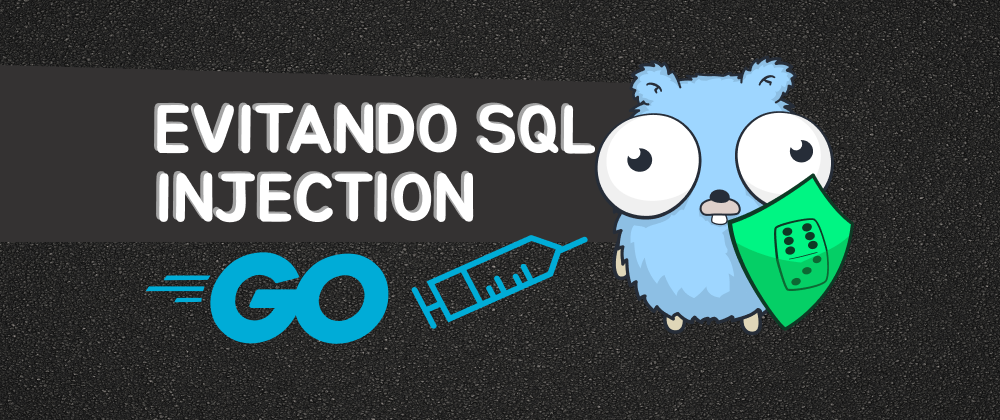
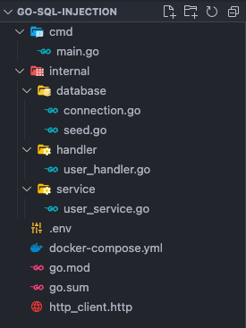

## What will we cover?

SQL injection is one of the most used techniques to carry out attacks on your system, where we can execute malicious SQL on vulnerable endpoints, making it possible to manipulate your database, although there are already many ways to mitigate this attack, it is still possible to leave this gap if the developer don't pay attention.

Most ORM's already inhibit this type of attack, but in Go it is very common not to use ORM, the chances of this vulnerability occurring are greater if it is not handled correctly.

## How SQL Injection works

SQL injection generally happens in routes that provided filters that allow parameters to be passed and these parameters are not treated correctly, for example:

```http
GET http://localhost:8080/users?id=1 HTTP/1.1
```

This endpoint searches for a user by id, but without correct treatment, an SQL injection can be performed.

```http
GET http://localhost:8080/users?id='1'OR'1'='1' HTTP/1.1
```

Adding the sql `'1'OR'1'='1'` which ignores any condition, `'1'='1` returns a true boolean, this way the query always returns all users in our database, this vulnerability is serious, we can even delete the entire database.

## Creating a seed

To help with testing, we will create a seed (populate records in the table), to facilitate our tests, inside the **database** folder we will create a `seed.go` file:

```go
  func SeedUsers() error {
    // drop table users
    _, err := DBConnection.Exec(`DROP TABLE IF EXISTS users`)
    if err != nil {
      log.Fatal(err)
    }

    // create table users
    createTableQuery := `
      CREATE TABLE IF NOT EXISTS users (
        id SERIAL PRIMARY KEY,
        name VARCHAR(256) NOT NULL,
        email VARCHAR(256) NOT NULL UNIQUE,
        password VARCHAR(256) NOT NULL
      )
    `
    _, err = DBConnection.Exec(createTableQuery)
    if err != nil {
      log.Fatal(err)
    }
    log.Println("Tabela de usuários criada com sucesso.")

    insertUserQuery := `
      INSERT INTO users (name, email, password) VALUES
      ('John Doe', 'john.doe@example.com', 123456),
      ('Bob', 'bob@example.com', 123456),
      ('Charlie', 'charlie@example.com', 123456),
      ('Slash', 'slash@example.com', 098765),
      ('Gilmour', 'gilmour@example.com', 1255657),
      ('Steve Vai', 'steve_vai@example.com', 1255657)
    `

    _, err = DBConnection.Exec(insertUserQuery)
    if err != nil {
      log.Fatal(err)
    }
    log.Println("Usuários inseridos com sucesso.")
    return nil
  }
```

`SeedUsers` deletes the table, if it exists, then creates the table again and finally adds the users to our table. You can add more user if you need.

## Project structure

To illustrate, let's create some endpoints with this vulnerability and fix these vulnerabilities, but first let's structure our project, I won't go too deep into the structure, I'll leave the repository link [here](https://github.com/wiliamvj/sql-injection-golang).



This will be the structure of our project, we will use PostgreSQL as the database, [go chi](https://github.com/go-chi/chi) to create our endpoints, [go dot env](github.com/joho/godotenv) to import our environment variables.

We separate `main.go` to start our server, connection to the bank and our endpoints:

```go
  func main() {
    err := database.NewDBConnection()
    if err != nil {
      panic(err)
    }

    service.SeedUsers("test")
    r := chi.NewRouter()
    r.Get("/users", handler.GetUsersInjectHandler)
    r.Get("/users/correct", handler.GetUsersCorrectHandler)
    r.Delete("/users", handler.DeleteUserInjectHandler)
    r.Delete("/users/correct", handler.DeleteUserCorrectHandler)

    server := &http.Server{
      Addr:    ":8080",
      Handler: r,
    }
    server.ListenAndServe()
  }
```

`connection.go` will create our connection with PostgreSQL and make the connection available globally in our application:

```go
  var DBConnection *sql.DB

  func NewDBConnection() error {
    err := godotenv.Load(".env")
    if err != nil {
      return errors.New("error loading .env file")
    }

    databaseURL := os.Getenv("DATABASE_URL")
    db, err := sql.Open("postgres", databaseURL)
    if err != nil {
      return err
    }
    DBConnection = db

    return nil
  }
```

`user_handler.go` will be responsible for handling our request and calling the `user_service.go` service.

## Creating the endpoints

Let's create endpoints with vulnerabilities and one without the vulnerability.

### Searching for users

Let's create an endpoint that searches for the user by id, let's call it `GetUsersInjectHandler`, this endpoint will have our vulnerability.

`user_handler.go`:

```go
  func GetUsersInjectHandler(w http.ResponseWriter, r *http.Request) {
    if r.Method != http.MethodGet {
      http.Error(w, "method not allowed", http.StatusMethodNotAllowed)
      return
    }
    id := r.URL.Query().Get("id")
    if id == "" {
      http.Error(w, "id not provided", http.StatusBadRequest)
      return
    }

    users, err := service.GetUserInject(id)
    if err != nil {
      fmt.Println(err)
      http.Error(w, "Error when searching for users", http.StatusInternalServerError)
      return
    }

    w.Header().Set("Content-Type", "application/json")
    w.WriteHeader(http.StatusOK)
    if err := json.NewEncoder(w).Encode(users); err != nil {
      http.Error(w, "Error encoding users to JSON", http.StatusInternalServerError)
      return
    }
  }
```

`user_service.go`:

```go
  func GetUserInject(id string) ([]User, error) {
    query := fmt.Sprintf("SELECT id, name, email FROM users WHERE id = %s", id)
    rows, err := database.DBConnection.Query(query)
    if err != nil {
      return nil, err
    }
    defer rows.Close()

    var users []User
    for rows.Next() {
      var user User
      if err := rows.Scan(&user.ID, &user.Name, &user.Email); err != nil {
        return nil, err
      }
      users = append(users, user)
    }

    return users, nil
  }
```

In the service we execute our query, passing the id directly `"SELECT id, name, email FROM users WHERE id = %s", id`, here is the vulnerability we are passing the id directly to the query, without treating it first.

Let's make a request using the vscode [HTTP Client](https://marketplace.visualstudio.com/items?itemName=humao.rest-client) extension:

```http
GET http://localhost:8080/users?id=1 HTTP/1.1
content-type: application/json
```

We received the expected return:

```json
[
  {
    "id": 1,
    "name": "John Doe",
    "email": "john.doe@example.com"
  }
]
```

Now, let's inject the sql:

```http
GET http://localhost:8080/users?id='1'OR'1'='1' HTTP/1.1
content-type: application/json
```

Received all users:

```json
[
  {
    "id": 1,
    "name": "John Doe",
    "email": "john.doe@example.com"
  },
  {
    "id": 2,
    "name": "Bob",
    "email": "bob@example.com"
  },
  {
    "id": 3,
    "name": "Charlie",
    "email": "charlie@example.com"
  },
  {
    "id": 4,
    "name": "Slash",
    "email": "slash@example.com"
  },
  {
    "id": 5,
    "name": "Gilmour",
    "email": "gilmour@example.com"
  },
  {
    "id": 6,
    "name": "Steve Vai",
    "email": "steve_vai@example.com"
  }
]
```

As the injected sql `'1'='1'` will always be `true`, the query will always return all records.

### Deleting users

The above sql is a serious flaw, but it could get worse, if the same vulnerability is in a query that deletes records, let's see an example:

`user_handler.go`:

```go
  func DeleteUserInjectHandler(w http.ResponseWriter, r *http.Request) {
    if r.Method != http.MethodDelete {
      http.Error(w, "method not allowed", http.StatusMethodNotAllowed)
      return
    }
    id := r.URL.Query().Get("id")
    if id == "" {
      http.Error(w, "id not provided", http.StatusBadRequest)
      return
    }

    err := service.DeleteUserInject(id)
    if err != nil {
      fmt.Println(err)
      http.Error(w, "Error when searching for users", http.StatusInternalServerError)
      return
    }

    w.Header().Set("Content-Type", "application/json")
    w.WriteHeader(http.StatusOK)
    if err := json.NewEncoder(w).Encode("Usuário deletado com sucesso"); err != nil {
      http.Error(w, "Error encoding users to JSON", http.StatusInternalServerError)
      return
    }
  }
```

`user_service.go`:

```go
  func DeleteUserInject(id string) error {
    query := fmt.Sprintf("DELETE FROM users WHERE id = %s", id)
    _, err := database.DBConnection.Exec(query)
    if err != nil {
      return err
    }

    return nil
  }
```

We use the same logic to delete user by id:

```http
DELETE http://localhost:8080/users?id=1 HTTP/1.1
content-type: application/json
```

When calling this endpoint, the user with `id = 1` is deleted, now let's inject the sql:

```http
DELETE http://localhost:8080/users?id='1'OR'1'='1' HTTP/1.1
content-type: application/json
```

When calling the endpoint with the injected sql, notice that all records in the user table were deleted, can you imagine the damage this can do to a production database?

This can be done in any query, we could have an endpoint that updates the user's password by id and with sql injection update the password of all users, the possibilities are enormous!

## Fixing the vulnerability

There are already countless ways to mitigate this attack, we could deal with it in the handler and check if there is sql in the `id` value for example, but the most effective and correct way is to use the database driver's existing resources, in this case the package `"database/sql"` already has this feature and with few modifications we can avoid the sql injection attack.

### Searching for users

Let's have the same logic:

`user_handler.go`

```go
  func GetUsersCorrectHandler(w http.ResponseWriter, r *http.Request) {
    if r.Method != http.MethodGet {
      http.Error(w, "method not allowed", http.StatusMethodNotAllowed)
      return
    }
    id := r.URL.Query().Get("id")
    if id == "" {
      http.Error(w, "id not provided", http.StatusBadRequest)
      return
    }

    users, err := service.GetUserCorrect(id)
    if err != nil {
      fmt.Println(err)
      http.Error(w, "Error when searching for users", http.StatusInternalServerError)
      return
    }

    w.Header().Set("Content-Type", "application/json")
    w.WriteHeader(http.StatusOK)
    if err := json.NewEncoder(w).Encode(users); err != nil {
      http.Error(w, "Error encoding users to JSON", http.StatusInternalServerError)
      return
    }
  }
```

`user_service.go`:

```go
  func GetUserCorrect(id string) ([]User, error) {
    query := "SELECT id, name, email FROM users WHERE id = $1"
    rows, err := database.DBConnection.Query(query, id)
    if err != nil {
      return nil, err
    }
    defer rows.Close()

    var users []User
    for rows.Next() {
      var user User
      if err := rows.Scan(&user.ID, &user.Name, &user.Email); err != nil {
        return nil, err
      }
      users = append(users, user)
    }

    return users, nil
  }
```

However, now we don't pass the `id` directly, we pass the marker `$1` which indicates that we will have a parameter in that position and we pass it to the query `Query(query, id)`, this way the driver already does what we call " prepared statement" or "sanitization", "hydration", call it whatever you think is best, this approach helps separate query logic from data input, improving the security and integrity of database operations.

Let's call the endpoint and try to inject the sql:

```http
GET http://localhost:8080/users/correct?id='1'OR'1'='1' HTTP/1.1
content-type: application/json
```

We get an error and avoid sql injection!

```http
HTTP/1.1 500 Internal Server Error
Content-Type: text/plain; charset=utf-8
X-Content-Type-Options: nosniff
Date: Wed, 27 Dec 2023 15:53:27 GMT
Content-Length: 28
Connection: close

Error when searching for users
```

Searching correctly:

```http
GET http://localhost:8080/users/correct?id=2 HTTP/1.1
content-type: application/json
```

We now receive the user data correctly.

```json
[
  {
    "id": 2,
    "name": "Bob",
    "email": "bob@example.com"
  }
]
```

### Deleting users

Let's use the same solution used to search for the user.

`user_handler.go`

```go
  func DeleteUserCorrectHandler(w http.ResponseWriter, r *http.Request) {
    if r.Method != http.MethodDelete {
      http.Error(w, "meyhod not allowed", http.StatusMethodNotAllowed)
      return
    }
    id := r.URL.Query().Get("id")
    if id == "" {
      http.Error(w, "id not provided", http.StatusBadRequest)
      return
    }

    err := service.DeleteUserCorrect(id)
    if err != nil {
      fmt.Println(err)
      http.Error(w, "Error when searching for users", http.StatusInternalServerError)
      return
    }

    w.Header().Set("Content-Type", "application/json")
    w.WriteHeader(http.StatusOK)
    if err := json.NewEncoder(w).Encode("User deleted successfully"); err != nil {
      http.Error(w, "Error encoding users to JSON", http.StatusInternalServerError)
      return
    }
  }
```

`user_service.go`:

```go
func DeleteUserCorrect(id string) error {
  query := "DELETE FROM users WHERE id = $1"
  _, err := database.DBConnection.Exec(query, id)
  if err != nil {
    return err
  }

  return nil
}
```

Let's call the endpoint and try to inject the sql:

```http
DELETE http://localhost:8080/users/correct?id='1'OR'1'='1' HTTP/1.1
content-type: application/json
```

We get an error and avoid sql injection!

```http
HTTP/1.1 500 Internal Server Error
Content-Type: text/plain; charset=utf-8
X-Content-Type-Options: nosniff
Date: Wed, 27 Dec 2023 15:58:52 GMT
Content-Length: 28
Connection: close

Error when deleting users
```

Deleting correctly:

```http
GET http://localhost:8080/users/correct?id=1 HTTP/1.1
content-type: application/json
```

We only delete the user with the id we want.

```json
"User deleted successfully"
```

## Final considerations

In this post we saw how to simulate sql injection and how to avoid sql injection, there are several ways to mitigate this attack, but using the resources provided by the database driver is generally the simplest and safest, however validating this before calling your driver causes that this vulnerability is practically nil. The use of ORM's also greatly reduces the chances of sql injection happening, this problem is already handled natively in the ORM, but it can still happen.

## Repository link

[repository](https://github.com/wiliamvj/sql-injection-golang) of the project

[Gopher credits](https://github.com/egonelbre/gophers)
