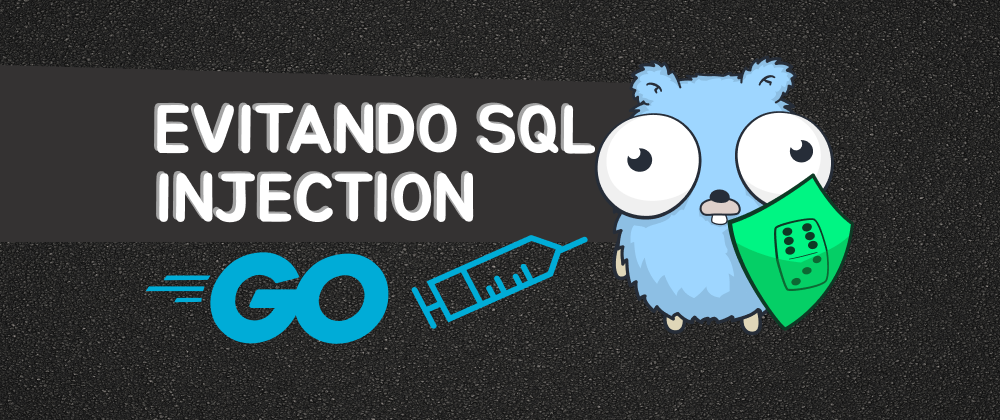

## O que vamos abordar?

SQL injection é uma das técnicas mais utilizadas para realizar ataques no seu sistema, onde podemos executar sql malicioso em endpoints vulneráveis sendo possível manipular seu banco de dados, apesar de já existir muitas formas de mitigar esse ataque, ainda é possível deixar essa brecha caso o desenvolvedor não fique atento.

A maioria dos ORM's já inibem esse tipo de ataque, mas em Go é muito comum não utilizar ORM as chances dessa vulnerabilidade acontecer é maior caso não seja tratado corretamente.

## Como o SQL Injection funciona

Geralmente o sql injection acontece em rotas que disponibilizam filtros que possibilitam passar parâmetros e esses parâmetros não são tratados corretamente, por exemplo:

```http
GET http://localhost:8080/users?id=1 HTTP/1.1
```

Esse endpoint busca um usuário pelo id, porém sem o tratamento correto pode ser feito uma injeção de sql.

```http
GET http://localhost:8080/users?id='1'OR'1'='1' HTTP/1.1
```

Adicionando o sql `'1'OR'1'='1'` que ignora qualquer condição, `'1'='1` retorna um booleano verdadeiro, dessa forma a consulta sempre retorna todos os usuários do nosso banco de dados, essa vulnerabilidade é grave, podemos inclusive deletar toda a base de dados.

## Criando um seed

Para ajudar no teste, vamos criar um seed (popular registros na tabela), para facilitar nossos testes, dentro da pasta **database** vamos criar um arquivo `seed.go`:

```go
  func SeedUsers() error {
    // drop table users
    _, err := DBConnection.Exec(`DROP TABLE IF EXISTS users`)
    if err != nil {
      log.Fatal(err)
    }

    // create table users
    createTableQuery := `
      CREATE TABLE IF NOT EXISTS users (
        id SERIAL PRIMARY KEY,
        name VARCHAR(256) NOT NULL,
        email VARCHAR(256) NOT NULL UNIQUE,
        password VARCHAR(256) NOT NULL
      )
    `
    _, err = DBConnection.Exec(createTableQuery)
    if err != nil {
      log.Fatal(err)
    }
    log.Println("Tabela de usuários criada com sucesso.")

    insertUserQuery := `
      INSERT INTO users (name, email, password) VALUES
      ('John Doe', 'john.doe@example.com', 123456),
      ('Bob', 'bob@example.com', 123456),
      ('Charlie', 'charlie@example.com', 123456),
      ('Slash', 'slash@example.com', 098765),
      ('Gilmour', 'gilmour@example.com', 1255657),
      ('Steve Vai', 'steve_vai@example.com', 1255657)
    `

    _, err = DBConnection.Exec(insertUserQuery)
    if err != nil {
      log.Fatal(err)
    }
    log.Println("Usuários inseridos com sucesso.")
    return nil
  }
```

O nosso `SeedUsers` deleta a tabela, caso exista, depois cria novamente a tabela e por último adiciona os usuários na nossa tabela. Você pode adicionar mais usuário, se precisar.

## Estrutura do projeto

Para exemplificar, vamos criar alguns endpoints com essa vulnerabilidade e vamos corrigir essas vulnerabilidades, mas antes vamos estruturar nosso projeto, não vou entrar muito a fundo na estrutura, vou deixar o link do repositório [aqui](https://github.com/wiliamvj/sql-injection-golang).


Essa vai ser a estrutura do nosso projeto, vamos utilizar o postgreSQL como banco de dados, [go chi](https://github.com/go-chi/chi) para criar nossos endpoints,[ go dot env](github.com/joho/godotenv) para importar nossas váriaveis de ambiente.

Separamos o `main.go` para iniciar nosso servidor, conexão com o banco e nossos endpoints:

```go
  func main() {
    err := database.NewDBConnection()
    if err != nil {
      panic(err)
    }

    service.SeedUsers("test")
    r := chi.NewRouter()
    r.Get("/users", handler.GetUsersInjectHandler)
    r.Get("/users/correct", handler.GetUsersCorrectHandler)
    r.Delete("/users", handler.DeleteUserInjectHandler)
    r.Delete("/users/correct", handler.DeleteUserCorrectHandler)

    server := &http.Server{
      Addr:    ":8080",
      Handler: r,
    }
    server.ListenAndServe()
  }
```

`connection.go` vai criar nossa conexão com o postgreSQL e disponibilizar a conexão de forma global em nossa aplicação:

```go
  var DBConnection *sql.DB

  func NewDBConnection() error {
    err := godotenv.Load(".env")
    if err != nil {
      return errors.New("error loading .env file")
    }

    databaseURL := os.Getenv("DATABASE_URL")
    db, err := sql.Open("postgres", databaseURL)
    if err != nil {
      return err
    }
    DBConnection = db

    return nil
  }
```

Nosso `user_handler.go` vai ser responsável por manipular nossa request e chamar o service `user_service.go`.

## Criando os endpoints

Vamos criar endpoints com vulnerabilidades e outro sem a vulnerabilidade.

### Buscando usuários

Vamos criar um endpoint que busca o usuário pelo id, vamos chamar de `GetUsersInjectHandler`, esse endpoint vai ter a nossa vulnerabilidade.

`user_handler.go`:

```go
  func GetUsersInjectHandler(w http.ResponseWriter, r *http.Request) {
    if r.Method != http.MethodGet {
      http.Error(w, "Método não permitido", http.StatusMethodNotAllowed)
      return
    }
    id := r.URL.Query().Get("id")
    if id == "" {
      http.Error(w, "id não informado", http.StatusBadRequest)
      return
    }

    users, err := service.GetUserInject(id)
    if err != nil {
      fmt.Println(err)
      http.Error(w, "Erro ao buscar os usuários", http.StatusInternalServerError)
      return
    }

    w.Header().Set("Content-Type", "application/json")
    w.WriteHeader(http.StatusOK)
    if err := json.NewEncoder(w).Encode(users); err != nil {
      http.Error(w, "Erro ao codificar os usuários para JSON", http.StatusInternalServerError)
      return
    }
  }
```

`user_service.go`:

```go
  func GetUserInject(id string) ([]User, error) {
    query := fmt.Sprintf("SELECT id, name, email FROM users WHERE id = %s", id)
    rows, err := database.DBConnection.Query(query)
    if err != nil {
      return nil, err
    }
    defer rows.Close()

    var users []User
    for rows.Next() {
      var user User
      if err := rows.Scan(&user.ID, &user.Name, &user.Email); err != nil {
        return nil, err
      }
      users = append(users, user)
    }

    return users, nil
  }
```

No service executamos nossa query, passando o id diretamente `"SELECT id, name, email FROM users WHERE id = %s", id`, aqui está a vulnerabilidade estamos passando o id diretamente para a consulta, sem tratar antes.

Vamos fazer uma requisição usando a extensão do [HTTP Client](https://marketplace.visualstudio.com/items?itemName=humao.rest-client) do vscode:

```http
GET http://localhost:8080/users?id=1 HTTP/1.1
content-type: application/json
```

Recebemos o retorno esperado:

```json
[
  {
    "id": 1,
    "name": "John Doe",
    "email": "john.doe@example.com"
  }
]
```

Agora, vamos injetar o sql:

```http
GET http://localhost:8080/users?id='1'OR'1'='1' HTTP/1.1
content-type: application/json
```

Recebemos todos os usuários:

```json
[
  {
    "id": 1,
    "name": "John Doe",
    "email": "john.doe@example.com"
  },
  {
    "id": 2,
    "name": "Bob",
    "email": "bob@example.com"
  },
  {
    "id": 3,
    "name": "Charlie",
    "email": "charlie@example.com"
  },
  {
    "id": 4,
    "name": "Slash",
    "email": "slash@example.com"
  },
  {
    "id": 5,
    "name": "Gilmour",
    "email": "gilmour@example.com"
  },
  {
    "id": 6,
    "name": "Steve Vai",
    "email": "steve_vai@example.com"
  }
]
```

Como o sql injetado `'1'='1'` sempre vai ser `true`, a query sempre vai retornar todos os registros.

### Deletando usuários

O sql acima é uma falha grave, mas ainda pode piorar, se a mesma vulnerabilidade estiver em uma query que deleta registros, vamos ver um exemplo:

`user_handler.go`:

```go
  func DeleteUserInjectHandler(w http.ResponseWriter, r *http.Request) {
    if r.Method != http.MethodDelete {
      http.Error(w, "Método não permitido", http.StatusMethodNotAllowed)
      return
    }
    id := r.URL.Query().Get("id")
    if id == "" {
      http.Error(w, "id não informado", http.StatusBadRequest)
      return
    }

    err := service.DeleteUserInject(id)
    if err != nil {
      fmt.Println(err)
      http.Error(w, "Erro ao buscar os usuários", http.StatusInternalServerError)
      return
    }

    w.Header().Set("Content-Type", "application/json")
    w.WriteHeader(http.StatusOK)
    if err := json.NewEncoder(w).Encode("Usuário deletado com sucesso"); err != nil {
      http.Error(w, "Erro ao codificar os usuários para JSON", http.StatusInternalServerError)
      return
    }
  }
```

`user_service.go`:

```go
  func DeleteUserInject(id string) error {
    query := fmt.Sprintf("DELETE FROM users WHERE id = %s", id)
    _, err := database.DBConnection.Exec(query)
    if err != nil {
      return err
    }

    return nil
  }
```

Usamos a mesma lógica para deletar usuário pelo id:

```http
DELETE http://localhost:8080/users?id=1 HTTP/1.1
content-type: application/json
```

Ao chamar esse endpoint, o usuário com `id = 1` é deletado, agora vamos injetar o sql:

```http
DELETE http://localhost:8080/users?id='1'OR'1'='1' HTTP/1.1
content-type: application/json
```

Ao chamar o endpoint com o sql injetado, perceba que todos os registros da tabela user foram deletados, já imaginou o estrago que isso pode fazer em um banco de produção?

Isso pode ser feito em qualquer query, poderíamos ter um endpoint que atualiza a senha do usuário pelo id e com injeção de sql atualizar a senha de todos os usuários, as possibilidades são enormes!

## Corrigindo a vulnerabilidade

Já existem inúmeras maneiras de mitigar esse ataque, poderíamos tratar no handler e verificar se existe sql no valor do `id` por exemplo, mas a forma mais eficaz e correta é usar dos recursos já existentes do driver do banco de dados, no caso o pacote `"database/sql"` já tem esse recurso e com poucas modificações já evitamos o ataque de sql injection.

### Buscando usuários

Vamos ter a mesma lógica:

`user_handler.go`

```go
  func GetUsersCorrectHandler(w http.ResponseWriter, r *http.Request) {
    if r.Method != http.MethodGet {
      http.Error(w, "Método não permitido", http.StatusMethodNotAllowed)
      return
    }
    id := r.URL.Query().Get("id")
    if id == "" {
      http.Error(w, "id não informado", http.StatusBadRequest)
      return
    }

    users, err := service.GetUserCorrect(id)
    if err != nil {
      fmt.Println(err)
      http.Error(w, "Erro ao buscar os usuários", http.StatusInternalServerError)
      return
    }

    w.Header().Set("Content-Type", "application/json")
    w.WriteHeader(http.StatusOK)
    if err := json.NewEncoder(w).Encode(users); err != nil {
      http.Error(w, "Erro ao codificar os usuários para JSON", http.StatusInternalServerError)
      return
    }
  }
```

`user_service.go`:

```go
  func GetUserCorrect(id string) ([]User, error) {
    query := "SELECT id, name, email FROM users WHERE id = $1"
    rows, err := database.DBConnection.Query(query, id)
    if err != nil {
      return nil, err
    }
    defer rows.Close()

    var users []User
    for rows.Next() {
      var user User
      if err := rows.Scan(&user.ID, &user.Name, &user.Email); err != nil {
        return nil, err
      }
      users = append(users, user)
    }

    return users, nil
  }
```

Porém agora não passamos o `id` diretamente, passamos o marcador `$1` que indica que vamos ter um parâmetro nessa posição e passamos para a query `Query(query, id)`, dessa forma o driver já faz o que chamamos de "prepared statement" ou "sanitização", "hidratação", chame do que achar melhor, essa abordagem ajuda a separar a lógica da consulta da entrada de dados, melhorando a segurança e a integridade das operações do banco de dados.

Vamos chamar o endpoint e tentar injetar o sql:

```http
GET http://localhost:8080/users/correct?id='1'OR'1'='1' HTTP/1.1
content-type: application/json
```

Recebemos um erro e evitamos a injeção do sql!

```http
HTTP/1.1 500 Internal Server Error
Content-Type: text/plain; charset=utf-8
X-Content-Type-Options: nosniff
Date: Wed, 27 Dec 2023 15:53:27 GMT
Content-Length: 28
Connection: close

Erro ao buscar os usuários
```

Buscando da forma correta:

```http
GET http://localhost:8080/users/correct?id=2 HTTP/1.1
content-type: application/json
```

Agora recebemos os dados do usuário corretamente.

```json
[
  {
    "id": 2,
    "name": "Bob",
    "email": "bob@example.com"
  }
]
```

### Deletando usuários

Vamos usar a mesma solução usada para buscar o usuário.

`user_handler.go`

```go
  func DeleteUserCorrectHandler(w http.ResponseWriter, r *http.Request) {
    if r.Method != http.MethodDelete {
      http.Error(w, "Método não permitido", http.StatusMethodNotAllowed)
      return
    }
    id := r.URL.Query().Get("id")
    if id == "" {
      http.Error(w, "id não informado", http.StatusBadRequest)
      return
    }

    err := service.DeleteUserCorrect(id)
    if err != nil {
      fmt.Println(err)
      http.Error(w, "Erro ao buscar os usuários", http.StatusInternalServerError)
      return
    }

    w.Header().Set("Content-Type", "application/json")
    w.WriteHeader(http.StatusOK)
    if err := json.NewEncoder(w).Encode("Usuário deletado com sucesso"); err != nil {
      http.Error(w, "Erro ao codificar os usuários para JSON", http.StatusInternalServerError)
      return
    }
  }
```

`user_service.go`:

```go
func DeleteUserCorrect(id string) error {
  query := "DELETE FROM users WHERE id = $1"
  _, err := database.DBConnection.Exec(query, id)
  if err != nil {
    return err
  }

  return nil
}
```

Vamos chamar o endpoint e tentar injetar o sql:

```http
DELETE http://localhost:8080/users/correct?id='1'OR'1'='1' HTTP/1.1
content-type: application/json
```

Recebemos um erro e evitamos a injeção do sql!

```http
HTTP/1.1 500 Internal Server Error
Content-Type: text/plain; charset=utf-8
X-Content-Type-Options: nosniff
Date: Wed, 27 Dec 2023 15:58:52 GMT
Content-Length: 28
Connection: close

Erro ao deletar os usuário
```

Deletando da forma correta:

```http
GET http://localhost:8080/users/correct?id=1 HTTP/1.1
content-type: application/json
```

Deletamos apenas o usuário com o id que desejamos.

```json
"Usuário deletado com sucesso"
```

## Considerações finais

Nesse post vimos como simular sql injection e como evitar a injeção de sql, existem diversas formas de mitigar esse ataque, mas usar os recursos fornecidos pelo driver do banco geralmente é o mais simples e seguro, Porém validar isso antes de chamar seu driver faz com que essa vulnerabilidade seja praticamente nula. O uso de ORM's também diminui muito as chances do sql injection acontecer, esse problema já é tratado nativamente no ORM, mas ainda pode acontecer.

## Links úteis

Vou anexar alguns links abordando esse assunto

- [Eficiência e segurança com consultas parametrizadas: prevenindo SQL Injection](https://dev.to/gabogaldino/eficiencia-e-seguranca-com-consultas-parametrizadas-prevenindo-sql-injection-5bln)
- [Como evitar SQL Injection no MongoDB](https://dev.to/williamkoller/como-evitar-sql-injection-no-mongodb-1fo3)
- [Explicando o TOP 3 da OWASP "Injection" para desenvolvedores](https://dev.to/gabogaldino/explicando-o-top-3-da-owasp-injection-para-desenvolvedores-43c7)
- [Como evitar um ATAQUE DE INJEÇÃO DE SQL](https://blog.lacnic.net/pt-br/seguranca-cibernetica/como-evitar-um-ataque-de-injecao-de-sql)

## Link do repositório

[repositório](https://github.com/wiliamvj/sql-injection-golang) do projeto

[Gopher credits](https://github.com/egonelbre/gophers)
