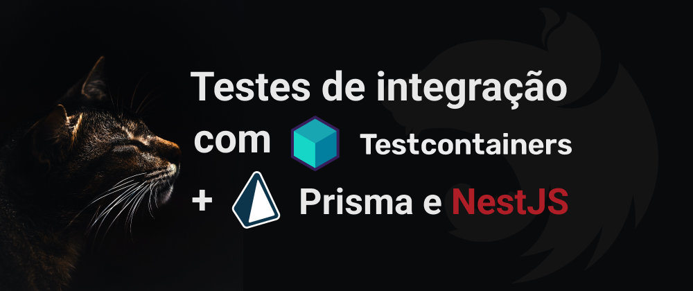
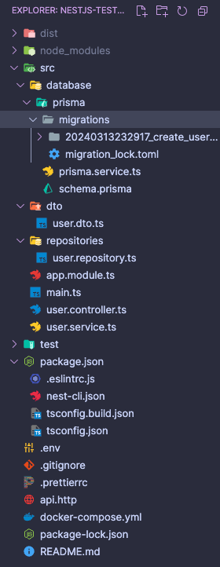
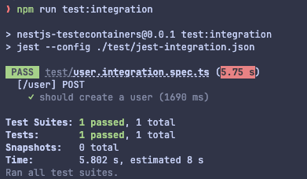

## Introdução

Neste guia, exploraremos como realizar testes de integração em nossa aplicação usando uma combinação poderosa de tecnologias: [NestJs](https://nestjs.com/) junto com o [Prisma ORM](https://www.prisma.io/), e aproveitando os recursos do [Testcontainers](https://testcontainers.com/).

O foco deste post é mostrar como integrar o Testcontainers em aplicações NestJS com Prisma, proporcionando testes robustos e eficientes. Embora não abordemos a criação e configuração inicial do projeto, irei explicar brevemente a estrutura básica que adotaremos.

Nosso projeto será composto por apenas três endpoints: criar usuário, atualizar e listar por ID.



Vamos utilizar constratos, já fiz um [post](/posts/nestjs-contratos/) sobre isso também, e postgres para banco de dados.

## O que é Testcontainers?

Antes de mergulharmos nos testes de integração, é importante compreender o papel do Testcontainers. Esses testes são cruciais para garantir o funcionamento fluido de uma aplicação, pois abrangem o teste de todo o fluxo de funcionalidades. Embora os testes unitários tenham seu lugar, os testes de integração oferecem uma cobertura mais abrangente.

No entanto, os testes de integração podem ser complexos, pois exigem a execução de vários componentes essenciais antes de iniciar os testes. É aqui que entra o [Testcontainers](https://testcontainers.com/).

O Testcontainers facilita a execução dos componentes necessários para a aplicação, como um banco de dados. Por exemplo, se precisarmos de um banco de dados Postgres, o Testcontainers inicia uma instância temporária do Postgres para nós, executa os testes e, em seguida, limpa o ambiente, excluindo o container.

## Como vamos utilizar?

Vamos utilizar o jest para realizar os testes e o [supertest](https://www.npmjs.com/package/supertest) para fazer nossas chamadas http, a ideia seria:

**No inicio de todos os teste:**

- Iniciar o Testcontainers juntamente com postgres
- Iniciar o prisma
- Criar uma instância da nossa aplicação

**A cada caso de teste:**

- Resetamos o banco e garantimos isolamento dos testes
- Rodamos as migrations

**No fim de todos os teste:**

- Desconectamos o prisma do banco
- Finalizamos o postgres
- Paramos o container

Poderíamos fazer todas as etapas acima a cada caso de teste, se tivermos 10 casos de teste, vamos levantar 10 containers, porém ficaria mais lento a cada teste subir um novo container com postgres, dessa forma vamos levantar apenas 1 container, fica mais rápido apenas limpar o banco e rodar as migrations novamente, mas cada cenário pede uma abordagem, em nosso exemplo esse cenários serve muito bem, mas caso seja melhor para o seu caso, você pode fazer exatamente como as [docs](https://node.testcontainers.org/modules/postgresql/) do Testcontainers fazem.

## Configurando o Jest

Antes de iniciar com testecotainers precisamos ajustar algumas coisas do jest, por padrão o nestJS criar alguns arquivos para teste e2e, vamos precisar ajustar.

Vamos renomear o arquivo chamado `jest-e2e.json` que fica na pasta **test** para `jest-integration.json` e vamos alterar o `testRegex` para buscar todos os arquivos com `.integration.spec.ts` no nome, você pode chamar o arquivo da forma que deseja, vai ficar asssim:

```json
{
  "moduleFileExtensions": ["js", "json", "ts"],
  "rootDir": ".",
  "testEnvironment": "node",
  "testRegex": ".integration.spec.ts$",
  "transform": {
    "^.+\\.(t|j)s$": "ts-jest"
  }
}
```

Vamos criar também um novo script para rodas os testes no `package.json`:

```json
"test:integration": "jest --config ./test/jest-integration.json"
```

Com isso temos o script pronto, basta rodas `nom run test:integration` ou `yarn test:integration`

## Instalando os pacotes

Vamos precisar de alguns pacotes, são eles:

O pacote do testcontainers

```bash
npm install testcontainers --save-dev
```

O pacote do postgres para o Testcontainers:

```bash
npm install @testcontainers/postgresql --save-dev
```

O pacote do drive do pg (postgres)

```bash
npm install pg
```

O pacote do super test

```bash
npm install supertest --save-dev
```

Com isso temos todos os pacotes necessários.

## Iniciado os testes

Vamos renomear o arquivo `app.e2e-spec.ts` criado pelo nestJS para `user.integration.spec.ts`, como vamos iniciar apenas 1 instância do postgres via container para todos os testes, precisamos deixar acessível de forma global, por isso vamos iniciar assim:

```typescript
let container: StartedPostgreSqlContainer; // importamos do pacote testcontainers/postgresql
let prismaClient: PrismaClient; // importamos do Prisma Client
let app: INestApplication; // importamos nestjs common
let urlConnection: string; // a url do banco que sera criada pelo testcontainers
let client: Client; // importamos do pacote pg
```

Isso vai nos permitir acessar fora do `beforeAll` que vamos criar.

Vamos iniciar tudo dentro de um `beforeAll` do jest, vamos primeiro estar o `PostgreSqlContainer` depois vamos criar um `Client` do postgres com o pacote [pg](https://www.npmjs.com/package/pg), conectamos o prisma ao banco e por fim iniciamos o nestJS, também pegamos a url de conexão com o postgres e atribuímos a variável `DATABASE_URL` que é usada por padrão pelo prisma.

vai ficar assim:

```typescript
beforeAll(async () => {
  container = await new PostgreSqlContainer().start();
  client = new Client({
    host: container.getHost(),
    port: container.getPort(),
    user: container.getUsername(),
    password: container.getPassword(),
    database: container.getDatabase(),
  });
  await client.connect();
  process.env.DATABASE_URL = container.getConnectionUri();
  urlConnection = container.getConnectionUri();

  // create a new instance of PrismaClient with the connection string
  prismaClient = new PrismaClient({
    datasources: {
      db: {
        url: urlConnection,
      },
    },
  });

  // start the nestjs application
  const moduleRef = await Test.createTestingModule({
    imports: [AppModule],
  }).compile();
  app = moduleRef.createNestApplication();
  app.useGlobalPipes(new ValidationPipe());
  await app.init();
});
```

Agora vamos fazer nosso `afterAll` que vai ser executado ao terminar todos os testes, basicamente finalizamos tudo que iniciamos no `beforeAll`

```typescript
afterAll(async () => {
  await prismaClient.$disconnect();
  await client.end();
  await container.stop();
});
```

Com isso temos quase tudo pronto para criar os casos de teste, mas precisamos garantir que a cada caso de teste, o que foi gerado por um caso não afete o outro, para isso vamos fazer um `beforeEach` que antes de cada caso de teste vai resetar o banco e rodas as migrations, garantindo que cada caso de teste tenho o banco zerado.

```typescript
beforeEach(async () => {
  // drop schema and create a new one
  execSync(`npx prisma migrate reset --force`, {
    env: {
      ...process.env,
      DATABASE_URL: urlConnection,
    },
  });
  execSync(`npx prisma migrate deploy`, {
    env: {
      ...process.env,
      DATABASE_URL: urlConnection,
    },
  });
});
```

Usamos o `execSync` para executar comandos no `shell`, resetando o banco com o comando do prisma cli, mas é preciso usar o `--force` para forçar o reset, sem isso o prisma pede uma confirmação manual.

Depois de resetar, rodamos as migrations, passando a url de conexão que colocamos no `urlConnection` no nosso `beforeAll`. Também vamos criar um `afterEach` para limpar os mocks do jest e garantir que nenhum mock que possa ser criado influencie os demais testes:

```typescript
afterEach(() => {
  jest.restoreAllMocks();
});
```

Com isso temos as configurações de teste prontas, agora é só escrever os testes.

## Criando os casos de teste

Vamos usar o [super test](https://www.npmjs.com/package/supertest) para chamar nosso endpoint de criação de usuários:

```typescript
describe('[/user] POST', () => {
  it('should create a user', async () => {
    const userData: UserDto = {
      email: 'john.doe@email.com',
      first_name: 'John',
      last_name: 'Doe',
      password: 'password@1234',
    };
    await request(app.getHttpServer()).post('/user').send(userData).expect(201);

    const userDb = await prismaClient.user.findUnique({
      where: {
        email: userData.email,
      },
    });

    expect(userDb).toBeTruthy();
    expect(userDb.email).toBe(userData.email);
    expect(userDb.first_name).toBe(userData.first_name);
    expect(userDb.last_name).toBe(userData.last_name);
    expect(userDb.password).not.toBe(userData.password);
    expect(userDb.created_at).toBeTruthy();
  });
});
```

Criamos um usuário usando nosso endpoint `[POST] /user` e depois buscamos no banco para garantir que o usuário foi salvo, rodando o teste com:

```bash
 npm run test:integration
```

Vamos ver que o teste passou:



Vamos fazer todos os testes, o foco não é mostrar cada teste, veja como ficou todos:

```typescript
describe('[/user] POST', () => {
  it('should create a user', async () => {
    const userData: UserDto = {
      email: 'john.doe@email.com',
      first_name: 'John',
      last_name: 'Doe',
      password: 'password@1234',
    };
    await request(app.getHttpServer()).post('/user').send(userData).expect(201);

    const userDb = await prismaClient.user.findUnique({
      where: {
        email: userData.email,
      },
    });

    expect(userDb).toBeTruthy();
    expect(userDb.email).toBe(userData.email);
    expect(userDb.first_name).toBe(userData.first_name);
    expect(userDb.last_name).toBe(userData.last_name);
    expect(userDb.password).not.toBe(userData.password);
    expect(userDb.created_at).toBeTruthy();
  });

  it('should not create a user with invalid data', async () => {
    const userData: UserDto = {
      email: 'john.doe@email.com',
      first_name: 'John',
      last_name: 'Doe',
      password: 'password@1234',
    };
    await prismaClient.user.create({
      data: userData,
    });

    const response = await request(app.getHttpServer())
      .post('/user')
      .send(userData)
      .expect(400);

    expect(response.body).toEqual({
      statusCode: 400,
      message: 'user already exists',
      error: 'Bad Request',
    });
  });

  it('should be able to update user', async () => {
    const userData: UserDto = {
      email: 'john.doe@email.com',
      first_name: 'John',
      last_name: 'Doe',
      password: 'password@1234',
    };
    const userdb = await prismaClient.user.create({
      data: userData,
    });

    await request(app.getHttpServer())
      .patch(`/user/${userdb.id}`)
      .send({
        first_name: 'John Doe Updated',
      })
      .expect(200);

    const userUpdated = await prismaClient.user.findUnique({
      where: {
        id: userdb.id,
      },
    });
    expect(userUpdated.first_name).toBe('John Doe Updated');
  });

  it("should not be able to update user that doesn't exist", async () => {
    const response = await request(app.getHttpServer())
      .patch(`/user/${randomUUID()}`)
      .send({
        first_name: 'John Doe Updated',
      })
      .expect(404);

    expect(response.body).toEqual({
      statusCode: 404,
      message: 'user not found',
      error: 'Not Found',
    });
  });

  it('should not be able to update user with email already in use', async () => {
    const userData: UserDto = {
      email: 'john.doe@email.com',
      first_name: 'John',
      last_name: 'Doe',
      password: 'password@1234',
    };
    const userDb = await prismaClient.user.create({
      data: userData,
    });

    const response = await request(app.getHttpServer())
      .patch(`/user/${userDb.id}`)
      .send({
        email: userData.email,
      })
      .expect(400);

    expect(response.body).toEqual({
      statusCode: 400,
      message: 'email already exists',
      error: 'Bad Request',
    });
  });
});
```

Com isso temos nossa api com quase 100% de cobertura em teste de integração, garantindo seu funcionamento conforme o esperado e nos ajudando em futuras alterações.

## Containers Genéricos

Você deve ter percebido que usamos o `PostgreSqlContainer` mas o testcontainers não oferece um container pronto para tudo, por isso temos os `GenericContainer`, com eles podemos passar qualquer imagem, por exemplo, se usarmos o [postgis](https://postgis.net/) que é uma extensão do postgres para trabalhar com dados geoespaciais, o `PostgreSqlContainer` não resolveria, então usaríamos o `GenericContainer`:

Ficaria desta forma:

```typescript
beforeAll(async () => {
  container = await new GenericContainer('postgis/postgis:16-3.4:alpine')
    .withEnvironment({
      POSTGRES_HOST: dbHost,
      POSTGRES_PASSWORD: dbPass,
      POSTGRES_USER: dbUser,
      POSTGRES_DB: dbName,
    })
    .withExposedPorts(dbPort)
    .start();
  const mappedPort = container.getMappedPort(dbPort);
  urlConnection = `postgresql://${dbUser}:${dbPass}@${dbHost}:${mappedPort}/${dbName}`;
  process.env.DATABASE_URL = urlConnection;

  //.. resto do codigo
});
```

Bem semelhante ao que fizemos, você pode criar `GenericContainer` de qualquer imagem, como elastic search, mongo, mysql.

## Considerações finais

Bom, este foi um pequeno post mostrando de forma simples como usar o poderoso [Testcontainers](https://testcontainers.com/) com nestjs e prisma orm, essa foi uma maneira simples e rápida que encontrei de trabalhar com ele, existem diversas formas e abordagens, essa forma que encontrei deixaram meus testes um pouco mais rápidos e simples, os testes de integração tendem a ser mais demorados de executar e utilizando container isso pode aumentar ainda mais o tempo, apenas 5 casos de testes levaram cerca de 12 segundos, imagine centenas de testes.

## Link do repositório

[repositório](https://github.com/wiliamvj/teste-integracao-Testecontainers) do projeto

Se inscreva e receba um aviso sobre novos posts, [participar](https://wiliamvj.substack.com/)
